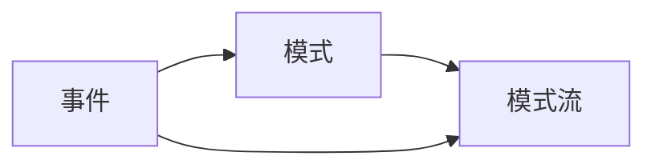
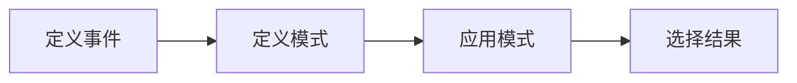

## 1.背景介绍

Apache Flink是一个开源流处理框架，其核心是一个流数据处理引擎，它支持批处理和实时数据处理。在Flink中有一个非常重要的模块叫做CEP，即Complex Event Processing，中文叫做复杂事件处理。它是一种处理模式，专门用于从数据流中查询模式和检测复杂事件的。

## 2.核心概念与联系

Flink CEP主要由三个核心概念构成：事件(Event)、模式(Pattern)和模式流(Pattern Stream)。

- 事件(Event)：在Flink CEP中，事件是数据流中的一项数据。每一项数据都可以被视为一个事件。

- 模式(Pattern)：模式是由一系列事件构成的，这些事件需要满足某些特定的条件。在Flink CEP中，我们可以定义模式的规则，例如事件的顺序、时间间隔等。

- 模式流(Pattern Stream)：模式流是由模式和原始数据流生成的。每当原始数据流中的一系列事件满足模式规则时，这一系列事件就会被捕获并生成一个新的事件，这个新的事件就会被添加到模式流中。

这三个概念之间的联系是：事件构成模式，模式应用于数据流生成模式流。



## 3.核心算法原理具体操作步骤

Flink CEP的工作流程主要包括以下四个步骤：

1. 定义事件：首先，我们需要定义数据流中的事件，这通常是通过实现一个特定的接口完成的。

2. 定义模式：然后，我们需要定义模式的规则，包括事件的顺序、时间间隔等。

3. 应用模式：接下来，我们需要将定义的模式应用到原始数据流中，生成模式流。

4. 选择结果：最后，我们需要从模式流中选择我们感兴趣的事件，这通常是通过实现一个选择函数完成的。



## 4.数学模型和公式详细讲解举例说明

在Flink CEP中，模式的定义通常涉及到一些数学模型和公式。例如，我们可以定义一个模式需要满足的条件是：在一定的时间窗口内，某个事件的发生次数需要满足一个阈值。这可以通过以下的数学公式来表示：

设事件$E$在时间窗口$T$内的发生次数为$n$，阈值为$N$，则模式的条件可以表示为：
$$
n \geq N
$$

在实际应用中，我们可以通过调整阈值$N$来控制模式的匹配程度，从而达到不同的事件检测效果。

## 5.项目实践：代码实例和详细解释说明

接下来，我们通过一个简单的例子来展示如何在Flink中使用CEP。在这个例子中，我们将定义一个模式：在5秒内，事件`A`后紧跟事件`B`。

首先，我们定义事件：

```java
public class Event {
    private String name;
    private long timestamp;
    // getters and setters...
}
```

然后，我们定义模式：

```java
Pattern<Event, ?> pattern = Pattern.<Event>begin("start")
    .where(new SimpleCondition<Event>() {
        public boolean filter(Event value) {
            return value.getName().equals("A");
        }
    })
    .next("middle")
    .where(new SimpleCondition<Event>() {
        public boolean filter(Event value) {
            return value.getName().equals("B");
        }
    })
    .within(Time.seconds(5));
```

接着，我们将模式应用到数据流中：

```java
DataStream<Event> input = // input data stream
PatternStream<Event> patternStream = CEP.pattern(input, pattern);
```

最后，我们从模式流中选择结果：

```java
DataStream<Alert> result = patternStream.select(new PatternSelectFunction<Event, Alert>() {
    public Alert select(Map<String, List<Event>> pattern) {
        Event start = pattern.get("start").get(0);
        Event middle = pattern.get("middle").get(0);
        return new Alert("Pattern matched: " + start + " -> " + middle);
    }
});
```

## 6.实际应用场景

Flink CEP在许多实际应用场景中都发挥了重要的作用，例如：

- 异常检测：在金融交易、网络安全等领域，我们可以定义一些异常模式，当这些模式被检测到时，就可以触发报警。

- 事件预测：在广告推荐、用户行为分析等领域，我们可以根据用户的历史行为模式来预测用户的未来行为。

- 实时监控：在物联网、工业制造等领域，我们可以实时监控设备的状态，当设备的行为模式发生变化时，就可以及时进行维护。

## 7.工具和资源推荐

- Apache Flink官方网站：提供了详细的Flink和Flink CEP的文档和教程。

- Flink Forward：Flink的年度用户大会，可以了解到最新的Flink技术和应用。

- Flink User Mailing List：Flink的用户邮件列表，可以用来询问问题和获取帮助。

## 8.总结：未来发展趋势与挑战

随着流数据处理需求的增长，Flink CEP的应用将会越来越广泛。然而，同时也面临一些挑战，例如如何提高模式匹配的效率，如何处理大规模的数据流等。未来，我们期待Flink CEP能够在处理复杂性、可扩展性和易用性等方面做出更多的改进。

## 9.附录：常见问题与解答

- Q: Flink CEP支持哪些类型的模式匹配？

  A: Flink CEP支持各种复杂的模式匹配，例如严格连续的模式、松散连续的模式、非确定性的模式等。

- Q: Flink CEP如何处理乱序的事件？

  A: Flink CEP提供了一种叫做事件时间(event time)的处理模式，可以处理乱序的事件。在事件时间模式下，事件的处理顺序由事件的时间戳决定，而不是事件到达的顺序。

作者：禅与计算机程序设计艺术 / Zen and the Art of Computer Programming