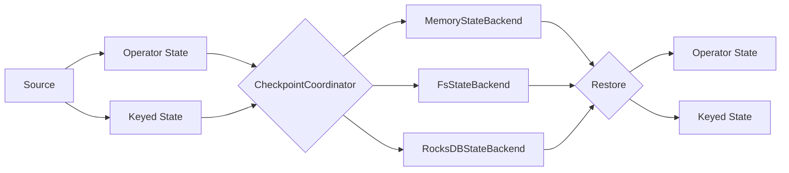

# Flink State状态管理原理与代码实例讲解

## 1. 背景介绍
### 1.1 Flink简介
### 1.2 状态管理在流处理中的重要性
### 1.3 Flink状态管理的发展历程

## 2. 核心概念与联系
### 2.1 状态的定义与分类
#### 2.1.1 算子状态(Operator State)
#### 2.1.2 键控状态(Keyed State)  
### 2.2 状态后端(State Backend)
#### 2.2.1 MemoryStateBackend
#### 2.2.2 FsStateBackend
#### 2.2.3 RocksDBStateBackend
### 2.3 状态一致性
#### 2.3.1 AT-LEAST-ONCE
#### 2.3.2 EXACTLY-ONCE
### 2.4 检查点(Checkpoint)与状态快照(State Snapshot)
### 2.5 状态序列化

## 3. 核心原理与算法
### 3.1 状态存储
#### 3.1.1 堆上状态与堆外状态
#### 3.1.2 异步状态快照
### 3.2 增量检查点(Incremental Checkpoint)
### 3.3 状态重分配
### 3.4 状态恢复
### 3.5 状态清理



## 4. 数学模型与公式
### 4.1 状态形式化定义
设状态为$S$，键为$k$，值为$v$，则键控状态可表示为：

$$S_k = \{(k_1, v_1), (k_2, v_2), ..., (k_n, v_n)\}$$

其中，$k_i$为第$i$个键，$v_i$为对应的值，$n$为键值对数量。

### 4.2 状态转换
假设算子$A$对键$k$的状态为$S_{A,k}$，经过转换函数$f$作用后输出给算子$B$，则有：

$$S_{B,k} = f(S_{A,k})$$

常见的状态转换函数包括`map`、`flatMap`、`filter`等。

### 4.3 状态快照
设$t$时刻算子$A$的状态为$S_A(t)$，则其状态快照$\hat{S}_A(t)$为：

$$\hat{S}_A(t) = S_A(t)$$

即将当前时刻的状态制作快照，供后续恢复使用。

## 5. 代码实例
### 5.1 算子状态示例
```java
public class CountWindowAverage extends RichFlatMapFunction<Tuple2<Long, Long>, Tuple2<Long, Long>> {

    private transient ValueState<Tuple2<Long, Long>> sum;

    @Override
    public void flatMap(Tuple2<Long, Long> input, Collector<Tuple2<Long, Long>> out) throws Exception {
        Tuple2<Long, Long> currentSum = sum.value();
        
        if (currentSum == null) {
            currentSum = Tuple2.of(0L, 0L);
        }

        currentSum.f0 += 1;
        currentSum.f1 += input.f1;

        sum.update(currentSum);

        if (currentSum.f0 >= 3) {
            out.collect(new Tuple2<>(input.f0, currentSum.f1 / currentSum.f0));
            sum.clear();
        }
    }

    @Override
    public void open(Configuration config) {
        ValueStateDescriptor<Tuple2<Long, Long>> descriptor =
                new ValueStateDescriptor<>(
                        "average", // 状态名称
                        TypeInformation.of(new TypeHint<Tuple2<Long, Long>>() {}), // 状态类型
                        Tuple2.of(0L, 0L)); // 状态默认值
        sum = getRuntimeContext().getState(descriptor);
    }
}
```
这个例子使用了`ValueState`来保存每个键对应的`sum`和`count`，用于计算平均值。状态通过`open()`方法中的`ValueStateDescriptor`来定义。

### 5.2 键控状态示例
```java
public class CountWindowAverage extends RichFlatMapFunction<Tuple2<Long, Long>, Tuple2<Long, Long>> {

    private transient ValueState<Tuple2<Long, Long>> sum;

    @Override
    public void flatMap(Tuple2<Long, Long> input, Collector<Tuple2<Long, Long>> out) throws Exception {
        Tuple2<Long, Long> currentSum = sum.value();
        
        if (currentSum == null) {
            currentSum = Tuple2.of(0L, 0L);
        }

        currentSum.f0 += 1;
        currentSum.f1 += input.f1;

        sum.update(currentSum);

        if (currentSum.f0 >= 3) {
            out.collect(new Tuple2<>(input.f0, currentSum.f1 / currentSum.f0));
            sum.clear();
        }
    }

    @Override
    public void open(Configuration config) {
        ValueStateDescriptor<Tuple2<Long, Long>> descriptor =
                new ValueStateDescriptor<>(
                        "average", // 状态名称 
                        TypeInformation.of(new TypeHint<Tuple2<Long, Long>>() {}), // 状态类型
                        Tuple2.of(0L, 0L)); // 状态默认值
        sum = getRuntimeContext().getState(descriptor);
    }
}
```
这个例子同样使用了`ValueState`，但是是作为键控状态来使用。每个键都有自己独立的状态，通过当前处理的键来访问和更新对应的状态值。

## 6. 实际应用场景
### 6.1 窗口计算
利用键控状态可以方便地实现各种窗口计算，如滑动窗口、滚动窗口、会话窗口等。通过将窗口中的元素缓存在状态中，在触发计算时进行聚合。

### 6.2 去重
利用键控状态可以记录每个键是否已经处理过，从而实现数据去重的功能。只需将每个键对应一个布尔类型的状态即可。

### 6.3 机器学习
在机器学习场景中，模型参数可以作为算子的状态保存起来，在数据到来时进行增量更新。这样可以实现一些在线学习算法。

### 6.4 状态化应用
利用Flink的状态管理和容错机制，可以构建"有状态应用"。将关键业务数据作为状态保存，在故障恢复后仍然能够从断点继续处理，实现端到端的Exactly-Once语义。

## 7. 工具与资源推荐
- Flink官方文档：https://ci.apache.org/projects/flink/flink-docs-stable/
- Flink github地址：https://github.com/apache/flink
- Flink中文社区：http://flink-china.org/
- 《Stream Processing with Apache Flink》：Flink权威指南
- 《Stateful Stream Processing with Apache Flink》：Flink状态管理专著

## 8. 总结与展望
### 8.1 Flink状态管理的优势
- 支持多种状态类型与丰富的状态操作
- 多层次的一致性保证
- 灵活的状态存储与访问
- 高效的状态快照与恢复
### 8.2 未来的改进方向
- 自适应的状态分区
- 状态的动态调优
- 状态的云原生支持
- 细粒度的状态恢复
### 8.3 结语
Flink强大的状态管理能力是其流处理能力的重要保证。合理利用状态能够大大提升流处理程序的表达能力和运行效率。未来Flink的状态管理机制还将不断完善，让流处理程序更加智能、高效、可靠。

## 9. 常见问题
### 9.1 什么时候该使用算子状态，什么时候使用键控状态？
算子状态适用于算子全局共享的状态，而键控状态适用于根据键值划分的状态。一般情况下，优先使用键控状态，除非确实需要全局共享的状态。

### 9.2 状态后端该如何选择？
- MemoryStateBackend：适用于本地调试，状态量不大的情况。
- FsStateBackend：适用于状态量较大，但是对读写性能要求不高的情况。
- RocksDBStateBackend：适用于超大状态量，对读写性能要求较高的情况。

生产环境下一般选择RocksDBStateBackend。

### 9.3 状态过大怎么办？
- 调整并发度，减少每个子任务的状态量。
- 开启增量Checkpoint，减少状态快照的大小。
- 打开配置StateTTLConfig，设置状态的TTL，及时清理过期状态。
- 使用RocksDB状态后端，利用其高效的压缩算法。

### 9.4 Flink状态和传统数据库有何区别？
Flink状态与传统数据库的区别主要在于：

- Flink状态是和算子的生命周期绑定的，而不是独立于程序之外。
- Flink状态的持久化是自动管理的，通过Checkpoint机制定期持久化。
- Flink状态是为了流处理场景优化的，更加轻量级。

但同时，Flink状态也借鉴了数据库的一些思想，如MVCC、LSM-Tree等。

### 9.5 Flink状态支持查询吗？
Flink状态目前主要是为了流处理场景设计的，不直接支持查询。

但是可以通过一些变通的方式实现类似的功能：

- 将状态数据写入外部存储，如HBase、Elasticsearch等，然后在外部系统中查询。
- 定义一个特殊的"查询流"，驱动状态数据不断输出，然后在外部消费这个流并进行查询。

未来Flink可能会提供状态查询的直接支持。

作者：禅与计算机程序设计艺术 / Zen and the Art of Computer Programming