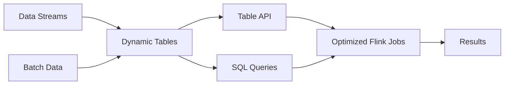

# Flink Table API和SQL原理与代码实例讲解

## 1. 背景介绍
### 1.1 Flink简介
#### 1.1.1 Flink的起源与发展
#### 1.1.2 Flink的主要特点
#### 1.1.3 Flink在流批一体化处理中的优势

### 1.2 Table API与SQL在Flink中的地位
#### 1.2.1 Table API与SQL的概念
#### 1.2.2 Table API与SQL在Flink技术栈中的位置
#### 1.2.3 Table API与SQL的应用场景

## 2. 核心概念与联系
### 2.1 Dynamic Tables 动态表
#### 2.1.1 动态表的定义
#### 2.1.2 动态表与流、关系表的关系
#### 2.1.3 动态表的特性

### 2.2 Table API
#### 2.2.1 Table API的概念与特点
#### 2.2.2 Table API的编程模型
#### 2.2.3 Table API的主要算子

### 2.3 Flink SQL
#### 2.3.1 Flink SQL的语法
#### 2.3.2 Flink SQL支持的操作
#### 2.3.3 Flink SQL与标准SQL的异同

### 2.4 Table API与SQL的关系
#### 2.4.1 Table API与SQL的互操作性
#### 2.4.2 Table API与SQL的选择原则
#### 2.4.3 混合使用Table API与SQL的最佳实践

## 3. 核心算法原理与具体操作步骤
### 3.1 动态表转换
#### 3.1.1 将流转换为动态表
#### 3.1.2 将动态表转换为流
#### 3.1.3 将关系表转换为动态表

### 3.2 动态表操作
#### 3.2.1 动态表的查询操作
#### 3.2.2 动态表的插入操作
#### 3.2.3 动态表的修改与删除操作

### 3.3 窗口操作
#### 3.3.1 滚动窗口
#### 3.3.2 滑动窗口
#### 3.3.3 会话窗口

### 3.4 时态表
#### 3.4.1 时态表的概念
#### 3.4.2 处理时间属性
#### 3.4.3 事件时间属性
#### 3.4.4 版本化表

### 3.5 连接操作
#### 3.5.1 常规连接
#### 3.5.2 时间区间连接
#### 3.5.3 模式匹配连接

## 4. 数学模型和公式详细讲解举例说明
### 4.1 窗口聚合的数学模型
#### 4.1.1 滚动窗口聚合
#### 4.1.2 滑动窗口聚合
#### 4.1.3 会话窗口聚合

### 4.2 时态表的数学模型
#### 4.2.1 处理时间属性的数学表示
#### 4.2.2 事件时间属性的数学表示
#### 4.2.3 版本化表的数学模型

### 4.3 模式匹配的数学模型
#### 4.3.1 单个模式的匹配
#### 4.3.2 组合模式的匹配
#### 4.3.3 模式序列的匹配

## 5. 项目实践：代码实例和详细解释说明
### 5.1 环境准备
#### 5.1.1 Flink环境搭建
#### 5.1.2 Table API与SQL依赖引入
#### 5.1.3 数据源准备

### 5.2 基本操作示例
#### 5.2.1 创建动态表
#### 5.2.2 查询动态表
#### 5.2.3 插入动态表
#### 5.2.4 修改与删除动态表

### 5.3 窗口操作示例
#### 5.3.1 滚动窗口示例
#### 5.3.2 滑动窗口示例 
#### 5.3.3 会话窗口示例

### 5.4 时态表操作示例
#### 5.4.1 处理时间属性示例
#### 5.4.2 事件时间属性示例
#### 5.4.3 版本化表示例

### 5.5 连接操作示例
#### 5.5.1 常规连接示例
#### 5.5.2 时间区间连接示例
#### 5.5.3 模式匹配连接示例

## 6. 实际应用场景
### 6.1 实时数据分析
#### 6.1.1 实时数据聚合统计
#### 6.1.2 实时数据报表
#### 6.1.3 实时异常检测

### 6.2 实时数据处理
#### 6.2.1 实时数据清洗
#### 6.2.2 实时数据富化
#### 6.2.3 实时数据规范化

### 6.3 实时数据集成
#### 6.3.1 异构数据源实时集成
#### 6.3.2 跨系统数据实时同步
#### 6.3.3 实时数据流转与分发

## 7. 工具和资源推荐
### 7.1 开发工具
#### 7.1.1 IntelliJ IDEA
#### 7.1.2 Flink WebUI
#### 7.1.3 SQL Client

### 7.2 学习资源
#### 7.2.1 官方文档
#### 7.2.2 在线教程
#### 7.2.3 技术博客

### 7.3 社区与支持
#### 7.3.1 Flink社区
#### 7.3.2 Stack Overflow
#### 7.3.3 邮件列表

## 8. 总结：未来发展趋势与挑战
### 8.1 Flink Table API与SQL的未来发展方向
#### 8.1.1 更丰富的SQL支持
#### 8.1.2 更高级的优化器
#### 8.1.3 更多的连接器支持

### 8.2 Flink Table API与SQL面临的挑战
#### 8.2.1 大规模数据处理的性能瓶颈
#### 8.2.2 复杂业务逻辑的表达能力
#### 8.2.3 与其他系统的无缝集成

### 8.3 Flink Table API与SQL的展望
#### 8.3.1 成为流批一体化处理的首选
#### 8.3.2 支持更广泛的数据源和数据汇
#### 8.3.3 与人工智能技术的结合

## 9. 附录：常见问题与解答
### 9.1 如何选择使用Table API还是SQL？
### 9.2 如何处理流数据中的延迟数据？
### 9.3 如何实现流数据的去重？
### 9.4 如何优化Flink Table API和SQL作业的性能？
### 9.5 如何处理动态表中的数据倾斜问题？

Flink Table API和SQL是流批一体化处理的强大工具，它们建立在Flink的核心之上，提供了声明式的API，使得用户能够以更加自然、直观的方式处理流数据和批数据。通过将流数据和批数据统一抽象为动态表，Table API和SQL屏蔽了底层数据的物理存储和计算模型，用户可以像操作普通数据库表一样操作流数据和批数据。

Table API是一套用于处理动态表的API，它以Java和Scala语言提供，支持选取、过滤、聚合、连接等关系型操作。相比于直接使用DataStream/DataSet API，Table API提供了更高层次的抽象，使得代码更加简洁、可读性更强。

Flink SQL是基于Apache Calcite框架实现的，支持标准的SQL语法，用户可以使用类似于操作关系型数据库的方式来处理流数据和批数据。Flink SQL不仅支持常见的SELECT、WHERE、GROUP BY、JOIN等操作，还引入了窗口、时态表等概念，以支持更加复杂的流数据分析场景。

在实际应用中，用户可以根据具体的业务需求，灵活选择使用Table API或SQL。对于需要复杂流程控制和自定义逻辑的场景，可以使用Table API；对于偏向于声明式SQL风格的场景，可以使用Flink SQL。同时，Table API和SQL也可以混合使用，用户可以用Table API定义一个中间结果表，然后在SQL中引用它。

Flink Table API和SQL让流数据和批数据处理变得前所未有的简单，它们极大降低了用户的学习和使用成本，使得更多的人能够从容应对日益复杂的数据处理需求。未来，Flink Table API和SQL将进一步完善，支持更加丰富的语义和特性，成为流批一体化处理的利器。

作者：禅与计算机程序设计艺术 / Zen and the Art of Computer Programming