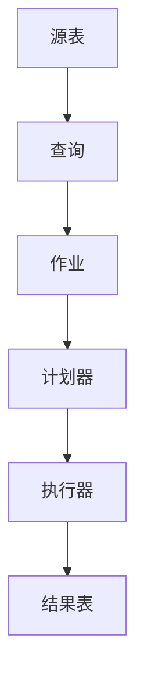

# Flink Table原理与代码实例讲解

## 1.背景介绍

Apache Flink 是一个开源的分布式流处理框架,它支持有状态计算、事件驱动的应用程序,并且具有高吞吐量和低延迟的特点。Flink Table API 和 SQL 是 Flink 提供的两种关系型API,用于统一批处理和流处理的编程范式。Table API 提供了一种类似于集合操作的编程风格,而 SQL 则支持使用标准的 SQL 语法来编写查询。

无论是使用 Table API 还是 SQL,底层都是由同一个统一的计划器 (Planner) 进行查询优化和执行。这个计划器负责将关系型查询转换为 DataStream 程序,并最终在 Flink 的分布式运行时系统上执行。

### 1.1 流处理与批处理的统一

传统上,批处理系统(如 Hadoop MapReduce)和流处理系统是分开的。批处理系统通常需要先将所有输入数据加载到集群中,然后再进行处理;而流处理系统则是持续不断地处理从源源不断的数据流中到来的数据记录。

Flink 的 Table API 和 SQL 统一了这两种范式。无论是有界的批处理输入还是无界的流式输入,在概念上都被视为逻辑上的动态表。对于有界的批输入,整个输入可以被编码为逻辑表的快照,而无界的流输入则被编码为逻辑表的变更日志(插入和撤销)。

### 1.2 Flink 与传统数据库的区别

与传统的数据库系统不同,Flink 是一个分布式的流处理引擎,旨在支持高吞吐量和低延迟的数据处理。Flink 的设计目标是能够实时处理连续到来的数据流,而不是像数据库那样专注于存储和管理静态数据。

虽然 Flink 提供了类似 SQL 的查询语言,但它并不是一个完整的数据库系统。Flink 缺乏一些数据库的核心功能,如完整的 ACID 事务支持、高级索引结构和复杂的查询优化器。相反,Flink 的重点是提供流数据处理、事件驱动应用程序和有状态计算等功能。

## 2.核心概念与联系

在深入探讨 Flink Table API 和 SQL 的细节之前,让我们先了解一些核心概念及它们之间的关系。

### 2.1 表 (Table)

在 Flink 中,表是所有数据的核心逻辑表示。表可以是批处理输入的有界快照,也可以是流式输入的持续追加的变更日志。表由一个或多个列 (Column) 组成,每一列都有相关的数据类型和名称。

### 2.2 动态表 (Dynamic Table)

动态表是一种根据数据变更持续发生变化的表。它由两部分组成:

1. **持久化的元数据** (Catalog) - 存储表的结构信息,如表名、字段名、字段类型等。
2. **持续追加的变更日志** - 存储对表的插入、更新和删除操作。

动态表可以表示有界批处理输入的快照视图,也可以表示无界流式输入的变更日志。

### 2.3 查询 (Query)

查询定义了对表进行的关系型操作,例如投影 (Projection)、过滤 (Filter)、联接 (Join)、分组 (Group) 和聚合 (Aggregate) 等。查询可以使用 Table API 的集合操作风格或 SQL 语法来表达。

### 2.4 作业 (Job)

作业是由一个或多个查询组成的端到端数据处理流水线。作业从一个或多个源表读取数据,经过一系列查询转换后,将结果写入一个或多个sink表。

### 2.5 计划器 (Planner)

计划器是 Flink 中负责将关系型查询转换为 DataStream 程序的组件。它首先将查询转换为逻辑查询计划,然后进行一系列的查询优化,最终生成可在 Flink 运行时执行的物理执行计划。

### 2.6 执行器 (Executor)

执行器是 Flink 运行时系统,负责执行由计划器生成的物理执行计划。它将执行计划分发到集群中的 TaskManager 上,并协调整个分布式执行过程。

### 2.7 关系

上述核心概念之间的关系如下所示:

1. 源表提供了作为输入的数据。
2. 查询定义了对源表进行的关系型操作。
3. 作业由一个或多个查询组成,构成了端到端的数据处理流水线。
4. 计划器将作业中的查询转换为可执行的物理计划。
5. 执行器负责在分布式运行时系统上执行物理计划,并将结果写入结果表。

## 3.核心算法原理具体操作步骤

在本节中,我们将探讨 Flink 如何将关系型查询转换为可执行的分布式数据流程序。这个过程包括以下几个主要步骤:

1. **查询解析** - 将查询语句解析为抽象语法树 (AST)。
2. **逻辑查询优化** - 对 AST 进行一系列等价的逻辑重写,以优化查询执行效率。
3. **逻辑计划生成** - 将优化后的 AST 转换为逻辑查询计划。
4. **物理优化** - 对逻辑查询计划进行一系列基于代价模型的优化,生成高效的物理执行计划。
5. **物理计划翻译** - 将物理执行计划翻译为可在 Flink 运行时执行的 DataStream 程序。

让我们逐步探讨这些步骤的细节。

### 3.1 查询解析

查询解析是将用户提交的查询语句转换为抽象语法树 (AST) 的过程。无论是 SQL 语句还是 Table API 的集合操作,都会被解析为相同的 AST 表示形式。

这个过程由 Flink 的 SQL 解析器完成,它基于 Apache Calcite 的查询解析和优化框架。解析器将查询语句分词、构建语法树,并进行语义检查以确保查询的有效性。

### 3.2 逻辑查询优化

在生成逻辑查询计划之前,Flink 会对 AST 进行一系列等价的逻辑重写,以优化查询执行效率。这个过程被称为逻辑查询优化。

一些常见的逻辑优化规则包括:

- **投影剪裁 (Projection Pruning)** - 移除不需要的投影字段。
- **过滤器下推 (Filter Pushdown)** - 将过滤条件下推到数据源,以尽早过滤掉不需要的数据。
- **子查询解相关 (Subquery Decorrelation)** - 将相关子查询转换为非相关子查询,以提高执行效率。
- **常量折叠 (Constant Folding)** - 预计算常量表达式的值。

经过逻辑优化后,AST 将被转换为更高效的等价形式。

### 3.3 逻辑计划生成

逻辑计划生成是将优化后的 AST 转换为逻辑查询计划的过程。逻辑查询计划是一种关系代数表示,描述了如何通过一系列关系运算 (如投影、过滤、联接等) 来计算查询结果。

Flink 使用了自己的关系代数表示形式,称为 RelNode。每个 RelNode 代表一种关系运算,如 Project、Filter、Join 等。这些 RelNode 按照特定的顺序组合在一起,构成了整个逻辑查询计划。

### 3.4 物理优化

逻辑查询计划描述了查询的逻辑执行步骤,但并未指定具体的物理执行策略。物理优化的目标是根据代价模型,为逻辑计划选择最优的物理执行策略,生成高效的物理执行计划。

Flink 的物理优化器会考虑多种执行策略,如:

- **联接策略** - 选择合适的联接算法 (如 Sort Merge Join、Hash Join 等) 以及联接顺序。
- **聚合策略** - 决定是先进行分组还是先进行聚合。
- **数据分区策略** - 确定如何在集群中分区和移动数据。
- **运算符链接** - 将多个运算符融合在一起执行,以减少数据移动。

物理优化器将根据代价模型评估不同策略的代价,并选择最优的执行计划。

### 3.5 物理计划翻译

最后一步是将优化后的物理执行计划翻译为可在 Flink 运行时执行的 DataStream 程序。这个过程由 Flink 的执行引擎完成。

每个物理运算符 (如 Join、Aggregate 等) 都会被翻译为一个或多个 DataStream 操作符。这些操作符按照特定的拓扑结构组织在一起,构成了最终的分布式数据流程序。

在翻译过程中,还需要考虑诸如数据分区、运算符链接、容错机制等因素,以确保程序能够高效、可靠地在分布式环境中执行。

## 4.数学模型和公式详细讲解举例说明

在关系型查询处理中,一些核心算法和优化技术都涉及到了数学模型和公式。本节将详细讲解其中的一些重要概念和方法。

### 4.1 代价模型

代价模型是物理查询优化中的关键组成部分。它用于估计不同执行计划的代价,以便选择最优的执行策略。

Flink 的代价模型基于以下几个主要指标:

- **CPU 代价** - 执行查询所需的 CPU 时间。
- **网络代价** - 在集群节点之间传输数据所需的网络开销。
- **内存代价** - 执行查询所需的内存空间。
- **IO 代价** - 从外部存储 (如 HDFS) 读取或写入数据的开销。

这些指标可以用不同的代价函数来建模,例如:

$$
\begin{align*}
\text{Cost}_\text{CPU}(o) &= \sum_i \text{CPU}_i(o) \\
\text{Cost}_\text{Net}(o) &= \sum_i \text{Bytes}_i(o) \times \text{TransferRate}_i(o) \\
\text{Cost}_\text{Mem}(o) &= \max_i \text{Mem}_i(o)
\end{align*}
$$

其中 $o$ 表示查询操作符, $i$ 表示并行实例。

物理优化器会根据这些代价函数评估不同执行计划的总体代价,并选择代价最小的计划作为最优执行策略。

### 4.2 查询重写

查询重写是逻辑查询优化中的一种核心技术。它通过等价变换将查询转换为更高效的形式,而不改变查询的语义。

一个常见的查询重写技术是基于代数等式的重写规则。例如,对于投影和过滤操作,我们有以下等式:

$$
\pi_X(\sigma_P(R)) \equiv \sigma_P(\pi_{X \cup \text{attrs}(P)}(R))
$$

其中 $\pi$ 表示投影, $\sigma$ 表示过滤, $X$ 是投影属性集合, $P$ 是过滤谓词, $R$ 是关系。

这个等式表明,我们可以先执行投影再执行过滤,或者先执行过滤再执行投影。根据代价模型,优化器会选择更高效的执行顺序。

类似的重写规则还包括联接重排序、谓词下推等。通过组合应用这些规则,优化器可以将查询转换为更优的逻辑形式。

### 4.3 数据分区策略

在分布式环境中,数据分区策略对查询执行效率有着重大影响。合理的分区策略可以减少数据移动,提高并行度,从而提升查询性能。

Flink 支持多种数据分区策略,包括:

- **哈希分区 (Hash Partitioning)** - 根据特定键的哈希值对数据进行分区。
- **范围分区 (Range Partitioning)** - 根据特定键的范围对数据进行分区。
- **广播 (Broadcast)** - 将数据广播到所有并行实例。
- **重分区 (Repartitioning)** - 根据新的分区键对数据进