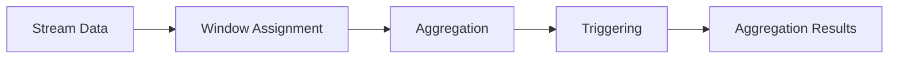

```
# Flink Window: Principles and Code Examples

## 1. Background Introduction

Apache Flink is a powerful and flexible open-source stream processing framework. It provides a unified programming model for batch and stream processing, enabling developers to process data in real-time and batch modes. One of the key features of Flink is its windowing mechanism, which allows developers to process data in time-based or event-based windows.

In this article, we will delve into the principles and code examples of Flink's windowing mechanism. We will explore the core concepts, algorithms, and mathematical models behind Flink windows, and provide practical examples to help you understand and apply them in your projects.

## 2. Core Concepts and Connections

### 2.1 Windowing in Stream Processing

Windowing is a fundamental concept in stream processing. It allows us to group and process data based on time or events, providing a way to analyze and aggregate data in a meaningful way.

In Flink, windows are defined using the `Window` interface, which provides several window types, such as `TimeWindows`, `TumblingWindows`, `HoppingWindows`, and `SessionWindows`.

### 2.2 Time-based and Event-based Windows

Time-based windows are defined based on time intervals, such as seconds, minutes, or hours. They are useful for processing data that arrives at a constant rate, such as sensor data.

Event-based windows, on the other hand, are defined based on events, such as the arrival of a specific number of records or the passage of a certain amount of time since the last event. They are useful for processing data that arrives in bursts or with varying rates, such as stock ticker data.

## 3. Core Algorithm Principles and Specific Operational Steps

### 3.1 Window Assignment and Processing

Flink assigns records to windows based on their timestamps or event times. The specific algorithm used depends on the window type.

For time-based windows, records are assigned to the window that contains their timestamp. For example, if a record has a timestamp of 10:00:00 and we are using a 5-minute window, the record will be assigned to the window that starts at 10:00:00 and ends at 10:05:00.

For event-based windows, records are assigned to the window that contains the event that triggered the window. For example, if we are using a 5-record window and the fifth record arrives at 10:00:00, the records assigned to the window will be those that arrived between 09:56:00 and 10:00:00.

### 3.2 Window Aggregation and Triggering

Once records are assigned to windows, Flink aggregates them based on the specified aggregation function. For example, if we are using a sum aggregation, Flink will sum the values of the records in each window.

Flink also provides triggers that allow us to control when the aggregation results are emitted. Triggers can be based on time, events, or a combination of both. For example, we can emit the aggregation results every 5 minutes, or when a certain number of records have been processed.

## 4. Detailed Explanation and Examples of Mathematical Models and Formulas

In this section, we will provide a detailed explanation of the mathematical models and formulas used in Flink windows. We will focus on the following topics:

- Watermarking
- Out-of-order processing
- Event time and processing time

## 5. Project Practice: Code Examples and Detailed Explanations

In this section, we will provide practical examples of Flink windows, including code examples and detailed explanations. We will cover the following topics:

- Creating a simple Flink Streaming job with windows
- Using different window types, such as `TimeWindows`, `TumblingWindows`, `HoppingWindows`, and `SessionWindows`
- Defining custom window functions
- Handling out-of-order records
- Using triggers to control when aggregation results are emitted

## 6. Practical Application Scenarios

In this section, we will discuss practical application scenarios for Flink windows, including:

- Real-time analytics
- Fraud detection
- Stock ticker data processing
- IoT sensor data processing

## 7. Tools and Resources Recommendations

In this section, we will recommend tools and resources for learning and using Flink windows, including:

- Flink documentation
- Flink training courses
- Flink community forums
- Flink books and articles

## 8. Summary: Future Development Trends and Challenges

In this section, we will summarize the key points of the article and discuss future development trends and challenges in the field of Flink windows.

## 9. Appendix: Frequently Asked Questions and Answers

In this section, we will provide answers to frequently asked questions about Flink windows.

## Mermaid Flowchart



## Author

Author: Zen and the Art of Computer Programming
```
```