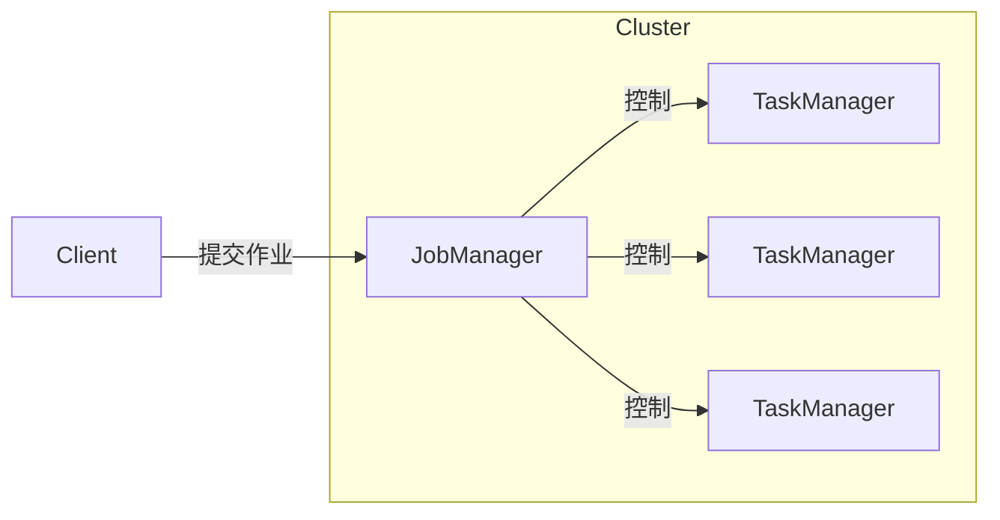
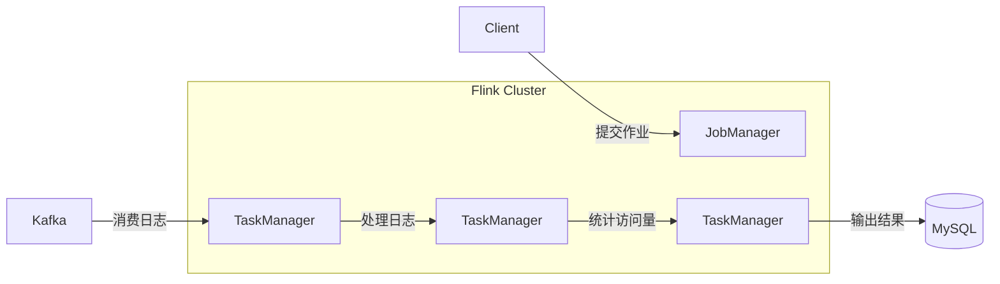

# Flink 原理与代码实例讲解

## 1. 背景介绍

### 1.1 大数据时代的到来

在当今时代,数据已经成为了一种新型的战略资源。随着互联网、物联网、移动互联网等新兴技术的快速发展,数据的产生速度和规模都在不断增长。根据IDC(国际数据公司)的预测,到2025年,全球数据总量将达到175ZB(1ZB=1万亿TB)。传统的数据处理系统已经难以满足如此海量数据的存储和计算需求。

### 1.2 大数据处理的挑战

面对大数据时代的到来,我们需要解决以下几个主要挑战:

1. **数据量大**:海量的数据需要高效的存储和计算能力。
2. **数据种类多**:结构化数据、半结构化数据和非结构化数据的混合。
3. **实时性要求高**:对数据的处理需要尽可能地实时。
4. **容错性强**:系统需要具有良好的容错能力,以应对节点故障。
5. **可扩展性好**:能够根据需求动态扩展计算资源。

### 1.3 大数据处理框架的演进

为了解决大数据带来的挑战,一系列大数据处理框架应运而生,主要包括:

1. **批处理框架**:Apache Hadoop MapReduce
2. **流处理框架**:Apache Storm、Apache Spark Streaming
3. **Lambda架构**:将批处理和流处理相结合
4. **新一代流处理框架**:Apache Flink、Apache Beam

其中,Apache Flink作为新一代流处理框架的代表,凭借其低延迟、高吞吐、容错性强等优势,备受关注。

## 2. 核心概念与联系

### 2.1 Flink 概述

Apache Flink是一个开源的分布式流处理框架,最初由德国柏林大学的一个研究小组开发。Flink具有以下核心特点:

1. **事件驱动型(Event-driven)**:基于流数据模型,以事件作为数据的基本单位。
2. **有状态计算(Stateful Computation)**:支持有状态的流处理应用。
3. **高吞吐、低延迟**:借助增量流处理模型,实现高吞吐和低延迟。
4. **精确一次语义(Exactly-once)**:通过检查点机制,保证作业在发生故障时可以恢复并且只处理一次数据。
5. **高可用性**:支持高可用集群部署,具有良好的容错性。
6. **可扩展性**:可以根据需求动态调整计算资源。

### 2.2 Flink 架构概览

Flink 采用了主从架构,主要包括以下几个核心组件:



- **Client**:用于提交作业到 Flink 集群。
- **JobManager**:集群的主节点,负责协调分布式执行,调度任务,协调检查点等。
- **TaskManager**:集群的工作节点,执行实际的数据处理任务。

### 2.3 Flink 核心概念

为了更好地理解 Flink,我们需要掌握以下几个核心概念:

1. **Stream & Transformation**:Flink 中的数据以流(Stream)的形式存在,通过转换操作(Transformation)对流进行处理。
2. **DataStream & DataSet**:DataStream 表示基本的数据流,DataSet 表示有界的数据集。
3. **Window**:用于对无界流数据进行切分,形成有界的数据集。
4. **State**:Flink 支持有状态的流处理,可以维护状态信息。
5. **Time**:Flink 支持基于事件时间或处理时间的处理模式。
6. **Checkpoint**:用于实现精确一次语义,在发生故障时可以恢复作业。

## 3. 核心算法原理具体操作步骤

### 3.1 流处理模型

Flink 采用了增量流处理模型,与传统的批处理模型不同。在增量流处理模型中,数据以流的形式持续不断地到达,Flink 会对新到达的数据进行增量计算,而不需要等待所有数据都到达后再进行批量计算。这种模型可以实现低延迟和高吞吐。

具体的操作步骤如下:

1. 数据源(Source)持续不断地产生数据流。
2. 数据流经过一系列转换操作(Transformation),形成新的数据流。
3. 最终结果通过sink(Sink)输出。

整个过程是流式的,数据一到达就立即进行处理,不需要等待所有数据都到达。这种模型非常适合实时数据处理场景,如实时监控、实时分析等。

### 3.2 有状态计算

在流处理中,有状态计算是一个非常重要的概念。有状态计算意味着我们可以在处理数据流时维护一些状态信息,这些状态信息可以用于后续的计算。Flink 支持有状态的流处理,可以使用各种状态原语(State Primitives)来维护状态。

常见的状态原语包括:

1. **Keyed State**:基于键(Key)维护的状态,不同的键对应不同的状态。
2. **Operator State**:与单个算子实例相关联的状态。
3. **Raw State**:原始字节序列形式的状态,可以由用户自定义序列化和反序列化方式。

有状态计算的操作步骤如下:

1. 在算子(Operator)中定义状态。
2. 在处理数据时,根据需要读取或更新状态。
3. Flink 会自动管理状态的分布式快照(Checkpoint),以保证精确一次语义。

有状态计算使得我们可以实现更加复杂的流处理应用,如会话窗口(Session Window)、连续计算(Incremental Computing)等。

### 3.3 窗口操作

在流处理中,我们经常需要对无界的数据流进行切分,形成有界的数据集,以便进行批量计算。这就需要使用窗口(Window)操作。Flink 支持多种窗口类型,如滚动窗口(Tumbling Window)、滑动窗口(Sliding Window)、会话窗口(Session Window)等。

窗口操作的具体步骤如下:

1. 根据需求选择合适的窗口类型,如基于时间的窗口或基于计数的窗口。
2. 对数据流应用窗口操作,将无界流切分为有界的窗口数据集。
3. 对每个窗口数据集进行批量计算,如聚合、连接等操作。
4. 输出计算结果。

窗口操作使得我们可以在无界数据流上执行批量计算,同时还能保持一定程度的实时性。它广泛应用于实时分析、实时监控等场景。

## 4. 数学模型和公式详细讲解举例说明

在流处理中,我们经常需要对数据进行聚合计算,如求和、求平均值等。这些计算通常可以用数学模型和公式来表示。下面我们以求和操作为例,详细讲解相关的数学模型和公式。

### 4.1 求和操作的数学模型

假设我们有一个数据流 $S = \{x_1, x_2, x_3, \dots, x_n\}$,其中 $x_i$ 表示第 $i$ 个数据元素。我们希望计算这个数据流的总和。

数学上,我们可以将求和操作表示为:

$$
sum = \sum_{i=1}^{n} x_i
$$

其中,符号 $\sum$ 表示求和运算,下标 $i=1$ 表示从第一个元素开始,上标 $n$ 表示到第 $n$ 个元素结束。

### 4.2 增量计算模型

在流处理中,我们需要采用增量计算模型,即每当有新的数据元素到达时,就立即将其加入到当前的总和中。这种增量计算模型可以表示为:

$$
sum_{t+1} = sum_t + x_{t+1}
$$

其中,符号 $sum_t$ 表示在时间 $t$ 时的总和,符号 $x_{t+1}$ 表示在时间 $t+1$ 时到达的新数据元素。

通过这种增量计算模型,我们可以实时地更新总和,而不需要等待所有数据都到达后再进行批量计算。这种模型非常适合流处理场景。

### 4.3 代码实例

下面是一个使用 Flink Java API 实现求和操作的代码示例:

```java
import org.apache.flink.streaming.api.environment.StreamExecutionEnvironment;
import org.apache.flink.streaming.api.datastream.DataStream;

public class SumExample {
    public static void main(String[] args) throws Exception {
        StreamExecutionEnvironment env = StreamExecutionEnvironment.getExecutionEnvironment();

        // 创建一个数据流
        DataStream<Integer> numbers = env.fromElements(1, 2, 3, 4, 5);

        // 对数据流进行求和操作
        DataStream<Integer> sum = numbers.sum();

        // 打印结果
        sum.print();

        env.execute("Sum Example");
    }
}
```

在这个示例中,我们首先创建了一个包含整数元素的数据流 `numbers`。然后,我们调用 `sum()` 方法对这个数据流进行求和操作,得到一个新的数据流 `sum`。最后,我们打印出求和结果。

运行这个示例,输出结果为:

```
15
```

这个结果正是我们期望的数据流 `{1, 2, 3, 4, 5}` 的总和。

通过这个简单的示例,我们可以看到 Flink 如何将数学模型和公式应用到实际的流处理场景中。

## 5. 项目实践:代码实例和详细解释说明

为了更好地理解 Flink 的使用,我们将通过一个实际项目来进行实践。在这个项目中,我们将构建一个简单的实时数据统计系统,统计网站的实时访问量。

### 5.1 项目需求

我们的实时数据统计系统需要满足以下需求:

1. 从 Kafka 消费实时的网站访问日志数据。
2. 对访问日志进行清洗和过滤,去除无效的访问记录。
3. 统计每个时间窗口内的访问量,包括总访问量和按页面维度的访问量。
4. 将统计结果输出到 MySQL 数据库中,以供后续查询和展示。

### 5.2 项目架构

我们的项目架构如下所示:



1. 网站访问日志被发送到 Kafka 消息队列中。
2. Flink 作业从 Kafka 消费实时的访问日志数据。
3. 对访问日志进行清洗和过滤。
4. 统计每个时间窗口内的访问量。
5. 将统计结果输出到 MySQL 数据库中。

### 5.3 代码实现

下面是核心代码的实现,包括从 Kafka 消费数据、数据清洗、统计访问量和输出结果等步骤。

#### 5.3.1 从 Kafka 消费数据

```java
import org.apache.flink.api.common.serialization.SimpleStringSchema;
import org.apache.flink.streaming.api.environment.StreamExecutionEnvironment;
import org.apache.flink.streaming.connectors.kafka.FlinkKafkaConsumer;

import java.util.Properties;

public class WebAccessLogAnalysis {
    public static void main(String[] args) throws Exception {
        StreamExecutionEnvironment env = StreamExecutionEnvironment.getExecutionEnvironment();

        Properties props = new Properties();
        props.setProperty("bootstrap.servers", "kafka-broker-1:9092,kafka-broker-2:9092");
        props.setProperty("group.id", "flink-consumer");

        FlinkKafkaConsumer<String> kafkaConsumer = new FlinkKafkaConsumer<>(
                "web-access-logs",
                new SimpleStringSchema(),
                props
        );

        env.addSource(kafkaConsumer)
            // 后续处理步骤...
    }
}
```

在这段代码中,我们首先创建了一个 `StreamExecutionEnvironment` 对象,用于构建 Flink 作业。