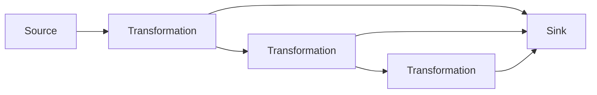

# Flink 原理与代码实例讲解

## 1. 背景介绍
### 1.1 大数据处理的挑战
### 1.2 Flink的诞生与发展历程
### 1.3 Flink在大数据领域的地位

## 2. 核心概念与联系
### 2.1 Flink的核心概念
#### 2.1.1 DataStream和DataSet
#### 2.1.2 Time和Window
#### 2.1.3 State和Checkpoint
#### 2.1.4 Event Time和Processing Time
### 2.2 Flink架构与组件
#### 2.2.1 Flink运行时架构
#### 2.2.2 JobManager和TaskManager
#### 2.2.3 Flink客户端
### 2.3 Flink核心API介绍
#### 2.3.1 DataStream API
#### 2.3.2 Table API & SQL
#### 2.3.3 Stateful Stream Processing
### 2.4 Flink生态系统
#### 2.4.1 Flink与Kafka集成
#### 2.4.2 Flink与HDFS集成
#### 2.4.3 Flink与Hive集成

## 3. 核心算法原理具体操作步骤
### 3.1 Flink中的数据传输与分区
#### 3.1.1 数据传输的一致性
#### 3.1.2 数据分区策略
### 3.2 Flink中的状态管理
#### 3.2.1 Keyed State与Operator State  
#### 3.2.2 状态后端
#### 3.2.3 状态快照与恢复
### 3.3 Flink中的容错机制
#### 3.3.1 Checkpoint原理
#### 3.3.2 Savepoint原理
#### 3.3.3 端到端的Exactly-Once语义
### 3.4 Flink中的时间语义
#### 3.4.1 Event Time与Processing Time
#### 3.4.2 Watermark原理
#### 3.4.3 处理乱序事件

## 4. 数学模型和公式详细讲解举例说明
### 4.1 Flink中的窗口模型
#### 4.1.1 滚动窗口(Tumbling Window)
#### 4.1.2 滑动窗口(Sliding Window) 
#### 4.1.3 会话窗口(Session Window)
#### 4.1.4 全局窗口(Global Window)
### 4.2 Flink中的时间戳分配与水位线生成
#### 4.2.1 时间戳分配器(Timestamp Assigner)
#### 4.2.2 水位线生成器(Watermark Generator)
### 4.3 Flink中的状态转移方程
#### 4.3.1 Keyed State的数学模型
#### 4.3.2 Operator State的数学模型

## 5. 项目实践：代码实例和详细解释说明
### 5.1 Flink DataStream API应用
#### 5.1.1 实时数据ETL
#### 5.1.2 实时异常检测
#### 5.1.3 实时报表分析
### 5.2 Flink Table API & SQL应用
#### 5.2.1 实时数据汇总
#### 5.2.2 实时数据关联
#### 5.2.3 实时数据去重
### 5.3 Flink状态管理应用
#### 5.3.1 实时Top N统计
#### 5.3.2 实时用户画像
#### 5.3.3 实时AB测试
### 5.4 Flink容错与恢复应用
#### 5.4.1 Checkpoint案例
#### 5.4.2 Savepoint案例
#### 5.4.3 Exactly-Once案例

## 6. 实际应用场景
### 6.1 电商实时推荐
### 6.2 金融风控实时预警
### 6.3 物联网实时监控
### 6.4 网络安全实时检测

## 7. 工具和资源推荐
### 7.1 Flink官网与文档
### 7.2 Flink社区与邮件列表
### 7.3 Flink源码与示例
### 7.4 Flink在线学习资源

## 8. 总结：未来发展趋势与挑战
### 8.1 Flink在AI与机器学习领域的应用前景
### 8.2 Flink在云原生与Serverless架构下的机遇
### 8.3 Flink面临的技术挑战与未来规划

## 9. 附录：常见问题与解答
### 9.1 Flink与Spark、Storm的对比
### 9.2 Flink适用的业务场景
### 9.3 Flink的学习路径与进阶建议

---

Flink是一个开源的分布式流处理和批处理框架,由Apache软件基金会管理。它是一个统一的数据处理引擎,可以同时处理无界和有界数据流。Flink以数据并行和流水线方式执行任意流数据程序,Flink的流水线运行时系统可以执行批处理和流处理程序。此外,Flink的运行时本身也支持迭代算法的执行。

Flink的核心是一个分布式流数据流引擎,它具有对流和批数据进行处理的功能。在Flink中,所有数据都被视为流,离线数据是有界流,实时数据是无界流。Flink程序可以在无界和有界数据流上运行,在无界流上运行时,会产生持续的结果流;在有界流上运行时,会产生一个结果流,然后结束。

Flink的主要特点包括:

1. 同时支持高吞吐、低延迟、高性能的流处理和批处理
2. 支持事件时间(event-time)和处理时间(processing-time)语义
3. 支持有状态计算,并提供了一致性、容错的状态管理
4. 基于轻量级分布式快照实现容错
5. 基于JVM实现独立的内存管理
6. 支持迭代计算
7. 支持程序自动优化
8. 支持高度灵活的窗口(window)操作
9. 支持循环和Delta迭代运算

下图展示了Flink的运行时架构:



Flink的分布式运行时包含两类进程:

- JobManager: 控制一个应用程序执行的主进程,也就是说,每个应用程序都会被一个不同的JobManager所控制执行。JobManager会先接收到要执行的应用程序,这个应用程序会包括:作业图(JobGraph)、逻辑数据流图和打包了所有的类、库和其它资源的JAR包。JobManager会把JobGraph转换成一个物理层面的数据流图,这个图被叫做"执行图"(ExecutionGraph),包含了所有可以并发执行的任务。JobManager会向资源管理器(如YARN)请求执行任务必要的资源,也就是TaskManager上的插槽(slot)。一旦它获取到了足够的资源,就会将执行图分发到真正运行它们的TaskManager上。而在运行过程中,JobManager会负责所有需要中央协调的操作,比如说检查点(checkpoints)的协调。

- TaskManager: Flink中的工作进程。通常在Flink中会有多个TaskManager运行,每一个TaskManager都包含了一定数量的插槽(slots)。插槽的数量限制了TaskManager能够执行的任务数量。启动之后,TaskManager会向资源管理器注册它的插槽;收到资源管理器的指令后,TaskManager就会将一个或者多个插槽提供给JobManager调用。JobManager就可以向插槽分配任务(tasks)来执行了。在执行过程中,一个TaskManager可以跟其它运行同一应用程序的TaskManager交换数据。

Flink的核心抽象是DataStream,它代表一个无界的、包含相同类型元素的数据流。Flink程序就是对DataStream的转换操作,将一个或多个DataStream转换成新的DataStream,然后通过Sink输出。Flink提供了多种内置的Source和Sink连接器,比如文件、集合、Kafka等。

下面是一个Flink WordCount的代码示例:

```java
public class WordCount {
  public static void main(String[] args) throws Exception {
    // 创建执行环境
    StreamExecutionEnvironment env = StreamExecutionEnvironment.getExecutionEnvironment();

    // 从文本文件读取数据
    DataStream<String> text = env.readTextFile("input");
    
    DataStream<Tuple2<String, Integer>> counts = 
      // 将每行文本分割成单词
      text.flatMap(new Tokenizer())
      // 按单词分组
      .keyBy(0)
      // 对每个组内的数据进行聚合
      .sum(1);

    // 将结果打印到控制台
    counts.print();

    // 执行任务
    env.execute("Streaming WordCount");
  }

  public static final class Tokenizer 
    implements FlatMapFunction<String, Tuple2<String, Integer>> {
    @Override
    public void flatMap(String value, Collector<Tuple2<String, Integer>> out) {
      String[] tokens = value.toLowerCase().split("\\W+");
      for (String token : tokens) {
        if (token.length() > 0) {
          out.collect(new Tuple2<>(token, 1));
        }
      }
    }
  }
}
```

这个例子展示了如何使用Flink的DataStream API来实现一个实时的WordCount应用。程序从一个文本文件读取数据,然后进行一系列的转换操作,最后将结果输出到控制台。

具体步骤如下:

1. 创建执行环境StreamExecutionEnvironment,这是所有Flink程序的基础。
2. 使用`readTextFile`方法从文本文件读取数据,得到一个DataStream<String>。
3. 对DataStream进行一系列的转换操作:
   - 使用`flatMap`方法将每行文本分割成单个单词,将句子映射成<word, 1>的二元组。flatMap的函数实现定义在Tokenizer类中。
   - 使用`keyBy`方法按照二元组的第一个字段(单词)进行分组。
   - 使用`sum`方法对每个组内的第二个字段(数量)进行求和聚合。
4. 使用`print`方法将结果DataStream输出到控制台。
5. 最后调用`execute`方法执行任务。

Flink中另一个重要的概念是状态管理。Flink通过State和Checkpoint两个核心机制来保证exactly-once语义。State是指一个任务在处理数据时的中间状态,可以被记录和更新。Flink根据State的作用范围,将State划分为Keyed State和Operator State。

- Keyed State: 根据指定的Key进行分区,每个Key对应一个State。只能用于KeyedStream。
- Operator State: 与特定算子相关联,整个算子只对应一个State。可用于所有算子。

下面是一个使用Keyed State实现单词计数的示例:

```java
public class CountWindowAverage extends RichFlatMapFunction<Tuple2<Long, Long>, Tuple2<Long, Long>> {
    private transient ValueState<Tuple2<Long, Long>> sum;

    @Override
    public void flatMap(Tuple2<Long, Long> input, Collector<Tuple2<Long, Long>> out) throws Exception {
        Tuple2<Long, Long> currentSum = sum.value();
        if (currentSum == null) {
            currentSum = Tuple2.of(0L, 0L);
        }

        currentSum.f0 += 1;
        currentSum.f1 += input.f1;
        sum.update(currentSum);

        if (currentSum.f0 >= 10) {
            out.collect(new Tuple2<>(input.f0, currentSum.f1 / currentSum.f0));
            sum.clear();
        }
    }

    @Override
    public void open(Configuration config) {
        ValueStateDescriptor<Tuple2<Long, Long>> descriptor =
                new ValueStateDescriptor<>(
                        "average", // state名称
                        TypeInformation.of(new TypeHint<Tuple2<Long, Long>>() {}), // 状态类型
                        Tuple2.of(0L, 0L)); // 默认值
        sum = getRuntimeContext().getState(descriptor);
    }
}
```

这个例子使用了一个Keyed State来保存每个Key对应的计数值和总和。flatMap函数在处理每个元素时,会更新对应Key的状态,并在计数达到10时输出平均值并清空状态。

Flink的另一个重要特性是容错。Flink使用Checkpoint机制来保证exactly-once语义。Checkpoint是Flink作业状态的一致性快照,包括所有任务的State和输出位置。通过Checkpoint,Flink可以从故障中恢复,并保证数据处理的一致性。

下面是一个启用Checkpoint的示例:

```java
StreamExecutionEnvironment env = StreamExecutionEnvironment.getExecutionEnvironment();

// 启用Checkpoint,每1000 ms进行一次Checkpoint
env.enableCheckpointing(1000);

// 设置Checkpoint的模式为EXACTLY_ONCE(默认)
env.getCheckpointConfig().setCheckpointingMode(CheckpointingMode.EXACTLY_ONCE);

// 设置Checkpoint的超时时间为60s
env.getCheckpointConfig().setCheckpointTimeout(60000);

// 设置同一时间只允许进行一个Checkpoint
env