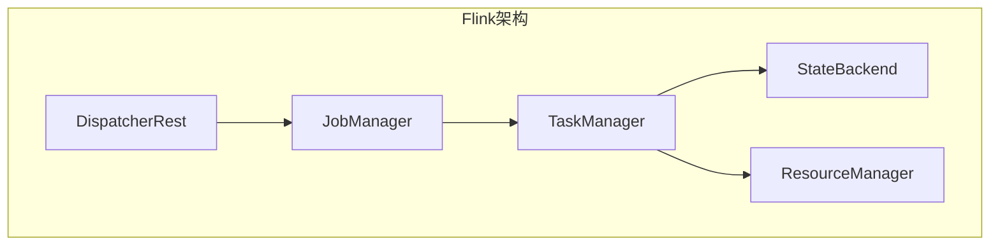
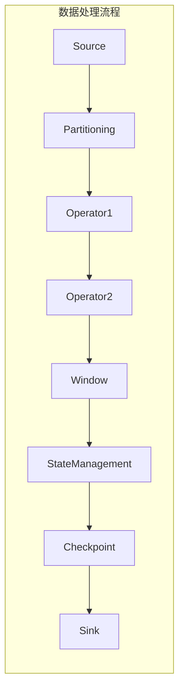
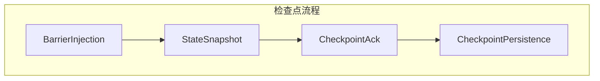

# Flink原理与代码实例讲解

## 1.背景介绍

Apache Flink是一个开源的分布式流处理框架,专门为有状态计算而设计。它能够对无界数据流进行高吞吐、低延迟的数据处理,同时还支持有状态计算和准确一次的状态一致性。Flink的核心是一个分布式流数据流引擎,它支持有状态计算、数据分布式缓存以及异步备份等功能。

Flink最初由柏林技术大学的学生开发,后来加入了数据存储和数据分析公司data Artisans的工程师,并最终捐赠给Apache软件基金会。Flink自2014年12月成为Apache的顶级项目,目前已经发展成为流处理领域最受欢迎的开源项目之一。

### 1.1 Flink的优势

- **事件驱动型(Event-driven)**: Flink是一个真正的流式数据处理系统,可以对数据流进行低延迟、高吞吐的处理。
- **有状态计算(Stateful Computations)**: Flink支持有状态计算,可以维护状态并将其一致性地存储在内存或者持久化存储中。
- **准确一次(Exactly-once)**: Flink支持端到端的精确一次语义,即使在发生故障时也能够保证数据不会丢失或重复处理。
- **可扩展&高可用**: Flink可以通过增加或减少工作节点来动态扩展计算资源,并且能够在出现故障时自动重启和恢复计算。
- **内存管理**: Flink通过JVM内存管理和磁盘式存储管理,实现了高效的内存管理。
- **迭代计算(Iterations)**: Flink支持批处理和流处理的无缝集成,可以在同一个程序中混合使用。

### 1.2 Flink的应用场景

- **实时数据分析**: 对来自多个数据源的流式数据进行实时分析,如网站用户行为分析、物联网数据分析等。
- **数据处理管道**: 构建可靠的端到端数据处理管道,从数据源采集、清洗、处理到最终存储。
- **事件驱动应用**: 基于事件驱动架构构建实时应用,如实时推荐系统、在线交易处理等。

## 2.核心概念与联系

### 2.1 流(Stream)

在Flink中,数据被建模为无限的数据流。流可以是有界的(如文件中的数据流),也可以是无界的(如消息队列中的数据流)。Flink以流的方式处理数据,而不是像批处理系统那样将数据存储在磁盘上。

### 2.2 数据源(Source)

数据源是指数据流的起点,可以是文件、消息队列、数据库等。Flink支持多种数据源,如Apache Kafka、RabbitMQ、Apache Hadoop等。

### 2.3 转换(Transformation)

转换是指对数据流进行处理的操作,如过滤、映射、聚合等。Flink提供了丰富的转换操作,可以灵活地构建数据处理管道。

### 2.4 数据接收器(Sink)

数据接收器是指数据流的终点,可以是文件、消息队列、数据库等。Flink支持多种数据接收器,如HDFS、Apache Kafka、RabbitMQ等。

### 2.5 任务(Task)

任务是Flink执行计算的基本单元,每个任务都是一个独立的线程,负责处理数据流的一部分。Flink会自动将计算程序划分为多个任务,并将它们分发到集群中的多个节点上执行。

### 2.6 作业(Job)

作业是指一个完整的数据处理程序,由多个任务组成。Flink会将作业转换为有向无环图(DAG),并根据DAG调度和执行任务。

### 2.7 执行环境(ExecutionEnvironment)

执行环境是Flink程序的入口,用于配置作业的执行参数、设置并行度等。Flink提供了两种执行环境:StreamExecutionEnvironment用于流处理,ExecutionEnvironment用于批处理。

### 2.8 窗口(Window)

窗口是Flink处理无界数据流的关键机制。窗口将无界数据流划分为有限的数据集,使得可以对这些有限数据集进行聚合等操作。Flink支持多种窗口类型,如滚动窗口、滑动窗口、会话窗口等。

### 2.9 状态(State)

状态是Flink实现有状态计算的关键。Flink将计算状态存储在本地或远程存储中,并在发生故障时自动恢复状态,从而实现精确一次的语义。Flink支持多种状态类型,如键控状态、操作符状态等。

### 2.10 时间语义(Time Semantics)

由于流式数据是无界的,因此时间在Flink中扮演着重要的角色。Flink支持三种时间语义:事件时间(Event Time)、处理时间(Processing Time)和引入时间(Ingestion Time)。正确理解和使用时间语义对于实现准确的流处理至关重要。

### 2.11 核心架构

Flink的核心架构由以下几个主要组件组成:

- **JobManager**: 负责协调分布式执行,调度任务、协调检查点等。
- **TaskManager**: 执行实际的数据处理任务,包括数据流的接收、转换和发送。
- **ResourceManager**: 负责管理任务执行所需的CPU、内存等资源,并将资源分配给TaskManager。
- **DispatcherRest**: 提供了一个REST接口,用于提交和运行Flink作业。
- **Checkpoint&StateBackend**: 负责管理状态数据的持久化和恢复。

这些组件协同工作,构成了Flink的核心架构,实现了流式数据处理、有状态计算和容错能力。

## 3.核心算法原理具体操作步骤

### 3.1 数据处理流程

Flink的数据处理流程可以概括为以下几个步骤:

1. **数据源(Source)**: 数据从各种数据源(如Kafka、文件等)流入Flink。
2. **流分区(Stream Partitioning)**: 数据流被划分为多个分区,以实现并行处理。
3. **算子(Operator)**: 数据流经过一系列算子(如map、filter、join等)进行转换和处理。
4. **任务链(Task Chain)**: 多个算子被链接在一起形成任务链,以减少数据传输和缓冲开销。
5. **窗口(Window)**: 对于无界数据流,可以使用窗口将其划分为有限的数据集进行处理。
6. **状态管理(State Management)**: 算子可以维护状态,状态会被持久化以实现容错。
7. **检查点(Checkpoint)**: 系统会定期保存状态快照,用于故障恢复。
8. **数据接收器(Sink)**: 处理后的数据流被发送到各种数据接收器(如Kafka、文件等)。

### 3.2 流分区(Stream Partitioning)

为了实现并行处理,Flink将数据流划分为多个分区。分区的方式有以下几种:

- **随机分区(Random Partitioning)**: 将数据随机分配到下游分区。
- **轮询分区(Round-Robin Partitioning)**: 将数据顺序分配到下游分区。
- **重缩分区(Rescale Partitioning)**: 根据数据键值进行分区,实现键组分区。
- **广播分区(Broadcast Partitioning)**: 将数据复制到所有下游分区。
- **自定义分区(Custom Partitioning)**: 用户可以自定义分区函数。

### 3.3 任务链(Task Chain)

为了减少数据传输和缓冲开销,Flink会将多个算子链接在一起形成任务链。在同一个任务链中,算子之间的数据是直接传递的,而不需要经过网络传输或缓冲。任务链的构建遵循以下原则:

- 同一个线程中的算子会被链接在一起。
- 只有两个算子之间的数据分区方式相同,它们才能被链接。
- 数据集合(如union)和数据分发(如broadcast)操作会断开任务链。

### 3.4 窗口(Window)

对于无界数据流,Flink使用窗口将其划分为有限的数据集进行处理。Flink支持以下几种窗口类型:

- **滚动窗口(Tumbling Window)**: 无重叠的固定大小窗口。
- **滑动窗口(Sliding Window)**: 有重叠的固定大小窗口。
- **会话窗口(Session Window)**: 根据数据活动期间划分窗口。
- **全局窗口(Global Window)**: 将所有数据收集到一个全局窗口中。

窗口可以根据时间(如每5秒一个窗口)或数据计数(如每1000条记录一个窗口)进行划分。窗口操作通常与聚合函数(如sum、max、min等)结合使用。

### 3.5 状态管理(State Management)

Flink支持有状态计算,算子可以维护状态并将其存储在本地或远程存储中。Flink支持以下几种状态类型:

- **键控状态(Keyed State)**: 每个键值对应一个状态实例,常用于实现有状态的流处理。
- **操作符状态(Operator State)**: 每个并行算子实例对应一个状态实例,常用于实现有状态的批处理。
- **原始状态(Raw State)**: 用户可以自定义状态存储和编码格式。

状态会被持久化到StateBackend中,以实现容错。Flink支持多种StateBackend,如基于内存的HashMapStateBackend、基于文件的FsStateBackend、基于RocksDB的RocksDBStateBackend等。

### 3.6 检查点(Checkpoint)

为了实现精确一次的语义,Flink会定期保存状态快照,称为检查点。检查点分为以下几个步骤:

1. **障碍点(Barrier Injection)**: Flink将障碍标记注入数据流,用于标记检查点的开始。
2. **状态快照(State Snapshot)**: 算子将当前状态存储到StateBackend中。
3. **检查点确认(Checkpoint Acknowledgement)**: 所有算子完成状态快照后,向JobManager确认检查点完成。
4. **检查点持久化(Checkpoint Persistence)**: JobManager将检查点元数据持久化到持久存储中。

如果发生故障,Flink可以从最近一次成功的检查点恢复,从而实现精确一次的语义。

## 4.数学模型和公式详细讲解举例说明

在Flink中,有一些核心算法和模型需要使用数学公式进行描述和推导。下面我们将详细介绍其中的一些关键公式。

### 4.1 流分区算法

Flink的流分区算法决定了数据如何在并行任务之间进行分发。常见的分区算法包括:

1. **随机分区(Random Partitioning)**

随机分区将数据随机分配到下游分区,可以实现良好的负载均衡。假设有$n$个下游分区,对于第$i$条记录,它被分配到第$j$个分区的概率为:

$$
P(i \rightarrow j) = \frac{1}{n}
$$

2. **轮询分区(Round-Robin Partitioning)**

轮询分区按顺序将数据分配到下游分区。假设有$n$个下游分区,对于第$i$条记录,它被分配到第$j$个分区的概率为:

$$
P(i \rightarrow j) = \begin{cases}
1, & \text{if } j = i \bmod n \\
0, & \text{otherwise}
\end{cases}
$$

3. **重缩分区(Rescale Partitioning)**

重缩分区根据数据键值进行分区,实现键组分区。假设有$n$个下游分区,对于键值为$k$的记录,它被分配到第$j$个分区的概率为:

$$
P(k \rightarrow j) = \begin{cases}
1, & \text{if } j = \text{hash}(k) \bmod n \\
0, & \text{otherwise}
\end{cases}
$$