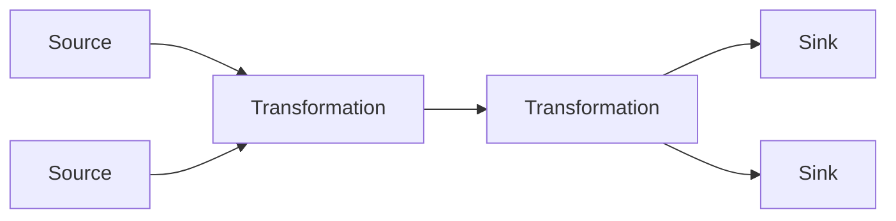
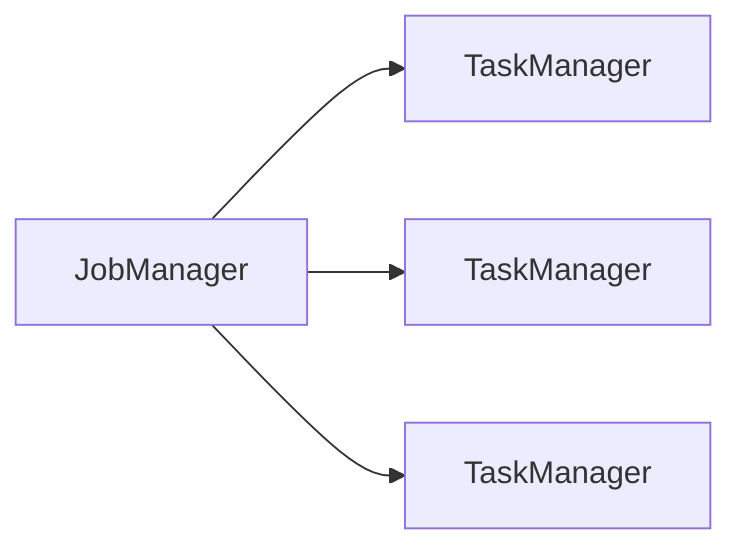

# Flink原理与代码实例讲解

## 1.背景介绍

### 1.1 大数据时代的到来

随着互联网、移动互联网和物联网的飞速发展,海量的数据正以前所未有的规模和速度不断产生。这些数据来源于各种渠道,如网站日志、移动应用程序、社交媒体平台、物联网设备等。传统的数据处理系统很难满足对这些大规模数据的实时处理和分析需求。因此,大数据时代的到来对数据处理系统提出了新的挑战。

### 1.2 流式数据处理的重要性

在大数据时代,数据不仅规模巨大,而且通常以流的形式持续产生。例如,网络日志、传感器数据、金融交易记录等都是流式数据。与传统的批处理系统不同,流式数据处理系统需要实时或近实时地处理持续到来的数据流,以便及时获取洞见和做出反应。流式数据处理在许多领域都扮演着关键角色,如实时监控、欺诈检测、物联网应用等。

### 1.3 Apache Flink 简介

Apache Flink 是一个开源的分布式流式数据处理框架,旨在统一批处理和流处理。它具有低延迟、高吞吐量、容错性强等优点,可以高效地处理有界和无界数据流。Flink 不仅支持纯流处理,还支持批处理,并提供了丰富的API和库,涵盖了机器学习、图形处理等多种场景。

## 2.核心概念与联系

### 2.1 流(Stream)

Flink 中的核心概念是流(Stream),它代表一个无界的、持续产生的数据流。流可以是有界的(如文件中的数据)或无界的(如从Kafka主题中读取的数据)。Flink以流作为数据的逻辑表示,并提供了丰富的操作符(Operator)对流进行转换和处理。

### 2.2 数据流编程模型

Flink 采用了数据流编程模型,这种模型将应用程序表示为流数据上的数据转换操作的有向无环图(DAG)。每个数据流从一个或多个源(Source)开始,经过一系列转换操作(Transformation),最终到达一个或多个sink(Sink)。这种模型使得程序可以并行执行,并具有很好的容错能力。



### 2.3 Window

对于流式数据,通常需要在一段时间内或一定数量的元素上进行计算和聚合。Flink 提供了 Window 概念,将流拆分为有限大小的块(可以是时间或计数驱动的),然后对每个块进行计算。常见的 Window 类型包括滚动窗口(Tumbling Window)、滑动窗口(Sliding Window)、会话窗口(Session Window)等。

### 2.4 状态管理

由于流式数据是无界的,因此在进行有状态计算时,需要管理和维护状态。Flink 提供了可靠的分布式快照机制,以确保在发生故障时能够从最近一次一致的快照中恢复状态,从而实现精确一次(Exactly-Once)的状态一致性。

### 2.5 时间语义

在流式数据处理中,时间语义至关重要。Flink 支持三种时间概念:事件时间(Event Time)、摄入时间(Ingestion Time)和处理时间(Processing Time)。事件时间是事件实际发生的时间戳,通常是最重要的时间概念。摄入时间是数据进入 Flink 的时间,而处理时间是数据在算子中处理的时间。根据不同的应用场景,用户可以选择合适的时间语义。

## 3.核心算法原理具体操作步骤

### 3.1 Flink 架构概览

Flink 采用主从架构,由一个 JobManager(主节点)和多个 TaskManager(从节点)组成。JobManager 负责协调分布式执行,调度任务、协调检查点(Checkpoint)等。TaskManager 负责执行具体的数据处理任务,包括数据流的分区、数据流的传输等。



### 3.2 执行流程

1. **客户端提交作业(Job)**: 用户通过客户端将作业提交到 Flink 集群。

2. **JobManager 接收作业并进行优化**: JobManager 接收到作业后,会对作业进行优化,包括逻辑优化和物理优化。逻辑优化主要是对作业的执行计划进行优化,而物理优化则是根据集群资源情况对任务进行调度。

3. **TaskManager 执行任务**: JobManager 将优化后的执行计划分发给 TaskManager,TaskManager 负责执行具体的数据处理任务。

4. **数据流传输**: TaskManager 之间通过网络进行数据流的传输,每个 TaskManager 都有一个或多个输入和输出流。

5. **容错与恢复**: Flink 通过分布式快照机制来实现容错和恢复。TaskManager 会定期向 JobManager 发送状态快照,JobManager 将这些快照持久化存储。如果发生故障,Flink 可以从最近一次一致的快照中恢复状态,继续执行作业。

6. **结果输出**: 处理后的数据流最终会输出到指定的 Sink 中,如文件系统、数据库或消息队列等。

### 3.3 数据分区

为了实现并行处理,Flink 将流进行分区(Partitioning)。常见的分区策略包括:

- **重分区(Rebalance)**: 将数据均匀分布到下游的所有分区中。
- **哈希分区(Hash Partitioning)**: 根据键的哈希值将数据分发到不同的分区中。
- **广播(Broadcast)**: 将数据复制到下游的每个分区中。
- **转发(Forward)**: 数据在上游和下游分区之间一对一映射。

### 3.4 运行时架构

Flink 的运行时架构由多个组件组成,包括:

- **JobManager**: 负责协调分布式执行、调度任务、协调检查点等。
- **TaskManager**: 执行具体的数据处理任务,包括数据流的分区、数据流的传输等。
- **Task**: 实际执行数据处理的单元,如 SourceTask、OperatorTask 等。
- **网关(Gateway)**: 作为客户端与 JobManager 之间的通信入口。
- **分布式存储(Distributed Storage)**: 用于存储检查点和恢复数据。

## 4.数学模型和公式详细讲解举例说明

### 4.1 窗口模型

在流式数据处理中,窗口模型是一种重要的数学模型,用于将无界的数据流划分为有限大小的块。Flink 支持多种窗口模型,包括滚动窗口(Tumbling Window)、滑动窗口(Sliding Window)和会话窗口(Session Window)等。

#### 4.1.1 滚动窗口

滚动窗口将数据流划分为固定大小的非重叠窗口。对于时间窗口,窗口大小由一个固定的时间间隔定义;对于计数窗口,窗口大小由一个固定的元素数量定义。

给定一个时间窗口大小为 $T$,数据流中的元素 $e_i$ 到达的时间戳为 $t_i$,则 $e_i$ 属于第 $\lfloor \frac{t_i}{T} \rfloor$ 个窗口。

$$
\text{Window}(e_i) = \lfloor \frac{t_i}{T} \rfloor
$$

#### 4.1.2 滑动窗口

滑动窗口将数据流划分为固定大小的重叠窗口。窗口大小由一个固定的时间间隔或元素数量定义,而滑动步长则由另一个时间间隔或元素数量定义。

给定一个时间窗口大小为 $T$,滑动步长为 $S$,数据流中的元素 $e_i$ 到达的时间戳为 $t_i$,则 $e_i$ 属于第 $\lfloor \frac{t_i}{S} \rfloor$ 个窗口及其之后的 $\lceil \frac{T}{S} \rceil - 1$ 个窗口。

$$
\text{Window}(e_i) = \{ \lfloor \frac{t_i}{S} \rfloor + k \mid 0 \leq k < \lceil \frac{T}{S} \rceil \}
$$

#### 4.1.3 会话窗口

会话窗口根据数据流中的活动模式动态地划分窗口。如果两个元素之间的时间间隔小于指定的间隔时间,则它们属于同一个会话窗口;否则,它们属于不同的会话窗口。

给定一个会话间隔时间为 $G$,数据流中的元素 $e_i$ 和 $e_{i+1}$ 到达的时间戳分别为 $t_i$ 和 $t_{i+1}$,则它们属于同一个会话窗口的条件为:

$$
t_{i+1} - t_i \leq G
$$

### 4.2 状态管理和一致性

Flink 通过分布式快照机制来实现状态管理和一致性。该机制基于异步分布式快照算法,可以在不停止流处理的情况下创建一致的快照。

设有 $n$ 个并行任务,每个任务都维护一个本地状态 $s_i$,全局状态为所有本地状态的并集:

$$
S = \bigcup_{i=1}^{n} s_i
$$

在创建快照时,Flink 会为每个并行任务生成一个本地快照 $c_i$,全局快照为所有本地快照的并集:

$$
C = \bigcup_{i=1}^{n} c_i
$$

为了确保快照的一致性,Flink 采用了一种基于"有界延迟"的算法。具体来说,在生成快照时,Flink 会记录一个逻辑时钟 $t_0$,并确保所有在 $t_0$ 之前进入系统的数据都被处理并包含在快照中。这样,快照就能反映出系统在时间 $t_0$ 的一致状态。

## 5.项目实践: 代码实例和详细解释说明

在本节中,我们将通过一个实际项目来演示如何使用 Flink 进行流式数据处理。我们将构建一个简单的应用程序,从 Kafka 主题中读取实时传感器数据,计算每个传感器在一分钟内的平均值,并将结果写入到另一个 Kafka 主题中。

### 5.1 项目设置

首先,我们需要创建一个 Maven 项目并添加 Flink 和 Kafka 的依赖项:

```xml
<dependencies>
    <dependency>
        <groupId>org.apache.flink</groupId>
        <artifactId>flink-streaming-java</artifactId>
        <version>1.14.0</version>
    </dependency>
    <dependency>
        <groupId>org.apache.flink</groupId>
        <artifactId>flink-connector-kafka</artifactId>
        <version>1.14.0</version>
    </dependency>
</dependencies>
```

### 5.2 数据源

我们将使用 Kafka 作为数据源。假设我们有一个名为 `sensor-data` 的 Kafka 主题,其中包含传感器数据,格式为 `sensorId,value`。我们可以使用 Flink 提供的 `FlinkKafkaConsumer` 从 Kafka 主题中读取数据:

```java
Properties properties = new Properties();
properties.setProperty("bootstrap.servers", "localhost:9092");
properties.setProperty("group.id", "sensor-data-consumer");

DataStream<String> sensorData = env.addSource(new FlinkKafkaConsumer<>("sensor-data", new SimpleStringSchema(), properties));
```

### 5.3 数据处理

接下来,我们需要对传感器数据进行处理。我们将数据流转换为 `SensorReading` 对象,然后使用 `keyBy` 操作符根据传感器 ID 对数据流进行分区,并使用 `window` 操作符创建一分钟的滚动时间窗口。在每个窗口中,我们将计算每个传感器的平均值。

```java
DataStream<SensorReading> sensorReadings = sensorData
    .map(value -> {
        String[] fields = value.split(",");
        return new SensorReading(fields[0], Double.valueOf(fields[1]));
    });

DataStream<SensorAv