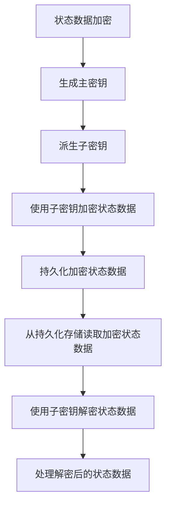

# Flink状态数据加密:安全防护与性能权衡的艺术

## 1.背景介绍

随着大数据处理系统的广泛应用,数据安全和隐私保护问题日益受到重视。Apache Flink作为流式大数据处理的领先框架,其状态管理机制使其能够有效地处理有状态的流数据。然而,当处理敏感数据时,如何保护状态数据的机密性和完整性成为一个关键挑战。

传统的数据加密方法通常针对静态数据,而Flink状态数据具有动态性和高吞吐量的特点,直接应用这些方法可能会带来严重的性能损失。因此,在Flink中实现高效的状态数据加密机制,平衡安全性和性能,成为一个值得探索的重要课题。

## 2.核心概念与联系

### 2.1 Flink状态管理

Flink将有状态的流数据处理划分为多个任务,每个任务维护自身的状态。状态可以存储在TaskManager的JVM堆或者RocksDB等外部存储中。Flink通过检查点(Checkpoint)和状态恢复机制来实现精确一次(Exactly-Once)的语义,确保在发生故障时能够从最近一次一致的检查点恢复状态并继续处理。

### 2.2 数据加密概念

数据加密是指使用密钥将明文数据转换为密文的过程,以防止未经授权的访问。常见的加密算法包括对称加密(AES、DES等)和非对称加密(RSA、ECC等)。加密过程涉及密钥生成、加密和解密三个步骤。

### 2.3 Flink状态数据加密挑战

Flink状态数据加密面临以下主要挑战:

1. **高吞吐量**: Flink需要处理大量的数据流,加密操作可能会成为性能瓶颈。
2. **状态持久化**: 加密状态数据需要在持久化到外部存储(如RocksDB)时进行加密和解密操作。
3. **分布式环境**: Flink任务在多个TaskManager上运行,需要考虑密钥分发和管理问题。
4. **容错性**: 加密机制需要与Flink的检查点和恢复机制相协调,确保状态一致性。

## 3.核心算法原理具体操作步骤

为了在Flink中实现高效的状态数据加密,我们提出了一种基于AES对称加密的分层加密方案。该方案包括以下几个关键步骤:



1. **生成主密钥**

在Flink作业启动时,生成一个随机的主密钥(Master Key),用于派生子密钥。主密钥可以存储在安全的外部密钥管理服务中。

2. **派生子密钥**

为每个TaskManager实例派生一个唯一的子密钥(Subkey),子密钥由主密钥和TaskManager ID通过密钥派生函数(KDF)计算得到。这样可以避免在分布式环境中共享主密钥,提高安全性。

3. **使用子密钥加密状态数据**

TaskManager在处理数据流时,使用对应的子密钥对状态数据进行加密。加密操作可以在内存中完成,以减少性能开销。

4. **持久化加密状态数据**

加密后的状态数据持久化到外部存储(如RocksDB)中。由于数据已经加密,外部存储不需要进行额外的加密操作。

5. **从持久化存储读取加密状态数据**

在恢复状态时,从外部存储读取加密的状态数据。

6. **使用子密钥解密状态数据**

使用对应的子密钥对加密状态数据进行解密,恢复明文状态数据。

7. **处理解密后的状态数据**

解密后的状态数据可以正常参与Flink的数据处理流程。

该分层加密方案的优点在于:

- 避免了在分布式环境中共享主密钥,提高了安全性。
- 加密和解密操作在TaskManager本地完成,减少了网络开销。
- 持久化存储只需要存储加密后的状态数据,无需额外的加密操作。
- 与Flink的检查点和恢复机制无缝集成,确保状态一致性。

## 4.数学模型和公式详细讲解举例说明

### 4.1 AES加密算法

AES(Advanced Encryption Standard)是一种广泛使用的对称加密算法。它使用相同的密钥对数据进行加密和解密,具有高效和安全的特点。

AES加密过程可以表示为:

$$
C = E_k(P)
$$

其中,
- $C$表示密文(Ciphertext)
- $P$表示明文(Plaintext)
- $E_k$表示使用密钥$k$的AES加密函数
- $k$是一个长度为128、192或256位的密钥

解密过程为:

$$
P = D_k(C)
$$

其中,
- $D_k$表示使用密钥$k$的AES解密函数

在实践中,我们通常使用256位的密钥,以获得更高的安全性。

### 4.2 密钥派生函数(KDF)

密钥派生函数(Key Derivation Function)用于从主密钥和其他参数(如盐值、上下文信息等)派生出子密钥或其他密钥材料。常用的KDF包括HKDF、PBKDF2等。

在Flink状态数据加密方案中,我们使用HKDF(HMAC-based Extract-and-Expand Key Derivation Function)作为KDF。HKDF的计算过程如下:

1. 提取步骤(Extract):
   $$
   \text{PRK} = \text{HMAC-Hash}(\text{salt}, \text{IKM})
   $$
   其中,
   - $\text{PRK}$是一个伪随机密钥(Pseudo-Random Key)
   - $\text{salt}$是一个可选的盐值
   - $\text{IKM}$是输入密钥材料(Input Keying Material),在我们的场景中是主密钥

2. 扩展步骤(Expand):
   $$
   \text{OKM} = \text{HKDF-Expand}(\text{PRK}, \text{info}, \text{L})
   $$
   其中,
   - $\text{OKM}$是输出密钥材料(Output Keying Material),即我们需要的子密钥
   - $\text{info}$是可选的上下文信息,在我们的场景中可以是TaskManager ID
   - $\text{L}$是期望输出的子密钥长度

通过使用HKDF,我们可以从主密钥和TaskManager ID派生出唯一的子密钥,用于加密和解密TaskManager的状态数据。

### 4.3 示例

假设我们有一个主密钥$\text{MK}$,需要为TaskManager ID为"taskmanager-1"的实例派生一个256位的子密钥。

1. 提取步骤:
   $$
   \text{PRK} = \text{HMAC-SHA256}(\text{salt}, \text{MK})
   $$

2. 扩展步骤:
   $$
   \begin{aligned}
   \text{info} &= \text{"taskmanager-1"} \\
   \text{L} &= 32 \text{ (256位)} \\
   \text{SK} &= \text{HKDF-Expand}(\text{PRK}, \text{info}, \text{L})
   \end{aligned}
   $$

其中,
- $\text{SK}$是派生出的256位子密钥
- $\text{HMAC-SHA256}$和$\text{HKDF-Expand}$是具体的HKDF实现函数

使用这种方式,我们可以为每个TaskManager实例派生出唯一的子密钥,用于加密和解密该实例的状态数据。

## 5.项目实践:代码实例和详细解释说明

为了更好地理解Flink状态数据加密的实现,我们提供了一个基于Flink 1.14.4版本的示例项目。该项目包含了一个简单的有状态流处理作业,并集成了我们提出的分层加密方案。

### 5.1 项目结构

```
flink-state-encryption-example
├── pom.xml
├── src
│   ├── main
│   │   ├── java
│   │   │   └── com/example/flink
│   │   │       ├── encryption
│   │   │       │   ├── AESEncryptor.java
│   │   │       │   ├── EncryptedStateSerializer.java
│   │   │       │   └── KeyDerivationFunction.java
│   │   │       └── StreamingJob.java
│   │   └── resources
│   │       └── log4j.properties
│   └── test
│       └── java
│           └── com/example/flink
│               └── encryption
│                   └── AESEncryptorTest.java
└── README.md
```

- `com.example.flink.encryption`包含了加密相关的核心代码:
  - `AESEncryptor.java`: 实现了基于AES的加密和解密操作。
  - `EncryptedStateSerializer.java`: 自定义的Flink状态序列化器,集成了加密和解密功能。
  - `KeyDerivationFunction.java`: 实现了HKDF密钥派生函数。
- `com.example.flink.StreamingJob.java`: 包含了一个简单的有状态流处理作业,用于测试加密功能。
- `pom.xml`: Maven项目配置文件。
- `README.md`: 项目说明文档。

### 5.2 核心代码解释

#### 5.2.1 AESEncryptor

`AESEncryptor`类实现了基于AES算法的加密和解密操作。它提供了以下主要方法:

```java
public class AESEncryptor {
    private final SecretKey key;

    public AESEncryptor(byte[] keyBytes) {
        // 从密钥字节数组构造SecretKey对象
        this.key = new SecretKeySpec(keyBytes, "AES");
    }

    public byte[] encrypt(byte[] plaintext) throws Exception {
        // 使用AES/CBC/PKCS5Padding模式加密数据
        // ...
    }

    public byte[] decrypt(byte[] ciphertext) throws Exception {
        // 使用AES/CBC/PKCS5Padding模式解密数据
        // ...
    }
}
```

该类使用Java密码扩展(JCE)提供的`Cipher`类实现AES加密和解密操作。它支持CBC(Cipher Block Chaining)模式和PKCS5Padding填充方式,以确保加密的安全性和正确性。

#### 5.2.2 EncryptedStateSerializer

`EncryptedStateSerializer`是一个自定义的Flink状态序列化器,它集成了加密和解密功能。它继承自`TypeSerializerSnapshot`类,并重写了相关的序列化和反序列化方法。

```java
public class EncryptedStateSerializer<T> extends TypeSerializerSnapshot<T, EncryptedStateSerializer.EncryptedStateSerializerSnapshot<T>> {
    private final TypeSerializer<T> wrappedSerializer;
    private final AESEncryptor encryptor;

    public EncryptedStateSerializer(TypeSerializer<T> wrappedSerializer, byte[] keyBytes) {
        this.wrappedSerializer = wrappedSerializer;
        this.encryptor = new AESEncryptor(keyBytes);
    }

    @Override
    public T deserialize(DataInputView source) throws IOException {
        // 从DataInputView读取加密数据
        byte[] encryptedData = // ...

        // 使用AESEncryptor解密数据
        byte[] plainData = encryptor.decrypt(encryptedData);

        // 使用包装的序列化器反序列化明文数据
        return wrappedSerializer.deserialize(new DataInputViewStreamWrapper(plainData));
    }

    @Override
    public void serialize(T record, DataOutputView target) throws IOException {
        // 使用包装的序列化器序列化数据
        DataOutputViewStreamWrapper plainDataStream = new DataOutputViewStreamWrapper();
        wrappedSerializer.serialize(record, plainDataStream);

        // 使用AESEncryptor加密数据
        byte[] plainData = plainDataStream.getByteArray();
        byte[] encryptedData = encryptor.encrypt(plainData);

        // 将加密数据写入DataOutputView
        target.writeBytes(encryptedData);
    }

    // ...
}
```

在序列化过程中,`EncryptedStateSerializer`首先使用包装的序列化器(如`TypeSerializer<T>`或其他自定义序列化器)将状态数据序列化为明文字节数组。然后,它使用`AESEncryptor`对明文数据进行加密,并将加密后的数据写入`DataOutputView`。

在反序列化过程中,它从`DataInputView`读取加密数据,使用`AESEncryptor`进行解密,得到明文数据。最后,使用包装的序列化器从明文数据反