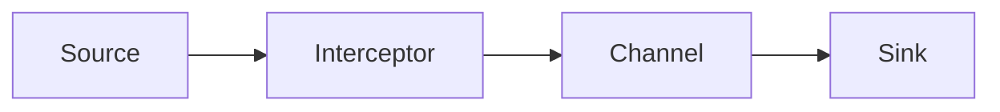
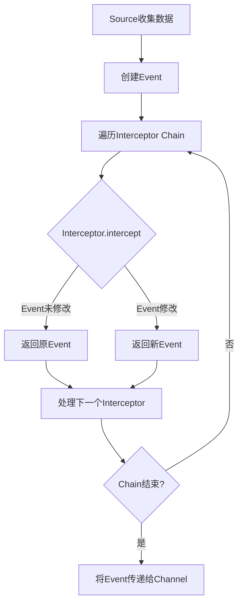

# Flume Interceptor原理与代码实例讲解

## 1.背景介绍

Apache Flume是一个分布式、可靠、高可用的海量日志采集、聚合和传输的系统。在日志数据从源头流向最终目的地的过程中,Flume为数据提供了多种转换和处理的机会,其中Interceptor就是实现这些转换和处理的重要组件。

Interceptor是Flume中一个轻量级的处理单元,它位于Source和Channel之间,可以对Source接收到的事件(Event)数据进行过滤、修改、删除或者添加头信息等操作。通过使用Interceptor,我们可以在数据进入Channel之前对其进行必要的处理,从而满足不同的业务需求。

### 1.1 Flume数据流程

在介绍Interceptor之前,我们先来了解一下Flume的基本数据流程。Flume主要由Source、Channel、Sink三个核心组件构成:

1. **Source** 负责从外部系统收集数据,并将收集到的数据封装成Flume事件(Event)。
2. **Channel** 是一个可靠的事件传输通道,用于临时存储Source收集到的事件,直到它们被Sink所消费。
3. **Sink** 从Channel中获取事件,并将事件批量写入外部系统,如HDFS、HBase或者Solr等。

Flume的工作流程如下:



可以看到,Interceptor位于Source和Channel之间,对Source收集的数据进行处理后再将处理后的数据传递给Channel。

### 1.2 Interceptor作用

Interceptor在Flume数据流中扮演着非常重要的角色,主要有以下作用:

1. **数据过滤**: 根据特定条件过滤掉不需要的数据,减少数据传输和存储的开销。
2. **数据转换**: 对数据进行格式转换,如将非结构化的日志数据转换为结构化的Avro格式。
3. **数据修改**: 修改事件头(Header)信息,添加自定义元数据等。
4. **数据路由**: 根据事件内容将数据路由到不同的Channel。

通过使用Interceptor,我们可以在数据进入Channel之前对其进行各种处理,从而提高数据质量、减少数据冗余、增强数据安全性等。

## 2.核心概念与联系

在深入探讨Interceptor的原理和实现之前,我们需要先了解几个与之密切相关的核心概念。

### 2.1 Event

Event是Flume中表示数据的核心数据结构,它由两部分组成:

1. **Body**: 实际的数据内容,可以是任意形式的字节序列。
2. **Header**: 元数据信息,以键值对的形式存储,用于描述和标识数据。

Interceptor主要针对Event的Header和Body进行处理。

### 2.2 Interceptor Chain

Interceptor Chain是一系列Interceptor的有序集合,它们按照配置的顺序依次对数据进行处理。Flume允许在Source上配置多个Interceptor,这些Interceptor会形成一个处理链,依次对数据进行处理。


上图展示了一个包含三个Interceptor的Interceptor Chain,数据首先经过I1处理,然后是I2,最后是I3,处理后的数据才会进入Channel。

通过构建Interceptor Chain,我们可以将不同的处理逻辑解耦,使得代码更加模块化和可维护。同时,也可以根据需求灵活地组合不同的Interceptor,满足各种数据处理场景。

### 2.3 Interceptor构建器

Flume提供了一个Interceptor构建器(InterceptorBuilderUtil)来简化Interceptor的创建和配置过程。构建器使用了Builder模式,可以通过链式调用的方式配置Interceptor的各种属性。

例如,要创建一个Host Interceptor,可以使用以下代码:

```java
Interceptor hostInterceptor = InterceptorBuilderUtil.newInterceptor()
        .type(HostInterceptorConstants.HOST_INTERCEPTOR_TYPE)
        .hostHeader("host")
        .preserveExisting(false)
        .build();
```

这种方式不仅使代码更加简洁易读,而且还提供了类型安全和参数校验,降低了出错的风险。

## 3.核心算法原理具体操作步骤 

现在,让我们深入探讨Interceptor的核心算法原理和具体操作步骤。

### 3.1 Interceptor接口

Flume中所有的Interceptor都需要实现`org.apache.flume.interceptor.Interceptor`接口,该接口只有一个方法:

```java
public interface Interceptor {
  void initialize();
  Event intercept(Event event);
  List<Event> intercept(List<Event> events);
  void close();
  //...
}
```

- `initialize()` 方法用于初始化Interceptor,在Interceptor被创建后调用。
- `intercept(Event event)` 方法对单个Event进行处理。
- `intercept(List<Event> events)` 方法对一批Event进行处理,通常性能更好。
- `close()` 方法在Interceptor被销毁时调用,用于释放资源。

要实现自定义的Interceptor,我们只需要继承`Interceptor`接口并实现上述方法即可。

### 3.2 Interceptor处理流程

当Source收集到数据后,Flume会将数据封装成Event,然后依次经过配置的Interceptor Chain进行处理。Interceptor处理Event的基本流程如下:



具体步骤如下:

1. Source收集到数据,并将数据封装成Event。
2. 遍历配置的Interceptor Chain。
3. 调用当前Interceptor的`intercept()`方法,传入Event。
4. Interceptor对Event进行处理,可以修改Event的Header或Body,也可以创建新的Event。
5. 如果Event未被修改,则返回原Event;否则返回新的Event。
6. 处理下一个Interceptor,重复步骤3-5。
7. 如果Chain中所有Interceptor都已处理完毕,则将最终的Event传递给Channel。

需要注意的是,每个Interceptor都可以选择是否修改Event。如果Interceptor没有对Event进行任何修改,则应该返回原Event;否则必须创建一个新的Event对象,并将修改后的数据复制到新的Event中。这样做是为了避免多个Interceptor同时修改同一个Event对象,从而导致数据不一致的问题。

### 3.3 Interceptor Chain构建

Flume允许用户在Source上配置多个Interceptor,这些Interceptor会按照配置的顺序形成一个Interceptor Chain。Chain的构建过程如下:

1. 解析Source的配置文件,获取Interceptor配置信息。
2. 根据配置信息,使用Interceptor构建器创建各个Interceptor实例。
3. 将创建的Interceptor实例按照配置的顺序添加到一个列表中,形成Interceptor Chain。

以下是一个配置多个Interceptor的示例:

```properties
# Source的其他配置...
a1.sources.r1.interceptors = i1 i2 i3
a1.sources.r1.interceptors.i1.type = host
a1.sources.r1.interceptors.i2.type = static
a1.sources.r1.interceptors.i2.key = datacenter
a1.sources.r1.interceptors.i2.value = NEW_YORK
a1.sources.r1.interceptors.i3.type = regex_extractor
# ...
```

在这个示例中,我们为Source `r1`配置了三个Interceptor:

1. `i1` 是一个Host Interceptor,用于自动添加主机名到Event的Header中。
2. `i2` 是一个Static Interceptor,用于为每个Event添加一个键值对到Header中。
3. `i3` 是一个Regex Extractor Interceptor,用于从Event的Body中提取数据,并将提取的数据添加到Header中。

根据这个配置,Flume会创建一个包含三个Interceptor的Chain,处理顺序为: `i1` -> `i2` -> `i3`。

## 4.数学模型和公式详细讲解举例说明

在实际应用中,我们经常需要从日志数据中提取特定的数值型字段,并对这些数值进行统计分析。Interceptor提供了一种方便的方式来实现这个需求,我们可以使用正则表达式从日志中提取数值,然后将提取的数值添加到Event的Header中。

以下是一个使用Regex Extractor Interceptor从日志中提取响应时间的示例。假设我们的日志格式如下:

```
10.20.36.18 - - [27/Jan/2023:16:00:42 -0800] "GET /api/v1/products/123 HTTP/1.1" 200 34 1589
```

其中,最后一个字段`1589`表示本次请求的响应时间(单位:毫秒)。我们的目标是从日志中提取出这个响应时间,并将其添加到Event的Header中,以便后续进行统计分析。

### 4.1 正则表达式

首先,我们需要编写一个正则表达式来匹配日志中的响应时间字段。正则表达式如下:

```regex
(\\d+)$
```

这个正则表达式使用了捕获组`(\\d+)`来捕获日志行中的最后一个数字序列,即响应时间。`$`表示匹配行尾。

### 4.2 配置Regex Extractor Interceptor

接下来,我们需要在Source上配置Regex Extractor Interceptor,并提供正则表达式和需要提取的组号。配置示例如下:

```properties
a1.sources.r1.interceptors.i3.type = regex_extractor
a1.sources.r1.interceptors.i3.regex = (\\d+)$
a1.sources.r1.interceptors.i3.serializers = response_time_ms
a1.sources.r1.interceptors.i3.serializers.response_time_ms.name = response_time_ms
```

在这个配置中:

- `regex` 指定了用于提取数据的正则表达式。
- `serializers` 指定了需要提取的组号,这里是`1`(从0开始计数)。
- `serializers.*.name` 指定了提取数据在Header中的键名,这里是`response_time_ms`。

### 4.3 数据提取过程

当Source收集到日志数据后,Regex Extractor Interceptor会按照以下步骤提取响应时间:

1. 将日志数据与配置的正则表达式进行匹配。
2. 如果匹配成功,则从匹配结果中提取出捕获组`(\\d+)`的值,即响应时间数值。
3. 将提取的响应时间数值作为值,`response_time_ms`作为键,添加到Event的Header中。
4. 将处理后的Event传递给下一个Interceptor或Channel。

例如,对于上面的示例日志:

```
10.20.36.18 - - [27/Jan/2023:16:00:42 -0800] "GET /api/v1/products/123 HTTP/1.1" 200 34 1589
```

Regex Extractor Interceptor会将`1589`提取出来,并将其作为值,`response_time_ms`作为键,添加到Event的Header中。

### 4.4 数据分析

提取响应时间数据后,我们就可以对这些数据进行统计分析,例如计算平均响应时间、最大响应时间等。以下是一个使用Apache Spark进行响应时间分析的示例:

```scala
import org.apache.spark.sql.functions._

val responseTimesDF = eventsDF
  .select(
    col("headers.response_time_ms").cast("long").alias("response_time_ms")
  )
  .select("response_time_ms")
  .na.drop()

val avgResponseTime = responseTimesDF.select(avg("response_time_ms")).first().getLong(0)
val maxResponseTime = responseTimesDF.select(max("response_time_ms")).first().getLong(0)

println(s"Average response time: $avgResponseTime ms")
println(s"Maximum response time: $maxResponseTime ms")
```

在这个示例中,我们首先从Flume Event的Header中提取出`response_time_ms`字段,并将其转换为Long类型。然后,我们使用Spark SQL函数`avg()`和`max()`计算平均响应时间和最大响应时间。

通过将Interceptor与大数据分析工具(如Apache Spark)相结合,我们可以方便地从海量日志数据中提取有价值的信息,并进行深入的数据分析和建模,为业务决策提供数据支持。

## 5.项目实践:代码实例和详细解释说明

为了更