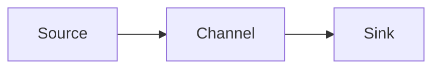

## 1.背景介绍

在当今数据驱动的时代，大数据技术已经成为了企业和组织获取竞争优势的重要武器。其中，数据的收集和处理成为了大数据技术中的重要环节。Apache Flume，作为一种分布式、可靠、可用的大数据日志收集系统，就在这个环节中扮演着重要的角色。Flume的主要功能是实现大数据集的高效收集、聚合和传输。

## 2.核心概念与联系

在深入了解Flume之前，我们需要先理解几个Flume的核心概念：

- Event：事件，是Flume数据传输的基本单位。每个Event包含了Header和Body两部分。
- Source：源，用于收集数据。它可以接收Event，并将它们存入Channel。
- Channel：通道，是Source和Sink之间的桥梁，用于缓存Event。
- Sink：汇，从Channel中取出Event，然后将它们发送到下一个Flume Agent或者其它的存储服务。

这四个概念构成了Flume的基本数据流：Event从Source流向Channel，然后从Channel流向Sink。



## 3.核心算法原理具体操作步骤

Flume的工作过程可以分为以下几个步骤：

1. Source接收到新的Event后，将其存入Channel。
2. Sink从Channel中取出Event。
3. Sink处理Event，如果成功，则从Channel中移除该Event；如果失败，则Event保留在Channel中，等待下次处理。
4. 如果Channel满了，Source会停止接收新的Event，直到Channel有足够的空间为止。
5. 如果Channel为空，Sink会等待，直到Channel中有新的Event为止。

## 4.数学模型和公式详细讲解举例说明

在理解了Flume的工作原理后，我们可以使用一些数学模型和公式来更深入地理解Flume的性能和效率。例如，我们可以定义以下几个变量：

- $S$：Source的处理速度，单位是Event/秒
- $C$：Channel的容量，单位是Event
- $K$：Sink的处理速度，单位是Event/秒

根据这些变量，我们可以得到以下公式：

- Flume的最大处理速度：$min(S, K)$
- Flume的最大延迟：$C / min(S, K)$

通过这些公式，我们可以看到，提高Flume的处理速度和降低延迟的方法主要有两个：增加Source的处理速度和Sink的处理速度，以及增加Channel的容量。

## 5.项目实践：代码实例和详细解释说明

下面，我们通过一个简单的例子来展示如何使用Flume收集和处理数据。在这个例子中，我们将使用Flume收集Web服务器的日志，并将它们发送到HDFS进行存储。

首先，我们需要在Flume的配置文件中定义Source、Channel和Sink。在这个例子中，我们将使用Exec source从Web服务器的日志文件中读取数据，使用Memory channel作为缓存，使用HDFS sink将数据写入HDFS。

```shell
# 定义Source
a1.sources.r1.type = exec
a1.sources.r1.command = tail -F /var/log/apache2/access.log

# 定义Channel
a1.channels.c1.type = memory
a1.channels.c1.capacity = 1000
a1.channels.c1.transactionCapacity = 100

# 定义Sink
a1.sinks.k1.type = hdfs
a1.sinks.k1.hdfs.path = hdfs://localhost:9000/user/flume/logs
a1.sinks.k1.hdfs.fileType = DataStream

# 将Source、Channel和Sink连接起来
a1.sources.r1.channels = c1
a1.sinks.k1.channel = c1
```

然后，我们可以启动Flume，开始收集和处理数据：

```shell
$ bin/flume-ng agent --conf conf --conf-file example.conf --name a1 -Dflume.root.logger=INFO,console
```

在Flume运行期间，我们可以通过HDFS的Web界面查看收集到的数据。

## 6.实际应用场景

Flume广泛应用于各种大数据场景中，例如：

- 日志收集：Flume可以从各种Source（例如Web服务器、应用服务器等）收集日志，然后将它们发送到各种Sink（例如HDFS、Kafka等）进行存储或进一步处理。
- 数据导入：Flume可以从各种数据库或文件系统中读取数据，然后将它们导入到Hadoop或Spark等大数据处理系统中。
- 实时分析：Flume可以接收实时的Event，然后将它们发送到Storm或Spark Streaming等实时分析系统中。

## 7.工具和资源推荐

- Apache Flume：Flume的官方网站，提供了详细的用户指南和API文档。
- Hadoop：Hadoop的官方网站，提供了详细的用户指南和API文档。
- Stack Overflow：一个广大的开发者社区，你可以在这里找到许多关于Flume的问题和答案。

## 8.总结：未来发展趋势与挑战

随着大数据技术的发展，Flume面临着许多新的挑战和机遇。例如，随着数据量的增长，如何提高Flume的处理速度和扩展性成为了一个重要的问题。此外，随着实时分析的需求增加，如何降低Flume的延迟也成为了一个重要的问题。

为了应对这些挑战，Flume的开发者正在不断地改进和优化Flume。例如，他们正在研究如何使用新的数据结构和算法来提高Flume的处理速度和扩展性。他们也正在研究如何使用新的通信协议和技术来降低Flume的延迟。

## 9.附录：常见问题与解答

- Q：Flume是否支持多个Source和Sink？
- A：是的，Flume支持多个Source和Sink。你可以在Flume的配置文件中定义多个Source和Sink，然后使用Channel将它们连接起来。

- Q：Flume如何处理失败的Event？
- A：如果Sink在处理Event时失败，Flume会将该Event保留在Channel中，等待下次处理。如果Channel满了，Flume会停止接收新的Event，直到Channel有足够的空间为止。

作者：禅与计算机程序设计艺术 / Zen and the Art of Computer Programming