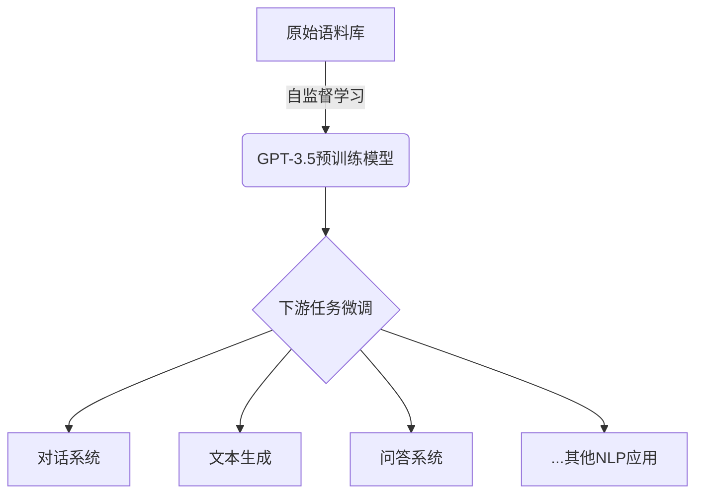
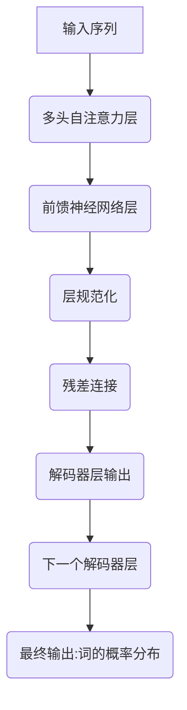

# GPT-3.5原理与代码实例讲解

## 1.背景介绍

在过去几年中,自然语言处理(NLP)领域取得了长足的进步,很大程度上要归功于大型语言模型(LLM)的出现。作为最新一代的LLM,GPT-3.5由OpenAI训练而成,展现出令人印象深刻的语言理解和生成能力。它不仅能够完成传统的NLP任务,如文本分类、机器翻译等,更能生成高质量、连贯的长文本输出,在对话系统、文本续写、问答等应用中大放异彩。

GPT-3.5是一种基于Transformer的自回归语言模型,通过自监督学习方式在大规模文本语料上进行预训练。它采用了改进的训练策略和模型架构,使其在上下文理解、知识整合和生成质量等方面有了突破性的提升。本文将深入探讨GPT-3.5的核心原理、训练过程、代码实现细节以及实际应用场景,为读者提供全面的理解和实践指导。

## 2.核心概念与联系

### 2.1 Transformer模型

GPT-3.5的核心架构源于Transformer模型,后者由Google在2017年提出,主要用于机器翻译任务。Transformer完全基于注意力(Attention)机制,摒弃了传统序列模型中的循环神经网络(RNN)和卷积神经网络(CNN)结构,从而解决了长期依赖问题,并提高了并行计算能力。

Transformer由编码器(Encoder)和解码器(Decoder)两个主要部分组成。编码器将输入序列映射为中间表示,解码器则根据中间表示生成输出序列。两者内部都采用了多头自注意力(Multi-Head Attention)和前馈神经网络(Feed-Forward Neural Network)等关键组件。

### 2.2 自回归语言模型

GPT-3.5属于自回归语言模型的范畴,这意味着它会根据前面生成的文本,自回归地预测下一个词的概率分布。与此不同,常见的语言模型(如BERT)则是一种自编码器(Auto-Encoder),旨在重建输入序列。

自回归语言模型的训练目标是最大化下一个词的条件概率,即:

$$P(x_t|x_1,x_2,...,x_{t-1})$$

其中$x_t$表示第t个词,$x_1,x_2,...,x_{t-1}$为前缀序列。通过最大化上述条件概率的对数似然,模型可以学习到生成自然语言的潜在规律。

在推理阶段,GPT-3.5将根据给定的文本前缀,逐步生成下一个最可能的词,直至达到终止条件。这种生成式的范式赋予了模型强大的文本创作能力。

### 2.3 自监督学习

GPT-3.5采用了自监督学习(Self-Supervised Learning)的范式进行预训练。与监督学习不同,自监督学习不需要人工标注的数据,而是利用原始数据本身的某些属性作为监督信号。

对于语言模型而言,常见的自监督学习任务是"遮蔽语言模型"(Masked Language Model),即在输入序列中随机遮蔽部分词,让模型去预测被遮蔽的词。GPT-3.5则采用了"因果语言模型"(Causal Language Model)的策略,即给定前缀序列,预测下一个词。

通过在大规模语料库上进行自监督预训练,GPT-3.5可以学习到丰富的语言知识和上下文信息,为后续的下游任务奠定基础。



## 3.核心算法原理具体操作步骤

### 3.1 Transformer解码器

GPT-3.5的核心算法是基于Transformer解码器的自回归语言模型。解码器由多个相同的解码器层组成,每个解码器层包含以下几个主要子层:

1. **多头自注意力层(Multi-Head Attention Layer)**: 这一层对输入序列进行自注意力计算,捕获序列内部的长程依赖关系。

2. **编码-解码注意力层(Encoder-Decoder Attention Layer)**: 在编码-解码架构中,该层负责将解码器的输出与编码器的输出进行注意力计算,融合编码器提取的上下文信息。但在GPT-3.5这种解码器only模型中,该层被省略。

3. **前馈神经网络层(Feed-Forward Neural Network Layer)**: 这一层对注意力层的输出进行非线性变换,提供额外的表达能力。

4. **层规范化(Layer Normalization)**: 用于加速训练收敛并提高模型稳定性。

5. **残差连接(Residual Connection)**: 将输入直接传递到下一层,有助于梯度传播和模型优化。

以上子层按顺序堆叠构成一个解码器层,多个解码器层再组成完整的解码器模型。在推理时,解码器会自回归地生成下一个词的概率分布,直至达到终止条件。



### 3.2 注意力机制

注意力机制是Transformer及GPT-3.5的核心,它能够自适应地捕获输入序列中不同位置之间的依赖关系,从而更好地建模长期依赖。

在自注意力层中,注意力分数$\alpha_{ij}$衡量查询向量$q_i$与键向量$k_j$之间的相关性,计算公式为:

$$\alpha_{ij} = \text{softmax}\left(\frac{q_i^T k_j}{\sqrt{d_k}}\right)$$

其中$d_k$为缩放因子,用于防止点积过大导致梯度饱和。

注意力输出则是值向量$v_j$的加权和,权重由注意力分数$\alpha_{ij}$决定:

$$\text{Attention}(Q, K, V) = \sum_{j=1}^n \alpha_{ij} v_j$$

多头注意力机制将注意力过程从不同的表示子空间进行捕捉,并将它们的结果进行拼接,从而提高模型的表达能力。

### 3.3 位置编码

由于Transformer不再使用RNN或CNN结构,因此需要一种机制来注入序列的位置信息。GPT-3.5采用了正弦位置编码的方式,将位置信息编码到词嵌入向量中:

$$
\begin{aligned}
\text{PE}_{(pos, 2i)} &= \sin\left(\frac{pos}{10000^{2i/d_\text{model}}}\right) \\
\text{PE}_{(pos, 2i+1)} &= \cos\left(\frac{pos}{10000^{2i/d_\text{model}}}\right)
\end{aligned}
$$

其中$pos$表示词在序列中的位置,$i$为维度索引,$d_\text{model}$为词嵌入维度。位置编码与词嵌入相加,使模型能够捕获序列的位置信息。

### 3.4 掩码自回归

在训练阶段,GPT-3.5采用了掩码自回归(Masked Auto-Regressive)策略。具体来说,给定一个长度为$n$的序列$\mathbf{x} = (x_1, x_2, \dots, x_n)$,模型需要最大化下一个词的条件概率:

$$\mathcal{L}(\mathbf{x}) = -\sum_{t=1}^n \log P(x_t | x_1, \dots, x_{t-1})$$

为了实现这一目标,模型需要预测每个位置的词,同时将该位置之前的词作为上下文输入。这种训练方式确保了模型能够学习到生成自然语言的规律。

在推理阶段,给定一个文本前缀,模型将自回归地生成下一个最可能的词,直至达到终止条件(如生成了特定的终止符)。这种生成式范式赋予了GPT-3.5强大的文本创作能力。

## 4.数学模型和公式详细讲解举例说明

### 4.1 Transformer模型

Transformer模型的核心思想是利用注意力机制来捕捉输入序列中任意两个位置之间的依赖关系。与RNN和CNN不同,Transformer不存在递归或卷积操作,而是完全依赖于注意力机制来处理序列数据。

在Transformer中,注意力机制的计算过程如下:

1. 首先,将输入序列$X = (x_1, x_2, \dots, x_n)$通过嵌入层映射为向量序列$\mathbf{x} = (\mathbf{x}_1, \mathbf{x}_2, \dots, \mathbf{x}_n)$。

2. 然后,将嵌入向量序列分别线性映射为查询向量$Q$、键向量$K$和值向量$V$:

$$
\begin{aligned}
Q &= \mathbf{x} W^Q \\
K &= \mathbf{x} W^K \\
V &= \mathbf{x} W^V
\end{aligned}
$$

其中$W^Q$、$W^K$和$W^V$为可学习的权重矩阵。

3. 接下来,计算查询向量$Q$与键向量$K$的点积,得到注意力分数矩阵$A$:

$$A = \text{softmax}\left(\frac{QK^\top}{\sqrt{d_k}}\right)$$

其中$d_k$为缩放因子,用于防止点积过大导致梯度饱和。

4. 最后,将注意力分数矩阵$A$与值向量$V$相乘,得到注意力输出$Z$:

$$Z = AV$$

注意力输出$Z$捕捉了输入序列中不同位置之间的依赖关系,并将这些依赖关系编码到了输出向量中。

为了提高模型的表达能力,Transformer还引入了多头注意力机制。多头注意力将注意力过程从不同的表示子空间进行捕捉,并将它们的结果进行拼接,从而提高模型的表达能力。

### 4.2 GPT语言模型

GPT(Generative Pre-trained Transformer)是一种基于Transformer解码器的自回归语言模型。在训练阶段,GPT模型的目标是最大化给定上下文的下一个词的条件概率:

$$\mathcal{L}(\mathbf{x}) = -\sum_{t=1}^n \log P(x_t | x_1, \dots, x_{t-1})$$

其中$\mathbf{x} = (x_1, x_2, \dots, x_n)$为输入序列。

为了实现这一目标,GPT模型需要预测每个位置的词,同时将该位置之前的词作为上下文输入。这种训练方式确保了模型能够学习到生成自然语言的规律。

在推理阶段,给定一个文本前缀,GPT模型将自回归地生成下一个最可能的词,直至达到终止条件(如生成了特定的终止符)。这种生成式范式赋予了GPT模型强大的文本创作能力。

GPT-3.5是GPT系列模型的最新版本,它在模型规模、训练数据和训练策略等方面都有了重大改进,展现出了更强大的语言理解和生成能力。

### 4.3 示例:GPT-3.5生成文本

以下是一个使用GPT-3.5生成文本的示例。假设我们给定一个文本前缀"人工智能是当代科技发展的"作为输入,GPT-3.5将自回归地生成下文:

```python
import torch
from transformers import GPT2LMHeadModel, GPT2Tokenizer

# 加载预训练模型和分词器
model = GPT2LMHeadModel.from_pretrained("gpt3.5-xl")
tokenizer = GPT2Tokenizer.from_pretrained("gpt3.5-xl")

# 编码输入文本
input_text = "人工智能是当代科技发展的"
input_ids = tokenizer.encode(input_text, return_tensors="pt")

# 生成文本
output_ids = model.generate(input_ids, max_length=100, do_sample=True, top_k=50, top_p=0.95, num_return_sequences=1)
output_text = tokenizer.decode(output_ids[0], skip_special_tokens=True)

print(output_text)
```

上述代码将输出类似于以下的生成文本:

```
人