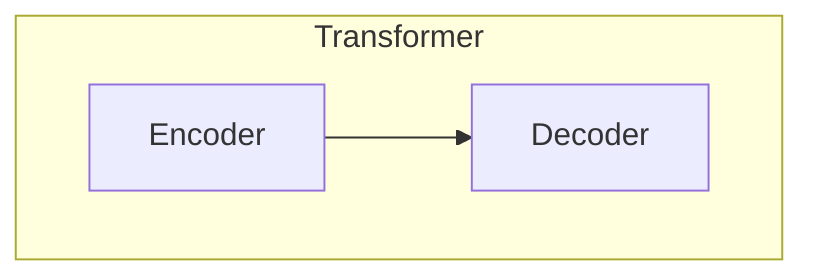
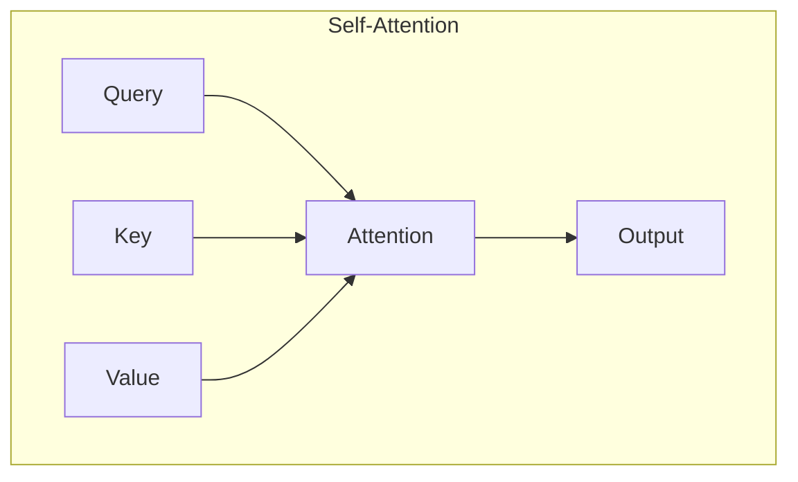

# GPT-4原理与代码实例讲解

## 1.背景介绍

大型语言模型(LLM)在近年来取得了长足的进步,其中以GPT系列模型最为人所熟知。GPT(Generative Pre-trained Transformer)是一种基于Transformer架构的自回归语言模型,由OpenAI公司开发。GPT模型通过在大规模语料库上进行预训练,学习语言的统计规律和语义关系,从而获得强大的生成能力。

GPT-4作为GPT系列的最新版本,是一个多模态的大型语言模型,能够同时处理文本、图像、视频等多种类型的输入。相比于前代产品GPT-3,GPT-4在模型规模、训练数据量、训练算法等多个方面都有了重大突破,展现出更强大的理解和生成能力。

## 2.核心概念与联系

### 2.1 Transformer架构

Transformer是GPT系列模型的核心架构,它完全基于注意力机制(Attention Mechanism)构建,摒弃了传统序列模型中的循环神经网络和卷积神经网络结构。Transformer架构主要由编码器(Encoder)和解码器(Decoder)两个子模块组成。

编码器负责处理输入序列,将其映射为一系列向量表示;解码器则根据编码器的输出,生成目标序列。在自回归语言模型中,只使用了Transformer的解码器部分。



### 2.2 自注意力机制

自注意力机制(Self-Attention)是Transformer架构的核心,它允许模型在计算目标位置的表示时,关注整个输入序列中的所有位置。这种长程依赖建模的能力,使得Transformer能够有效捕获序列中的远程语义关系。



### 2.3 预训练与微调

GPT系列模型采用了两阶段训练范式:预训练(Pre-training)和微调(Fine-tuning)。在预训练阶段,模型在大规模无监督语料库上学习通用的语言知识;在微调阶段,模型在特定任务的标注数据上进行进一步训练,使其适应特定的应用场景。这种预训练+微调的范式,大幅提升了模型的泛化能力和训练效率。

## 3.核心算法原理具体操作步骤

GPT-4作为一种大型语言模型,其核心算法主要包括以下几个步骤:

1. **输入嵌入(Input Embedding)**: 将输入的文本(或其他模态)转换为向量表示,作为模型的初始输入。

2. **位置编码(Positional Encoding)**: 为输入序列中的每个位置添加位置信息,使模型能够捕获序列的顺序关系。

3. **多头自注意力(Multi-Head Self-Attention)**: 在Transformer的编码器和解码器中,计算输入序列中每个位置与其他位置的注意力权重,捕获长程依赖关系。

4. **前馈神经网络(Feed-Forward Neural Network)**: 对自注意力的输出进行非线性变换,提取更高层次的特征表示。

5. **掩码自回归(Masked Auto-Regressive)**: 在生成任务中,模型根据前缀(已生成的部分)预测下一个token,并将预测结果作为新的前缀,重复该过程直至生成完整序列。

6. **梯度更新(Gradient Update)**: 在训练过程中,根据预测结果和真实标签计算损失函数,并通过反向传播算法更新模型参数。

上述步骤在编码器和解码器中交替进行,直至模型收敛或达到预设的训练轮次。

## 4.数学模型和公式详细讲解举例说明

### 4.1 自注意力机制

自注意力机制是Transformer架构的核心,它允许模型在计算目标位置的表示时,关注整个输入序列中的所有位置。具体来说,给定一个长度为n的输入序列$X = (x_1, x_2, \dots, x_n)$,我们希望计算一个新的序列$Z = (z_1, z_2, \dots, z_n)$,其中每个$z_i$是对应位置$x_i$的新表示,同时也融合了其他位置的信息。

自注意力的计算过程如下:

1. 将输入序列$X$分别通过三个线性变换,得到查询(Query)、键(Key)和值(Value)向量:

$$
Q = XW^Q, K = XW^K, V = XW^V
$$

其中$W^Q, W^K, W^V$分别是查询、键和值的权重矩阵。

2. 计算查询$Q$与所有键$K$的点积,得到注意力分数矩阵$E$:

$$
E = QK^T
$$

3. 对注意力分数矩阵$E$进行缩放和软最大化处理,得到注意力权重矩阵$A$:

$$
A = \text{softmax}(\frac{E}{\sqrt{d_k}})
$$

其中$d_k$是键向量的维度,缩放操作是为了避免软最大化函数的梯度较小。

4. 将注意力权重矩阵$A$与值向量$V$相乘,得到注意力输出$Z$:

$$
Z = AV
$$

注意力输出$Z$就是输入序列$X$的新表示,它融合了整个序列的信息,并强调了与当前位置相关的部分。

### 4.2 多头自注意力

为了进一步提高模型的表示能力,Transformer采用了多头自注意力(Multi-Head Self-Attention)机制。具体来说,将查询、键和值向量分别线性投影到$h$个子空间,在每个子空间中独立计算自注意力,最后将$h$个注意力输出进行拼接:

$$
\text{MultiHead}(Q, K, V) = \text{Concat}(\text{head}_1, \text{head}_2, \dots, \text{head}_h)W^O
$$

其中,第$i$个注意力头$\text{head}_i$的计算方式为:

$$
\text{head}_i = \text{Attention}(QW_i^Q, KW_i^K, VW_i^V)
$$

$W_i^Q, W_i^K, W_i^V$分别是第$i$个注意力头的查询、键和值的线性投影矩阵,$W^O$是最终的线性变换矩阵。

多头自注意力机制允许模型从不同的子空间捕获不同的依赖关系,提高了模型的表示能力。

## 5.项目实践:代码实例和详细解释说明

为了更好地理解GPT-4的原理,我们提供了一个基于PyTorch实现的简化版GPT模型示例。该示例包括模型的定义、训练和生成三个部分,可以帮助读者更直观地掌握GPT模型的工作流程。

### 5.1 模型定义

我们首先定义GPT模型的基本组件,包括词嵌入层、位置编码层、多头自注意力层和前馈神经网络层。

```python
import torch
import torch.nn as nn

class GPTEmbedding(nn.Module):
    def __init__(self, vocab_size, embed_dim):
        super().__init__()
        self.token_embedding = nn.Embedding(vocab_size, embed_dim)
        self.position_embedding = nn.Embedding(512, embed_dim)

    def forward(self, x):
        token_embed = self.token_embedding(x)
        position_embed = self.position_embedding(torch.arange(x.size(1), device=x.device))
        return token_embed + position_embed

class MultiHeadAttention(nn.Module):
    def __init__(self, embed_dim, num_heads):
        super().__init__()
        self.num_heads = num_heads
        self.head_dim = embed_dim // num_heads
        self.qkv_proj = nn.Linear(embed_dim, 3 * embed_dim)
        self.out_proj = nn.Linear(embed_dim, embed_dim)

    def forward(self, x):
        batch_size, seq_len, embed_dim = x.size()
        qkv = self.qkv_proj(x).reshape(batch_size, seq_len, 3, self.num_heads, self.head_dim).permute(2, 0, 3, 1, 4)
        q, k, v = qkv[0], qkv[1], qkv[2]
        attn_scores = torch.matmul(q, k.transpose(-2, -1)) / (self.head_dim ** 0.5)
        attn_scores = attn_scores.masked_fill(torch.triu(torch.ones(seq_len, seq_len)) == 1, float('-inf'))
        attn_weights = torch.softmax(attn_scores, dim=-1)
        attn_output = torch.matmul(attn_weights, v).permute(0, 2, 1, 3).reshape(batch_size, seq_len, embed_dim)
        return self.out_proj(attn_output)

class FeedForward(nn.Module):
    def __init__(self, embed_dim, ffn_dim):
        super().__init__()
        self.ffn = nn.Sequential(
            nn.Linear(embed_dim, ffn_dim),
            nn.ReLU(),
            nn.Linear(ffn_dim, embed_dim)
        )

    def forward(self, x):
        return self.ffn(x)

class GPTBlock(nn.Module):
    def __init__(self, embed_dim, num_heads, ffn_dim):
        super().__init__()
        self.attn = MultiHeadAttention(embed_dim, num_heads)
        self.ffn = FeedForward(embed_dim, ffn_dim)
        self.ln1 = nn.LayerNorm(embed_dim)
        self.ln2 = nn.LayerNorm(embed_dim)

    def forward(self, x):
        attn_output = self.attn(x)
        x = self.ln1(x + attn_output)
        ffn_output = self.ffn(x)
        x = self.ln2(x + ffn_output)
        return x

class GPT(nn.Module):
    def __init__(self, vocab_size, embed_dim, num_heads, ffn_dim, num_layers):
        super().__init__()
        self.embed = GPTEmbedding(vocab_size, embed_dim)
        self.blocks = nn.ModuleList([GPTBlock(embed_dim, num_heads, ffn_dim) for _ in range(num_layers)])
        self.ln = nn.LayerNorm(embed_dim)
        self.out = nn.Linear(embed_dim, vocab_size)

    def forward(self, x):
        x = self.embed(x)
        for block in self.blocks:
            x = block(x)
        x = self.ln(x)
        return self.out(x)
```

上述代码定义了GPT模型的各个组件,包括词嵌入层、位置编码层、多头自注意力层、前馈神经网络层和GPT模型的主体。这些组件按照GPT的架构进行组合,实现了模型的前向传播过程。

### 5.2 模型训练

接下来,我们定义训练过程,包括数据加载、模型初始化、优化器设置和训练循环。

```python
import torch.optim as optim
from torch.utils.data import DataLoader

# 加载数据集
train_dataset = ...
train_loader = DataLoader(train_dataset, batch_size=32, shuffle=True)

# 初始化模型
vocab_size = len(train_dataset.vocab)
model = GPT(vocab_size, embed_dim=512, num_heads=8, ffn_dim=2048, num_layers=6)
optimizer = optim.Adam(model.parameters(), lr=1e-4)
criterion = nn.CrossEntropyLoss()

# 训练循环
for epoch in range(10):
    for inputs, targets in train_loader:
        outputs = model(inputs)
        loss = criterion(outputs.view(-1, vocab_size), targets.view(-1))
        optimizer.zero_grad()
        loss.backward()
        optimizer.step()
    print(f'Epoch {epoch+1}, Loss: {loss.item()}')
```

在上述代码中,我们首先加载训练数据集,并使用DataLoader进行批次采样。然后,我们初始化GPT模型,设置优化器和损失函数。在训练循环中,我们对每个批次的输入进行前向传播,计算交叉熵损失,并通过反向传播更新模型参数。

### 5.3 模型生成

最后,我们实现模型的生成功能,即根据给定的前缀,生成连贯的文本序列。

```python
def generate(model, prefix, max_len=100):
    model.eval()
    with torch.no_grad():
        input_ids = torch.tensor(prefix, dtype=torch.long).unsqueeze(0)
        for _ in range(max_len):
            outputs = model(input_ids)
            last_token_logits = outputs[:, -1, :]
            next_token_id = torch.multinomial(torch.softmax(last_token_logits, dim=-1), num_samples=1).squeeze()
            input_ids = torch.cat((input_ids, next_token_id.unsqueeze(0)), dim=1)
    return input_ids.squeeze().tolist()

# 示例用法
prefix = [train_dataset.vocab.stoi['<start>']]
generated_ids = generate(model, prefix)
generated_text = ''.join([train