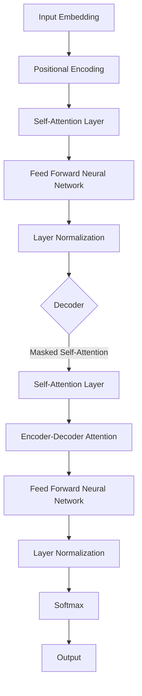

# GPT原理与代码实战案例讲解

## 1. 背景介绍
### 1.1 GPT的发展历程
#### 1.1.1 GPT-1的诞生
#### 1.1.2 GPT-2的进化
#### 1.1.3 GPT-3的革命性突破

### 1.2 GPT在自然语言处理领域的地位
#### 1.2.1 GPT模型的优势
#### 1.2.2 GPT模型的应用场景
#### 1.2.3 GPT模型的未来发展趋势

## 2. 核心概念与联系
### 2.1 Transformer架构
#### 2.1.1 Self-Attention机制
#### 2.1.2 Multi-Head Attention
#### 2.1.3 Positional Encoding

### 2.2 预训练与微调
#### 2.2.1 无监督预训练
#### 2.2.2 有监督微调
#### 2.2.3 预训练与微调的关系

### 2.3 语言模型
#### 2.3.1 统计语言模型
#### 2.3.2 神经网络语言模型
#### 2.3.3 GPT语言模型的特点

## 3. 核心算法原理具体操作步骤
### 3.1 Transformer的编码器
#### 3.1.1 输入嵌入
#### 3.1.2 位置编码
#### 3.1.3 Self-Attention计算
#### 3.1.4 前馈神经网络

### 3.2 Transformer的解码器  
#### 3.2.1 Masked Self-Attention
#### 3.2.2 Encoder-Decoder Attention
#### 3.2.3 前馈神经网络与softmax输出

### 3.3 GPT模型的训练过程
#### 3.3.1 数据预处理
#### 3.3.2 模型初始化
#### 3.3.3 前向传播与损失计算
#### 3.3.4 反向传播与参数更新

## 4. 数学模型和公式详细讲解举例说明
### 4.1 Self-Attention的数学表示
#### 4.1.1 查询、键、值的计算
#### 4.1.2 注意力权重的计算
#### 4.1.3 注意力输出的计算

### 4.2 前馈神经网络的数学表示
#### 4.2.1 线性变换
#### 4.2.2 激活函数
#### 4.2.3 残差连接与层归一化

### 4.3 损失函数与优化算法
#### 4.3.1 交叉熵损失函数
#### 4.3.2 Adam优化算法
#### 4.3.3 学习率调度策略

## 5. 项目实践：代码实例和详细解释说明
### 5.1 数据准备
#### 5.1.1 数据集介绍
#### 5.1.2 数据预处理
#### 5.1.3 数据加载

### 5.2 模型构建
#### 5.2.1 Transformer编码器的实现
#### 5.2.2 Transformer解码器的实现 
#### 5.2.3 GPT模型的构建

### 5.3 模型训练
#### 5.3.1 训练循环的实现
#### 5.3.2 损失函数与优化器的选择
#### 5.3.3 模型保存与加载

### 5.4 模型评估与应用
#### 5.4.1 评估指标的选择
#### 5.4.2 模型在测试集上的表现
#### 5.4.3 模型的实际应用案例

## 6. 实际应用场景
### 6.1 文本生成
#### 6.1.1 开放域对话生成
#### 6.1.2 故事创作
#### 6.1.3 诗歌生成

### 6.2 文本分类
#### 6.2.1 情感分析
#### 6.2.2 主题分类
#### 6.2.3 意图识别

### 6.3 问答系统
#### 6.3.1 阅读理解
#### 6.3.2 知识问答
#### 6.3.3 常见问题解答

## 7. 工具和资源推荐
### 7.1 开源框架
#### 7.1.1 Transformers
#### 7.1.2 Fairseq
#### 7.1.3 OpenAI GPT

### 7.2 预训练模型
#### 7.2.1 GPT-2
#### 7.2.2 GPT-3
#### 7.2.3 BERT

### 7.3 数据集
#### 7.3.1 WikiText
#### 7.3.2 BookCorpus
#### 7.3.3 OpenWebText

## 8. 总结：未来发展趋势与挑战
### 8.1 GPT模型的发展方向
#### 8.1.1 模型规模的扩大
#### 8.1.2 多模态学习
#### 8.1.3 少样本学习

### 8.2 GPT模型面临的挑战
#### 8.2.1 计算资源的限制
#### 8.2.2 数据偏差与公平性
#### 8.2.3 可解释性与可控性

### 8.3 GPT模型的未来应用前景
#### 8.3.1 智能写作助手
#### 8.3.2 个性化推荐系统
#### 8.3.3 智能客服与虚拟助手

## 9. 附录：常见问题与解答
### 9.1 如何选择合适的GPT模型？
### 9.2 如何处理训练过程中的过拟合问题？
### 9.3 如何平衡模型的生成质量与效率？
### 9.4 如何应对生成文本中的偏见与不当内容？
### 9.5 如何将GPT模型应用于特定领域？

GPT（Generative Pre-trained Transformer）是近年来自然语言处理领域最具革命性的突破之一。它通过在大规模无标注文本数据上进行预训练，学习到了丰富的语言知识和生成能力，并在下游任务中表现出了卓越的性能。本文将深入探讨GPT的原理、算法细节以及代码实现，帮助读者全面了解这一颠覆性的语言模型。

GPT模型的核心在于其采用了Transformer架构，特别是其中的Self-Attention机制。Self-Attention允许模型在处理每个词时，都能够关注到输入序列中的其他位置，捕捉词与词之间的依赖关系。通过多头注意力机制和位置编码的引入，Transformer能够更好地建模语言的上下文信息。

在算法实现上，GPT模型的训练过程可以分为两个阶段：无监督预训练和有监督微调。在预训练阶段，模型在大规模无标注文本数据上学习语言的通用表示。通过优化语言模型的目标函数，如最大化下一个词的概率，模型掌握了语言的基本规律和知识。在微调阶段，我们将预训练好的模型应用于具体的下游任务，如文本分类、问答等，通过少量的标注数据对模型进行调优，使其适应特定任务的需求。

本文还将通过详细的数学公式和代码实例，讲解GPT模型中的关键技术细节。我们会介绍Self-Attention的计算过程、前馈神经网络的设计、损失函数的选择以及优化算法的应用。通过对每一步的拆解和分析，读者将对GPT模型的内部工作原理有更深入的理解。

除了理论探讨外，本文还将展示GPT模型在实际应用中的威力。我们会讨论如何利用GPT进行文本生成、文本分类、问答系统等任务，并提供相应的代码实现。通过这些实例，读者可以直观地体会到GPT模型的强大能力，并学习如何将其应用于自己的项目中。

在文章的最后，我们将展望GPT模型的未来发展趋势和面临的挑战。随着模型规模的不断扩大、多模态学习的引入以及少样本学习的探索，GPT模型有望在更广泛的领域发挥重要作用。同时，我们也需要关注计算资源的限制、数据偏差与公平性、可解释性与可控性等问题，以确保GPT模型的健康发展。

总之，本文将全面剖析GPT模型的原理、算法和应用，为读者提供一个系统而深入的学习指南。无论您是自然语言处理领域的研究者、工程师，还是对人工智能技术感兴趣的爱好者，都能从中获益匪浅。让我们一起探索GPT模型的奥秘，开启自然语言处理的新篇章！

作者：禅与计算机程序设计艺术 / Zen and the Art of Computer Programming