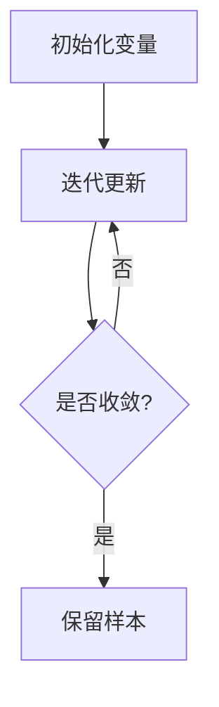

# Gibbs采样原理与代码实战案例讲解

## 1.背景介绍

在机器学习和统计建模领域中,常常需要从复杂的高维概率分布中抽取样本。然而,由于这些分布的复杂性,通常很难直接从中抽取样本。这时,Gibbs采样(Gibbs Sampling)作为一种马尔可夫链蒙特卡罗(MCMC)方法,为我们提供了一种有效的解决方案。

Gibbs采样是一种常用的生成模型采样技术,广泛应用于机器学习、统计推断、图像处理、自然语言处理等诸多领域。它能够从复杂的联合概率分布中生成样本,而无需计算高维分布的分区函数(Partition Function),从而克服了直接采样的困难。

## 2.核心概念与联系

### 2.1 马尔可夫链蒙特卡罗方法

马尔可夫链蒙特卡罗(MCMC)方法是一种用于从复杂分布中抽取样本的通用技术。它通过构建一个马尔可夫链,使其在足够长的时间后收敛到所需的目标分布。

Gibbs采样作为MCMC方法的一种变体,它利用了条件分布的性质,通过逐个更新每个变量的条件分布来近似目标分布。

### 2.2 条件概率和联合概率

在理解Gibbs采样之前,我们需要了解条件概率和联合概率的概念。

对于一个包含多个随机变量的联合概率分布$P(X_1, X_2, \ldots, X_n)$,条件概率$P(X_i|X_1, \ldots, X_{i-1}, X_{i+1}, \ldots, X_n)$表示在已知其他变量的值时,变量$X_i$的概率分布。

通过链式法则,我们可以将联合概率分布表示为条件概率的乘积:

$$P(X_1, X_2, \ldots, X_n) = P(X_1)P(X_2|X_1)P(X_3|X_1, X_2)\ldots P(X_n|X_1, X_2, \ldots, X_{n-1})$$

Gibbs采样利用了这种关系,通过逐个更新每个变量的条件分布来近似目标联合分布。

## 3.核心算法原理具体操作步骤

Gibbs采样算法的核心思想是通过迭代地从每个变量的条件分布中抽取样本,最终收敛到目标联合分布。具体步骤如下:

1. 初始化所有变量的初始值,构成一个初始样本点$X^{(0)} = (X_1^{(0)}, X_2^{(0)}, \ldots, X_n^{(0)})$。

2. 对于第$t$次迭代:
   a. 从条件分布$P(X_1|X_2^{(t-1)}, X_3^{(t-1)}, \ldots, X_n^{(t-1)})$中抽取一个样本,更新$X_1^{(t)}$。
   b. 从条件分布$P(X_2|X_1^{(t)}, X_3^{(t-1)}, \ldots, X_n^{(t-1)})$中抽取一个样本,更新$X_2^{(t)}$。
   c. 依次类推,从条件分布$P(X_i|X_1^{(t)}, \ldots, X_{i-1}^{(t)}, X_{i+1}^{(t-1)}, \ldots, X_n^{(t-1)})$中抽取一个样本,更新$X_i^{(t)}$。

3. 重复步骤2,直到马尔可夫链收敛。

4. 在收敛后,保留一定数量的样本点,作为从目标分布抽取的样本。

需要注意的是,Gibbs采样算法的收敛性取决于马尔可夫链的遍历性质。为了确保收敛,通常需要进行足够多次迭代,并丢弃一定数量的初始样本(称为burn-in期)。

下面是Gibbs采样算法的流程图:



## 4.数学模型和公式详细讲解举例说明

为了更好地理解Gibbs采样的原理,我们以一个简单的二元正态分布为例,详细讲解其数学模型和公式推导过程。

### 4.1 二元正态分布

设有两个随机变量$X$和$Y$,它们服从二元正态分布,联合概率密度函数为:

$$
P(X, Y) = \frac{1}{2\pi\sigma_x\sigma_y\sqrt{1-\rho^2}}\exp\left(-\frac{1}{2(1-\rho^2)}\left[\frac{(x-\mu_x)^2}{\sigma_x^2}+\frac{(y-\mu_y)^2}{\sigma_y^2}-\frac{2\rho(x-\mu_x)(y-\mu_y)}{\sigma_x\sigma_y}\right]\right)
$$

其中,$\mu_x$和$\mu_y$分别为$X$和$Y$的均值,$\sigma_x$和$\sigma_y$分别为$X$和$Y$的标准差,$\rho$为$X$和$Y$之间的相关系数。

### 4.2 条件分布推导

为了进行Gibbs采样,我们需要得到$X$和$Y$的条件分布。根据条件概率公式,我们可以推导出:

$$
P(X|Y) = \frac{P(X, Y)}{P(Y)} = \frac{P(X, Y)}{\int_{-\infty}^{\infty}P(X, Y)dX}
$$

$$
P(Y|X) = \frac{P(X, Y)}{P(X)} = \frac{P(X, Y)}{\int_{-\infty}^{\infty}P(X, Y)dY}
$$

经过一系列推导,我们可以得到$X$和$Y$的条件分布为:

$$
X|Y \sim N\left(\mu_x + \rho\frac{\sigma_x}{\sigma_y}(y-\mu_y), \sigma_x\sqrt{1-\rho^2}\right)
$$

$$
Y|X \sim N\left(\mu_y + \rho\frac{\sigma_y}{\sigma_x}(x-\mu_x), \sigma_y\sqrt{1-\rho^2}\right)
$$

这意味着,给定$Y$的值,我们可以从上述正态分布中抽取$X$的样本;给定$X$的值,我们可以从上述正态分布中抽取$Y$的样本。

### 4.3 Gibbs采样过程

现在,我们可以使用Gibbs采样来从二元正态分布中抽取样本。假设我们已知参数$\mu_x, \mu_y, \sigma_x, \sigma_y$和$\rho$,算法步骤如下:

1. 初始化$X^{(0)}$和$Y^{(0)}$为任意值。

2. 对于第$t$次迭代:
   a. 从条件分布$X|Y^{(t-1)} \sim N\left(\mu_x + \rho\frac{\sigma_x}{\sigma_y}(y^{(t-1)}-\mu_y), \sigma_x\sqrt{1-\rho^2}\right)$中抽取一个样本,更新$X^{(t)}$。
   b. 从条件分布$Y|X^{(t)} \sim N\left(\mu_y + \rho\frac{\sigma_y}{\sigma_x}(x^{(t)}-\mu_x), \sigma_y\sqrt{1-\rho^2}\right)$中抽取一个样本,更新$Y^{(t)}$。

3. 重复步骤2,直到马尔可夫链收敛。

4. 在收敛后,保留一定数量的样本点$(X^{(t)}, Y^{(t)})$,作为从二元正态分布抽取的样本。

通过这个例子,我们可以清楚地看到Gibbs采样是如何利用条件分布来近似复杂的联合分布的。

## 5.项目实践:代码实例和详细解释说明

为了更好地理解Gibbs采样的实现,我们将使用Python编写一个简单的示例代码,从二元正态分布中抽取样本。

```python
import numpy as np
import matplotlib.pyplot as plt

# 参数设置
mu_x, mu_y = 0, 0
sigma_x, sigma_y = 1, 1
rho = 0.8

# 初始化样本点
x_init, y_init = 0, 0

# Gibbs采样函数
def gibbs_sampler(x_init, y_init, num_iter=1000):
    x = x_init
    y = y_init
    samples = []
    
    for _ in range(num_iter):
        for _ in range(100): # burn-in期
            y_new = np.random.normal(mu_y + rho * (sigma_y / sigma_x) * (x - mu_x), sigma_y * np.sqrt(1 - rho**2))
            x_new = np.random.normal(mu_x + rho * (sigma_x / sigma_y) * (y_new - mu_y), sigma_x * np.sqrt(1 - rho**2))
            x, y = x_new, y_new
        
        samples.append([x, y])
    
    return np.array(samples)

# 运行Gibbs采样
samples = gibbs_sampler(x_init, y_init)

# 可视化结果
plt.scatter(samples[:, 0], samples[:, 1], s=1, alpha=0.5)
plt.xlabel('X')
plt.ylabel('Y')
plt.title('Gibbs Sampling from Bivariate Normal Distribution')
plt.show()
```

代码解释:

1. 首先,我们导入所需的库,并设置二元正态分布的参数$\mu_x, \mu_y, \sigma_x, \sigma_y$和$\rho$。

2. 接下来,我们定义了`gibbs_sampler`函数,它实现了Gibbs采样算法。该函数接受初始样本点`x_init`和`y_init`,以及迭代次数`num_iter`。

3. 在`gibbs_sampler`函数中,我们首先初始化`x`和`y`为给定的初始值。然后,我们进行迭代循环。

4. 在每次迭代中,我们首先进行一定次数的burn-in期,以确保马尔可夫链收敛。在burn-in期内,我们从条件分布中抽取新的样本点,并更新`x`和`y`的值。

5. 在burn-in期结束后,我们将当前的样本点`(x, y)`添加到`samples`列表中。

6. 迭代结束后,函数返回包含所有样本点的`samples`数组。

7. 最后,我们运行`gibbs_sampler`函数,并使用`matplotlib`库将样本点可视化。

运行这段代码,你将看到一个散点图,显示了从二元正态分布中抽取的样本点。这些样本点应该围绕着分布的均值,并且具有相应的相关性。

通过这个示例,你应该能够更好地理解Gibbs采样的实现细节,并且可以尝试修改代码以适应其他分布或场景。

## 6.实际应用场景

Gibbs采样由于其简单高效的特点,在许多实际应用领域都有广泛的应用。以下是一些典型的应用场景:

### 6.1 机器学习

在机器学习领域,Gibbs采样常被用于训练含有隐变量的概率模型,如混合模型、隐马尔可夫模型等。通过从后验分布中抽取样本,我们可以估计模型参数和隐变量的值。

### 6.2 图像处理

在图像处理中,Gibbs采样可用于图像去噪、图像分割和图像修复等任务。例如,在图像去噪中,我们可以将图像像素值建模为一个马尔可夫随机场,然后使用Gibbs采样从后验分布中抽取样本,从而获得去噪后的图像。

### 6.3 自然语言处理

在自然语言处理领域,Gibbs采样被广泛用于主题模型(如LDA)的推断和参数估计。通过从后验分布中抽取样本,我们可以获得文档-主题和词-主题的分布,从而实现文本聚类和主题提取等任务。

### 6.4 计算生物学

在计算生物学中,Gibbs采样被用于基因调控网络的推断、蛋白质结构预测等问题。例如,在基因调控网络推断中,我们可以将基因表达数据建模为一个概率图模型,然后使用Gibbs采样从后验分布中抽取样本,从而推断出基因之间的调控关系。

### 6.5 计算社会科学

在计算社会科学领域,Gibbs采样被用于社交网络分析、投票行为预测等问题。例如,在社交网络分析中,我们可以将社交网络建模为一个随机图模型,然后使用Gibbs采样从后验分