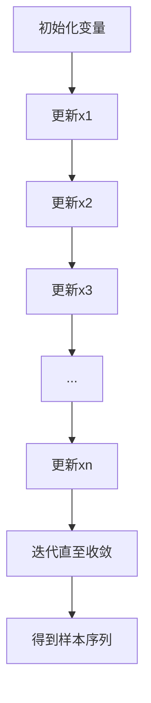

# Gibbs采样原理与代码实战案例讲解

## 1.背景介绍

在机器学习和统计建模领域中,常常需要从复杂的高维概率分布中抽取样本。然而,由于这些分布的复杂性,通常很难直接从联合分布中采样。这就是Gibbs采样(Gibbs Sampling)发挥作用的时候。

Gibbs采样是一种常用的马尔可夫链蒙特卡罗(MCMC)方法,用于从多元联合概率分布中生成样本。它通过逐个更新每个变量的条件分布来近似目标分布,从而避免了直接从联合分布中采样的困难。

### 1.1 MCMC方法概述

蒙特卡罗方法是一种通过构造随机过程来模拟概率分布的方法。马尔可夫链蒙特卡罗(MCMC)方法则是利用马尔可夫链构造随机过程,使其收敛到目标分布。

MCMC方法的基本思想是构造一个马尔可夫链,使其状态空间覆盖目标分布的支撑集,并且其平稳分布就是目标分布。通过模拟这个马尔可夫链的状态转移,可以得到目标分布的样本。

### 1.2 Gibbs采样在MCMC中的地位

Gibbs采样是MCMC方法中最常用的一种算法。它的优点是简单易懂,实现起来也相对容易。但它也有一些局限性,比如对于高维问题可能收敛速度较慢。

## 2.核心概念与联系

### 2.1 马尔可夫链

马尔可夫链是一个离散时间随机过程,具有"无后效性"的性质,即下一状态的分布只依赖于当前状态,而与过去的状态无关。形式上,对于时刻t,如果满足:

$$P(X_{t+1}=x|X_t=x_t,X_{t-1}=x_{t-1},...,X_0=x_0) = P(X_{t+1}=x|X_t=x_t)$$

则称{X_t}是一个马尔可夫链。

马尔可夫链的转移概率由转移核P(x,A)确定,表示从状态x转移到集合A中的概率。

### 2.2 平稳分布

如果一个马尔可夫链的转移核P(x,A)满足细致平稳条件:

$$\int_x \pi(x)P(x,A)dx = \int_A \pi(x)dx$$

则π(x)就是这个马尔可夫链的平稳分布。也就是说,如果初始分布是π(x),那么在任意时刻t,马尔可夫链的分布仍然是π(x)。

MCMC方法的目标就是构造一个马尔可夫链,使其平稳分布π(x)就是我们想要模拟的目标分布。

### 2.3 Gibbs采样原理

Gibbs采样的核心思想是,对于一个联合分布π(x1,x2,...,xn),通过从每个条件分布π(xi|x1,...,xi-1,xi+1,...,xn)中逐个采样,最终可以得到联合分布π(x1,x2,...,xn)的样本。

具体做法是:

1) 初始化变量x^(0)=(x1^(0),x2^(0),...,xn^(0))
2) 对t=1,2,...,T:
    - 从π(x1|x2^(t-1),...,xn^(t-1))中采样x1^(t)
    - 从π(x2|x1^(t),x3^(t-1),...,xn^(t-1))中采样x2^(t)
    - ...
    - 从π(xn|x1^(t),...,xn-1^(t))中采样xn^(t)

这样通过不断更新每个变量的条件分布,最终可以得到联合分布π(x1,x2,...,xn)的样本序列。



## 3.核心算法原理具体操作步骤

Gibbs采样算法的具体步骤如下:

1. **初始化**:给定联合分布π(x)=π(x1,x2,...,xn),初始化变量的初始值x^(0)=(x1^(0),x2^(0),...,xn^(0))。

2. **迭代**:对t=1,2,...,T执行以下步骤:
    a) 对i=1,2,...,n:
        - 固定其他变量的值为x^(t-1):x_(-i)^(t-1)=(x1^(t-1),...,x(i-1)^(t-1),x(i+1)^(t-1),...,xn^(t-1))
        - 从条件分布π(xi|x_(-i)^(t-1))中采样xi^(t)
    b) 更新x^(t)=(x1^(t),x2^(t),...,xn^(t))

3. **收敛**:经过足够多的迭代步骤后,Gibbs采样将收敛到目标分布π(x)。这时,x^(t)的值就可以看作是从π(x)中采样得到的样本。

4. **样本输出**:通常我们会丢弃开始的一些迭代步骤(称为burn-in期),然后每隔一定步长取一个样本,以减小自相关性。最终得到的样本序列{x^(t1),x^(t2),...,x^(tN)}就近似服从目标分布π(x)。

需要注意的是,Gibbs采样的收敛性取决于目标分布的性质。对于一些复杂的多模态分布,Gibbs采样可能需要很长的迭代时间才能收敛,甚至可能无法收敛。

## 4.数学模型和公式详细讲解举例说明

为了更好地理解Gibbs采样算法,我们来看一个具体的例子。假设我们想要从一个二元正态分布中采样,其概率密度函数为:

$$\pi(x,y) = \frac{1}{2\pi\sigma_x\sigma_y\sqrt{1-\rho^2}}\exp\left(-\frac{1}{2(1-\rho^2)}\left[\left(\frac{x-\mu_x}{\sigma_x}\right)^2 + \left(\frac{y-\mu_y}{\sigma_y}\right)^2 - \frac{2\rho(x-\mu_x)(y-\mu_y)}{\sigma_x\sigma_y}\right]\right)$$

其中$\mu_x,\mu_y$是x和y的均值,$\sigma_x,\sigma_y$是标准差,$\rho$是相关系数。

我们可以使用Gibbs采样来从这个分布中抽取样本。首先需要得到x和y的条件分布:

$$\pi(x|y) = \mathcal{N}\left(\mu_x + \rho\frac{\sigma_x}{\sigma_y}(y-\mu_y), \sigma_x\sqrt{1-\rho^2}\right)$$
$$\pi(y|x) = \mathcal{N}\left(\mu_y + \rho\frac{\sigma_y}{\sigma_x}(x-\mu_x), \sigma_y\sqrt{1-\rho^2}\right)$$

然后按照Gibbs采样的步骤迭代:

1. 初始化x^(0)和y^(0)为任意值
2. 对t=1,2,...,T:
    - 从$\pi(x|y^{(t-1)})$中采样x^(t)
    - 从$\pi(y|x^{(t)})$中采样y^(t)

经过足够多的迭代后,我们就可以得到服从目标分布$\pi(x,y)$的样本序列了。

## 5.项目实践:代码实例和详细解释说明

下面是一个使用Python实现Gibbs采样的示例代码,用于从二元正态分布中抽取样本:

```python
import numpy as np
import matplotlib.pyplot as plt

# 参数设置
mu_x, mu_y = 0, 0
sigma_x, sigma_y = 1, 1
rho = 0.5
num_samples = 10000
burn_in = 1000
thin = 10

# 条件分布
def cond_x(y, mu_x, mu_y, sigma_x, sigma_y, rho):
    mean = mu_x + rho * (sigma_x / sigma_y) * (y - mu_y)
    var = sigma_x**2 * (1 - rho**2)
    return np.random.normal(mean, np.sqrt(var))

def cond_y(x, mu_x, mu_y, sigma_x, sigma_y, rho):
    mean = mu_y + rho * (sigma_y / sigma_x) * (x - mu_x)
    var = sigma_y**2 * (1 - rho**2)
    return np.random.normal(mean, np.sqrt(var))

# Gibbs采样
x = np.zeros(num_samples)
y = np.zeros(num_samples)
x[0] = np.random.normal(mu_x, sigma_x)
y[0] = np.random.normal(mu_y, sigma_y)

for i in range(1, num_samples):
    x[i] = cond_x(y[i-1], mu_x, mu_y, sigma_x, sigma_y, rho)
    y[i] = cond_y(x[i], mu_x, mu_y, sigma_x, sigma_y, rho)

# 丢弃burn-in期,并进行稀疏采样
x = x[burn_in::thin]
y = y[burn_in::thin]

# 绘制样本分布
plt.figure(figsize=(8, 6))
plt.scatter(x, y, s=2, alpha=0.5)
plt.xlabel('x')
plt.ylabel('y')
plt.title('Samples from Bivariate Normal Distribution')
plt.show()
```

上面的代码首先定义了二元正态分布的参数,包括均值、标准差和相关系数。然后定义了x和y的条件分布的采样函数`cond_x`和`cond_y`。

在Gibbs采样的过程中,我们初始化x和y的初始值,然后进行迭代采样。每次迭代中,我们首先从`cond_x`中采样得到x的新值,然后从`cond_y`中采样得到y的新值。

为了减小样本的自相关性,我们丢弃了前`burn_in`个样本,并且每隔`thin`个样本取一个,得到最终的样本序列。

最后,我们绘制了样本的分布图,可以看到样本的分布与目标分布(二元正态分布)是一致的。

通过这个示例,我们可以清楚地看到Gibbs采样算法的实现过程,以及如何从给定的条件分布中进行采样。这种思路可以推广到更复杂的多元分布情况。

## 6.实际应用场景

Gibbs采样在许多领域都有广泛的应用,包括但不限于:

1. **贝叶斯统计**:在贝叶斯统计中,我们常常需要从后验分布中抽取样本。由于后验分布通常是复杂的高维分布,因此Gibbs采样就成为了一种非常有用的工具。

2. **图模型**:在图模型(如马尔可夫随机场、贝叶斯网络等)中,变量之间存在复杂的条件独立性结构,因此直接从联合分布中采样是非常困难的。Gibbs采样可以通过利用变量之间的条件独立性,从条件分布中逐个采样,从而有效地近似联合分布。

3. **混合模型**:在混合模型中,观测数据被假设来自多个不同的潜在分布的混合。Gibbs采样可以用于估计每个观测数据来自哪个潜在分布,以及每个潜在分布的参数。

4. **主成分分析(PCA)**:在贝叶斯PCA中,我们需要从主成分的后验分布中抽取样本。由于这个后验分布通常是非高斯的,因此Gibbs采样就成为了一种有效的采样方法。

5. **计算机视觉**:在计算机视觉领域,Gibbs采样被广泛用于图像分割、目标跟踪、3D重建等任务中,用于从复杂的图像模型中抽取样本。

6. **自然语言处理**:在主题模型(如LDA)中,Gibbs采样被用于估计每个单词属于哪个主题,以及每个主题的单词分布。

总的来说,只要遇到需要从复杂的高维分布中抽取样本的情况,Gibbs采样就是一种非常有用的工具。它的简单性和通用性使其在许多领域都有广泛的应用。

## 7.工具和资源推荐

如果你想进一步学习和使用Gibbs采样,以下是一些推荐的工具和资源:

1. **Python库**:
   - `numpy`和`scipy`提供了一些基本的采样函数
   - `pymc3`是一个强大的概