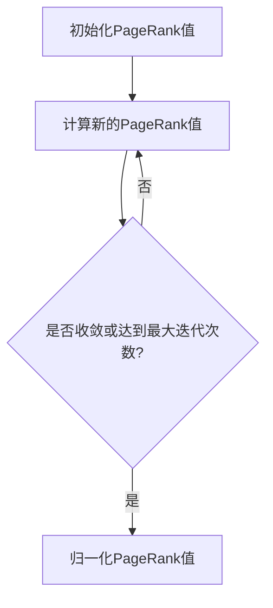
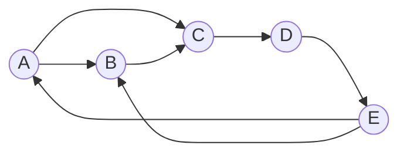

# Graph PageRank算法原理与代码实例讲解

## 1.背景介绍

在当今的互联网时代,网络数据的规模正在以前所未有的速度增长。随着网络数据量的不断增加,有效地组织和检索这些数据变得至关重要。这就是PageRank算法发挥作用的地方。

PageRank算法最初是由谷歌公司的创始人拉里·佩奇(Larry Page)和谢尔盖·布林(Sergey Brin)在1998年提出的,用于评估网页的重要性和排名。该算法基于网页之间的链接结构,通过计算每个网页的重要性分数(PageRank值)来确定其在搜索结果中的排名。

PageRank算法的核心思想是,一个网页的重要性不仅取决于该网页本身的内容质量,还取决于链接到该网页的其他网页的重要性。换句话说,如果一个网页被许多重要网页链接,那么这个网页本身也会被认为是重要的。这种基于链接结构的重要性评估方法与传统的基于内容的方法形成了鲜明对比,也是PageRank算法独特之处。

随着时间的推移,PageRank算法不仅被广泛应用于网页排名,还被推广到其他领域,如社交网络分析、推荐系统、生物信息学等。在这些领域中,PageRank算法被用于评估节点(如用户、商品或基因)的重要性,并且可以应用于各种类型的图结构数据。

## 2.核心概念与联系

在深入探讨PageRank算法的原理之前,我们需要先了解一些核心概念和它们之间的联系。

### 2.1 图(Graph)

图是一种用于表示对象及其相互关系的数学结构。在图论中,图由一组节点(也称为顶点)和一组连接这些节点的边(也称为链接或关系)组成。

在PageRank算法的背景下,网页可以被视为图中的节点,而超链接则表示节点之间的边。因此,整个互联网可以被抽象为一个巨大的图,其中每个网页都是一个节点,每个超链接都是一条边。

### 2.2 随机游走(Random Walk)

随机游走是一种在图上模拟随机行走过程的概率模型。在这个模型中,假设有一个"随机浏览者"从某个节点出发,随机选择一条出边,沿着该边移动到下一个节点。然后,从新的节点出发,再次随机选择一条出边,如此重复。

随机游走模型在PageRank算法中扮演着重要角色。PageRank算法假设一个"随机浏览者"在网络中随机游走,并基于这个过程来评估每个网页的重要性。

### 2.3 马尔可夫链(Markov Chain)

马尔可夫链是一种描述随机过程的数学模型,其中每个状态只依赖于前一个状态,而与过去的其他状态无关。在PageRank算法中,随机游走过程可以被建模为一个马尔可夫链,其中每个状态对应一个网页。

马尔可夫链具有一个重要的性质,即在经过足够长的时间后,它会收敛到一个稳定的状态分布,称为"平稳分布"。在PageRank算法中,这个平稳分布就对应于每个网页的PageRank值。

### 2.4 PageRank值

PageRank值是一个介于0和1之间的分数,用于衡量网页的重要性。一个网页的PageRank值越高,表示该网页在整个网络中越重要。

PageRank值的计算基于随机游走模型和马尔可夫链的理论。具体来说,PageRank值反映了"随机浏览者"在长期随机游走后停留在该网页的概率。

### 2.5 Mermaid流程图

为了更好地理解这些核心概念之间的关系,我们可以使用Mermaid流程图进行可视化表示:


在这个流程图中,我们可以看到图(Graph)是整个过程的基础,随机游走(Random Walk)是对图上的随机行走过程的建模,马尔可夫链(Markov Chain)提供了一种数学框架来描述和分析这个随机过程,最终导出了PageRank值(PageRank Score),用于衡量每个节点(网页)的重要性。

## 3.核心算法原理具体操作步骤

现在,让我们深入探讨PageRank算法的核心原理和具体操作步骤。

### 3.1 算法基本思想

PageRank算法的基本思想是,一个网页的重要性不仅取决于该网页本身的内容质量,还取决于链接到该网页的其他网页的重要性。具体来说,如果一个网页被许多重要网页链接,那么这个网页本身也会被认为是重要的。

为了量化这个思想,PageRank算法引入了一个"随机浏览者"的概念。假设有一个"随机浏览者"在网络中随机游走,从一个网页跳转到另一个网页,每次跳转都是随机选择一条出边。在这个过程中,每个网页被访问的频率就反映了它的重要性。

### 3.2 算法迭代过程

PageRank算法通过迭代计算的方式来确定每个网页的PageRank值。具体步骤如下:

1. **初始化**: 将所有网页的初始PageRank值设置为相同的值,通常为1/N,其中N是网页总数。

2. **计算新的PageRank值**: 对于每个网页u,计算它的新PageRank值PR(u)如下:

   $$PR(u) = (1 - d) + d \sum_{v \in B_u} \frac{PR(v)}{L(v)}$$

   其中:
   - d是一个阻尼系数(damping factor),通常取值0.85
   - $B_u$是所有链接到网页u的网页集合
   - PR(v)是网页v的当前PageRank值
   - L(v)是网页v的出边数量(链接数)

   这个公式可以解释为:网页u的新PageRank值是由两部分组成的。第一部分(1-d)是一个常数,表示"随机浏览者"有一定概率会随机跳转到任何一个网页。第二部分是所有链接到u的网页的PageRank值的加权和,权重为1/L(v)。这反映了"随机浏览者"从其他网页跳转到u的概率。

3. **迭代更新**: 重复步骤2,直到PageRank值收敛或达到预设的最大迭代次数。

4. **归一化**: 将所有PageRank值除以它们的总和,使得它们的和为1。这样,PageRank值就可以被解释为"随机浏览者"停留在每个网页的概率。

### 3.3 算法流程图

为了更清晰地展示PageRank算法的迭代过程,我们可以使用Mermaid流程图进行可视化:



在这个流程图中,我们可以看到算法从初始化PageRank值开始,然后进入迭代循环。在每次迭代中,算法根据当前的PageRank值计算新的PageRank值。如果收敛条件满足或达到最大迭代次数,则进行归一化操作,否则继续下一次迭代。

## 4.数学模型和公式详细讲解举例说明

为了更深入地理解PageRank算法的数学模型和公式,我们将通过一个具体示例进行详细讲解。

### 4.1 示例网络

假设我们有一个由5个网页组成的小型网络,如下图所示:



在这个网络中,每个节点代表一个网页,边表示网页之间的链接。例如,网页A链接到网页B和网页C。

### 4.2 PageRank公式推导

现在,让我们来推导PageRank公式,以计算每个网页的PageRank值。

首先,我们定义一个向量$\pi$,其中$\pi_i$表示网页i的PageRank值。我们的目标是找到一个$\pi$,使得它是马尔可夫链的平稳分布。

根据马尔可夫链的性质,我们可以写出以下方程:

$$\pi_i = (1 - d) + d \sum_{j \in B_i} \frac{\pi_j}{L(j)}$$

其中:
- $B_i$是所有链接到网页i的网页集合
- $L(j)$是网页j的出边数量(链接数)
- d是阻尼系数,通常取值0.85

这个方程可以解释为:网页i的PageRank值是由两部分组成的。第一部分(1-d)是一个常数,表示"随机浏览者"有一定概率会随机跳转到任何一个网页。第二部分是所有链接到i的网页的PageRank值的加权和,权重为1/L(j)。这反映了"随机浏览者"从其他网页跳转到i的概率。

将上述方程写成矩阵形式,我们得到:

$$\pi = (1 - d) \frac{1}{N} \vec{1} + d M^T \pi$$

其中:
- $\vec{1}$是所有元素为1的列向量
- N是网页总数
- M是一个$N \times N$的矩阵,称为"链接矩阵"(link matrix),其中$M_{ij} = 1/L(j)$如果网页j链接到网页i,否则$M_{ij} = 0$

解这个方程,我们可以得到$\pi$的值,即每个网页的PageRank值。

### 4.3 示例计算

现在,让我们使用上面的网络示例来计算每个网页的PageRank值。

首先,我们构建链接矩阵M:

$$M = \begin{pmatrix}
0 & 1/2 & 1/2 & 0 & 0 \\
0 & 0 & 1/1 & 0 & 0 \\
0 & 0 & 0 & 1/1 & 0 \\
0 & 0 & 0 & 0 & 1/1 \\
1/2 & 1/2 & 0 & 0 & 0
\end{pmatrix}$$

然后,我们可以使用迭代方法来求解$\pi$。假设初始时所有网页的PageRank值相等,即$\pi_0 = (1/5, 1/5, 1/5, 1/5, 1/5)^T$。

在第一次迭代中,我们有:

$$\pi_1 = (1 - d) \frac{1}{5} \vec{1} + d M^T \pi_0$$

代入数值,我们得到:

$$\pi_1 = (0.2, 0.2, 0.2, 0.2, 0.2)^T$$

在第二次迭代中:

$$\pi_2 = (1 - d) \frac{1}{5} \vec{1} + d M^T \pi_1 = (0.28, 0.18, 0.18, 0.18, 0.18)^T$$

继续迭代,直到收敛或达到最大迭代次数。最终,我们可以得到每个网页的PageRank值。

通过这个示例,我们可以更好地理解PageRank算法的数学模型和公式,以及如何应用它们来计算实际网络中每个网页的PageRank值。

## 5.项目实践:代码实例和详细解释说明

为了更好地理解PageRank算法的实现,我们将提供一个Python代码示例,并对其进行详细解释。

### 5.1 Python代码实例

```python
import numpy as np

def pagerank(M, num_iterations=100, d=0.85):
    N = M.shape[1]
    v = np.random.rand(N, 1)
    v = v / np.linalg.norm(v, 1)
    M_hat = (d * M) + (1 - d) / N
    
    for i in range(num_iterations):
        v_new = np.dot(M_hat.T, v)
        if np.linalg.norm(v_new - v, 1) < 1e-8:
            break
        v = v_new
    
    return v

# 示例用法
M = np.array([[0, 1/2, 1/2, 0, 0],
              [0, 0, 1, 0, 0],
              [0, 0, 0, 1, 0],