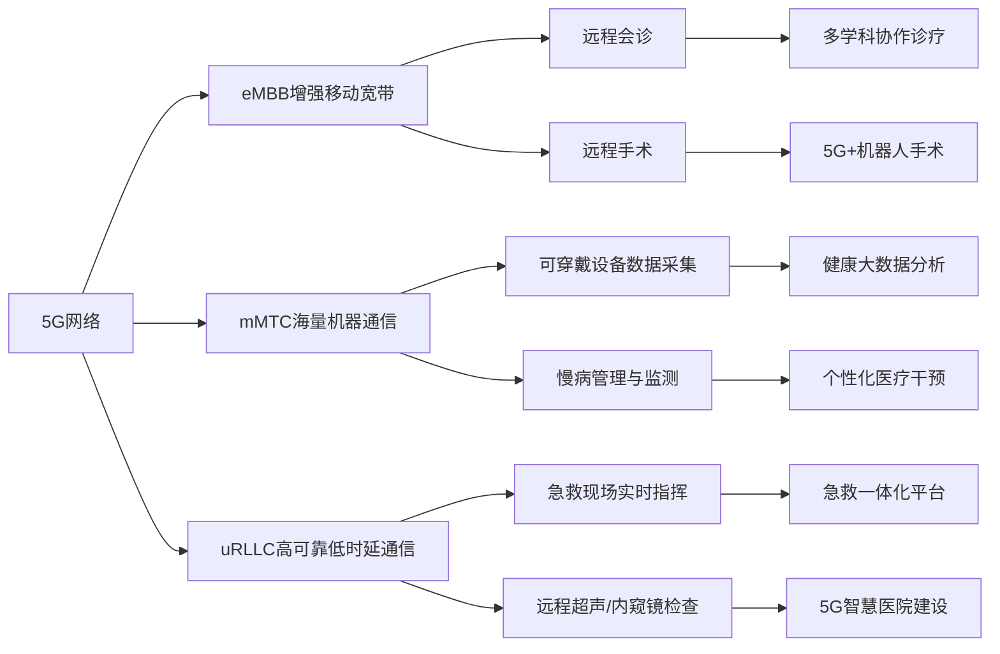

# 5G技术：加速医疗信息互联互通

## 1. 背景介绍
### 1.1 医疗信息化的重要性
### 1.2 当前医疗信息化面临的挑战
#### 1.2.1 信息孤岛问题
#### 1.2.2 数据安全与隐私保护
#### 1.2.3 网络传输速度与稳定性
### 1.3 5G技术的发展现状

## 2. 核心概念与联系
### 2.1 5G的关键技术
#### 2.1.1 高频段通信
#### 2.1.2 大规模MIMO
#### 2.1.3 超密集组网
#### 2.1.4 新型网络架构
### 2.2 5G与医疗信息化的联系
#### 2.2.1 高速率与低时延
#### 2.2.2 广连接与高可靠
#### 2.2.3 网络切片与边缘计算

## 3. 核心算法原理具体操作步骤
### 3.1 5G网络切片技术
#### 3.1.1 网络切片的概念与优势
#### 3.1.2 端到端网络切片的实现步骤
#### 3.1.3 基于SDN/NFV的网络切片编排
### 3.2 多址接入技术
#### 3.2.1 正交频分多址(OFDMA)
#### 3.2.2 非正交多址接入(NOMA)
#### 3.2.3 稀疏编码多址接入(SCMA)
### 3.3 边缘计算与数据处理
#### 3.3.1 移动边缘计算(MEC)架构
#### 3.3.2 分布式数据处理与融合
#### 3.3.3 隐私保护与安全机制

## 4. 数学模型和公式详细讲解举例说明
### 4.1 5G大规模MIMO系统模型
#### 4.1.1 信道矩阵与信号模型
#### 4.1.2 预编码与检测算法
#### 4.1.3 系统容量分析
### 4.2 网络切片资源分配优化
#### 4.2.1 切片资源分配问题建模
#### 4.2.2 基于博弈论的切片资源分配算法
#### 4.2.3 数值仿真与性能评估
### 4.3 移动边缘计算任务卸载策略
#### 4.3.1 计算任务卸载决策优化
#### 4.3.2 多用户资源分配博弈
#### 4.3.3 强化学习任务卸载算法

## 5. 项目实践：代码实例和详细解释说明
### 5.1 5G网络切片编排平台搭建
#### 5.1.1 基于OpenStack的NFV平台部署
#### 5.1.2 切片管理与编排模块实现
#### 5.1.3 切片生命周期管理
### 5.2 医疗数据传输与处理实例
#### 5.2.1 医学影像数据传输优化
#### 5.2.2 分布式健康数据处理
#### 5.2.3 安全隐私保护机制实现
### 5.3 远程医疗应用案例开发
#### 5.3.1 远程会诊系统设计
#### 5.3.2 可穿戴设备数据采集与分析
#### 5.3.3 基于5G的远程手术方案

## 6. 实际应用场景
### 6.1 5G智慧医院建设
#### 6.1.1 医院网络架构升级
#### 6.1.2 医疗设备互联互通
#### 6.1.3 智能化医疗服务应用
### 6.2 远程医疗服务普及
#### 6.2.1 偏远地区医疗资源共享
#### 6.2.2 远程会诊与多学科诊疗
#### 6.2.3 远程手术与专家指导
### 6.3 慢病管理与健康监测
#### 6.3.1 居家慢病管理方案
#### 6.3.2 实时健康数据采集与分析
#### 6.3.3 个性化健康干预措施

## 7. 工具和资源推荐 
### 7.1 5G网络仿真平台
#### 7.1.1 ns-3 
#### 7.1.2 OPNET
#### 7.1.3 NetSim
### 7.2 医疗信息标准与规范
#### 7.2.1 HL7
#### 7.2.2 DICOM
#### 7.2.3 FHIR
### 7.3 开源医疗信息化项目
#### 7.3.1 OpenEMR
#### 7.3.2 OpenMRS
#### 7.3.3 OSCAR EMR

## 8. 总结：未来发展趋势与挑战
### 8.1 5G赋能医疗信息化的前景展望
### 8.2 技术融合与创新应用探索
#### 8.2.1 人工智能与5G融合
#### 8.2.2 区块链技术应用
#### 8.2.3 AR/VR在医疗中的应用
### 8.3 面临的挑战与对策
#### 8.3.1 标准化与互操作性问题
#### 8.3.2 数据安全与隐私保护
#### 8.3.3 医疗政策与监管适应

## 9. 附录：常见问题与解答
### 9.1 5G技术对医疗行业有哪些影响？
### 9.2 如何保障5G医疗应用的安全性？
### 9.3 5G远程医疗面临哪些法律与伦理问题？

5G技术以其高速率、低时延、广连接的特性，为医疗信息化注入了新的活力。5G网络可以有效解决医疗信息孤岛问题，实现医疗资源的互联互通和共享。通过5G网络切片技术，可以为不同医疗应用提供定制化的网络服务，保障关键医疗数据的传输质量。同时，5G边缘计算能力将数据处理前移，实现实时的数据分析和决策支持。

在5G环境下，远程医疗服务将得到极大普及。偏远地区的患者能够享受到优质的医疗资源，通过远程会诊、远程手术等方式，跨越时空限制获得及时诊疗。5G+可穿戴设备将助力慢病管理和健康监测，实现居家健康管理和连续护理。5G智慧医院建设将推动医院网络架构升级，实现医疗设备互联互通，提供智能化医疗服务。

5G赋能医疗信息化，前景广阔，但同时也面临诸多挑战。医疗数据的标准化和互操作性问题亟待解决。如何在5G开放网络环境下保障医疗数据安全和隐私，需要从技术和管理两方面入手。此外，5G医疗应用涉及的法律、伦理问题也需要引起重视，建立适应5G时代的医疗政策与监管体系。

未来，5G与人工智能、区块链、AR/VR等技术的融合，将进一步推动医疗信息化的创新发展。5G+AI将实现智能辅助诊断、智能影像分析、药物研发等应用。5G+区块链有望破解医疗数据共享难题，实现安全可信的数据流通。5G+AR/VR将在医学教育、手术规划、康复训练等领域大显身手。

总之，5G技术为医疗信息化插上了腾飞的翅膀。在5G的助力下，"健康中国"战略目标将指日可待。让我们携手共进，共创5G智慧医疗的美好未来！

作者：禅与计算机程序设计艺术 / Zen and the Art of Computer Programming