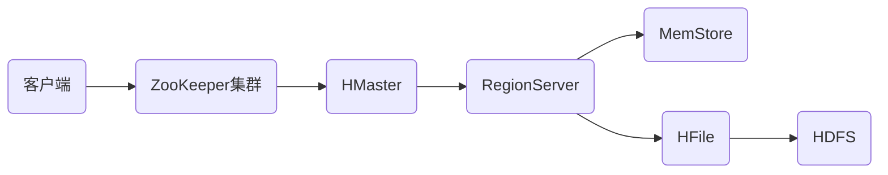

# HBase原理与代码实例讲解

## 1.背景介绍

### 1.1 大数据时代的数据存储挑战

随着互联网、物联网、人工智能等技术的飞速发展,我们已经进入了大数据时代。海量的数据每时每刻都在被生成和采集,传统的关系型数据库已经无法满足大规模数据存储和实时查询分析的需求。NoSQL数据库应运而生,其中HBase作为一款高可靠、高性能、面向列的分布式数据库,在大数据领域得到了广泛的应用。

### 1.2 HBase的诞生与发展历程

HBase最初由Powerset公司于2007年开发,旨在解决实时网页索引的问题。2008年成为Apache顶级开源项目,目前已发展到2.x版本。HBase构建在Hadoop之上,利用HDFS作为底层分布式文件系统,提供类似于Bigtable的数据模型和功能。经过十多年的发展,HBase已成为大数据生态系统中不可或缺的重要组件。

### 1.3 HBase在大数据领域的应用现状

当前,HBase被广泛应用于各种大数据场景,如:

- 海量数据存储:淘宝、小米等电商平台使用HBase存储交易、用户、商品等PB级数据
- 实时查询分析:Facebook利用HBase进行消息实时检索,华为用其进行呼叫数据分析
- 时序数据管理:OpenTSDB基于HBase构建,广泛用于物联网、监控等领域的时序数据存储
- 内容索引与推荐:Pinterest将HBase作为图片元数据存储,实现实时索引与推荐

可以看出,HBase凭借其优异的性能和可伸缩性,已成为大数据时代的关键技术之一。

## 2.核心概念与联系

### 2.1 表(Table)、行(Row)、列族(Column Family)、列(Column) 

HBase采用类似Google Bigtable的数据模型,以表(Table)的形式组织数据。每个表包含多个行(Row),每行有一个唯一的行键(RowKey)。

行中的数据按列族(Column Family)分组,列族下包含多个列(Column),以列族名+列名作为列限定符(Column Qualifier)。表模式需预先定义列族,但列可以动态增加。

一个单元格(Cell)对应一个{rowkey, column+qualifier, version}元组,存储对应数据值。

### 2.2 Region、RegionServer、HMaster

为实现水平扩展,HBase将表横向切分成多个区域(Region),每个Region包含连续的行键范围。Region是HBase分布式存储和负载均衡的基本单位。 

多个Region分布在不同的RegionServer上,每个RegionServer管理多个Region,负责数据的读写。

HMaster是整个HBase集群的管理节点,负责Region的分配、RegionServer的监控、元数据管理等。

### 2.3 数据存储流程

HBase客户端发起读写请求后,数据在HBase中存储和访问的流程如下:



1. 客户端从ZooKeeper获取元数据,找到RowKey所在的Region和RegionServer
2. 客户端直接与RegionServer通信,发送读写请求
3. 对于写请求,数据先写入RegionServer的MemStore内存缓存
4. 当MemStore达到阈值,触发flush操作,将数据持久化为HDFS上的HFile 
5. 对于读请求,先在MemStore和HFile中查找,如果未命中则访问HDFS

整个过程中,数据先写内存再持久化,充分利用了内存的高速和磁盘的高容量。同时,数据在多个RegionServer间分布,实现了负载均衡和水平扩展。

## 3.核心算法原理具体操作步骤

### 3.1 LSM树(Log-Structured Merge-Tree)

HBase的核心是LSM树,这是一种高效的数据结构,将随机写转化为顺序写,大幅提升写入性能。具体实现原理如下:

1. 数据写入时,先追加到内存中的有序数据结构(如跳表、红黑树等),即MemStore
2. 当MemStore达到阈值(默认128MB),触发flush操作,将数据顺序写入磁盘,生成一个新的HFile
3. 随着HFile的不断生成,会定期触发Compaction操作,将多个小HFile合并为少数大HFile
4. 在合并过程中,会清理掉过期和删除的数据,同时对数据进行排序,生成新的有序HFile
5. 读取数据时,先在MemStore中查找,接着依次查找HFile,直到找到所需数据

通过这种方式,LSM树在写入时只有顺序I/O,在读取时通过多级索引和布隆过滤器优化定位,达到了高效读写的目的。

### 3.2 Region分裂(Region Split)

为了应对数据量的增长并实现负载均衡,HBase需要动态分裂Region。具体步骤如下:

1. 当RegionServer发现某个Region的大小超过阈值(默认10GB),会将其加入split队列
2. split线程从队列中取出Region,判断是否需要分裂(如Region只有一个HFile则不分裂)
3. 如果需要分裂,split线程会将Region一分为二,找到中间的RowKey作为分界点
4. 在ZooKeeper中创建新Region的元数据,包括起始和结束的RowKey
5. 通知HMaster有新的Region生成,HMaster分配这些Region到不同的RegionServer
6. 原RegionServer将原Region下线,新RegionServer提供新Region的服务

通过Region分裂,HBase可以在数据不断增长时自适应地调整数据分布,维持系统的负载均衡。

### 3.3 数据恢复与故障转移

为保证数据的高可用,HBase提供了多种数据恢复和故障转移机制:

1. WAL(Write-Ahead Log):数据写入MemStore前,会先写一份日志到HDFS,用于RegionServer故障恢复
2. 定期Flush:即使没有达到阈值,也会定期将MemStore中的数据flush到HFile,降低数据丢失风险
3. RegionServer故障转移:当RegionServer宕机,HMaster会将其上的Region重新分配给其他RegionServer
4. 数据备份:可通过Replication将数据同步到其他HBase集群,提供异地容灾能力

综合利用这些手段,HBase能够提供类似RDBMS的数据可靠性保证,同时还能实现自动扩展和负载均衡。

## 4.数学模型和公式详细讲解举例说明

HBase中用到的主要数学模型有布隆过滤器(Bloom Filter)和一致性哈希(Consistent Hashing)。

### 4.1 布隆过滤器(Bloom Filter)

布隆过滤器是一种概率数据结构,用于快速判断一个元素是否在集合中。其原理如下:

1. 初始化一个m位的位数组,所有位初始为0
2. 选择k个不同的哈希函数,每个函数将元素映射到{1,2,...,m}范围内
3. 对于集合中的每个元素,用k个哈希函数计算哈希值,将位数组对应位置置为1
4. 查询时,用同样的k个哈希函数计算待查元素的哈希值,如果所有位置都为1则认为元素存在

假设m=20,k=3,集合S={x,y,z},哈希函数为$H_1(x)=x\bmod 5$,$H_2(x)=2x+1\bmod 5$,$H_3(x)=(x^2-1)\bmod 5$,过程如下:

对x,哈希值为$H_1(x)=2,H_2(x)=3,H_3(x)=0$,将位数组第2,3,0位置为1。
对y和z执行相同操作,最终位数组为:10111 01011 00101 01110

查询w时,哈希值为$H_1(w)=3,H_2(w)=2,H_3(w)=1$,发现第1位为0,可判断w不在集合中。

布隆过滤器可能存在假阳性(False Positive),但不会存在假阴性。通过合理设置m和k,可使假阳性概率较低。

HBase利用布隆过滤器快速判断RowKey是否在某个HFile中,大幅降低了不必要的I/O操作。

### 4.2 一致性哈希(Consistent Hashing)

一致性哈希是一种特殊的哈希算法,常用于分布式缓存等场景中,具有优异的负载均衡能力和数据迁移最小化特点。基本原理如下:

1. 将哈希空间想象成一个首尾相接的圆环,用整数$\{0,1,2,...,2^{32}-1\}$表示
2. 将数据和服务节点都计算哈希值,映射到圆环上
3. 对数据顺时针找到的第一个服务节点,即为该数据的存储位置
4. 新增或删除节点时,只影响该节点顺时针相邻的一个节点,数据迁移量最小

例如,有3个服务节点A、B、C,哈希值分别为$hash(A)=5,hash(B)=15,hash(C)=25$,数据对象x、y、z哈希值为$hash(x)=8,hash(y)=18,hash(z)=28$,则:

- x存储在B上,因为$hash(x)=8$顺时针找到的第一个节点是B
- y存储在C上,因为$hash(y)=18$顺时针找到的第一个节点是C
- z存储在A上,因为$hash(z)=28$超过最大值,回到圆环起点,第一个节点是A

如果新增节点D,哈希值$hash(D)=12$,则只有x需要从B迁移到D,y和z保持不变。

HBase将一致性哈希用于RegionServer的负载均衡。Row Key经过一致性哈希后分配到不同Region上,使得数据在集群中均匀分布,同时在Region分裂或RegionServer宕机时,数据迁移量也得到控制。

## 5.项目实践：代码实例和详细解释说明

下面通过Java代码演示如何使用HBase进行表操作和数据读写。

### 5.1 创建连接并建表

```java
// 配置ZooKeeper地址
Configuration conf = HBaseConfiguration.create();
conf.set("hbase.zookeeper.quorum", "localhost");
conf.set("hbase.zookeeper.property.clientPort", "2181");

// 创建HBase连接
Connection conn = ConnectionFactory.createConnection(conf);
Admin admin = conn.getAdmin();

// 创建表描述器
TableName tableName = TableName.valueOf("test_table");
TableDescriptorBuilder tableDescBuilder = TableDescriptorBuilder.newBuilder(tableName);

// 添加列族
ColumnFamilyDescriptor cfDesc = ColumnFamilyDescriptorBuilder.newBuilder(Bytes.toBytes("cf")).build();
tableDescBuilder.setColumnFamily(cfDesc);

// 创建表
TableDescriptor tableDesc = tableDescBuilder.build();
admin.createTable(tableDesc);
```

代码解释:
1. 配置ZooKeeper地址,用于定位HBase集群
2. 通过`ConnectionFactory`创建HBase连接`Connection`和`Admin`
3. 创建表名为`test_table`的表描述器`TableDescriptor`
4. 创建列族`cf`,添加到表描述器中
5. 调用`admin.createTable`创建HBase表

### 5.2 插入数据

```java
// 获取表对象
Table table = conn.getTable(tableName);

// 创建Put对象
Put put = new Put(Bytes.toBytes("row1"));

// 添加列数据
put.addColumn(Bytes.toBytes("cf"), Bytes.toBytes("col1"), Bytes.toBytes("value1"));
put.addColumn(Bytes.toBytes("cf"), Bytes.toBytes("col2"), Bytes.toBytes("value2"));

// 执行Put操作
table.put(put);
```

代码解释:
1. 通过`Connection`获取`test_table`的表对象`Table` 
2. 创建`Put`对象,指定RowKey为`row1`
3. 调用`addColumn`方法,在`cf`列族下添加`col1`和`col2`两个列,值分别为`value1`和`value2`
4. 调用`table.put`执行写入操作

### 5.3 读取数据

```java
// 创建Get对象
Get get = new Get(Bytes.toBytes("row1"));

// 指定列族和列
get.addColumn(Bytes.toBytes("cf"), Bytes.toBytes("col1"));

// 执行Get操作
Result result = table.get(get);

// 获取单元格数据
byte[] value = result.getValue(Bytes.toBytes("cf"), Bytes.toBytes("col