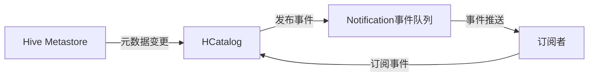

# HCatalog Notification机制原理与代码实例讲解

## 1. 背景介绍

在大数据处理和分析领域,数据的实时性和一致性至关重要。Apache Hive作为一个构建在Hadoop之上的数据仓库工具,为海量结构化数据的存储和分析提供了便利。然而,Hive本身并不支持对元数据变更的实时通知。这就导致在Hive之上构建的应用程序难以实时感知和响应元数据的变化。

HCatalog作为Hive的一个子项目,旨在为Hadoop生态系统中的不同工具和框架提供一个共享的元数据服务。HCatalog Notification机制应运而生,它允许外部系统订阅Hive元数据变更事件,实现元数据变更的实时通知。这为构建实时数据处理和分析管道奠定了基础。

本文将深入探讨HCatalog Notification机制的原理,并结合代码实例进行讲解,帮助读者全面理解和掌握这一重要机制。

## 2. 核心概念与联系

在深入研究HCatalog Notification机制之前,我们需要了解几个核心概念:

### 2.1 Hive Metastore

Hive Metastore是Hive的核心组件之一,负责存储和管理Hive的元数据信息,包括数据库、表、分区、列等。Metastore支持不同的存储后端,如内嵌的Derby数据库、MySQL等外部数据库。

### 2.2 HCatalog

HCatalog提供了一个统一的元数据管理和数据访问接口,使得不同的工具和框架可以共享Hive Metastore中的元数据。HCatalog将Hive Metastore的功能进行了扩展和抽象,简化了元数据的访问和操作。

### 2.3 Notification事件

HCatalog Notification机制中的事件表示Hive Metastore中的元数据发生了变更。常见的事件类型包括:

- CREATE_DATABASE: 创建数据库事件
- DROP_DATABASE: 删除数据库事件 
- CREATE_TABLE: 创建表事件
- ALTER_TABLE: 修改表事件
- DROP_TABLE: 删除表事件
- ADD_PARTITION: 添加分区事件
- DROP_PARTITION: 删除分区事件

这些事件覆盖了元数据变更的主要场景。

### 2.4 事件订阅与消费

外部系统可以通过HCatalog提供的接口订阅感兴趣的元数据变更事件。当相应的事件发生时,HCatalog会将事件推送给订阅者。订阅者通过消费事件来实时感知元数据的变化,并做出相应的处理。

下图展示了HCatalog Notification机制的核心组件和事件流转过程:



## 3. 核心算法原理与操作步骤

HCatalog Notification机制的核心在于事件的生成、存储、订阅和消费。下面我们详细介绍其中的关键算法和操作步骤。

### 3.1 事件生成

当Hive Metastore中的元数据发生变更时,HCatalog会拦截这些变更操作,并生成相应的Notification事件。事件生成的主要步骤如下:

1. 拦截Metastore的变更操作,如CREATE、ALTER、DROP等。
2. 解析变更操作,提取关键信息,如数据库名称、表名称、分区信息等。
3. 根据变更类型和提取的信息,构建相应的Notification事件对象。
4. 将生成的事件对象发布到Notification事件队列中。

### 3.2 事件存储

生成的Notification事件需要持久化存储,以便订阅者能够可靠地消费事件。HCatalog支持将事件存储在Metastore后端数据库中。事件存储的主要步骤如下:

1. 在Metastore后端数据库中创建NOTIFICATION_LOG表,用于存储事件。
2. 将生成的Notification事件序列化为JSON格式。
3. 将序列化后的事件数据插入到NOTIFICATION_LOG表中。
4. 记录事件的元数据信息,如事件ID、事件类型、生成时间等。

### 3.3 事件订阅

外部系统需要订阅感兴趣的事件类型,以便接收相应的事件通知。事件订阅的主要步骤如下:

1. 通过HCatalog提供的API接口创建事件订阅。
2. 指定订阅的事件类型,如CREATE_TABLE、DROP_TABLE等。
3. 设置事件接收的回调函数或消息队列。
4. 启动事件订阅,开始接收事件通知。

### 3.4 事件消费

订阅者接收到事件通知后,需要对事件进行消费和处理。事件消费的主要步骤如下:

1. 接收事件通知,获取事件的元数据信息,如事件ID、事件类型等。
2. 根据事件类型和元数据,从NOTIFICATION_LOG表中读取事件的详细数据。
3. 反序列化事件数据,还原Notification事件对象。
4. 根据事件类型和内容,执行相应的业务逻辑,如更新缓存、触发数据处理等。
5. 标记事件为已消费,避免重复消费。

## 4. 数学模型与公式

HCatalog Notification机制涉及到事件的序列化和反序列化,以及事件元数据的存储和查询。这里我们重点介绍事件序列化和反序列化的数学模型。

### 4.1 事件序列化

Notification事件对象需要序列化为JSON格式的字符串,以便存储和传输。假设事件对象为$E$,序列化函数为$S$,序列化后的JSON字符串为$J$,则有:

$$J = S(E)$$

其中,$S$函数将事件对象$E$的各个字段转换为JSON格式的键值对,并拼接成一个完整的JSON字符串$J$。

### 4.2 事件反序列化

订阅者接收到JSON格式的事件数据后,需要将其反序列化为Notification事件对象。假设JSON字符串为$J$,反序列化函数为$D$,反序列化后的事件对象为$E$,则有:

$$E = D(J)$$

其中,$D$函数将JSON字符串$J$解析为键值对,并根据事件类型和字段映射关系,还原出事件对象$E$的各个字段值。

## 5. 项目实践:代码实例与详细解释

下面我们通过一个具体的代码实例来演示HCatalog Notification机制的使用。

### 5.1 事件生成与发布

```java
// 创建HiveMetaStore客户端
HiveMetaStoreClient metaStoreClient = new HiveMetaStoreClient(hiveConf);

// 创建数据库
String dbName = "test_db";
Database db = new Database();
db.setName(dbName);
metaStoreClient.createDatabase(db);

// 创建表
String tableName = "test_table";
Table table = new Table();
table.setDbName(dbName);
table.setTableName(tableName);
// 设置表的其他属性...
metaStoreClient.createTable(table);

// 添加分区
String partitionName = "dt=20230531";
Partition partition = new Partition();
partition.setDbName(dbName);
partition.setTableName(tableName);
partition.setValues(Arrays.asList(partitionName));
// 设置分区的其他属性...
metaStoreClient.add_partition(partition);
```

上述代码演示了使用HiveMetaStoreClient创建数据库、表和添加分区的过程。在每个操作执行时,HCatalog会自动生成相应的Notification事件,并将其发布到事件队列中。

### 5.2 事件订阅与消费

```java
// 创建事件订阅器
HCatNotificationListener listener = new HCatNotificationListener() {
    @Override
    public void onNotification(HCatNotificationEvent event) {
        // 处理接收到的事件
        System.out.println("Received event: " + event);
        // 根据事件类型执行相应的业务逻辑...
    }
};

// 创建事件服务器配置
HCatNotificationServiceConfig config = new HCatNotificationServiceConfig();
config.setMetastoreUri(metastoreUri);
config.setDbName(dbName);
config.setTableNames(Arrays.asList(tableName));
config.setEventTypes(Arrays.asList(
    HCatNotificationEvent.EventType.CREATE_TABLE,
    HCatNotificationEvent.EventType.ALTER_TABLE,
    HCatNotificationEvent.EventType.ADD_PARTITION
));

// 创建事件服务器
HCatNotificationService service = new HCatNotificationService(config);
service.addListener(listener);

// 启动事件服务器
service.start();
```

上述代码演示了使用HCatNotificationListener创建事件订阅器,并指定感兴趣的事件类型。通过HCatNotificationService配置和启动事件服务器,订阅器就可以接收到相应的事件通知,并执行相应的业务逻辑。

## 6. 实际应用场景

HCatalog Notification机制在实际的大数据应用中有广泛的应用场景,下面列举几个典型的例子:

### 6.1 实时数据处理

当Hive表发生变更时,可以通过HCatalog Notification机制触发实时数据处理作业。例如,当新的分区被添加到表中时,可以自动启动Spark Streaming作业,对新增的分区数据进行实时处理和分析。

### 6.2 数据血缘与影响分析

通过订阅Hive Metastore的变更事件,可以实时跟踪数据血缘关系和数据变更的影响范围。例如,当一个表被删除时,可以分析出依赖该表的下游作业和应用,并及时进行影响评估和调整。

### 6.3 元数据同步与一致性

在多个系统共享Hive Metastore的情况下,通过HCatalog Notification机制可以实现元数据的实时同步和一致性维护。例如,当一个外部系统修改了表的结构,可以通过事件通知及时将变更同步到其他系统,保证元数据的一致性。

### 6.4 数据治理与审计

HCatalog Notification机制可以用于数据治理和审计目的。通过记录和分析Metastore的变更事件,可以跟踪数据的访问和修改历史,实现数据溯源和合规性审计。

## 7. 工具与资源推荐

对于HCatalog Notification机制的学习和应用,以下是一些有用的工具和资源推荐:

- Apache Hive官方文档:提供了HCatalog Notification机制的详细介绍和API参考。
- Apache Hadoop官方文档:介绍了Hadoop生态系统的各个组件,包括HDFS、YARN等。
- Apache HCatalog官方示例:包含了HCatalog Notification机制的示例代码和使用指南。
- Cloudera博客:提供了关于HCatalog Notification机制的实践经验和优化建议。
- Hortonworks博客:分享了HCatalog Notification机制在实际项目中的应用案例和最佳实践。

## 8. 总结:未来发展趋势与挑战

HCatalog Notification机制为Hadoop生态系统中的元数据变更实时通知提供了一种标准化的解决方案。它促进了不同系统之间的数据集成和协作,提高了数据处理的实时性和一致性。

未来,HCatalog Notification机制有望在以下方面得到进一步发展和完善:

1. 与更多的计算框架和工具集成,如Flink、Presto等,扩大其应用范围。
2. 支持更细粒度的事件类型和过滤条件,提供更灵活的事件订阅和消费机制。
3. 提高事件处理的性能和可扩展性,支持更大规模的元数据变更和事件吞吐。
4. 加强事件的安全性和权限控制,确保事件的生产和消费都在可信的环境中进行。

同时,HCatalog Notification机制也面临着一些挑战:

1. 事件的可靠性和一致性保证,需要在分布式环境中确保事件的有序性和不丢失。
2. 事件的存储和查询性能优化,需要设计高效的事件存储格式和索引机制。
3. 事件订阅和消费的动态管理,需要支持订阅者的动态添加、删除和权限控制。

相信通过社区的持续努力和创新,HCatalog Notification机制将不断完善和发展,为大数据生态系统的集成与协作提供更强大的支持。

## 9. 附录:常见问题与解答

### 9.1 HCatalog Notification机制支持哪些版本的Hive?