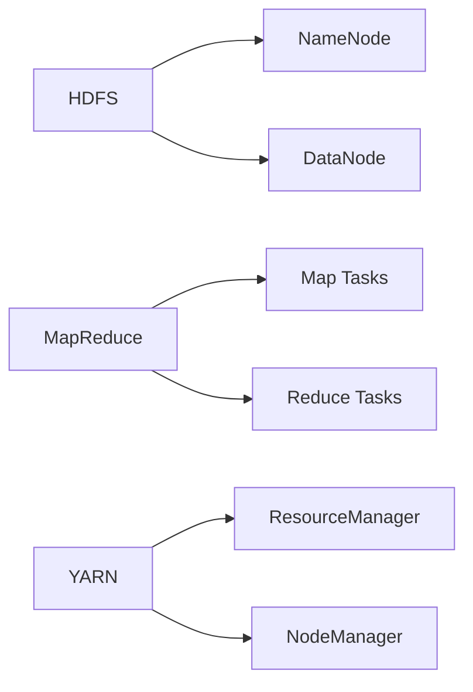

# Hadoop原理与代码实例讲解

## 1.背景介绍
### 1.1 大数据处理的挑战
### 1.2 Hadoop的诞生
### 1.3 Hadoop生态系统概览

## 2.核心概念与联系
### 2.1 Hadoop分布式文件系统HDFS
#### 2.1.1 HDFS的设计目标
#### 2.1.2 HDFS的架构
#### 2.1.3 数据块与副本
### 2.2 分布式计算框架MapReduce
#### 2.2.1 MapReduce编程模型 
#### 2.2.2 Map阶段与Reduce阶段
#### 2.2.3 任务调度与容错
### 2.3 资源管理系统YARN
#### 2.3.1 YARN架构
#### 2.3.2 资源请求与分配
#### 2.3.3 任务调度与监控



## 3.核心算法原理具体操作步骤
### 3.1 HDFS读写数据流程
#### 3.1.1 HDFS写数据
#### 3.1.2 HDFS读数据
#### 3.1.3 数据完整性校验
### 3.2 MapReduce工作流程
#### 3.2.1 作业提交
#### 3.2.2 任务分配
#### 3.2.3 Map与Reduce阶段
### 3.3 YARN资源分配与任务调度
#### 3.3.1 资源请求
#### 3.3.2 资源分配
#### 3.3.3 任务调度

## 4.数学模型和公式详细讲解举例说明
### 4.1 数据局部性原理
### 4.2 数据分块与副本放置策略
### 4.3 MapReduce中的排序、洗牌与合并
#### 4.3.1 Map端Combine
#### 4.3.2 Reduce端分区与排序
### 4.4 YARN中的资源调度算法
#### 4.4.1 容量调度器
#### 4.4.2 公平调度器

## 5.项目实践：代码实例和详细解释说明
### 5.1 HDFS Java API操作
#### 5.1.1 创建目录
#### 5.1.2 上传文件
#### 5.1.3 读取文件
#### 5.1.4 删除文件
### 5.2 MapReduce词频统计
#### 5.2.1 Map函数
#### 5.2.2 Reduce函数
#### 5.2.3 作业配置与提交
#### 5.2.4 结果验证
### 5.3 YARN集群部署
#### 5.3.1 配置文件
#### 5.3.2 启动集群
#### 5.3.3 提交作业
#### 5.3.4 查看任务执行

## 6.实际应用场景
### 6.1 日志分析
### 6.2 推荐系统
### 6.3 网页排名
### 6.4 社交网络分析

## 7.工具和资源推荐
### 7.1 Hadoop发行版
#### 7.1.1 Apache Hadoop 
#### 7.1.2 Cloudera CDH
#### 7.1.3 Hortonworks HDP
### 7.2 开发工具
#### 7.2.1 Eclipse
#### 7.2.2 IntelliJ IDEA
### 7.3 学习资源
#### 7.3.1 官方文档
#### 7.3.2 书籍推荐
#### 7.3.3 在线课程

## 8.总结：未来发展趋势与挑战 
### 8.1 Hadoop 3.x的新特性
### 8.2 云计算与Hadoop
### 8.3 实时大数据处理
### 8.4 机器学习与Hadoop
### 8.5 Hadoop面临的挑战

## 9.附录：常见问题与解答
### 9.1 Hadoop适合处理什么样的数据？
### 9.2 如何选择Hadoop发行版？ 
### 9.3 如何优化MapReduce作业性能？
### 9.4 HDFS的小文件问题如何解决？
### 9.5 Hadoop生态系统中还有哪些重要组件？

---

Hadoop作为当前大数据处理领域的事实标准，其底层依赖分布式文件系统HDFS实现海量数据的可靠存储，并通过分布式计算框架MapReduce实现数据的并行处理。同时，Hadoop生态系统中还包含一系列围绕数据采集、存储、处理、分析、可视化等全生命周期的工具与框架。

HDFS采用主/从架构，由单个NameNode管理文件系统的命名空间和数据块映射信息，以及若干个DataNode存储实际数据。HDFS将文件切分成固定大小的数据块，并将每个数据块以多个副本的形式分散存储在集群的不同节点上，以提供高可靠性和数据局部性访问。

MapReduce基于函数式编程思想，通过Map和Reduce两个基本操作实现数据的并行处理。用户只需编写Map和Reduce函数，将串行的程序逻辑描述成并行的步骤，而无需关心底层复杂的分布式系统细节。同时，MapReduce框架会自动完成任务的调度、容错等工作。

MapReduce作业执行过程如下：

1. 输入数据被切分成多个Split，每个Split由一个Map任务处理。
2. Map任务读取输入Split，解析成键值对，调用用户定义的map函数进行处理，输出中间结果。
3. MapReduce框架对Map输出的中间结果按照key进行排序，并执行Combine、Partition操作。
4. Reduce任务从Map任务拉取属于自己的分区数据，对数据按照key进行排序、分组，调用用户定义的reduce函数进行聚合计算，输出最终结果。

以下是经典的WordCount示例，展示了如何使用MapReduce进行词频统计：

```java
public class WordCount {
    
  public static class TokenizerMapper extends Mapper<Object, Text, Text, IntWritable> {
    private final static IntWritable one = new IntWritable(1);
    private Text word = new Text();
        
    public void map(Object key, Text value, Context context) throws IOException, InterruptedException {
      StringTokenizer itr = new StringTokenizer(value.toString());
      while (itr.hasMoreTokens()) {
        word.set(itr.nextToken());
        context.write(word, one);
      }
    }
  }
    
  public static class IntSumReducer extends Reducer<Text,IntWritable,Text,IntWritable> {
    private IntWritable result = new IntWritable();
        
    public void reduce(Text key, Iterable<IntWritable> values, Context context) throws IOException, InterruptedException {
      int sum = 0;
      for (IntWritable val : values) {
        sum += val.get();
      }
      result.set(sum);
      context.write(key, result);
    }
  }
    
  public static void main(String[] args) throws Exception {
    Configuration conf = new Configuration();
    Job job = Job.getInstance(conf, "word count");
    job.setJarByClass(WordCount.class);
    job.setMapperClass(TokenizerMapper.class);
    job.setCombinerClass(IntSumReducer.class);
    job.setReducerClass(IntSumReducer.class);
    job.setOutputKeyClass(Text.class);
    job.setOutputValueClass(IntWritable.class);
    FileInputFormat.addInputPath(job, new Path(args[0]));
    FileOutputFormat.setOutputPath(job, new Path(args[1]));
    System.exit(job.waitForCompletion(true) ? 0 : 1);
  }
}
```

随着集群规模和作业复杂度的增长，Hadoop 1.x中MapReduce既负责资源管理又负责任务调度的问题逐渐暴露出来。为了解决这个问题，Hadoop 2.x引入了YARN作为集群资源管理系统，将资源管理和作业调度解耦，使得Hadoop可以支持多种计算框架如Spark、Flink等。

YARN主要由ResourceManager、NodeManager、ApplicationMaster组成:

- ResourceManager负责整个集群的资源管理和调度
- NodeManager负责单个节点的资源管理和任务监控
- ApplicationMaster负责单个应用程序的任务调度和协调

YARN支持多种调度器，包括容量调度器、公平调度器等，可以根据实际需求选择。

未来，Hadoop将持续演进，以支持更多的计算和存储框架，提供更好的性能和易用性。同时，Hadoop与云计算、机器学习等新兴技术的结合，也将进一步拓展其应用场景。当然，Hadoop在扩展性、实时性、安全性等方面仍然面临诸多挑战，需要社区和厂商的共同努力。

作者：禅与计算机程序设计艺术 / Zen and the Art of Computer Programming