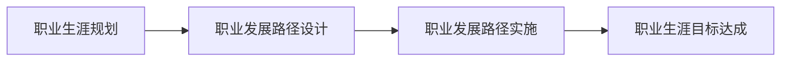
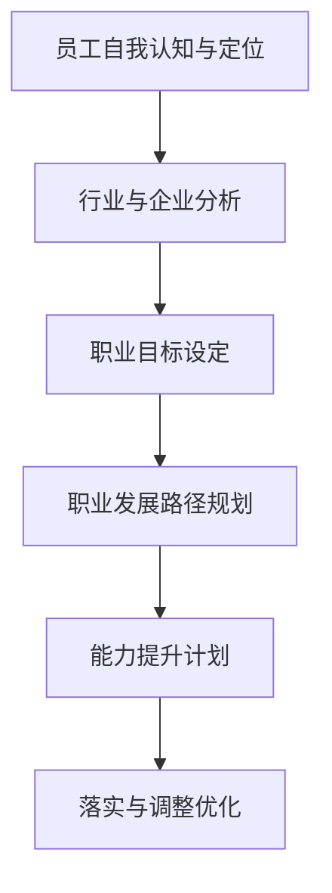

# IT职业生涯规划:为员工描绘清晰的发展路径

## 1. 背景介绍
### 1.1 IT行业发展现状
#### 1.1.1 技术快速迭代
#### 1.1.2 人才需求旺盛
#### 1.1.3 行业竞争加剧

### 1.2 职业生涯规划的重要性  
#### 1.2.1 个人发展需要
#### 1.2.2 企业人才培养需求
#### 1.2.3 行业人才梯队建设

### 1.3 IT企业面临的人才挑战
#### 1.3.1 人才流失问题
#### 1.3.2 人才培养难题
#### 1.3.3 人才结构不合理

## 2. 核心概念与联系
### 2.1 职业生涯规划的定义
#### 2.1.1 职业生涯的内涵
#### 2.1.2 规划的目的和意义
#### 2.1.3 规划的主要内容

### 2.2 职业发展路径的概念
#### 2.2.1 职业发展路径的定义
#### 2.2.2 发展路径的类型
#### 2.2.3 发展路径的作用

### 2.3 职业生涯规划与发展路径的关系
#### 2.3.1 规划是路径设计的基础
#### 2.3.2 路径是规划落地的载体 
#### 2.3.3 两者相辅相成、缺一不可



## 3. 职业生涯规划的核心步骤
### 3.1 员工自我认知与定位
#### 3.1.1 了解自我特点与优势  
#### 3.1.2 明确职业兴趣与价值观
#### 3.1.3 判断自身能力与不足

### 3.2 行业与企业分析
#### 3.2.1 把握行业发展趋势
#### 3.2.2 了解企业战略与文化
#### 3.2.3 研究企业内部机会

### 3.3 职业目标设定
#### 3.3.1 确立长期职业愿景
#### 3.3.2 制定中短期发展目标  
#### 3.3.3 目标的SMART原则

### 3.4 职业发展路径规划
#### 3.4.1 纵向路径:管理与专业双通道
#### 3.4.2 横向路径:跨部门与跨领域发展
#### 3.4.3 制定路径时间表与行动计划

### 3.5 能力提升计划
#### 3.5.1 识别关键能力要求
#### 3.5.2 评估能力现状与差距
#### 3.5.3 制定有针对性的学习计划

### 3.6 落实与调整优化
#### 3.6.1 路径实施与进度跟踪
#### 3.6.2 寻求组织支持与资源  
#### 3.6.3 定期回顾总结与动态优化



## 4. IT职业发展路径的数学建模
### 4.1 马尔可夫链模型
马尔可夫链是一种随机过程,用于描述状态之间的转移。假设IT职业发展有m个状态$S={S_1,S_2,...,S_m}$,从状态$S_i$转移到$S_j$的概率为$P_{ij}$,则状态转移概率矩阵为:

$$
P=
\begin{bmatrix}
P_{11} & P_{12} & \cdots & P_{1m} \\
P_{21} & P_{22} & \cdots & P_{2m} \\
\vdots & \vdots & \ddots & \vdots \\
P_{m1} & P_{m2} & \cdots & P_{mm} 
\end{bmatrix}
$$

假设初始状态分布为$\mu^{(0)}=(\mu_1^{(0)},\mu_2^{(0)},...,\mu_m^{(0)})$,则k步后的状态分布:

$$\mu^{(k)}=\mu^{(0)}P^k$$

该模型可用于预测员工在不同职位间流动的概率分布。

### 4.2 动态规划模型
动态规划可用于求解分阶段决策问题的最优解。假设职业发展分为n个阶段,每个阶段有若干决策,记第i阶段的状态变量为$x_i$,决策变量为$u_i$,目标函数为$f_i(x_i,u_i)$,状态转移方程为$x_{i+1}=T_i(x_i,u_i)$。

则最优值函数为:

$$
V_i(x_i)=\max_{u_i} {f_i(x_i,u_i)+V_{i+1}[T_i(x_i,u_i)]}, i=n,n-1,...,1
$$

边界条件:$V_{n+1}(x)=0$。

通过逆向递推求解,可得每个阶段的最优决策,构成整个职业发展的最优路径。

### 4.3 偏好预测模型
员工对不同职位的偏好可用效用函数表示。假设员工对第i种职位的效用为$U_i$,影响因素有薪酬$S_i$、发展前景$G_i$、工作强度$W_i$等,则效用函数可表示为:

$$U_i=\alpha S_i+\beta G_i-\gamma W_i+\varepsilon_i$$

其中$\alpha,\beta,\gamma$为偏好参数,$\varepsilon_i$为随机误差项。

通过员工历史行为数据,可估计偏好参数,进而预测其对不同职位的偏好,为职业发展路径规划提供参考。

## 5. 项目实践:基于机器学习的职业发展路径推荐系统
### 5.1 系统架构设计
#### 5.1.1 数据层:收集员工简历、绩效等结构化与非结构化数据
#### 5.1.2 特征工程层:数据清洗、特征提取、特征选择 
#### 5.1.3 模型层:协同过滤、内容推荐等算法模型
#### 5.1.4 应用层:面向HR与员工的可视化交互界面

### 5.2 核心算法介绍
#### 5.2.1 协同过滤算法
- 基于用户的协同过滤:根据员工历史行为的相似性,推荐相似员工选择的职位 
- 基于物品的协同过滤:根据职位的相似性,推荐与员工历史选择职位相似的其他职位

#### 5.2.2 基于内容的推荐算法
- TF-IDF:提取员工简历和职位描述的关键词,计算员工-职位匹配度
- Word2Vec:将员工简历和职位描述映射为语义向量,计算相似度

### 5.3 模型训练与评估
#### 5.3.1 数据集划分:采用留一法,将数据划分为训练集和测试集
#### 5.3.2 模型训练:分别训练协同过滤和内容推荐模型
#### 5.3.3 模型评估:采用准确率、召回率、F1值、ROC曲线等评价指标

### 5.4 系统实现与部署
#### 5.4.1 使用Python实现算法模型,如协同过滤:
```python
from sklearn.metrics.pairwise import cosine_similarity

# 计算员工相似度矩阵
user_similarity = cosine_similarity(user_job_matrix)

# 生成推荐结果
def recommend(user_id, top_n):
    user_ratings = user_job_matrix[user_id]
    similarity_scores = user_similarity[user_id]
    weights = similarity_scores.reshape(-1, 1)
    recommend_matrix = user_job_matrix.dot(weights) / weights.sum()
    recommend_result = recommend_matrix.argsort()[:, -top_n:]
    return recommend_result
```

#### 5.4.2 使用Flask框架搭建Web服务,提供REST API
#### 5.4.3 使用Vue.js开发Web前端,实现推荐结果可视化展示

## 6. 职业发展路径规划的应用场景
### 6.1 员工入职与在职发展 
#### 6.1.1 新员工职业发展方向指引
#### 6.1.2 在职员工职业发展路径优化
#### 6.1.3 员工内部跨部门轮岗与交流

### 6.2 干部选拔与领导梯队建设
#### 6.2.1 中高层管理者继任者计划
#### 6.2.2 后备干部选拔与培养
#### 6.2.3 领导力发展项目

### 6.3 关键岗位人才盘点与规划
#### 6.3.1 核心骨干与关键人才识别 
#### 6.3.2 专业序列发展通道设计
#### 6.3.3 人才风险评估与应对

### 6.4 企业重组与并购中的人才整合
#### 6.4.1 并购双方人才盘点与评估
#### 6.4.2 人才结构优化与整合
#### 6.4.3 文化融合与团队重建

## 7. 职业生涯规划的工具与资源
### 7.1 个人职业生涯管理工具
#### 7.1.1 职业性格与能力测评工具
#### 7.1.2 职业发展路径规划模板
#### 7.1.3 在线学习与职业社区资源

### 7.2 组织人才发展管理系统
#### 7.2.1 人才测评与盘点系统
#### 7.2.2 员工职业发展跟踪系统
#### 7.2.3 继任者计划管理系统

### 7.3 行业职业发展资源
#### 7.3.1 行业职位图谱与能力模型
#### 7.3.2 行业职业发展研究报告 
#### 7.3.3 职业发展教练与咨询服务

## 8. 总结与展望
### 8.1 IT职业生涯规划的意义
#### 8.1.1 个人:实现职业理想,提升职业满意度
#### 8.1.2 组织:提升人才竞争力,实现可持续发展
#### 8.1.3 行业:优化人才结构,推动行业进步

### 8.2 未来发展趋势
#### 8.2.1 个性化与智能化的职业规划服务
#### 8.2.2 员工主导的自驱型职业发展模式
#### 8.2.3 终身学习与持续发展的职业观

### 8.3 面临的挑战
#### 8.3.1 外部环境不确定性增加,如技术变革、行业洗牌等
#### 8.3.2 组织扁平化趋势下,传统职业发展路径受限
#### 8.3.3 新生代员工职业观念变化,忠诚度下降

## 9. 附录:常见问题解答
### 9.1 职业生涯规划的最佳起步时间?
职业生涯规划宜早不宜迟,大学阶段就需开始职业探索,职场初期更需系统规划。但职业生涯规划是一个持续的过程,任何阶段开始都不晚。

### 9.2 如何平衡个人职业发展与家庭?
制定职业规划时需统筹考虑个人与家庭因素,必要时可主动与组织沟通,争取家庭友好的政策支持,同时注意提升时间管理能力,在工作与生活间找到平衡点。

### 9.3 跨行业跨领域发展有哪些挑战?
跨界发展面临知识技能的转换、人际网络的重建等挑战,需要开放的心态与学习意愿。同时可寻求导师指引,积累跨界项目经验,逐步实现跨界过渡。

作者:禅与计算机程序设计艺术 / Zen and the Art of Computer Programming