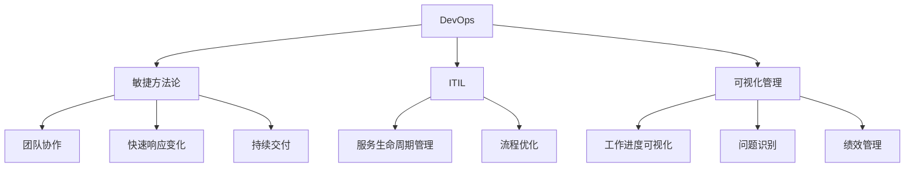

# IT运维文化：构建高效协作的团队氛围

## 1. 背景介绍
### 1.1 IT运维的重要性
在当今数字化时代,IT系统的稳定运行对于企业的生存和发展至关重要。IT运维团队肩负着确保系统高可用性、安全性和性能的重任。高效的IT运维不仅能够最大限度地减少系统故障和停机时间,还能够提高企业的生产力和竞争力。

### 1.2 团队文化的影响
然而,IT运维的成功不仅仅依赖于技术,更依赖于团队的协作和文化。一个高效协作、积极向上的团队文化能够激发团队成员的潜力,提高工作效率和质量。相反,一个缺乏沟通、互相推诿的团队文化会导致效率低下,甚至引发系统故障和安全事故。

### 1.3 构建高效协作的IT运维文化的必要性
因此,构建一个高效协作的IT运维文化对于企业的IT运维工作至关重要。本文将探讨如何从团队建设、沟通协作、流程优化等方面入手,打造一支高效协作的IT运维团队,提升企业的IT运维水平。

## 2. 核心概念与联系
### 2.1 DevOps理念
DevOps是一种强调开发(Development)与运维(Operations)之间沟通、协作与整合的文化、运动或惯例。它的目标是缩短开发周期,提高部署频率,以更快的速度交付高质量的软件。DevOps理念强调开发与运维之间的紧密协作,打破部门壁垒,共同承担起系统的稳定性和性能。

### 2.2 敏捷(Agile)方法论
敏捷方法论是一种迭代、增量式的软件开发方法。它强调团队协作、快速响应变化、持续交付有价值的软件。敏捷方法论中的一些实践,如每日站会、迭代评审等,都有助于提高团队的沟通和协作效率。IT运维团队可以借鉴敏捷方法论的理念,快速响应变化,持续改进运维流程和工具。

### 2.3 ITIL(IT Infrastructure Library)
ITIL是一套IT服务管理的最佳实践框架。它提供了一系列的流程、角色和工具,帮助IT团队更好地管理IT服务。ITIL强调服务的生命周期管理,包括服务策略、设计、转换、运营和持续改进。IT运维团队可以参考ITIL的流程和实践,优化运维流程,提高服务质量。

### 2.4 可视化管理
可视化管理是一种通过可视化的方式展示团队的工作进度、问题和绩效的管理方法。它可以帮助团队成员快速了解当前的工作状态,识别潜在的问题和瓶颈,并及时采取改进措施。在IT运维团队中,可以使用看板、仪表盘等可视化工具,实时监控系统的运行状态和性能指标。



## 3. 核心实践步骤
### 3.1 建立共同的愿景和目标
- 明确团队的使命和愿景,确保团队成员理解并认同
- 设定明确、可衡量的目标,并定期评估进展
- 鼓励团队成员参与目标制定,增强主人翁意识

### 3.2 促进开放、透明的沟通
- 建立定期的沟通机制,如每日站会、迭代评审等
- 鼓励团队成员之间的直接沟通,减少信息传递的层级
- 使用协作工具,如即时通讯、wiki等,方便信息共享

### 3.3 实施敏捷实践
- 采用敏捷的工作方式,如Scrum、看板等
- 建立跨职能团队,打破部门壁垒
- 定期举行回顾会议,持续改进工作方式

### 3.4 优化流程和工具
- 梳理和优化现有的运维流程,消除浪费和瓶颈
- 引入自动化工具,减少重复性工作,提高效率
- 建立知识库,方便知识的沉淀和共享

### 3.5 注重学习和成长
- 为团队成员提供培训和学习机会,鼓励持续学习
- 营造开放、互信的团队氛围,鼓励创新和尝试
- 建立导师制度,帮助新人快速成长

## 4. 数学模型和公式详细讲解举例说明
在IT运维领域,有一些常用的数学模型和公式可以帮助我们评估系统的可用性、可靠性和性能。下面我们以可用性计算为例,详细讲解相关的数学模型和公式。

系统可用性是指系统在需要时可以正常使用的能力,通常用可用性指标来衡量。可用性指标包括:
- MTBF(Mean Time Between Failures):平均故障间隔时间,即系统两次故障之间的平均时间。
- MTTR(Mean Time To Repair):平均修复时间,即系统发生故障后,从开始修复到修复完成的平均时间。
- 可用性(Availability) = MTBF / (MTBF + MTTR)

举个例子,假设一个系统的MTBF为100天,MTTR为1天,则该系统的可用性为:

$$ Availability = \frac{MTBF}{MTBF + MTTR} = \frac{100}{100 + 1} \approx 0.9901 $$

这意味着,该系统在任意时刻正常运行的概率为99.01%。

如果我们要提高系统的可用性,就需要提高MTBF,降低MTTR。例如,通过优化系统架构、改进故障诊断和恢复流程等手段,可以有效提高系统的可用性。

假设经过一系列优化措施,系统的MTBF提高到200天,MTTR降低到0.5天,则优化后的系统可用性为:

$$ Availability = \frac{MTBF}{MTBF + MTTR} = \frac{200}{200 + 0.5} \approx 0.9975 $$

可以看到,系统可用性从99.01%提高到了99.75%,提升了0.74个百分点。

除了可用性指标,IT运维团队还需要关注其他一些数学模型和公式,如:
- 系统响应时间:衡量系统对请求的响应速度,通常用平均响应时间、百分位响应时间等指标来衡量。
- 吞吐量:衡量系统单位时间内能够处理的请求数量。
- 资源利用率:衡量系统资源(如CPU、内存、磁盘等)的使用情况,通常用百分比来表示。

这些数学模型和公式可以帮助IT运维团队量化系统的性能和质量,为优化和改进提供依据。同时,它们也可以作为服务级别协议(SLA)的重要指标,帮助IT运维团队与业务部门建立共识,明确服务目标和责任。

## 5. 项目实践：代码实例和详细解释说明
下面我们以一个简单的Python脚本为例,演示如何使用代码来实现系统监控和告警。

```python
import psutil
import time
import smtplib
from email.mime.text import MIMEText

# 设置CPU使用率阈值和内存使用率阈值
CPU_THRESHOLD = 80
MEMORY_THRESHOLD = 90

# 设置告警邮件的发件人、收件人和SMTP服务器
SMTP_SERVER = 'smtp.example.com'
SMTP_PORT = 587
SMTP_USERNAME = 'alert@example.com'
SMTP_PASSWORD = 'your_password'
SENDER = 'alert@example.com'
RECIPIENTS = ['ops@example.com']

def send_alert_email(subject, body):
    """发送告警邮件"""
    msg = MIMEText(body)
    msg['Subject'] = subject
    msg['From'] = SENDER
    msg['To'] = ', '.join(RECIPIENTS)

    with smtplib.SMTP(SMTP_SERVER, SMTP_PORT) as server:
        server.starttls()
        server.login(SMTP_USERNAME, SMTP_PASSWORD)
        server.sendmail(SENDER, RECIPIENTS, msg.as_string())

def monitor_system():
    """监控系统资源使用情况"""
    while True:
        # 获取CPU使用率
        cpu_percent = psutil.cpu_percent()
        # 获取内存使用率
        memory_percent = psutil.virtual_memory().percent

        # 判断CPU使用率是否超过阈值
        if cpu_percent > CPU_THRESHOLD:
            subject = f'CPU Usage Alert: {cpu_percent}%'
            body = f'CPU usage exceeds threshold of {CPU_THRESHOLD}%'
            send_alert_email(subject, body)

        # 判断内存使用率是否超过阈值  
        if memory_percent > MEMORY_THRESHOLD:
            subject = f'Memory Usage Alert: {memory_percent}%'
            body = f'Memory usage exceeds threshold of {MEMORY_THRESHOLD}%'
            send_alert_email(subject, body)

        # 等待5秒后再次检查
        time.sleep(5)

if __name__ == '__main__':
    monitor_system()
```

这个脚本使用了psutil库来获取系统的CPU和内存使用情况,并设定了相应的阈值。当CPU或内存使用率超过阈值时,脚本会自动发送告警邮件给指定的收件人。

脚本的主要步骤如下:
1. 导入所需的库,包括psutil、time、smtplib和email。
2. 设置CPU使用率阈值和内存使用率阈值,以及告警邮件的发件人、收件人和SMTP服务器信息。
3. 定义send_alert_email函数,用于发送告警邮件。该函数使用smtplib和email库,通过SMTP协议发送邮件。
4. 定义monitor_system函数,用于监控系统资源使用情况。该函数通过一个无限循环,不断获取CPU和内存使用率,并判断是否超过阈值。如果超过阈值,则调用send_alert_email函数发送告警邮件。
5. 在主函数中调用monitor_system函数,启动系统监控。

这个脚本可以帮助IT运维团队及时发现系统资源使用异常,并及时采取措施,避免系统出现性能瓶颈或稳定性问题。当然,这只是一个简单的示例,在实际的IT运维工作中,还需要根据具体的系统架构和业务需求,设计更加全面、灵活的监控和告警方案。

## 6. 实际应用场景
构建高效协作的IT运维文化,可以在多个场景中发挥重要作用,例如:

### 6.1 故障处理和问题解决
当系统出现故障或问题时,高效协作的IT运维团队可以快速响应,准确定位问题根源,并及时采取有效的解决措施。通过建立清晰的问题处理流程,加强团队成员之间的沟通和协调,可以最大限度地减少故障的影响,提高系统的可用性和稳定性。

### 6.2 系统变更和发布管理
在进行系统变更和发布时,高效协作的IT运维团队可以与开发团队紧密配合,确保变更的顺利实施和系统的平稳运行。通过采用敏捷的工作方式,建立自动化的测试和发布流程,可以降低变更的风险,提高发布的效率和质量。

### 6.3 容量和性能管理
为了确保系统的性能和容量满足业务需求,高效协作的IT运维团队需要持续监控系统的关键指标,并根据数据分析结果进行优化和调整。通过建立容量规划流程,利用自动化的监控和告警工具,可以及时发现潜在的性能瓶颈,并采取预防性措施。

### 6.4 安全和合规管理
高效协作的IT运维团队在确保系统安全和合规方面也发挥着关键作用。通过与安全团队紧密合作,建立完善的安全策略和流程,并利用自动化的安全工具和审计机制,可以有效地防范安全威胁,保护企业的数据和资产。

### 6.5 服务台和用户支持
高效协作的IT运维团队可以为用户提供及时、专业的技术支持和服务。通过建立标准化的服务请求处理流程,利用自助服务平台和知识库,可以提高服务效率,减少