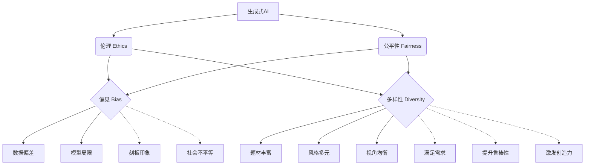

# Imagen的伦理和公平性:生成AI面临的挑战

## 1.背景介绍
### 1.1 生成式人工智能的发展现状
近年来,生成式人工智能(Generative AI)技术取得了突飞猛进的发展。从OpenAI的DALL-E、Midjourney到Google的Imagen,一系列强大的文本到图像(Text-to-Image)生成模型相继问世,展示了AI在创意生成领域的巨大潜力。这些模型能够根据自然语言描述生成逼真、多样化的图像,为创意产业和普通用户带来了全新的创作方式。
### 1.2 Imagen模型的特点和优势
作为Google发布的最新Text-to-Image生成模型,Imagen在图像质量、多样性和语义理解等方面都取得了突破性进展。相比之前的模型,Imagen生成的图像更加细节丰富、逼真自然,能够更好地理解和满足用户需求。同时,Imagen在公平性、伦理性等方面也进行了更多探索,力图减少模型输出中的偏见和风险。
### 1.3 生成式AI面临的伦理挑战
尽管Imagen等生成式AI模型展现了令人振奋的能力,但它们同时也面临着诸多伦理和公平性挑战。模型可能放大数据中固有的偏见,导致性别、种族等方面的歧视;恶意用户可能滥用模型生成违法或有害内容;版权归属、知识产权等法律问题尚待明确。这些问题如果处理不当,将极大影响生成式AI的健康发展和社会影响。因此,深入探讨Imagen等模型的伦理和公平性问题,对于推动AI向善至关重要。

## 2.核心概念与联系
### 2.1 伦理(Ethics)
伦理是关于是非、善恶、正当等道德问题的规范和思考。在人工智能语境下,伦理主要关注AI系统在设计、开发、部署和使用过程中的道德考量,旨在确保AI能够尊重人类价值观,造福人类社会。
### 2.2 公平性(Fairness) 
公平性要求AI系统能够平等对待不同群体,避免基于敏感属性(如性别、种族)产生歧视和偏见。对于生成式AI而言,公平性意味着生成的内容应当多样、均衡,不能强化刻板印象,加剧社会不平等。
### 2.3 偏见(Bias)
偏见是指系统性地偏离客观事实或道德准则。AI系统的偏见通常源自训练数据中的偏差、模型设计的局限性等。生成式AI的偏见可能体现为对特定性别、种族等的刻板化表征。
### 2.4 多样性(Diversity)
多样性是指生成内容的丰富程度,包括题材、风格、视角等方面。保障生成内容的多样性,有助于提升模型的鲁棒性和创造力,满足不同用户的需求。
### 2.5 概念之间的关系
伦理和公平性密切相关,是评估AI系统的重要维度。而偏见和缺乏多样性,则是影响生成式AI伦理性和公平性的主要问题。只有切实解决模型中的偏见,并提升生成内容的多样性,才能真正实现生成式AI的伦理、公平、负责、包容。



## 3.核心算法原理具体操作步骤
### 3.1 Imagen模型架构
Imagen采用了扩散模型(Diffusion Model)的架构,主要包括以下几个部分:

1. 文本编码器:将输入的文本描述转化为语义向量表示。
2. 图像编码器:将噪声图像转化为隐空间表示。  
3. 扩散过程:通过迭代的去噪过程,逐步将隐空间表示还原为清晰图像。
4. 解码器:将最终的隐空间表示解码为高质量图像输出。

### 3.2 去偏和增强多样性的策略

为了提升生成图像的伦理性和公平性,Imagen在算法和数据处理中采取了一系列去偏和增强多样性的策略:

1. 数据均衡:在训练数据中平衡不同群体的比例,减少数据集偏差。
2. 对比学习:通过对比不同属性的样本,学习到公平的特征表示。
3. 属性解耦:将敏感属性从图像表示中分离出来,减少属性的影响。
4. 多样性采样:在生成过程中引入随机性,鼓励生成内容的多样化。
5. 后处理校正:对生成图像进行后处理,纠正可能存在的偏见和刻板印象。

### 3.3 伦理约束和内容过滤

除了算法层面的改进,Imagen还引入了额外的伦理约束和内容过滤机制:

1. 敏感词过滤:对输入文本进行过滤,屏蔽涉及暴力、色情等敏感内容的描述。
2. 图像分析:对生成图像进行实时分析,识别和过滤掉有害、违规的内容。
3. 人工审核:对高风险、涉及敏感主题的生成请求,引入人工审核环节把关。
4. 用户反馈:建立用户反馈渠道,及时收集并处理社区报告的伦理问题。

通过以上策略的综合运用,Imagen在很大程度上缓解了生成式AI面临的伦理和公平性挑战,为负责任、有益的创意生成铺平了道路。

## 4.数学模型和公式详细讲解举例说明
### 4.1 扩散模型(Diffusion Model)原理

扩散模型是Imagen的核心组件,其数学原理可以概括为逐步去噪的过程。假设我们有一个干净的图像$x_0$,通过添加高斯噪声,我们可以得到一系列逐渐退化的图像$x_1, x_2, ..., x_T$:

$$
q(x_t|x_{t-1}) = \mathcal{N}(x_t; \sqrt{1-\beta_t} x_{t-1}, \beta_t \mathbf{I})
$$

其中$\beta_t$是噪声强度的控制参数。扩散模型的目标是学习一个逆向过程,通过去噪将$x_T$还原为$x_0$:

$$
p_\theta(x_{t-1}|x_t) = \mathcal{N}(x_{t-1}; \mu_\theta(x_t, t), \Sigma_\theta(x_t, t))
$$

$\mu_\theta$和$\Sigma_\theta$分别表示估计的均值和方差,通过神经网络参数化。模型通过最小化变分下界(VLB)来学习去噪过程:

$$
L_{VLB} = \mathbb{E}_{q(x_{0:T})} \left[ -\log \frac{p_\theta(x_{0:T})}{q(x_{1:T}|x_0)} \right]
$$

### 4.2 对比学习(Contrastive Learning)

对比学习通过最大化正样本对的相似度,最小化负样本对的相似度,来学习到公平、无偏的特征表示。给定一个样本$x$,我们首先生成其变换后的正样本$x^+$,以及若干负样本$\{x^-_i\}$。对比学习的目标函数可以表示为:

$$
L_{contrast} = -\log \frac{\exp(f(x) \cdot f(x^+) / \tau)}{\exp(f(x) \cdot f(x^+) / \tau) + \sum_i \exp(f(x) \cdot f(x^-_i) / \tau)}
$$

其中$f$是特征提取器(如CNN),$\tau$是温度超参数。通过最小化该损失函数,模型能够学习到对敏感属性不变的特征表示,从而提升生成内容的公平性。

### 4.3 属性解耦(Attribute Disentanglement)

属性解耦旨在将图像的内容特征和敏感属性分离,减少属性对生成过程的影响。假设$z$是图像的隐空间表示,$a$是敏感属性(如性别、年龄),属性解耦的目标是学习一个编码器$E$和解码器$D$,使得:

$$
z = E(x), \quad \hat{x} = D(z)
$$

同时,我们希望$z$和$a$之间的互信息$I(z;a)$尽可能小,从而实现属性的解耦:

$$
\min_{E,D} \mathcal{L}_{recon}(x, \hat{x}) + \lambda I(z;a)
$$

$\mathcal{L}_{recon}$是重构损失(如MSE),$\lambda$是平衡系数。通过优化该目标函数,模型能够学习到与属性无关的图像表示,生成更加公平、多样的图像。

## 5.项目实践：代码实例和详细解释说明

下面我们通过一个简化的PyTorch代码实例,来演示如何在生成模型中引入对比学习,提升生成内容的公平性。

```python
import torch
import torch.nn as nn
import torch.optim as optim

# 定义编码器和生成器
class Encoder(nn.Module):
    def __init__(self):
        super().__init__()
        self.conv1 = nn.Conv2d(3, 16, 3, 2, 1)
        self.conv2 = nn.Conv2d(16, 32, 3, 2, 1) 
        self.conv3 = nn.Conv2d(32, 64, 3, 2, 1)
    
    def forward(self, x):
        x = nn.ReLU()(self.conv1(x))
        x = nn.ReLU()(self.conv2(x))
        x = nn.ReLU()(self.conv3(x))
        return x
        
class Generator(nn.Module):
    def __init__(self):
        super().__init__()
        self.deconv1 = nn.ConvTranspose2d(64, 32, 4, 2, 1)
        self.deconv2 = nn.ConvTranspose2d(32, 16, 4, 2, 1)
        self.deconv3 = nn.ConvTranspose2d(16, 3, 4, 2, 1)
        
    def forward(self, z):
        z = nn.ReLU()(self.deconv1(z))
        z = nn.ReLU()(self.deconv2(z))
        x_hat = nn.Tanh()(self.deconv3(z))
        return x_hat
        
encoder = Encoder()
generator = Generator()

# 定义对比损失
def contrastive_loss(z, z_pos, z_neg, temperature=0.1):
    z = nn.functional.normalize(z, dim=1)
    z_pos = nn.functional.normalize(z_pos, dim=1)
    z_neg = nn.functional.normalize(z_neg, dim=1)
    
    pos_sim = torch.exp(torch.sum(z * z_pos, dim=1) / temperature)
    neg_sim = torch.sum(torch.exp(torch.matmul(z, z_neg.t()) / temperature), dim=1)
    loss = -torch.log(pos_sim / (pos_sim + neg_sim)).mean()
    return loss

# 训练循环
optimizer = optim.Adam(list(encoder.parameters()) + list(generator.parameters()))

for epoch in range(num_epochs):
    for x in dataloader:
        # 生成正负样本对
        x_pos = augment(x) # 数据增强生成正样本
        x_neg = sample_neg(x) # 采样负样本
        
        # 编码和生成
        z = encoder(x)
        z_pos = encoder(x_pos) 
        z_neg = encoder(x_neg)
        x_hat = generator(z)
        
        # 计算损失
        recon_loss = nn.MSELoss()(x_hat, x)
        contrast_loss = contrastive_loss(z, z_pos, z_neg)
        loss = recon_loss + lambda * contrast_loss
        
        # 反向传播和优化
        optimizer.zero_grad()
        loss.backward()
        optimizer.step()
```

以上代码中,我们定义了一个简单的编码器`Encoder`和生成器`Generator`,分别用于图像编码和解码。在训练过程中,我们首先通过数据增强和负采样生成正负样本对,然后分别对其进行编码。我们使用重构损失`recon_loss`来优化生成图像的质量,同时引入对比损失`contrast_loss`来拉近正样本对的特征