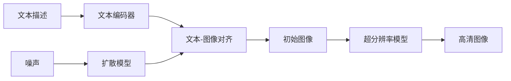

# Imagen的细粒度控制:精细化调节生成图像的细节

## 1. 背景介绍
### 1.1 文本到图像生成的发展历程
近年来,随着深度学习技术的快速发展,文本到图像(Text-to-Image)生成技术取得了突破性进展。从最初的GAN(Generative Adversarial Network)模型,到后来的DALL-E、Stable Diffusion等,AI生成图像的质量和多样性不断提升。而最近,Google发布的Imagen模型更是将这一技术推向新的高度。

### 1.2 Imagen模型的优势
Imagen模型不仅能根据文本描述生成高质量、高分辨率的逼真图像,还支持对生成图像的细粒度控制。用户可以通过附加的文本提示,精细化调节生成图像的各种细节,如物体的位置、大小、数量、颜色、纹理等。这极大地提升了用户控制生成图像的灵活性和创造力。

### 1.3 细粒度控制的重要意义
- 满足用户个性化需求:用户可按照自己的意愿定制图像细节
- 提升生成图像的多样性:通过细粒度控制生成更丰富的图像变体
- 改善人机交互体验:用户能更直观地控制AI生成的图像效果
- 拓展应用场景:如在设计、创意、教育等领域提供更强大的辅助工具

## 2. 核心概念与联系
### 2.1 扩散模型(Diffusion Model)
- 扩散模型是一类生成模型,通过迭代去噪过程学习数据分布
- 正向过程:给数据添加高斯噪声,逐步"破坏"数据
- 反向过程:学习从噪声恢复到原始数据的逆转过程
- Imagen使用级联扩散模型作为生成器

### 2.2 文本到图像跨模态对齐
- 将文本编码器(如T5)和图像编码器(如ViT)对齐到共同的潜在空间
- 文本编码捕捉语义信息,图像编码捕捉视觉特征
- 对齐使得文本描述和图像在语义层面建立关联

### 2.3 自回归语言模型
- 自回归语言模型可以根据上下文生成连贯的文本
- Imagen使用自回归模型(如T5)作为文本编码器
- 支持输入任意长度的文本描述,增强表达能力

### 2.4 超分辨率模型
- 超分辨率模型可将低分辨率图像放大为高分辨率
- Imagen使用级联的超分辨率模型提升生成图像的质量
- 逐步将64x64的初始图像放大到1024x1024

### 2.5 概念关系图


## 3. 核心算法原理与操作步骤
### 3.1 基于扩散模型的图像生成
- 输入:文本描述 t 和随机噪声 z
- 文本编码器将 t 编码为语义向量 c
- 初始化潜变量 x0 为高斯噪声
- For i = 1 to n:
  - 根据 xi-1 和 c 预测噪声 ε 
  - 更新 xi = xi-1 - α·ε
- 输出 xn 作为生成的图像

### 3.2 文本编码器
- 使用T5模型作为文本编码器
- 将输入文本t切分为子词tokens
- 通过T5的自注意力层提取上下文信息
- 取T5最后一层输出作为文本特征c

### 3.3 图像编码器
- 使用ViT(Vision Transformer)作为图像编码器  
- 将图像分割为固定大小的patches
- 通过ViT的自注意力层提取patches间的全局信息
- 取ViT最后一层输出作为图像特征v

### 3.4 文本-图像对齐
- 将文本特征c和图像特征v映射到共同的d维潜在空间
- 使用对比学习(Contrastive Learning)进行对齐学习
- 最大化正样本对(c,v)的相似度,最小化负样本对的相似度
- 使用cosine相似度度量特征向量间的距离

### 3.5 超分辨率模型
- 使用级联的超分辨率模型提升图像分辨率
- 低分辨率图像通过上采样和卷积层逐步放大
- 引入注意力机制和残差连接改进细节生成
- 最终输出高分辨率(如1024x1024)的图像

## 4. 数学模型与公式详解
### 4.1 扩散模型的数学形式化
扩散模型通过马尔可夫链对数据分布进行建模。正向过程为:

$q(x_t|x_{t-1}) = \mathcal{N}(x_t; \sqrt{1-\beta_t} x_{t-1}, \beta_t \mathbf{I})$

其中 $\beta_t$ 为噪声系数。反向过程为:  

$p_\theta(x_{t-1}|x_t) = \mathcal{N}(x_{t-1}; \mu_\theta(x_t, t), \sigma_t^2 \mathbf{I})$

其中 $\mu_\theta$ 为神经网络预测的均值。训练目标是优化变分下界(ELBO):

$\mathbb{E}_{q(x_{1:T}|x_0)} \big[\log \frac{p_\theta(x_{0:T})}{q(x_{1:T}|x_0)}\big] \leq \log p_\theta(x_0)$

### 4.2 文本-图像对齐的对比学习
对比学习通过拉近正样本对的距离,推开负样本对的距离,达到对齐的目的。损失函数为:

$\mathcal{L} = -\log \frac{\exp(\text{sim}(c,v)/\tau)}{\sum_{v'\in\mathcal{B}}\exp(\text{sim}(c,v')/\tau)}$

其中 $\text{sim}(c,v)=c^Tv/(\|c\|\|v\|)$ 为归一化的点积相似度,$\tau$ 为温度超参数。

### 4.3 超分辨率的数学原理
设 $I^{LR}$ 为低分辨率输入,$I^{SR}$ 为超分辨率输出,超分模型 $f$ 的目标是最小化重建损失:

$\mathcal{L}_{SR} = \|I^{HR} - I^{SR}\|_1 = \|I^{HR} - f(I^{LR})\|_1$

其中 $I^{HR}$ 为高分辨率的真实图像。上采样可通过插值或转置卷积实现。

## 5. 项目实践:代码实例与详解
下面以PyTorch为例,展示Imagen的核心模块的简化实现:

```python
import torch
import torch.nn as nn

# 文本编码器
class TextEncoder(nn.Module):
    def __init__(self, vocab_size, embed_dim, num_heads):
        super().__init__()
        self.embedding = nn.Embedding(vocab_size, embed_dim)
        self.transformer = nn.TransformerEncoder(
            nn.TransformerEncoderLayer(embed_dim, num_heads), 
            num_layers=6
        )
        
    def forward(self, x):
        x = self.embedding(x)
        x = self.transformer(x)
        return x.mean(dim=1)  # 平均池化为文本特征
        
# 图像编码器
class ImageEncoder(nn.Module):
    def __init__(self, image_size, patch_size, embed_dim, num_heads):
        super().__init__()
        self.patch_embed = nn.Conv2d(3, embed_dim, patch_size, stride=patch_size)
        self.transformer = nn.TransformerEncoder(
            nn.TransformerEncoderLayer(embed_dim, num_heads),
            num_layers=6
        )
        
    def forward(self, x):
        x = self.patch_embed(x)  # 分割为patches
        x = x.flatten(2).transpose(1, 2)
        x = self.transformer(x)
        return x.mean(dim=1)  # 平均池化为图像特征
        
# 扩散模型        
class DiffusionModel(nn.Module):
    def __init__(self, image_size, num_channels, num_timesteps):
        super().__init__()
        self.image_size = image_size
        self.num_channels = num_channels
        self.num_timesteps = num_timesteps
        self.conv1 = nn.Conv2d(num_channels, 64, 3, padding=1)
        self.conv2 = nn.Conv2d(64, 64, 3, padding=1)
        self.conv3 = nn.Conv2d(64, num_channels, 3, padding=1)
        
    def forward(self, x, t, text_emb):
        # 将时间步t和文本特征text_emb与图像特征拼接
        t_emb = t.view(-1, 1, 1, 1).expand(-1, -1, x.shape[2], x.shape[3])
        text_emb = text_emb.view(-1, -1, 1, 1).expand(-1, -1, x.shape[2], x.shape[3])
        x = torch.cat([x, t_emb, text_emb], dim=1)
        
        x = self.conv1(x)
        x = nn.ReLU()(x)
        x = self.conv2(x)   
        x = nn.ReLU()(x)
        x = self.conv3(x)
        return x
        
# 超分辨率模型
class SRModel(nn.Module):
    def __init__(self, in_channels, out_channels, scale_factor):
        super().__init__()
        self.conv1 = nn.Conv2d(in_channels, 64, 3, padding=1)
        self.conv2 = nn.Conv2d(64, 64, 3, padding=1)
        self.conv3 = nn.Conv2d(64, out_channels, 3, padding=1)
        self.upscale = nn.Upsample(scale_factor=scale_factor)
        
    def forward(self, x):
        x = self.upscale(x)
        x = self.conv1(x)
        x = nn.ReLU()(x)
        x = self.conv2(x)
        x = nn.ReLU()(x) 
        x = self.conv3(x)
        return x
```

以上代码分别定义了文本编码器`TextEncoder`、图像编码器`ImageEncoder`、扩散模型`DiffusionModel`和超分辨率模型`SRModel`。

- `TextEncoder`使用Transformer提取文本特征
- `ImageEncoder`使用ViT提取图像patch特征
- `DiffusionModel`根据文本特征和时间步预测噪声
- `SRModel`通过上采样和卷积层提升图像分辨率

实际的Imagen模型在此基础上还有更多的细节优化,如更大的模型尺寸、更深的网络结构、更多的训练技巧等,以进一步提升生成图像的质量和多样性。

## 6. 实际应用场景
Imagen的细粒度控制能力可应用于多个领域:

- 创意设计:根据用户描述生成个性化的图像素材,如Logo、海报、插画等
- 辅助绘画:提供参考图像和创作灵感,帮助艺术家快速构思和草稿
- 游戏开发:自动生成游戏场景、角色、道具等素材,加速游戏内容创建  
- 电影特效:根据剧本生成概念图,辅助分镜头设计和特效制作
- 时尚设计:根据文字描述生成服装、配饰等设计草图,激发设计灵感
- 建筑设计:根据需求描述生成建筑外观、室内布局等设计方案
- 广告营销:根据文案自动生成产品图片、广告创意等,提高制作效率
- 教育培训:将知识点可视化为图像,帮助学生直观理解抽象概念

## 7. 工具与资源推荐
- Hugging Face的[Diffusers库](https://github.com/huggingface/diffusers):实现了多种扩散模型,方便研究和应用
- [Stable Diffusion](https://stability.ai/blog/stable-diffusion-public-release):基于Latent Diffusion Model的开源图像生成模型
- [DALL·E 2](https://openai.com/dall-e-2/):OpenAI开发的强大的文本到图像生成系统
- [Midjourney](https://www.midjourney.com/):提供基于文本生成艺术图像的商业化服务
- [Replicate](https://replicate.com/):云平台,支持运行多种图像生成模型
- [Prompt Engineering Guide](https://github.com/dair-ai/Prompt-Engineering-Guide):提示工程指南,教你如何设计出优质的文本提示

## 8. 总结:未来发展趋势与挑战
Imagen代表了文本到图像生成技术的新高度,其细粒