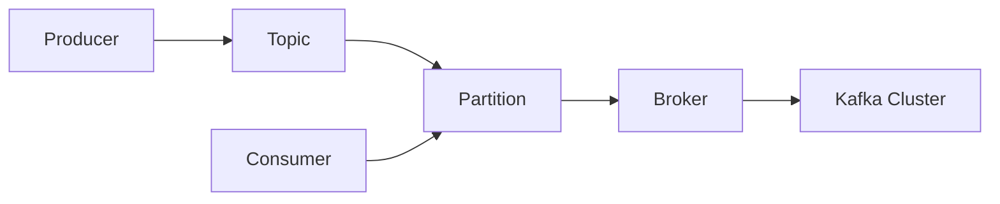

# KafkaGroup：Kafka的未来发展与挑战

## 1.背景介绍
### 1.1 Kafka的起源与发展历程
Apache Kafka最初由LinkedIn公司开发,用作LinkedIn的活动流和运营数据处理管道的基础。Kafka于2011年初开源,并于2012年10月23日由Apache Incubator孵化出站,迅速成为Apache顶级开源项目。

### 1.2 Kafka在大数据生态系统中的地位
在当前大数据生态系统中,Kafka已经成为了事实上的标准。Kafka常常被用作数据管道,充当数据源与数据处理层之间的缓冲。Kafka凭借其优异的性能、可靠性和可扩展性,在数据密集型应用中得到了广泛应用。

### 1.3 Kafka面临的机遇与挑战
随着大数据和流处理的蓬勃发展,Kafka面临着前所未有的机遇。越来越多的企业开始依赖Kafka构建实时的数据管道和流处理应用。与此同时,Kafka也面临着诸多挑战,例如如何进一步提升性能,简化运维,改善与其他系统的集成等。

## 2.核心概念与关联
### 2.1 Producer与Consumer
- Producer:消息生产者,负责将消息发布到Kafka的topic中。
- Consumer:消息消费者,负责从Kafka的topic中拉取消息并进行处理。
Producer与Consumer是Kafka的核心概念,它们通过Kafka实现了生产者与消费者的解耦。

### 2.2 Topic与Partition
- Topic:Kafka中的消息以topic为单位进行组织。每个topic可以被认为是一个消息队列。
- Partition:为了实现扩展性,一个非常大的topic可以分布到多个broker上,一个topic可以分为多个partition,每个partition是一个有序的队列。
Topic与Partition是Kafka实现高吞吐、可扩展的关键。

### 2.3 Broker与集群
- Broker:Kafka集群包含一个或多个服务器,这种服务器被称为broker。
- 集群:Kafka通过多个broker组成一个集群,并通过Zookeeper进行协调。
Broker与集群保证了Kafka的高可用性与可靠性。

### 2.4 Mermaid流程图
下面是Kafka核心概念的Mermaid流程图:


## 3.核心算法原理与具体操作步骤
### 3.1 消息的发布与订阅
1. Producer将消息发布到指定的Topic。
2. Topic根据分区规则将消息分配到不同的Partition。
3. Consumer通过订阅Topic来消费消息。
4. Consumer根据消费者组的概念,实现消息的广播与单播。

### 3.2 消息的存储与索引
1. Broker接收到Producer发来的消息后,将其追加到Partition的本地磁盘上。  
2. 消息写入磁盘的同时,Broker还会建立索引文件,索引文件中保存了每个消息的offset。
3. Consumer通过offset来定位和拉取消息。

### 3.3 消息的复制与同步
1. 每个Topic的Partition都有一个leader和多个follower。
2. Producer和Consumer只与leader交互,follower负责从leader拉取消息。 
3. follower拉取消息后会写入本地磁盘,并向leader发送ACK。
4. leader收到所有ISR中的follower的ACK后,向Producer发送ACK,认为消息已经commit。

### 3.4 再均衡与高可用
1. 当有新的Consumer加入或者离开Consumer Group时,会触发再均衡。
2. 在再均衡过程中,Kafka会重新分配Partition的消费权。
3. 当leader失效时,Kafka会从ISR中选举新的leader,保证高可用。

## 4.数学模型与公式详解
### 4.1 吞吐量估算
Kafka的吞吐量可以用下面的公式来估算:

$Throughput = \frac{BatchSize * ProducerNum}{RTT + BatchDuration}$

其中:
- BatchSize:每个批次的消息大小
- ProducerNum:并发的Producer数量  
- RTT:网络的往返时延
- BatchDuration:每个批次的处理时间

### 4.2 消息的可靠性
Kafka通过ISR和ACK机制来保证消息的可靠性。可靠性可以用下面的公式来表示:

$Reliability = 1 - (1 - p)^n$

其中:
- p:每个副本写入成功的概率
- n:副本的个数

可以看出,增加副本数可以指数级地提高可靠性。

### 4.3 消息的延迟
Kafka的端到端延迟可以用下面的公式来表示:

$Latency = RTT + BatchDuration + ReplicationDuration + PollInterval$

其中:
- RTT:网络的往返时延
- BatchDuration:每个批次的处理时间
- ReplicationDuration:消息在副本之间同步的时间
- PollInterval:Consumer拉取消息的间隔

减小BatchSize、PollInterval,增加并发度,都可以减小延迟。

## 5.项目实践：代码实例与详解
下面是一个简单的Kafka Producer和Consumer的代码实例。

### 5.1 Producer代码
```java
public class SimpleProducer {
    public static void main(String[] args) {
        Properties props = new Properties();
        props.put("bootstrap.servers", "localhost:9092");
        props.put("key.serializer", "org.apache.kafka.common.serialization.StringSerializer");
        props.put("value.serializer", "org.apache.kafka.common.serialization.StringSerializer");
        
        Producer<String, String> producer = new KafkaProducer<>(props);
        for (int i = 0; i < 10; i++) {
            producer.send(new ProducerRecord<>("my-topic", Integer.toString(i), "Message: " + i));
        }
        producer.close();
    }
}
```

这个例子创建了一个Kafka Producer,并向名为"my-topic"的Topic发送了10条消息。

### 5.2 Consumer代码
```java
public class SimpleConsumer {
    public static void main(String[] args) {
        Properties props = new Properties();
        props.setProperty("bootstrap.servers", "localhost:9092");
        props.setProperty("group.id", "test");
        props.setProperty("enable.auto.commit", "true");
        props.setProperty("key.deserializer", "org.apache.kafka.common.serialization.StringDeserializer");
        props.setProperty("value.deserializer", "org.apache.kafka.common.serialization.StringDeserializer");
        KafkaConsumer<String, String> consumer = new KafkaConsumer<>(props);
        
        consumer.subscribe(Arrays.asList("my-topic"));
        while (true) {
            ConsumerRecords<String, String> records = consumer.poll(Duration.ofMillis(100));
            for (ConsumerRecord<String, String> record : records)
                System.out.printf("offset = %d, key = %s, value = %s%n", record.offset(), record.key(), record.value());
        }
    }
}
```

这个例子创建了一个Kafka Consumer,订阅了名为"my-topic"的Topic,并持续地拉取和打印消息。

## 6.实际应用场景
Kafka凭借其优异的性能和可扩展性,在许多实际场景中得到了应用,例如:

### 6.1 日志聚合
许多公司使用Kafka收集各种服务的日志,通过Kafka以统一的格式将日志发送到中央系统,例如Hadoop或者专门的日志搜索系统如Elasticsearch。

### 6.2 流处理
很多Kafka的使用场景都涉及到对实时数据的处理。这包括网站活动跟踪、指标监控、日志聚合等。Kafka常常与Storm、Spark Streaming等流处理框架集成,构建实时的流数据处理管道。

### 6.3 事件溯源
事件溯源是一种应用设计模式,它将应用的状态变化建模为一系列事件。这些事件可以被持久化,并在需要时重放。Kafka可以作为事件的存储和分发平台,帮助实现事件溯源模式。

### 6.4 物联网
在物联网应用中,Kafka常常被用作设备数据的收集中心。设备产生的海量数据可以被发送到Kafka,然后由流处理程序或者批处理程序进行消费和分析。

## 7.工具与资源推荐
### 7.1 Kafka官方文档
Kafka的官方文档是学习和使用Kafka的最权威资料。文档详细介绍了Kafka的架构、API、配置等各个方面。
链接:https://kafka.apache.org/documentation/

### 7.2 Confluent Blog
Confluent是Kafka的主要贡献者,其博客有许多关于Kafka的深度文章和最佳实践分享。
链接:https://www.confluent.io/blog/ 

### 7.3 Kafka Streams
Kafka Streams是Kafka官方的流处理库。它提供了一种简单而强大的方式来编写流处理应用。
链接:https://kafka.apache.org/documentation/streams/

### 7.4 Kafka Connect
Kafka Connect是Kafka官方的数据集成框架。它可以方便地把数据导入和导出Kafka,大大简化了Kafka与其他系统的集成。
链接:https://kafka.apache.org/documentation/#connect

## 8.总结：未来发展趋势与挑战
### 8.1 云原生Kafka
随着云计算的发展,越来越多的公司开始在云上部署Kafka。各大云厂商也开始提供托管的Kafka服务。如何更好地支持云环境,如何降低运维成本,将是Kafka未来的一个重要方向。

### 8.2 Kafka的SQL化
Kafka传统的使用方式需要编写Java或Scala代码,学习曲线较陡。为了让更多的人能够使用Kafka,SQL化是一个重要的趋势。Kafka的SQL化可以让用户用类似SQL的语言来查询和处理Kafka中的数据,大大降低了使用门槛。

### 8.3 Kafka与机器学习
机器学习,特别是实时机器学习,正在成为Kafka的一个重要应用场景。如何更好地支持机器学习框架,如何优化Kafka以满足机器学习的需求,将是一个值得探索的方向。

### 8.4 安全与治理
随着Kafka在企业中的广泛应用,安全与治理变得越来越重要。如何保证数据的安全,如何对数据进行有效的治理,如何满足合规性要求,都是Kafka需要解决的问题。

## 9.附录：常见问题与解答
### 9.1 Kafka的数据会丢失吗?
Kafka通过副本机制保证了数据的高可靠性。只要副本数设置得当,且ISR机制工作正常,数据基本不会丢失。

### 9.2 Kafka的数据可以保存多久?
Kafka的数据保存时间可以通过`log.retention.hours`参数设置。你可以根据自己的需求,设置合适的保存时间。

### 9.3 Kafka的消息是否有序?
在同一个Partition内,Kafka的消息是有序的。但是在不同的Partition之间,消息是无序的。如果需要全局有序,可以使用单个Partition,或者自己在应用层面做排序。

### 9.4 Kafka的吞吐量有多高?
Kafka的吞吐量非常高,可以达到每秒数百万条消息。具体的吞吐量取决于硬件配置、网络环境、消息大小等多个因素。一般来说,Kafka的吞吐量远高于大多数消息队列系统。

作者：禅与计算机程序设计艺术 / Zen and the Art of Computer Programming