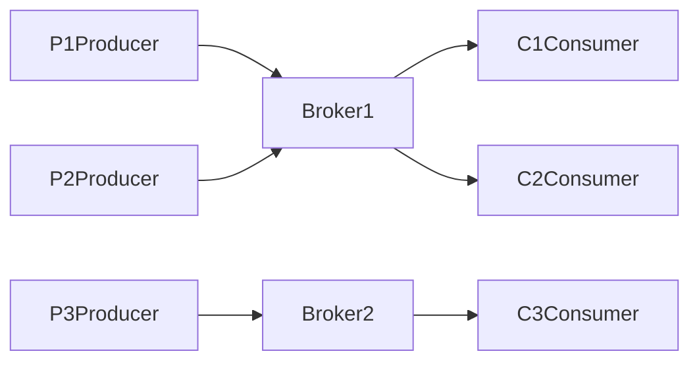
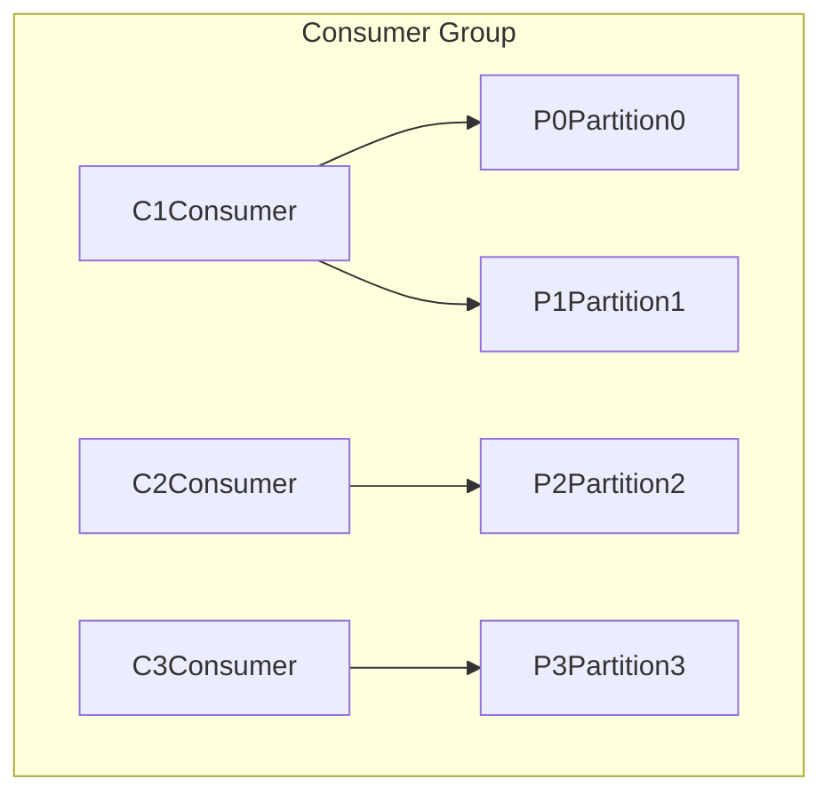

# KafkaGroup：扩展Kafka的功能与性能

## 1.背景介绍
### 1.1 Kafka的基本概念与架构
#### 1.1.1 Kafka是什么
Kafka是一个分布式的流处理平台，它可以发布和订阅消息流，并且能够容错地持久化存储这些消息流。Kafka最初由LinkedIn公司开发，现在是Apache基金会的顶级开源项目之一。

#### 1.1.2 Kafka的核心组件
Kafka主要由以下几个核心组件构成：

- Producer：消息生产者，向Kafka发送消息。 
- Consumer：消息消费者，从Kafka读取消息。
- Broker：Kafka集群中的服务器，负责存储和转发消息。
- Topic：消息的类别，生产者发送消息到特定的Topic，消费者从特定的Topic读取消息。
- Partition：Topic的分区，一个Topic可以分为多个Partition，以实现负载均衡和水平扩展。

#### 1.1.3 Kafka的基本架构
Kafka采用发布-订阅模式，生产者将消息发布到特定的Topic，消费者订阅感兴趣的Topic并消费其中的消息。Kafka的基本架构如下图所示：



### 1.2 Kafka面临的挑战
#### 1.2.1 吞吐量瓶颈
随着数据量的增长和业务的发展，Kafka面临着吞吐量瓶颈的挑战。单个Broker的吞吐能力有限，难以满足海量消息的高吞吐需求。

#### 1.2.2 消费者扩展性问题
当有大量消费者同时消费同一个Topic时，Kafka需要为每个消费者维护状态信息，导致Broker端的资源开销增加，影响整体性能。此外，大量消费者的offset提交也会给Broker带来压力。

#### 1.2.3 消息顺序性保证
在某些场景下，消息的顺序至关重要，例如数据库binlog同步等。而Kafka默认只保证Partition内消息有序，无法保证全局有序，给应用开发带来不便。

### 1.3 KafkaGroup的提出
为了应对上述挑战，KafkaGroup应运而生。KafkaGroup是对Kafka进行功能和性能扩展的一套方案，主要包括以下几个方面：

- 引入消费者分组机制，将消费者划分为不同的Group，每个Group独立消费，减轻单个Group的压力。
- 支持自定义分区分配策略，允许不同的消费模式，满足不同业务场景的需求。
- 优化offset管理，引入Group Coordinator角色，集中管理offset，减轻Broker压力。
- 增强消息有序性保证，支持局部有序和全局有序两种模式。

## 2.核心概念与关联
### 2.1 消费者分组(Consumer Group)
#### 2.1.1 消费者分组的概念
消费者分组是指将多个消费者划分到同一个组中，组内消费者协同消费Topic的数据。每个消费者组都有一个唯一的GroupId作为标识。

#### 2.1.2 消费者组与分区的对应关系
在一个消费者组内，每个分区只能被一个消费者消费。如果消费者数量超过分区数，则有部分消费者会闲置。一个消费者可以消费多个分区。典型的消费者组与分区对应关系如下：



### 2.2 再均衡(Rebalance)
#### 2.2.1 再均衡的触发条件
当消费者组内成员发生变化时（有消费者加入或离开组），就会触发再均衡。再均衡会重新调整消费者与分区的对应关系，以实现负载均衡。

#### 2.2.2 再均衡的过程
再均衡主要分为以下几个步骤：

1. 消费者向Group Coordinator发送JoinGroup请求，请求加入组。
2. Group Coordinator选择一个消费者作为Leader。
3. Leader根据分区分配策略计算分配方案。
4. Leader将分配方案发送给Group Coordinator。
5. Group Coordinator将分配方案下发给各个消费者。
6. 消费者根据分配方案进行消费。

### 2.3 位移(Offset)管理
#### 2.3.1 位移的概念
位移是指消息在分区中的偏移量，用于记录消费者消费进度。每个消费者组维护自己的位移信息。

#### 2.3.2 位移的提交方式
消费者消费完消息后，需要向Kafka提交位移，以避免重复消费。位移提交方式主要有以下两种：

- 自动提交：设置enable.auto.commit=true，让Kafka自动定期提交位移。
- 手动提交：应用代码中显式调用commitSync/commitAsync方法提交位移。

#### 2.3.3 位移的存储
Kafka支持将位移存储在Zookeeper或Kafka内部主题__consumer_offsets中。Kafka内部主题性能更优，不受Zookeeper单点限制，是更推荐的方式。

### 2.4 分区分配策略
#### 2.4.1 Range策略
Range是Kafka默认的分区分配策略。它按照消费者的哈希值大小顺序划分分区的连续范围，每个消费者分配一个范围内的分区。

#### 2.4.2 RoundRobin策略
RoundRobin策略按照消费者的哈希值大小顺序依次轮流分配分区，尽量保证分配的均衡性。适合消费者数量变化不频繁的场景。

#### 2.4.3 Sticky策略
Sticky是Kafka后来新增的策略，目标是在满足平衡性的同时，最大限度地减少分区的迁移。它综合考虑了消费者上次的分配结果，尽量避免不必要的分区迁移。

## 3.核心算法原理与操作步骤
### 3.1 消费者组的协调
#### 3.1.1 加入组的流程
1. 消费者向Kafka Broker发送FindCoordinator请求，查找负责该Group的Coordinator。
2. Broker返回Coordinator的信息。
3. 消费者向Coordinator发送JoinGroup请求，请求加入组。
4. Coordinator在收到所有成员的JoinGroup请求后，从中选出一个消费者作为Leader。
5. Coordinator将Leader的信息返回给所有成员。

#### 3.1.2 同步组的流程
1. Leader消费者根据分区分配策略，计算每个消费者的分区分配方案。
2. Leader将分配方案发送给Coordinator。
3. Coordinator将分配方案下发给各个消费者。
4. 消费者根据分配方案进行消费。

#### 3.1.3 离开组的流程
1. 消费者向Coordinator发送LeaveGroup请求。
2. Coordinator将该消费者从组中移除，并触发再均衡。

### 3.2 分区分配算法
#### 3.2.1 Range分配算法
1. 根据Topic的分区数和消费者数，计算每个消费者平均分配的分区数。
2. 根据消费者的哈希值大小顺序，为每个消费者分配一段连续的分区范围。
3. 如果有剩余的分区，则依次分配给哈希值较小的消费者。

#### 3.2.2 RoundRobin分配算法
1. 根据消费者的哈希值大小顺序，依次轮流分配分区。
2. 直到所有分区都被分配完毕。

#### 3.2.3 Sticky分配算法
1. 获取消费者组的历史分配信息。
2. 计算最小分区迁移数量的分配方案。
3. 如果有新的消费者加入，则从原有消费者中平均划分一部分分区给新消费者。
4. 如果有消费者离开，则将其分区平均分配给剩余消费者。

### 3.3 位移提交与同步
#### 3.3.1 位移提交的流程
1. 消费者在消费完一批消息后，调用commitSync/commitAsync方法提交位移。
2. 消费者将位移信息发送给Coordinator。
3. Coordinator将位移信息持久化到__consumer_offsets主题。

#### 3.3.2 位移同步的流程
1. Coordinator定期将各个消费者提交的位移信息进行汇总。
2. Coordinator将汇总后的位移信息广播给所有消费者。
3. 消费者根据同步后的位移信息校准自己的消费进度。

## 4.数学模型与公式详解
### 4.1 消息投递量估算
假设有m个生产者，每秒生成n条消息，发送到k个分区，则单个分区每秒接收的消息数为：

$$
\frac{m \times n}{k}
$$

假设有p个消费者，每秒处理q条消息，则单个消费者每秒需要处理的消息数为：

$$
\frac{m \times n}{p}
$$

为了避免消息堆积，需要满足：

$$
\frac{m \times n}{p} \leq q
$$

即：

$$
p \geq \frac{m \times n}{q}
$$

### 4.2 消费者组内负载均衡
假设有n个分区，m个消费者，则单个消费者平均分配到的分区数为：

$$
\frac{n}{m}
$$

在Range分配策略下，第i个消费者分配到的分区范围为：

$$
[\lfloor \frac{i \times n}{m} \rfloor, \lfloor \frac{(i+1) \times n}{m} \rfloor)
$$

其中$\lfloor x \rfloor$表示对x向下取整。

在RoundRobin分配策略下，第i个消费者分配到的分区编号为：

$$
\{j | j \equiv i \pmod{m}, j \in [0, n)\}
$$

其中$a \equiv b \pmod{c}$表示a与b模c同余。

### 4.3 位移提交与同步频率
假设消费者每处理k条消息提交一次位移，平均每条消息的处理时间为t，则位移提交间隔为：

$$
k \times t
$$

为了避免重复消费，位移提交间隔不宜过大。但过于频繁的提交也会增加开销。一般建议根据消息的重要程度和处理时间来设置合理的提交间隔，例如：

$$
k = \begin{cases}
1, & \text{if } t > 100ms \\
10, & \text{if } 10ms \leq t \leq 100ms \\
100, & \text{if } t < 10ms
\end{cases}
$$

## 5.代码实例与详解
### 5.1 生产者示例
```java
// 创建生产者配置
Properties props = new Properties();
props.put("bootstrap.servers", "localhost:9092");
props.put("key.serializer", "org.apache.kafka.common.serialization.StringSerializer");
props.put("value.serializer", "org.apache.kafka.common.serialization.StringSerializer");

// 创建生产者实例
KafkaProducer<String, String> producer = new KafkaProducer<>(props);

// 发送消息
for (int i = 0; i < 100; i++) {
    ProducerRecord<String, String> record = new ProducerRecord<>("my-topic", "message-" + i);
    producer.send(record);
}

// 关闭生产者
producer.close();
```

上述代码创建了一个Kafka生产者，并发送100条消息到名为"my-topic"的主题。其中：

- bootstrap.servers指定Kafka Broker的地址。
- key.serializer和value.serializer指定消息的键和值的序列化器。
- 使用KafkaProducer.send()方法发送消息，send()方法返回一个Future对象，可以同步等待消息发送结果。

### 5.2 消费者示例
```java
// 创建消费者配置
Properties props = new Properties();
props.put("bootstrap.servers", "localhost:9092");
props.put("group.id", "my-group");
props.put("enable.auto.commit", "true");
props.put("auto.commit.interval.ms", "1000");
props.put("key.deserializer", "org.apache.kafka.common.serialization.StringDeserializer");
props.put("value.deserializer", "org.apache.kafka.common.serialization.StringDeserializer");

// 创建消费者实例
KafkaConsumer<String, String> consumer = new KafkaConsumer<>(props);

// 订阅主题
consumer.subscribe(Arrays.asList("my-topic"));

// 消费消息
while (true) {
    ConsumerRecords<String, String> records = consumer.poll(Duration.ofMillis(100));
    for (ConsumerRecord<String, String> record : records) {
        System.out.printf("offset = %d, key = %s, value = %s%n", record.offset(), record.key