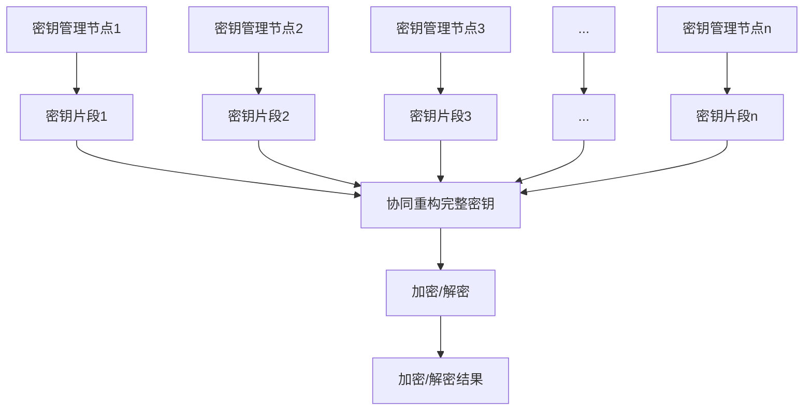

# Knox原理与代码实例讲解

## 1.背景介绍

在当今数据安全和隐私保护日益受到重视的时代,Knox作为一种新兴的加密技术,正在引起广泛关注。Knox旨在解决传统加密方案中存在的一些缺陷,为数据提供更加全面和可靠的保护。

Knox的核心思想是将数据分割成多个部分,并将每个部分单独加密。这种分散式加密方法可以有效防止数据被完全解密,即使其中一部分被破解,其余部分仍然保持加密状态。此外,Knox还引入了一种新颖的密钥管理机制,使得密钥的生成、分发和更新更加安全可靠。

Knox技术的出现为数据安全领域带来了新的契机,它可以广泛应用于云存储、金融交易、医疗健康等对数据隐私和安全性要求极高的领域。本文将深入探讨Knox的核心原理、算法实现、应用场景等,为读者提供全面的Knox技术解析。

## 2.核心概念与联系

### 2.1 分散式加密

分散式加密是Knox技术的核心概念,它将待加密数据分割成多个部分,每个部分单独加密。具体来说,假设原始数据为D,将其分割为n个部分D1,D2,...,Dn,然后对每个部分Di进行加密,得到加密后的数据片段Ci。最终,原始数据D的加密结果是所有加密片段的集合{C1,C2,...,Cn}。

```mermaid
graph TD
    A[原始数据D] --> B[分割]
    B --> C1[D1]
    B --> C2[D2]
    B --> C3[...]
    B --> Cn[Dn]
    C1 --> D1[加密]
    C2 --> D2[加密]
    C3 --> D3[加密]
    Cn --> Dn[加密]
    D1 --> E1[C1]
    D2 --> E2[C2]
    D3 --> E3[...]
    Dn --> En[Cn]
    E1 & E2 & E3 & En --> F[加密结果集合{C1,C2,...,Cn}]
```

分散式加密的优势在于,即使其中一个或几个加密片段被破解,攻击者也无法获取完整的原始数据,因为其他未被破解的片段仍然保持加密状态。这大大提高了数据的安全性和隐私性。

### 2.2 密钥管理

密钥管理是加密技术中一个至关重要的环节。传统的密钥管理方式存在一些缺陷,例如密钥分发过程中容易被窃取、密钥更新困难等。Knox采用了一种新颖的密钥管理机制,以确保密钥的安全性和可控性。

在Knox中,密钥的生成、分发和更新都采用了分散式的方法。首先,系统会生成多个密钥片段,每个片段由不同的密钥管理节点持有。当需要对数据进行加密或解密时,这些节点会协同工作,重构出完整的密钥。密钥片段的数量和分布可以根据安全需求进行调整,从而实现更高的安全性和容错能力。

此外,Knox还引入了密钥轮换机制,定期更新密钥以防止密钥被破解。在密钥轮换过程中,新旧密钥会同时存在一段时间,确保数据的连续可用性。



### 2.3 访问控制

为了进一步增强数据的安全性,Knox采用了基于属性的访问控制(Attribute-Based Access Control,ABAC)机制。在ABAC中,每个用户和数据资源都被赋予一组属性,用户只有具备特定的属性才能访问相应的数据资源。

Knox将ABAC机制与分散式加密相结合,实现了细粒度的数据访问控制。具体来说,原始数据在分割加密之前,会根据不同的访问策略进行逻辑划分。每个数据片段对应一个访问策略,只有满足该策略的用户才能获取和解密该片段。通过这种方式,Knox可以精确控制用户对数据的访问权限,从而实现数据的安全共享和协作。

```mermaid
graph TD
    A[原始数据D] --> B[逻辑划分]
    B --> C1[D1(策略1)]
    B --> C2[D2(策略2)]
    B --> C3[...]
    B --> Cn[Dn(策略n)]
    C1 --> D1[加密]
    C2 --> D2[加密]
    C3 --> D3[加密]
    Cn --> Dn[加密]
    D1 --> E1[C1]
    D2 --> E2[C2]
    D3 --> E3[...]
    Dn --> En[Cn]
    E1 & E2 & E3 & En --> F[加密结果集合{C1,C2,...,Cn}]
    G[用户属性] --> H[访问控制]
    H --> I[允许访问的数据片段]
    I --> J[解密]
    J --> K[可访问数据]
```

## 3.核心算法原理具体操作步骤

Knox技术的核心算法包括数据分割、加密、密钥管理和访问控制等多个环节,下面将详细介绍每个环节的具体操作步骤。

### 3.1 数据分割

1) 确定分割参数:包括分割的数据块数量n和分割算法。
2) 对原始数据D进行分割,得到n个数据块D1,D2,...,Dn。
3) 可选:对每个数据块进行编码,增加冗余信息,提高容错能力。

### 3.2 加密

1) 生成n个密钥片段K1,K2,...,Kn,并分发给不同的密钥管理节点。
2) 使用协同密钥重构算法,从密钥管理节点获取密钥片段,重构出完整密钥K。
3) 使用对称加密算法(如AES)对每个数据块Di进行加密,得到加密块Ci=Enc(K,Di)。

### 3.3 密钥管理

1) 密钥生成:使用安全的随机数生成器生成主密钥,并将其分割为n个密钥片段。
2) 密钥分发:将每个密钥片段分发给对应的密钥管理节点。
3) 密钥重构:当需要对数据进行加密或解密时,密钥管理节点使用协同密钥重构算法重构出完整密钥。
4) 密钥轮换:定期更新密钥,旧密钥和新密钥在一段时间内并存,确保数据可用性。

### 3.4 访问控制

1) 属性分配:为用户和数据资源分配相应的属性。
2) 策略制定:根据安全需求制定访问策略,确定哪些属性组合可以访问哪些数据资源。
3) 数据逻辑划分:根据访问策略,将原始数据逻辑划分为多个部分,每个部分对应一个访问策略。
4) 数据加密:对每个数据部分进行分割加密,得到加密数据块集合。
5) 访问控制:当用户请求访问数据时,验证用户属性是否满足相应的访问策略,只允许访问授权的数据块。

## 4.数学模型和公式详细讲解举例说明

Knox技术中涉及到多种数学模型和公式,下面将对其中的几个核心模型进行详细讲解。

### 4.1 分散式加密模型

假设原始数据D的长度为l,将其分割为n个数据块,每个数据块的长度为l/n。我们使用对称加密算法(如AES)对每个数据块进行加密。设加密算法为Enc,密钥为K,则加密过程可表示为:

$$C_i = Enc(K, D_i), i=1,2,...,n$$

其中,Ci是第i个加密数据块,Di是第i个原始数据块。

为了提高容错能力,我们可以对每个数据块进行纠删码编码,引入一定的冗余信息。设编码函数为Code,编码率为r,则编码过程为:

$$D_i' = Code(D_i, r), i=1,2,...,n$$

将编码后的数据块加密,我们得到最终的加密结果:

$$C_i = Enc(K, D_i'), i=1,2,...,n$$

在解密过程中,我们首先使用密钥K对每个加密块Ci进行解密,得到编码后的数据块Di'。然后使用解码函数Decode对Di'进行解码,获得原始数据块Di。最后,将所有Di合并,就可以重构出完整的原始数据D。

### 4.2 密钥管理模型

在Knox的密钥管理模型中,我们采用了基于门限的秘密共享(Shamir's Secret Sharing)算法。该算法可以将一个秘密(即密钥)安全地分割为n个份额,只有当至少有t个份额聚合时,才能重构出原始秘密。

设秘密为s,将其嵌入到一个随机多项式f(x)中,其中f(0)=s。然后计算n个点(xi,f(xi)),将每个点作为一个密钥份额,分发给不同的密钥管理节点。

当需要重构秘密时,至少收集t个密钥份额(xi,f(xi))。使用拉格朗日插值法,我们可以重构出原始多项式f(x),从而获得秘密s=f(0)。

拉格朗日插值公式为:

$$f(x) = \sum_{j=1}^{t}f(x_j)\prod_{1\leq m\leq t,m\neq j}\frac{x-x_m}{x_j-x_m}$$

其中,t是重构所需的最小份额数量,xj是已知的份额点。

通过调整n和t的值,我们可以在安全性和可用性之间进行权衡。n越大,系统的容错能力越强;t越大,系统的安全性越高,但可用性会降低。

### 4.3 访问控制模型

Knox采用基于属性的访问控制(ABAC)模型,用户和数据资源都被赋予一组属性。访问策略由一个访问结构树表示,树的叶子节点对应属性,内部节点表示逻辑运算(与或或非)。用户只有满足访问策略,才能获取相应的数据资源。

我们使用线性秘密共享方案(LSSS)来实现ABAC模型。LSSS通过将秘密(即解密密钥)嵌入到一个矩阵中,并将矩阵的行作为密钥份额分发给用户。只有当用户的属性满足访问策略时,才能重构出完整的解密密钥。

设访问策略为A,对应的LSSS矩阵为(M,ρ),其中M是l×n的矩阵,ρ是将行映射到相应属性的函数。我们选择一个随机向量v=(s,y2,...,yn),其中s是要共享的秘密,yi是随机数。然后计算λx=Mv,将λx作为密钥份额发放给具有属性ρ(x)的用户。

如果一组用户的属性满足访问策略A,那么他们所持有的密钥份额就能通过线性重构得到秘密s。具体来说,设I是满足A的最小授权集,{λi}i∈I是对应的密钥份额,那么有:

$$\sum_{i\in I}\lambda_i=s$$

通过这种方式,Knox可以实现细粒度的数据访问控制,只有授权用户才能解密相应的数据块。

## 5.项目实践:代码实例和详细解释说明

为了更好地理解Knox技术的实现细节,我们提供了一个基于Python的Knox加密示例项目。该项目包括数据分割、加密、密钥管理和访问控制等多个模块,展示了Knox技术的核心算法。

### 5.1 项目结构

```
knox-demo/
├── data/
│   └── plaintext.txt
├── keys/
├── utils/
│   ├── crypto.py
│   ├── keymgmt.py
│   └── splitting.py
├── access_control.py
├── decrypt.py
├── encrypt.py
└── main.py
```

- `data/`目录存放原始数据文件
- `keys/`目录用于存储密钥文件
- `utils/`目录包含