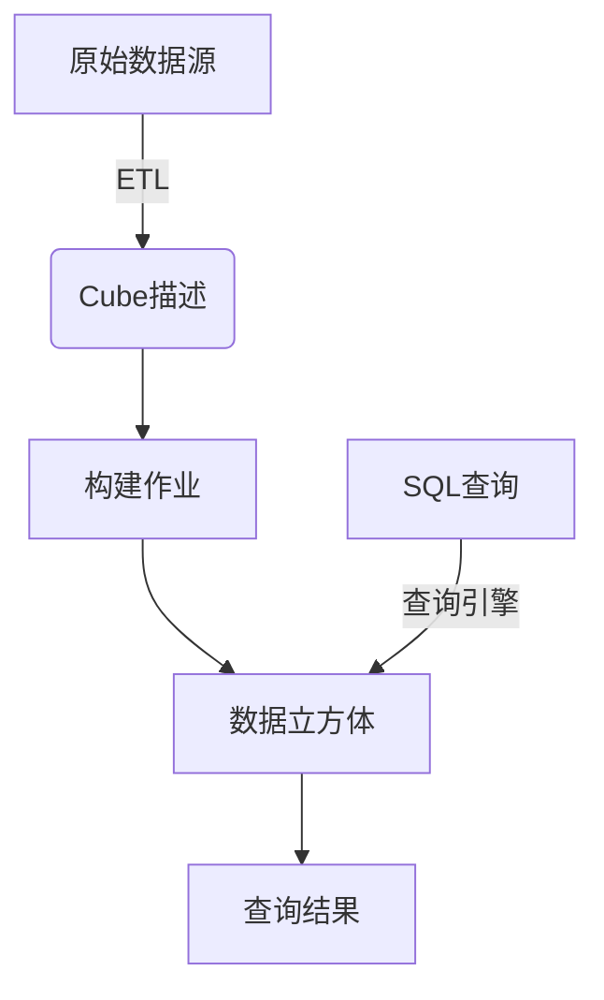

# Kylin原理与代码实例讲解

## 1.背景介绍

Apache Kylin是一款开源的分析型大数据处理引擎,旨在提供SQL查询在Hadoop之上的低延迟和高性能分析能力。它最初由eBay公司开发,后捐赠给Apache基金会,于2015年12月正式成为Apache顶级项目。

在大数据时代,企业需要对海量数据进行分析和挖掘,以获取有价值的商业洞察力。然而,直接在Hadoop集群上执行复杂的SQL查询通常会遇到较高的延迟和资源占用问题。为了解决这一痛点,Kylin应运而生。

Kylin的核心思想是预计算和存储数据立方体,从而实现查询时的高性能。它预先对原始数据进行建模、预计算和编码,将结果存储在高度优化的数据立方体中。查询时,Kylin只需从预计算的立方体中读取所需数据,避免了对原始数据的扫描,从而大幅降低了查询延迟。

## 2.核心概念与联系

Kylin的核心概念主要包括:

### 2.1 Cube描述(Data Cube)

Cube描述定义了如何从原始数据源构建数据立方体。它包含了维度、度量、分区和其他配置信息。Cube描述是Kylin构建和查询立方体的基础。

### 2.2 构建(Build)

构建过程根据Cube描述从原始数据源提取、转换和加载(ETL)数据,生成高度压缩和编码的数据立方体文件。

### 2.3 查询(Query)

查询引擎根据SQL查询语句,从相关的立方体中读取数据并执行计算,最终返回查询结果。Kylin会自动选择最佳立方体以获得最优查询性能。

### 2.4 作业(Job)

Kylin使用作业来执行构建和查询等操作。作业可分为多个可重新执行的步骤,具有容错和恢复能力。

### 2.5 元数据(Metadata)

Kylin使用元数据存储Cube描述、作业信息和统计数据等,以支持查询优化和系统管理。

### 2.6 Mermaid流程图



上图展示了Kylin的核心概念及其联系。Cube描述定义了如何从原始数据源构建立方体,构建作业根据描述执行ETL过程生成立方体文件。查询引擎根据SQL查询从立方体中读取数据并返回结果。

## 3.核心算法原理具体操作步骤

Kylin的核心算法主要包括数据立方体构建和查询执行两个部分。

### 3.1 数据立方体构建

数据立方体构建过程可分为以下几个步骤:

1. **读取原始数据**: 根据Cube描述中的数据源配置,从HDFS、Hive或HBase等源读取原始数据。

2. **数据抽象层(OLA)**: 对原始数据进行抽象,构建统一的数据视图。

3. **构建立方体段(Cube Segment)**: 对数据执行多维建模,生成立方体段文件。主要步骤包括:
   - **分区(Partition)**: 根据分区规则对数据进行分区。
   - **编码(Encoding)**: 对维度和度量进行高效编码,如字典编码和位映射编码。
   - **构建索引(Indexing)**: 构建列存索引,如位图索引。
   - **数据存储(Storage)**: 将编码后的数据以高度压缩的方式存储在HDFS上。

4. **元数据更新**: 将新构建的立方体段元数据信息更新到Kylin的元数据存储中。

5. **优化和合并**: 对立方体段进行合并和优化,以提高查询性能。

### 3.2 查询执行

查询执行过程如下:

1. **查询解析**: 将SQL查询解析为查询计划。

2. **立方体选择**: 根据查询计划,选择最佳的立方体段用于查询。

3. **数据读取**: 从选定的立方体段中读取所需的编码数据。

4. **数据解码**: 对读取的编码数据进行解码,还原为原始数据格式。

5. **查询计算**: 执行过滤、聚合、排序等查询计算操作。

6. **结果返回**: 将查询结果返回给用户。

## 4.数学模型和公式详细讲解举例说明

Kylin在数据编码和存储方面采用了多种数学模型和算法,以实现高效的数据压缩和快速查询。

### 4.1 字典编码

字典编码是Kylin中一种常用的维度编码技术。它将维度值映射为整数ID,从而减小维度值的存储空间。

假设有一个"城市"维度,其取值为{"北京","上海","广州","深圳"}。字典编码可将其映射为{0,1,2,3}。编码过程如下:

$$
\begin{align*}
\text{Encode}(\text{"北京"}) &= 0\\
\text{Encode}(\text{"上海"}) &= 1\\
\text{Encode}(\text{"广州"}) &= 2\\
\text{Encode}(\text{"深圳"}) &= 3
\end{align*}
$$

解码过程为其逆过程:

$$
\begin{align*}
\text{Decode}(0) &= \text{"北京"}\\
\text{Decode}(1) &= \text{"上海"}\\
\text{Decode}(2) &= \text{"广州"}\\
\text{Decode}(3) &= \text{"深圳"}
\end{align*}
$$

### 4.2 位映射编码

位映射编码适用于基数较小的维度,可将维度值编码为位序列,从而实现极高的压缩率。

假设有一个"是否加班"维度,其取值为{是,否}。我们可将其编码为{1,0}:

$$
\begin{align*}
\text{Encode}(\text{"是"}) &= 1\\
\text{Encode}(\text{"否"}) &= 0
\end{align*}
$$

在存储时,Kylin将多个编码值打包成位序列,每个值占用1位。例如,序列"10010111"表示8个"是否加班"值,其中第1、4、5个值为"是",其余为"否"。

### 4.3 位图索引

Kylin使用位图索引来加速维度过滤操作。位图索引将每个维度值的行集合编码为位序列,支持高效的位运算。

例如,对于"城市"维度,位图索引可为每个城市值存储一个位序列,其中第i位为1表示第i行属于该城市。则过滤"城市=北京"只需读取"北京"的位序列,并通过位运算快速获取满足条件的行号。

$$
\begin{align*}
\text{Filter}(\text{"城市=北京"}) &= \text{Bitmap}(\text{"北京"})\\
\text{Filter}(\text{"城市=北京 OR 城市=上海"}) &= \text{Bitmap}(\text{"北京"}) \; \text{OR} \; \text{Bitmap}(\text{"上海"})
\end{align*}
$$

位图索引不仅节省存储空间,而且通过位运算实现高效过滤,是Kylin中的核心索引技术。

### 4.4 数据压缩

Kylin采用多种压缩算法来减小数据存储大小,包括RLE(Run-Length Encoding)、字典编码、位映射编码等。压缩不仅节省存储空间,还可减少I/O开销,从而提高查询性能。

例如,对于重复值较多的列,RLE压缩可将其表示为"值-重复次数"的形式,大幅减小存储空间。而字典编码和位映射编码则可将较大的原始值压缩为较小的整数或位序列。

## 5.项目实践:代码实例和详细解释说明

本节将通过一个示例项目,展示如何使用Kylin进行数据建模、立方体构建和查询分析。

### 5.1 准备工作

我们将使用Kylin分析一个在线零售数据集,其中包含订单、产品、客户和促销活动等信息。数据存储在Hive表中。

首先,需要下载并安装Kylin,并将其与Hadoop集群和Hive元数据服务集成。然后创建一个Kylin项目,并定义数据源指向Hive表。

### 5.2 定义Cube描述

接下来,我们需要定义Cube描述,告知Kylin如何从原始数据构建立方体。以下是一个示例Cube描述:

```json
{
  "name": "order_cube",
  "model_desc_data": {
    "dimensions": [
      {
        "name": "ORDER_DATE",
        "table": "ORDER",
        "column": "ORDER_DATE"
      },
      {
        "name": "CUSTOMER_NAME",
        "table": "CUSTOMER",
        "column": "CUSTOMER_NAME"
      },
      // 其他维度...
    ],
    "measures": [
      {
        "name": "ORDER_COUNT",
        "function": {
          "expression": "COUNT()",
          "parameter": {
            "type": "constant",
            "value": "1",
            "next_parameter": null
          }
        }
      },
      {
        "name": "TOTAL_PRICE",
        "function": {
          "expression": "SUM",
          "parameter": {
            "type": "colRef",
            "columnName": "TOTAL_PRICE",
            "next_parameter": null
          }
        }
      },
      // 其他度量...
    ]
  },
  "dimensions": [
    {
      "name": "ORDER_DATE",
      "hierarchy": [
        {
          "level": "YEAR",
          "column": "YEAR"
        },
        {
          "level": "MONTH",
          "column": "MONTH"
        },
        {
          "level": "DAY",
          "column": "DAY"
        }
      ]
    },
    // 其他维度层次...
  ],
  "metrics": [
    "ORDER_COUNT",
    "TOTAL_PRICE"
  ],
  "cube_desc_is_draft": false
}
```

该Cube描述定义了两个维度(订单日期和客户名称)和两个度量(订单数和总价格)。维度层次用于支持不同粒度的分析,如按年、月或日对订单进行汇总。

### 5.3 构建立方体

定义好Cube描述后,我们可以触发立方体构建作业。Kylin将根据描述从Hive表中提取数据,执行ETL过程,并生成优化的立方体文件。

构建过程可通过Kylin的Web UI或REST API进行监控和管理。完成后,新构建的立方体段将显示在Kylin的"Cube Instances"列表中。

### 5.4 查询分析

立方体构建完成后,我们就可以使用SQL查询对数据进行分析了。以下是一个示例查询:

```sql
SELECT
  YEAR(ORDER_DATE) AS ORDER_YEAR,
  MONTH(ORDER_DATE) AS ORDER_MONTH,
  CUSTOMER_NAME,
  SUM(TOTAL_PRICE) AS TOTAL_REVENUE
FROM ORDER
  JOIN CUSTOMER ON ORDER.CUSTOMER_ID = CUSTOMER.CUSTOMER_ID
WHERE ORDER_DATE >= '2022-01-01' AND ORDER_DATE < '2023-01-01'
GROUP BY
  YEAR(ORDER_DATE),
  MONTH(ORDER_DATE),
  CUSTOMER_NAME
ORDER BY TOTAL_REVENUE DESC
LIMIT 10;
```

该查询计算了2022年每个月每个客户的总收入,并按收入降序排列,只返回前10条记录。

Kylin将自动选择最佳的立方体段来执行查询,从而获得高性能。同时,Kylin还提供了"Insight"功能,可以自动发现数据中的有趣模式和异常值。

### 5.5 代码示例

以下是一个Java代码示例,展示如何使用Kylin的API执行查询:

```java
import org.apache.kylin.query.relnode.OLAPContext;
import org.apache.kylin.query.relnode.OLAPContextManager;
import org.apache.kylin.query.relnode.OLAPQuery;

// 创建OLAPContext
OLAPContext context = OLAPContextManager.getInstance(config).getContext(project);

// 构建查询
String sql = "SELECT YEAR(ORDER_DATE) AS ORDER_YEAR, MONTH(ORDER_DATE) AS ORDER_MONTH, " +
             "CUSTOMER_NAME, SUM(TOTAL_PRICE) AS TOTAL_REVENUE " +
             "FROM ORDER JOIN CUSTOMER ON ORDER.CUSTOMER_ID = CUSTOMER.CUSTOMER_ID " +
             "WHERE ORDER_DATE >= '2022-01-01' AND ORDER_DATE < '2023-01-01' " +
             "GROUP BY YEAR(ORDER_DATE), MONTH(ORDER_DATE), CUSTOMER_NAME " +
             "ORDER BY TOTAL_REVENUE DESC LIMIT 10";
OLAPQuery query = OLAPQuery.createQuery(sql, context);

// 执行查询
query.preparePlan();
query.executeQuery();

// 获取结果
List<List