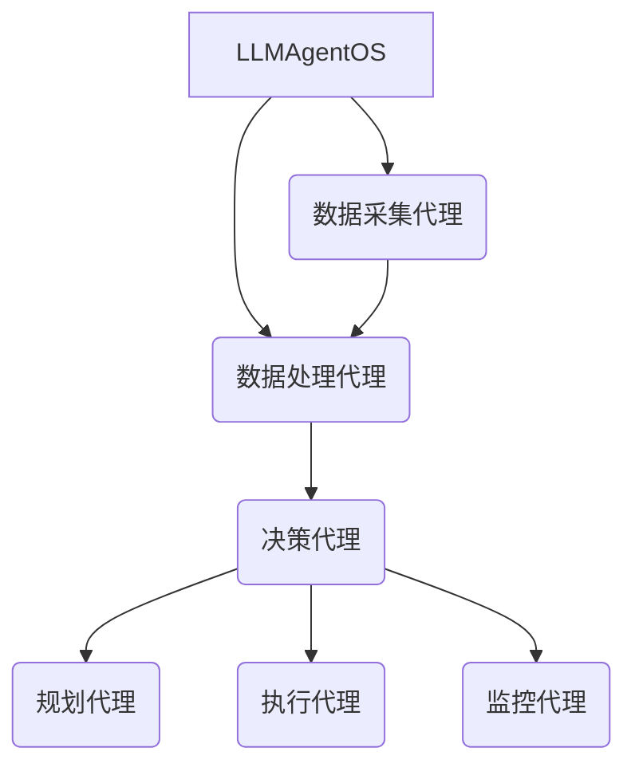
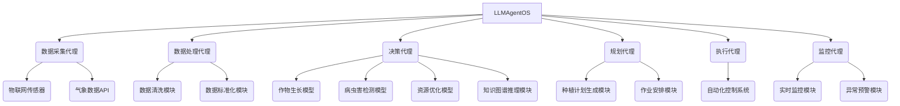

# LLMAgentOS在智能农业领域的应用:优化种植和收获过程

## 1.背景介绍

### 1.1 农业的重要性

农业是人类赖以生存的基础产业,对于确保粮食安全、维护生态平衡和促进经济发展至关重要。随着世界人口的不断增长和气候变化的日益严峻,农业面临着前所未有的挑战,迫切需要创新技术来提高生产效率、优化资源利用和减少环境影响。

### 1.2 传统农业的挑战

传统农业生产方式存在诸多弊端,如过度使用化肥和农药、浪费水资源、劳动密集型等,这不仅降低了农产品质量和收益,也对环境造成了严重破坏。此外,农民缺乏科学决策支持系统,难以准确预测天气、病虫害发生等,导致种植和收获效率低下。

### 1.3 智能农业的兴起

智能农业(Smart Agriculture)正在通过融合物联网(IoT)、人工智能(AI)、大数据分析等前沿技术,为农业注入新的活力。智能农业系统可实时监测农田环境,优化生产流程,提高决策效率,从而实现精准高效的农业生产。

## 2.核心概念与联系

### 2.1 LLMAgentOS概述

LLMAgentOS是一种基于大型语言模型(LLM)的智能操作系统,旨在将人工智能无缝集成到各个领域的工作流程中。它由一系列智能代理(Agents)组成,每个代理都专注于特定任务,如数据处理、决策分析、任务规划等。这些代理通过协作完成复杂的工作流程。

### 2.2 LLMAgentOS在智能农业中的作用

LLMAgentOS可以作为智能农业的核心大脑,整合各种传感器数据、气象数据、历史数据等,并通过强大的语言理解和决策能力,为农业生产的各个环节提供智能化支持,包括:

- 种植规划和管理
- 实时环境监测和预警
- 病虫害诊断和防治
- 灌溉优化和节水
- 收获时机预测和作业安排
- 产品质量控制和溯源

### 2.3 LLMAgentOS架构

LLMAgentOS采用模块化设计,由多个智能代理组成,每个代理负责特定的任务。这些代理通过高效的协作,形成一个统一的智能系统。主要代理包括:

- 数据采集代理:从各种传感器和数据源收集农业相关数据
- 数据处理代理:清洗、整合和标准化农业大数据
- 决策代理:基于机器学习模型和知识图谱进行智能决策
- 规划代理:制定种植计划、作业安排等
- 执行代理:控制农业机器设备执行具体操作
- 监控代理:实时监测农业生产过程,预警异常情况

这些代理通过高度的模块化和协作,为农业生产提供端到端的智能化支持。



## 3.核心算法原理具体操作步骤

LLMAgentOS的核心是其强大的决策代理,它集成了多种先进的机器学习算法和知识库,可以对复杂的农业生产场景进行智能决策。

### 3.1 数据融合

决策代理首先需要从数据采集代理和数据处理代理获取多源异构数据,包括:

- 农田环境数据:温度、湿度、光照、土壤湿度等
- 作物生长数据:植株高度、叶面积指数等
- 气象数据:降雨量、日照时长等
- 历史数据:过去的种植记录、收获量等
- 专家知识:农业专家的经验总结

这些数据需要进行清洗、标准化和融合,为后续的建模和决策奠定数据基础。

### 3.2 特征工程

基于融合后的数据,决策代理需要提取有价值的特征,作为机器学习模型的输入。常用的特征包括:

- 时间特征:种植日期、生长周期等
- 环境特征:温度、湿度、日照条件等
- 作物特征:品种、生长阶段等
- 操作特征:施肥量、浇水量等

特征工程对于提高模型的预测精度至关重要。

### 3.3 机器学习模型

决策代理集成了多种机器学习模型,用于解决不同的农业决策问题:

- 作物生长模型:预测作物在给定条件下的生长情况
- 病虫害检测模型:基于图像识别技术诊断植株健康状况
- 收获时机预测模型:综合多种因素预测最佳收获时间
- 资源优化模型:优化水资源、肥料等投入,最大化收益

这些模型通过对历史数据的训练,可以学习到农业生产中的内在规律,为智能决策提供依据。

### 3.4 知识图谱推理

除了机器学习模型,决策代理还融合了农业领域知识图谱,对复杂的决策场景进行语义推理。知识图谱包含了作物生长规律、病虫害防治方法、农艺操作流程等结构化知识,可以与机器学习模型的输出相结合,生成更加全面和解释性更强的决策方案。

### 3.5 决策生成与执行

基于模型预测和知识推理的结果,决策代理可以为农业生产的各个环节生成智能决策方案,例如:

- 种植计划:确定作物品种、播种时间和密度
- 田间管理:制定施肥、浇水、防治等操作计划
- 收获作业:安排收获时间和作业流程

这些决策将由规划代理和执行代理具体实施,通过控制农业机器人、自动化设备等,将决策方案转化为现实操作,实现农业生产的自动化和智能化。

## 4.数学模型和公式详细讲解举例说明

在LLMAgentOS的决策过程中,涉及多种数学模型和公式,用于量化描述农业生产中的各种现象和规律。

### 4.1 作物生长模型

作物生长模型是农业决策的基础,它描述了作物在不同环境条件下的生长过程。一种常用的作物生长模型是基于生长度日(Growing Degree Days,GDD)的模型:

$$GDD = \sum_{i=1}^{n}(T_{avg,i} - T_{base})$$

其中:
- $GDD$是生长度日的累积值
- $n$是生长周期的天数
- $T_{avg,i}$是第$i$天的平均温度
- $T_{base}$是作物生长的基础温度阈值

作物在达到特定的$GDD$值时,会进入不同的生长阶段,如发芽、开花、成熟等。通过估计$GDD$的值,可以预测作物生长进度。

### 4.2 病虫害检测模型

病虫害是影响农作物产量的主要因素之一。LLMAgentOS采用基于深度学习的图像识别模型,对植株图像进行智能诊断。

常用的卷积神经网络(CNN)模型可以表示为:

$$y = f(W^{(L)}*a^{(L-1)} + b^{(L)})$$

其中:
- $y$是模型输出,表示病虫害类别的概率分布
- $f$是激活函数,如ReLU、Sigmoid等
- $W^{(L)}$和$b^{(L)}$分别是第$L$层的权重和偏置
- $a^{(L-1)}$是上一层的激活值
- $*$表示卷积操作

通过对大量标注的植株图像进行训练,CNN模型可以学习到植株健康状态的视觉特征,实现准确的病虫害检测。

### 4.3 资源优化模型

在农业生产中,如何合理配置有限的资源(如水资源、肥料等),以获得最大的收益,是一个典型的优化问题。LLMAgentOS采用线性规划等优化算法求解这一问题。

假设有$n$种资源和$m$种作物,资源的可用量为$r_i(i=1,2,...,n)$,单位资源产出为$p_{ij}(i=1,2,...,n;j=1,2,...,m)$,目标是最大化总收益:

$$\max \sum_{j=1}^{m}c_jx_j$$
$$s.t.\begin{cases}
\sum_{j=1}^{m}p_{ij}x_j \leq r_i, & i=1,2,...,n\\
x_j \geq 0, & j=1,2,...,m
\end{cases}$$

其中$c_j$是第$j$种作物的单位收益,$x_j$是第$j$种作物的种植量。通过求解这一优化问题,可以获得资源的最优配置方案。

上述仅是LLMAgentOS所涉及数学模型的一个示例,在实际应用中,还会涉及更多的模型和公式,用于量化描述农业生产的各个方面。

## 5.项目实践:代码实例和详细解释说明

为了便于理解LLMAgentOS在实际项目中的应用,我们以一个智能大棚管理系统为例,介绍其核心代码实现。

### 5.1 系统架构



如上图所示,智能大棚管理系统由多个代理组成,各司其职,通过紧密协作实现智能化管理。

### 5.2 数据采集代理

数据采集代理负责从物联网传感器和第三方数据源获取相关数据,以Python的代码实现为例:

```python
import requests

# 从物联网传感器获取数据
def get_iot_data():
    sensor_data = {...} # 模拟传感器数据
    return sensor_data

# 从气象数据API获取数据
def get_weather_data():
    api_url = 'https://api.example.com/weather'
    response = requests.get(api_url)
    weather_data = response.json()
    return weather_data
```

### 5.3 数据处理代理

数据处理代理对原始数据进行清洗、标准化等预处理,为模型训练和决策做准备:

```python
import pandas as pd
from sklearn.preprocessing import StandardScaler

# 数据清洗
def clean_data(data):
    df = pd.DataFrame(data)
    df = df.dropna() # 删除缺失值
    df = df.drop_duplicates() # 删除重复值
    return df

# 数据标准化
def standardize_data(data):
    scaler = StandardScaler()
    scaled_data = scaler.fit_transform(data)
    return scaled_data
```

### 5.4 决策代理

决策代理是LLMAgentOS的核心,集成了多种机器学习模型和知识推理模块。以作物生长模型为例:

```python
import numpy as np
from sklearn.linear_model import LinearRegression

# 训练作物生长模型
def train_crop_model(X, y):
    model = LinearRegression()
    model.fit(X, y)
    return model

# 预测作物生长
def predict_crop_growth(model, X):
    y_pred = model.predict(X)
    return y_pred
```

知识图谱推理模块可以基于开源工具(如Apache Jena)实现,此处不再赘述。

### 5.5 规划代理

规划代理根据决策代理的输出,生成具体的种植计划和作业安排:

```python
from datetime import datetime

# 生成种植计划
def generate_planting_plan(crop, start_date, area):
    plan = {
        'crop': crop,
        'start_date': start_date,
        'area': area,
        ...
    }
    return plan

# 生成作业安排
def schedule_operations