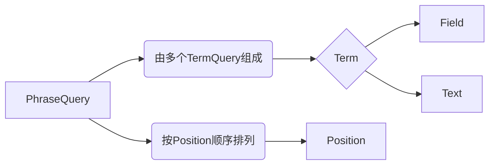

# Lucene中的PhraseQuery短语查询实战

## 1. 背景介绍

在全文搜索领域,Lucene是一个非常流行和强大的开源搜索引擎库。它提供了丰富的查询功能,可以满足各种搜索需求。其中,PhraseQuery(短语查询)是Lucene提供的一种重要查询类型,可以精确匹配文档中的短语。

短语查询在很多场景下都非常有用,例如:

- 搜索引擎:用户输入一个短语,希望搜索结果中的文档都包含这个完整短语。
- 问答系统:从海量文档中找出包含问题关键短语的精确答案。
- 文本挖掘:挖掘文档中的特定概念、人名、地名等,通常以短语形式出现。

因此,掌握PhraseQuery的使用方法,对于开发基于Lucene的搜索应用非常重要。本文将深入探讨PhraseQuery的原理、使用方法和实际应用,帮助读者更好地理解和应用这一查询类型。

## 2. 核心概念与联系

要理解PhraseQuery,首先需要了解以下几个核心概念:

### 2.1 Term

Term是Lucene中最基本的搜索单元,由两部分组成:词项文本(text)和词项所在的字段(field)。例如,在文档中某个字段包含词项"hello",就可以表示为一个Term。

### 2.2 TermQuery 

TermQuery是Lucene中最简单、最常用的一种查询,它匹配包含指定Term的文档。比如查询title字段中包含"java"的文档,就可以构造一个TermQuery。

### 2.3 Phrase

Phrase(短语)由多个Term按顺序组成,中间可以插入任意个位置(position)。PhraseQuery正是用来查询包含指定Phrase的文档。

### 2.4 Position

Lucene在创建索引时,会记录每个Term出现的位置(position),用一个整数表示。基于Position,可以知道Term之间的顺序、距离等信息,PhraseQuery正是利用Position来匹配短语的。

下图展示了PhraseQuery与其他概念之间的关系:



## 3. 核心算法原理与操作步骤

PhraseQuery的原理是:首先根据短语中的每个词项构造TermQuery,然后通过Position进行连接,形成一个完整的短语查询。

具体步骤如下:

1. 将短语拆分成一个个Term,为每个Term构造一个TermQuery。
2. 计算第一个Term的位置,作为起始位置。
3. 依次获取每个Term的位置,并与前一个Term的位置比较,确保 position 递增且与前一个 position 的差值为 1。
4. 如果中间出现 position 的差值大于1,表示短语不连续,该文档不符合条件。
5. 如果所有 Term 的 position 都满足要求,则文档符合查询条件,加入到结果集中。

可以看出,PhraseQuery的关键是利用 position 信息,确保各个Term之间的顺序和距离都满足短语的要求。

## 4. 数学模型与公式

PhraseQuery的数学模型可以用集合论来表示。假设短语由n个Term组成,每个Term对应一个集合,包含所有包含该Term的文档,用$S_i$表示第i个Term对应的集合,则PhraseQuery的结果集可以表示为:

$$
\bigcap_{i=1}^{n} S_i
$$

其中,$\bigcap$表示集合的交集操作。这个公式表示,PhraseQuery的结果集是所有Term集合的交集,即同时包含所有Term的文档集合。

但这个公式只是表示了Term的共现性,还需要考虑Position的条件。引入函数$f(d, t)$表示Term t在文档d中出现的位置集合,则PhraseQuery的数学模型为:

$$
\{d \mid d \in \bigcap_{i=1}^{n} S_i, \exists p_1 \in f(d, t_1), p_2 \in f(d, t_2), ..., p_n \in f(d, t_n) \\
s.t. \quad p_1 < p_2 < ... < p_n \quad and \quad p_{i+1} - p_i = 1, \forall 1 \leq i < n\}
$$

这个模型表示,PhraseQuery的结果集需要满足两个条件:

1. 文档同时包含所有的Term。
2. 存在一组位置$p_1, p_2, ..., p_n$,对应每个Term在文档中的位置,满足递增关系且相邻位置差为1。

综合这两个条件,就得到了 PhraseQuery 的最终结果集。

## 5. 项目实践:代码实例与详细解释

下面通过一个具体的Java代码实例,演示如何使用Lucene的PhraseQuery进行短语查询。

```java
// 创建一个IndexReader对象,用于读取索引
IndexReader reader = DirectoryReader.open(FSDirectory.open(Paths.get("index_path")));

// 创建一个IndexSearcher对象,用于执行查询
IndexSearcher searcher = new IndexSearcher(reader);

// 指定查询的字段和短语内容
String field = "content";
String phrase = "Apache Lucene";

// 创建一个PhraseQuery对象
PhraseQuery query = new PhraseQuery(field, phrase.split(" "));

// 执行查询,获取前10个结果
TopDocs topDocs = searcher.search(query, 10);

// 遍历查询结果,输出文档ID和得分
for (ScoreDoc scoreDoc : topDocs.scoreDocs) {
    int docID = scoreDoc.doc;
    float score = scoreDoc.score;
    System.out.println("DocID: " + docID + ", Score: " + score);
}
```

代码解释:

1. 首先创建一个IndexReader对象,用于读取已经建立好的索引。
2. 然后创建一个IndexSearcher对象,用于执行实际的查询操作。
3. 指定要查询的字段和短语内容,这里查询content字段中包含"Apache Lucene"这个短语的文档。
4. 创建PhraseQuery对象,将短语拆分成Term数组传入。注意,如果短语中包含停用词,可能会被自动过滤掉。
5. 调用IndexSearcher的search方法执行查询,指定查询对象和返回结果的最大数量,这里设置为10。
6. 查询结果通过TopDocs对象返回,其中包含了得分最高的前N个文档。
7. 最后,遍历TopDocs中的每个ScoreDoc对象,获取文档ID和相关性得分,输出到控制台。

通过这个例子,可以看出使用PhraseQuery进行短语查询非常简单,只需要指定字段和短语内容即可。Lucene会自动完成短语匹配、相关性打分等工作。

## 6. 实际应用场景

PhraseQuery在实际项目中有非常广泛的应用,下面列举几个典型场景:

### 6.1 全文搜索引擎

对于像Elasticsearch、Solr这样的搜索引擎,短语查询是一个必不可少的功能。用户在搜索框中输入一段短语,期望搜索结果与这段短语完全匹配。这时就可以使用PhraseQuery,精确匹配包含搜索短语的文档。

### 6.2 智能问答系统

问答系统的一个重要任务是从海量文档中找出与问题相关的精确答案。其中一种方法是将问题转化为短语查询,从候选答案段落中匹配出包含问题关键短语的片段,这些片段很可能就包含了问题的答案。

### 6.3 文本挖掘

在文本挖掘任务中,经常需要从文档集合中挖掘出特定的概念、实体、关系等信息。这些信息通常以短语的形式出现在文档中,例如人名"Barack Obama"、地名"New York"、概念"Machine Learning"等。使用PhraseQuery可以准确地定位到包含这些短语的文档段落,进而抽取出需要的信息。

### 6.4 医疗信息检索

在医疗领域,医生和研究人员经常需要查询病例报告、学术论文等文献,寻找与特定疾病、药物、治疗方案相关的信息。这些关键信息通常都是以短语的形式出现,例如疾病名称"Diabetes Mellitus"、药物名称"Aspirin"等。PhraseQuery可以帮助快速、准确地检索到包含这些关键短语的文献。

## 7. 工具与资源推荐

要深入学习和使用PhraseQuery,以下是一些有用的工具和资源:

- [Apache Lucene官方文档](https://lucene.apache.org/core/):最权威的Lucene使用指南,包含PhraseQuery的详细API文档。
- [Lucene in Action](https://www.manning.com/books/lucene-in-action-second-edition):经典的Lucene学习图书,对PhraseQuery有深入的讲解和示例。
- [Elasticsearch](https://www.elastic.co/):基于Lucene构建的开源搜索引擎,提供了RESTful API,可以方便地使用PhraseQuery进行搜索。
- [Apache Solr](https://lucene.apache.org/solr/):另一个流行的基于Lucene的搜索引擎,提供了丰富的文本分析和查询功能。
- [Lucene Query Parser Syntax](https://lucene.apache.org/core/2_9_4/queryparsersyntax.html):Lucene的查询语法参考,展示了如何在查询表达式中使用PhraseQuery。

## 8. 总结:未来发展趋势与挑战

PhraseQuery作为一种基本的查询类型,在全文搜索领域已经得到了广泛应用。未来随着搜索技术的不断发展,PhraseQuery也面临着新的挑战和机遇:

- 智能匹配:引入词向量、知识图谱等技术,实现短语的语义匹配,提高查询的准确率和召回率。
- 个性化:根据用户的历史行为、兴趣偏好等,对短语查询结果进行个性化排序和过滤,提供更加符合用户需求的搜索体验。
- 实时索引:在流式数据处理场景下,如何实现短语查询的实时索引和更新,是一个挑战性的问题。
- 跨语言:随着全球化的发展,如何实现跨语言的短语查询,支持用户用母语搜索外语资源,是一个值得研究的方向。

总之,PhraseQuery作为Lucene的核心查询类型之一,在全文搜索领域还有很大的发展空间。研究人员和工程师需要不断探索新的技术和方法,应对不断变化的应用需求和挑战,让PhraseQuery在未来有更广阔的应用前景。

## 9. 附录:常见问题与解答

### 9.1 PhraseQuery与TermQuery的区别是什么?

TermQuery是最基本的查询类型,用于匹配包含指定词项的文档。而PhraseQuery是由多个TermQuery组成的短语查询,不仅要求文档包含所有词项,还要求这些词项按照指定的顺序紧邻出现。因此,PhraseQuery的匹配条件更加严格。

### 9.2 PhraseQuery是否支持跨字段查询?

PhraseQuery要求所有Term都出现在同一个字段中,按照指定顺序紧邻。所以PhraseQuery不支持跨字段查询。如果需要在多个字段中查询短语,可以在每个字段上分别构建PhraseQuery,再把它们组合成BooleanQuery。

### 9.3 PhraseQuery中的Term之间允许插入额外的单词吗?

默认情况下,PhraseQuery要求各个Term之间严格紧邻,中间不允许插入其他单词。但是PhraseQuery提供了slop参数,用于设置Term之间允许的最大间隔。例如,slop=1表示允许Term之间最多插入1个单词,slop=2允许插入2个单词,依此类推。

### 9.4 PhraseQuery的查询性能如何?

PhraseQuery的查询性能优于TermQuery。因为在索引中,每个Term的倒排列表已经按照文档ID排序。执行PhraseQuery时,可以利用跳表(SkipList)算法,快速定位到包含多个Term的文档,减少不必要的文档扫描。同时,由于PhraseQuery的约束条件更多,通常结果集也会更小,因此整体的查询性能是比较高的。

作者:禅与计算机程序设计艺术 / Zen and the Art of Computer Programming