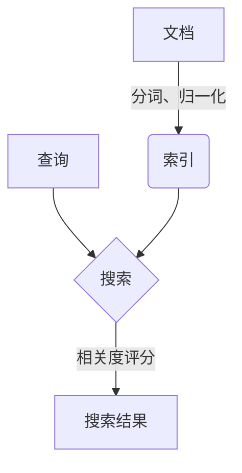

# Lucene搜索原理与代码实例讲解

## 1.背景介绍

### 1.1 什么是Lucene

Lucene是一个基于Java的高性能、全功能的搜索引擎库。它是Apache软件基金会Jakarta项目组的一个子项目,提供了完整的查询引擎和索引引擎,支持全文检索和hitHighlighting等功能。Lucene以开源的方式发布,因此可以免费使用和修改源代码。

### 1.2 Lucene的应用场景

Lucene可以应用于任何需要添加搜索功能的场景,常见的应用包括:

- 网站搜索:为网站添加全文搜索功能
- 企业文档搜索:搜索公司内部文档、知识库等
- 电商网站:为电商网站提供商品搜索功能
- 日志分析:对日志文件进行全文搜索和分析
- 科学数据搜索:搜索科学数据集等

### 1.3 Lucene与传统数据库搜索的区别

传统数据库通常只能进行基于字段的精确匹配搜索,而Lucene则提供了全文检索的功能,能够从大量非结构化的文本数据中快速查找相关信息。此外,Lucene还支持模糊查询、相似度排序等高级搜索特性。

## 2.核心概念与联系

### 2.1 索引(Index)

索引是Lucene的核心概念,它将文档数据进行分词、归一化等处理,并建立倒排索引,以支持高效的全文搜索。

### 2.2 文档(Document)

文档表示要被索引和搜索的基本数据单元,可以是一个文件、一条数据库记录或任何其他形式的数据。一个文档由一系列域(Field)组成。

### 2.3 域(Field)

域是文档中的一个数据单元,例如标题、内容、作者等。不同的域可以赋予不同的索引方式和搜索权重。

### 2.4 分词(Analysis)

分词是将文本按照一定的规则分解成一个个词条或词元的过程,是创建索引和执行查询的基础。Lucene提供了多种分词器,可以针对不同的语言进行定制。

### 2.5 查询(Query)

查询定义了用户的搜索条件,Lucene支持多种查询类型,如词条查询、短语查询、模糊查询等。查询与索引一起决定了搜索的结果。

### 2.6 相关度评分(Scoring)

Lucene会根据文档与查询条件的相关程度,给每个搜索结果文档计算一个相关度评分,并按分值降序排列。

### 2.7 Mermaid流程图



上图展示了Lucene的核心工作流程:文档经过分词和归一化处理后创建索引,查询与索引相匹配并根据相关度评分得到最终搜索结果。

## 3.核心算法原理具体操作步骤  

### 3.1 创建索引

创建索引是Lucene的核心功能之一,包括以下步骤:

1. 获取文档数据
2. 创建IndexWriter实例
3. 对文档进行分词和归一化处理
4. 将文档添加到IndexWriter
5. 提交并关闭IndexWriter

示例代码:

```java
// 1. 获取文档数据
String text = "This is a sample document for Lucene indexing.";

// 2. 创建IndexWriter实例
Directory dir = FSDirectory.open(Paths.get("index"));
Analyzer analyzer = new StandardAnalyzer();
IndexWriterConfig config = new IndexWriterConfig(analyzer);
IndexWriter writer = new IndexWriter(dir, config);

// 3. 对文档进行分词和归一化处理
Document doc = new Document();
Field field = new TextField("content", text, Field.Store.YES);
doc.add(field);

// 4. 将文档添加到IndexWriter
writer.addDocument(doc);

// 5. 提交并关闭IndexWriter
writer.commit();
writer.close();
```

### 3.2 执行搜索

执行搜索需要创建IndexSearcher实例,构建查询,并获取TopDocs结果集,步骤如下:

1. 创建IndexReader实例
2. 基于IndexReader创建IndexSearcher
3. 创建查询对象Query
4. 使用IndexSearcher执行查询
5. 获取TopDocs结果集

示例代码:

```java
// 1. 创建IndexReader实例
Directory dir = FSDirectory.open(Paths.get("index"));
IndexReader reader = DirectoryReader.open(dir);

// 2. 基于IndexReader创建IndexSearcher
IndexSearcher searcher = new IndexSearcher(reader);

// 3. 创建查询对象Query
String queryStr = "Lucene";
Query query = new QueryParser("content", analyzer).parse(queryStr);

// 4. 使用IndexSearcher执行查询
TopDocs docs = searcher.search(query, 10);

// 5. 获取TopDocs结果集
ScoreDoc[] hits = docs.scoreDocs;
for (ScoreDoc hit : hits) {
    Document doc = searcher.doc(hit.doc);
    System.out.println(doc.get("content"));
}

// 关闭资源
reader.close();
dir.close();
```

上述代码执行一个简单的"Lucene"关键词搜索,并输出前10条结果的内容。

## 4.数学模型和公式详细讲解举例说明

### 4.1 TF-IDF模型

Lucene使用TF-IDF(Term Frequency-Inverse Document Frequency)模型来计算查询和文档之间的相关度分数。该模型由两个部分组成:

1. 词频(Term Frequency, TF)
2. 逆向文档频率(Inverse Document Frequency, IDF)

#### 4.1.1 词频(TF)

词频是指一个给定的词条在当前文档中出现的次数,用来衡量该词条对文档的重要程度。词频通常使用下面的函数进行计算:

$$
tf_{t,d} = \frac{n_{t,d}}{\sum_{t' \in d} n_{t',d}}
$$

其中 $n_{t,d}$ 表示词条 $t$ 在文档 $d$ 中出现的次数, $\sum_{t' \in d} n_{t',d}$ 表示文档 $d$ 中所有词条出现次数的总和。

#### 4.1.2 逆向文档频率(IDF)

逆向文档频率是用于衡量一个词条在整个文档集合中的重要程度。一个在很多文档中出现的词条,对这些文档的区分度就不高,因此其IDF值会较低。IDF的计算公式如下:

$$
idf_t = \log \frac{N + 1}{df_t + 1} + 1
$$

其中 $N$ 表示文档集合中文档的总数, $df_t$ 表示包含词条 $t$ 的文档数量。

#### 4.1.3 TF-IDF相关度分数

将TF和IDF相乘,即可得到该词条对文档的TF-IDF权重:

$$
w_{t,d} = tf_{t,d} \times idf_t
$$

对于一个查询 $q$ 和文档 $d$, 它们的相关度分数可以用所有查询词条的TF-IDF权重之和来计算:

$$
score(q, d) = \sum_{t \in q} w_{t,d}
$$

通过这种方式,Lucene可以有效地评估查询与文档的相关程度,并对搜索结果进行排序。

### 4.2 BM25算法

BM25是一种改进的TF-IDF相似度算法,在Lucene中也得到了广泛应用。相比TF-IDF,BM25考虑了更多因素,如文档长度、查询词条频率等,从而能够获得更准确的相关度评分。

BM25的计算公式如下:

$$
score(D, Q) = \sum_{q \in Q} \frac{idf(q) \times f(q, D) \times (k_1 + 1)}{f(q, D) + k_1 \times (1 - b + b \times \frac{|D|}{avgdl})}
$$

其中:

- $f(q, D)$ 表示词条 $q$ 在文档 $D$ 中出现的词频
- $|D|$ 表示文档 $D$ 的长度
- $avgdl$ 表示文档集合的平均文档长度
- $k_1$ 和 $b$ 是用于调节算法性能的常数

BM25算法通过引入文档长度归一化因子和词频饱和因子,能够更准确地评估查询与文档的相关度。

## 5.项目实践:代码实例和详细解释说明

本节将通过一个完整的项目示例,演示如何使用Lucene进行索引和搜索操作。

### 5.1 项目结构

```
lucene-demo
├── pom.xml
└── src
    ├── main
    │   ├── java
    │   │   └── com
    │   │       └── example
    │   │           ├── IndexManager.java
    │   │           ├── SearchManager.java
    │   │           └── TextFileFilter.java
    │   └── resources
    │       └── documents
    │           ├── doc1.txt
    │           ├── doc2.txt
    │           └── ...
    └── test
        └── java
            └── com
                └── example
                    ├── IndexManagerTest.java
                    └── SearchManagerTest.java
```

- `IndexManager`: 负责创建索引
- `SearchManager`: 负责执行搜索
- `TextFileFilter`: 用于过滤文本文件
- `documents`: 存放待索引的文档文件

### 5.2 IndexManager

`IndexManager`负责从指定目录读取文本文件,并为每个文件创建Lucene文档对象,最后将这些文档写入索引。

```java
public class IndexManager {
    private static final String INDEX_DIR = "index";

    public void createIndex(String dataDir) throws IOException {
        Path indexPath = Paths.get(INDEX_DIR);
        Directory dir = FSDirectory.open(indexPath);
        Analyzer analyzer = new StandardAnalyzer();
        IndexWriterConfig config = new IndexWriterConfig(analyzer);
        IndexWriter writer = new IndexWriter(dir, config);

        Path docDir = Paths.get(dataDir);
        if (!Files.isDirectory(docDir)) {
            throw new IllegalArgumentException(dataDir + " is not a directory");
        }

        indexDocs(writer, docDir);
        writer.commit();
        writer.close();
    }

    private void indexDocs(IndexWriter writer, Path path) throws IOException {
        if (Files.isDirectory(path)) {
            Files.walkFileTree(path, new TextFileFilter(), Integer.MAX_VALUE, FileVisitOption.FOLLOW_LINKS)
                    .filter(Files::isRegularFile)
                    .forEach(file -> indexDoc(writer, file));
        } else {
            indexDoc(writer, path);
        }
    }

    private void indexDoc(IndexWriter writer, Path file) {
        try {
            Document doc = new Document();
            doc.add(new TextField("contents", new String(Files.readAllBytes(file)), Field.Store.YES));
            doc.add(new StringField("path", file.toString(), Field.Store.YES));
            writer.addDocument(doc);
        } catch (IOException e) {
            e.printStackTrace();
        }
    }
}
```

`createIndex`方法是入口,它首先创建`IndexWriter`实例,然后调用`indexDocs`方法遍历指定目录下的所有文本文件,对每个文件调用`indexDoc`方法创建Lucene文档对象并添加到`IndexWriter`中。最后提交并关闭`IndexWriter`。

### 5.3 SearchManager

`SearchManager`负责基于已创建的索引执行搜索操作。

```java
public class SearchManager {
    private static final String INDEX_DIR = "index";

    public void search(String queryStr) throws IOException, ParseException {
        Path indexPath = Paths.get(INDEX_DIR);
        Directory dir = FSDirectory.open(indexPath);
        IndexReader reader = DirectoryReader.open(dir);
        IndexSearcher searcher = new IndexSearcher(reader);

        QueryParser parser = new QueryParser("contents", new StandardAnalyzer());
        Query query = parser.parse(queryStr);

        TopDocs results = searcher.search(query, 10);
        ScoreDoc[] hits = results.scoreDocs;

        System.out.println("Found " + hits.length + " hits.");
        for (int i = 0; i < hits.length; ++i) {
            int docId = hits[i].doc;
            Document doc = searcher.doc(docId);
            System.out.println((i + 1) + ". Path: " + doc.get("path") + ", Score: " + hits[i].score);
        }

        reader.close();
        dir.close();
    }
}
```

`search`方法首先创建`IndexReader`和`IndexSearcher`实例,然后使用`QueryParser`解析查询字符串,构建`Query`对象。接下来调用`IndexSearcher`的`search`方法执行查询,获取前10条搜索结果。最后输出每个结果文档的路径和相关度分数。

### 5.4 使用示例

```java
public static void main(String[] args) {
    String dataDir = "src/main/resources/documents";
    String queryStr = "Lucene";

    try {
        IndexManager indexManager = new IndexManager();
        indexManager.createIndex(dataDir);

        SearchManager searchManager = new SearchManager();
        searchManager.search(queryStr);
    } catch (IOException | ParseException e) {
        e.printStackTrace