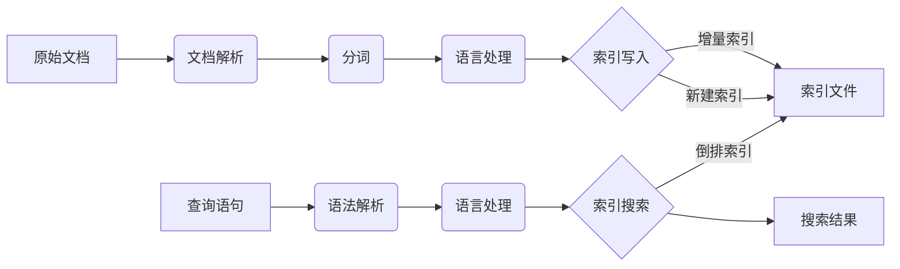

# Lucene索引原理与代码实例讲解

## 1.背景介绍
### 1.1 Lucene简介
Lucene是一个基于Java的高性能、全文搜索引擎工具包,它不是一个完整的搜索引擎,而是为你提供了完整的查询引擎和索引引擎,以及部分文本分析引擎。Lucene目前是Apache Jakarta家族中的一个开源项目。

### 1.2 全文检索的概念
全文检索是指计算机索引程序通过扫描文章中的每一个词,对每一个词建立一个索引,指明该词在文章中出现的次数和位置。当用户查询时,检索程序就根据事先建立的索引进行查找,并将查找的结果反馈给用户的检索方式。这个过程类似于通过字典的检索字表查字的过程。

### 1.3 Lucene的应用场景
Lucene可以为各种规模的应用程序添加搜索功能。一些常见的应用场景包括:
- 为网站添加搜索功能 
- 创建特定领域的搜索引擎,如科学文献、法律文档等
- 对大规模非结构化数据进行索引和搜索,如日志文件、电子邮件存档等
- 结合机器学习算法,提供智能推荐和个性化搜索

## 2.核心概念与联系
### 2.1 索引(Index)
索引是Lucene的核心,它是将原始内容经过语言处理和文本分析后得到的一种数据结构。索引的目的是为了加快搜索的速度。Lucene索引存储在磁盘上,由一个或多个Segment组成。

### 2.2 文档(Document) 
文档是Lucene索引和搜索的基本单元。一个文档包含一个或多个Field,不同的Field可以是不同的数据类型,如文本、数字、日期等。每个文档都有一个唯一的文档编号(DocId)。

### 2.3 域(Field)
Field是Lucene文档的组成部分,包含Field的名称和值。不同的Field可以有不同的属性,如是否分词、是否索引、是否存储等。常见的Field类型有:
- StringField:字符串类型,不分词,常用于存储标识性信息,如ID、分类编码等 
- TextField:文本类型,分词,常用于存储内容性信息,如标题、正文等
- IntPoint/LongPoint/FloatPoint/DoublePoint:数值类型,可索引、不分词,常用于数值范围查询
- StoredField:仅存储,不索引,常用于存储不需要检索的信息,如文档原文等

### 2.4 词(Term)
Term是索引的最小单位,由两部分组成:词名(Term text)和词典(Term dictionary)。词名表示Term的内容,词典用于快速定位Term。

### 2.5 分词(Tokenizer)
将Field的值按照一定的规则切分成一个个词(Term)的过程,就是分词。不同的语言有不同的分词器,如英文、中文、阿拉伯语等。常用的分词器有:
- StandardTokenizer:Lucene默认的标准分词器,基于Unicode Text Segmentation算法
- IKAnalyzer:中文分词器,基于词典,支持用户词典扩展
- SmartChineseAnalyzer:Lucene自带的中文分词器,基于Hidden Markov Model算法

### 2.6 索引过程与查询过程
下面是Lucene索引和查询的基本流程:



索引过程:
1. 将原始文档解析为一个个Field
2. 对需要索引的Field进行分词,生成一系列Term
3. 对Term进行语言处理,如转小写、同义词处理等 
4. 将处理后的Term写入索引文件,更新词典

查询过程:
1. 对用户输入的查询语句进行语法解析
2. 对解析后的查询语句进行语言处理
3. 在倒排索引中搜索与查询语句匹配的文档
4. 返回符合条件的搜索结果

## 3.核心算法原理具体操作步骤
Lucene的核心是倒排索引(Inverted Index)。倒排索引由两部分组成:词典和倒排表。

### 3.1 词典(Term Dictionary)
词典记录了所有文档的词项,以及每个词项的一些统计信息,如文档频率(Document Frequency)等。词典一般采用 FST(Finite State Transducer)有限状态转换器进行存储,可以快速进行词项的查找。

### 3.2 倒排表(Posting List)  
倒排表记录了每个词项对应的文档列表。倒排表中的每一项称为倒排项(Posting),包含了文档编号(DocId)、词频(Term Frequency)、位置(Position)等信息。倒排表一般采用跳表(Skip List)这种数据结构进行存储和压缩,可以快速定位文档。

### 3.3 索引构建算法
Lucene采用了BSBI(Blocked Sort-Based Indexing)算法来构建索引,主要步骤如下:

1. 将文档集合按固定大小分成若干个Block
2. 对每个Block中的文档进行解析,提取出词项(Term),形成一个个<Term, DocId>对 
3. 对每个Block中的<Term, DocId>对进行字典序排序,形成有序的<Term, Posting List>
4. 对所有Block的<Term, Posting List>进行归并排序,构建出完整的词典和倒排表
5. 对词典和倒排表进行压缩存储,写入磁盘形成最终的索引文件

### 3.4 索引更新算法
当有新的文档加入时,Lucene采用了Copy-On-Write的策略来更新索引,主要步骤如下:

1. 将新的文档集合构建为一个新的独立的Segment
2. 将新的Segment追加到当前索引的Segment列表中 
3. 定期将多个小的Segment合并为较大的Segment,提高查询性能

### 3.5 查询算法
Lucene采用了倒排索引的思想来进行查询,主要步骤如下:

1. 对查询语句进行语法解析,提取出查询词项
2. 在词典中查找每个词项,获取其倒排列表 
3. 遍历每个倒排列表,获取包含该词项的文档
4. 根据查询语句中的逻辑关系(AND/OR)对文档进行合并,过滤,得到最终的结果集
5. 根据相关度算分公式对结果集进行排序,返回Top N个文档

## 4.数学模型和公式详细讲解举例说明
### 4.1 向量空间模型(Vector Space Model)
Lucene使用向量空间模型来计算文档和查询之间的相关度。在向量空间模型中,将文档和查询都表示为一个N维向量,每个维度对应一个词项,维度的值为该词项在文档或查询中的权重。
设文档向量为 $\vec{d} = (w_{1}, w_{2}, ..., w_{n})$,查询向量为 $\vec{q} = (q_{1}, q_{2}, ..., q_{n})$,则两者的相关度可以用余弦相似度(Cosine Similarity)来衡量:

$$
sim(q,d) = \cos(\vec{q},\vec{d}) = \frac{\vec{q} \cdot \vec{d}}{\sqrt{|\vec{q}|^2 \cdot |\vec{d}|^2}} = \frac{\sum_{i=1}^{n} q_{i}w_{i}}{\sqrt{\sum_{i=1}^{n} q_{i}^2} \sqrt{\sum_{i=1}^{n} w_{i}^2}}
$$

其中,$q_{i}$和$w_{i}$分别表示第i个词项在查询和文档中的权重。权重的计算一般采用TF-IDF(Term Frequency–Inverse Document Frequency)公式:

$$
w_{i,j} = tf_{i,j} \cdot \log(\frac{N}{df_{i}})
$$

其中,$tf_{i,j}$表示词项i在文档j中的词频,$N$为索引的文档总数,$df_{i}$为包含词项i的文档数。

### 4.2 BM25相关度算法
除了TF-IDF,Lucene还支持BM25相关度算法。BM25是一种概率相关度框架,考虑了文档长度对相关度的影响。BM25的相关度得分公式为:

$$
score(q,d) = \sum_{i=1}^{n} IDF(q_{i}) \cdot \frac{f(q_{i},d) \cdot (k_{1} + 1)}{f(q_{i},d) + k_{1} \cdot (1-b+b \cdot \frac{|d|}{avgdl})}
$$

其中:
- $IDF(q_{i})$是词项$q_{i}$的逆文档频率,表示词项的重要性,计算公式为:

$$
IDF(q_{i}) = \log \frac{N - df(q_{i}) + 0.5}{df(q_{i}) + 0.5}
$$

- $f(q_{i},d)$是词项$q_{i}$在文档d中的词频
- $|d|$是文档d的长度,$avgdl$是文档集合的平均长度
- $k_{1}$和$b$是可调的参数,控制词频和文档长度的影响,$k_{1} \in [1.2, 2.0]$,$b = 0.75$

### 4.3 示例说明
假设有两个文档d1和d2,它们的内容如下:

d1: "Lucene is a Java full-text search engine"
d2: "Lucene is an Apache open source project"

查询语句q为:"Lucene search"

对于词项"Lucene":
- $df(Lucene) = 2$
- $tf(Lucene, d1) = 1$, $tf(Lucene, d2) = 1$
- $IDF(Lucene) = \log \frac{2 - 2 + 0.5}{2 + 0.5} = 0.176$ 

对于词项"search":  
- $df(search) = 1$
- $tf(search, d1) = 1$, $tf(search, d2) = 0$
- $IDF(search) = \log \frac{2 - 1 + 0.5}{1 + 0.5} = 0.477$

假设$k_{1} = 1.5$, $b = 0.75$, 文档平均长度$avgdl = 8$,则d1和d2的BM25相关度得分为:

$$
score(q,d1) = 0.176 * \frac{1 * 2.5}{1 + 1.5 * 0.578} + 0.477 * \frac{1 * 2.5}{1 + 1.5 * 0.578} = 0.540
$$

$$  
score(q,d2) = 0.176 * \frac{1 * 2.5}{1 + 1.5 * 0.703} = 0.212
$$

可以看出,d1的相关度得分高于d2,这是因为d1同时包含了查询中的两个词"Lucene"和"search",而d2只包含了"Lucene"。

## 5.项目实践：代码实例和详细解释说明
下面通过一个简单的Java代码示例来演示Lucene的基本用法。该示例包括:
1. 创建索引
2. 查询索引
3. 高亮显示

### 5.1 添加依赖
首先在pom.xml中添加对Lucene的依赖:

```xml
<dependency>
    <groupId>org.apache.lucene</groupId>
    <artifactId>lucene-core</artifactId>
    <version>8.8.2</version>
</dependency>
<dependency>
    <groupId>org.apache.lucene</groupId>
    <artifactId>lucene-queryparser</artifactId>
    <version>8.8.2</version>
</dependency>
<dependency>
    <groupId>org.apache.lucene</groupId>
    <artifactId>lucene-highlighter</artifactId>
    <version>8.8.2</version>
</dependency>
<dependency>
    <groupId>org.apache.lucene</groupId>
    <artifactId>lucene-analyzers-common</artifactId>
    <version>8.8.2</version>
</dependency>
```

### 5.2 创建索引
```java
public void createIndex(String indexDir, String dataDir) throws Exception {
    //索引存储目录
    Directory dir = FSDirectory.open(Paths.get(indexDir));
    //标准分词器,会自动去掉停用词、标点符号,并转为小写
    Analyzer analyzer = new StandardAnalyzer();
    //索引写配置
    IndexWriterConfig config = new IndexWriterConfig(analyzer);
    //创建索引写对象
    IndexWriter writer = new IndexWriter(dir, config);
    
    //