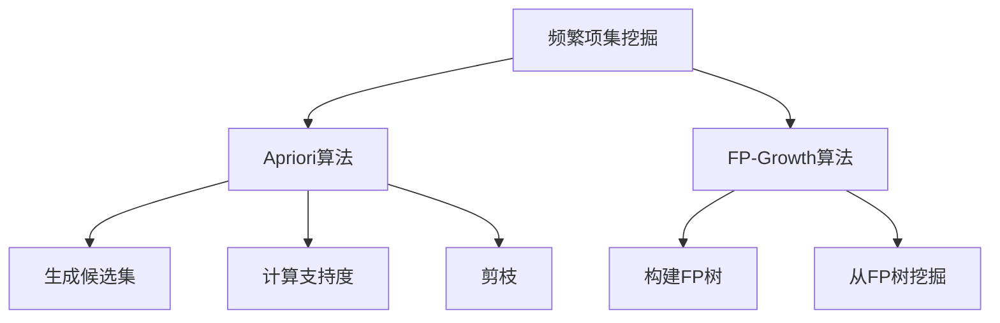

# Mahout频繁项挖掘原理与代码实例讲解

## 1.背景介绍

频繁项挖掘是数据挖掘领域中一个基础且重要的任务,旨在从大规模数据集中发现经常出现的项集模式。这种模式可以为各种应用提供有价值的见解,例如市场篮分析、网页挖掘、基因序列分析等。Apache Mahout是一个可扩展的机器学习库,提供了多种数据挖掘算法的实现,其中就包括频繁项挖掘算法。

### 1.1 什么是频繁项集

频繁项集(Frequent Itemset)是一组项(项目或事务),在给定的数据集中同时出现的频率超过了预设的最小支持度阈值。支持度是指包含该项集的事务数占所有事务数的比例。

例如,在一个超市的交易数据集中,如果{面包,牛奶}这个项集在20%的交易中同时出现,且我们设置最小支持度为15%,那么{面包,牛奶}就是一个频繁项集。

### 1.2 为什么要挖掘频繁项集

发现频繁项集对于以下应用场景非常有用:

- **关联规则挖掘**: 频繁项集是发现关联规则的基础,可以从中推导出"如果买了A,也可能买B"这样的规则。
- **市场篮分析**: 通过分析购物篮数据中的频繁项集,可以优化商品布局、促销策略等。
- **网页挖掘**: 发现网页浏览模式中的频繁项集,可以改善网站设计和个性化推荐。
- **基因序列分析**: 在基因组数据中发现频繁的基因序列模式,可以揭示基因的功能和相互作用。

## 2.核心概念与联系

### 2.1 支持度(Support)

支持度是衡量一个项集频繁程度的指标,定义为包含该项集的事务数占所有事务数的比例。数学表达式如下:

$$
\text{支持度}(X) = \frac{\text{包含项集}X\text{的事务数量}}{\text{总事务数量}}
$$

只有支持度高于预设的最小支持度阈值,项集才被视为频繁项集。

### 2.2 Apriori原理

Apriori是一种经典的频繁项集挖掘算法,它的核心思想是利用先验知识(Apriori)减少搜索空间。Apriori原理可以用下面两条性质来概括:

1. **子集频繁性质**: 如果一个项集是频繁的,那么它的所有非空子集也是频繁的。
2. **子集不频繁性质**: 如果一个项集是不频繁的,那么它的所有超集也是不频繁的。

基于这两条性质,Apriori算法采用迭代方法,从频繁1-项集开始,通过连接和剪枝生成候选k-项集,并计算它们的支持度来确定频繁k-项集。这种做法避免了对非频繁项集的无谓计算。

### 2.3 FP-Growth算法

FP-Growth(Frequent Pattern Growth)是另一种高效的频繁项集挖掘算法,它不需要像Apriori那样生成大量候选集。FP-Growth算法包括两个主要步骤:

1. **构建FP树**: 高效地将数据集压缩到一棵频繁模式树(FP-Tree)中,只保留频繁项集信息。
2. **从FP树中挖掘频繁项集**: 对FP树进行有序遍历,从而发现所有内嵌的频繁项集。

FP-Growth算法通过有效压缩数据集,避免了Apriori算法中大量候选集的生成和测试,从而提高了挖掘效率,尤其在处理高维、稀疏数据时表现优异。

### 2.4 Mermaid流程图



上图展示了频繁项集挖掘的两种核心算法Apriori和FP-Growth的工作流程。Apriori算法通过生成候选集、计算支持度和剪枝等步骤迭代发现频繁项集;而FP-Growth算法则通过构建FP树和从FP树挖掘的方式来高效发现频繁项集。

## 3.核心算法原理具体操作步骤

### 3.1 Apriori算法步骤

Apriori算法通过迭代的方式发现频繁项集,具体步骤如下:

1. **初始化**: 扫描数据集,统计每个项的支持度,找出所有频繁1-项集。
2. **连接步骤(join step)**: 对频繁k-项集进行自连接,生成候选(k+1)-项集。
3. **剪枝步骤(prune step)**: 根据Apriori原理的子集频繁性质,删除非频繁(k+1)-项集的子集。
4. **计算支持度**: 扫描数据集,计算候选(k+1)-项集的支持度。
5. **确定频繁(k+1)-项集**: 将支持度不小于最小支持度阈值的候选(k+1)-项集作为频繁(k+1)-项集。
6. **重复**: 重复步骤2到5,直到不能再找到更大的频繁项集为止。

这种做法虽然简单,但随着k值的增加,需要处理的候选集数量会迅速增长,效率下降严重。

### 3.2 FP-Growth算法步骤

FP-Growth算法包括两个主要步骤:

#### 3.2.1 构建FP树

1. **计算项支持度**: 扫描一次数据集,计算每个项的支持度。
2. **创建根节点**: 创建一个根节点表示FP树。
3. **插入事务**: 对于每个事务,按照项支持度的降序排列,构建前缀路径,插入到FP树中。如果已经存在该路径,则增加计数值;否则创建新的路径。

#### 3.2.2 从FP树挖掘频繁项集

1. **初始化**: 从FP树中获取每个项的支持度,构建头表链表。
2. **从头表链表中获取条件模式基**: 对于每个项,通过头表链表获取其前缀路径,构建条件模式基。
3. **构建条件FP树**: 对于每个条件模式基,构建一个条件FP树。
4. **递归挖掘频繁项集**: 对于每棵条件FP树,递归挖掘其频繁项集,并与后缀模式连接得到完整的频繁项集。

FP-Growth算法通过压缩数据集到FP树,避免了大量候选集的生成和测试,从而提高了效率。但在构建初始FP树时需要消耗较多内存。

## 4.数学模型和公式详细讲解举例说明

### 4.1 支持度公式

支持度是衡量一个项集频繁程度的关键指标,定义为包含该项集的事务数占所有事务数的比例。数学表达式如下:

$$
\text{支持度}(X) = \frac{\text{包含项集}X\text{的事务数量}}{\text{总事务数量}}
$$

其中:

- $X$是一个项集,包含一个或多个项。
- 分子是包含项集$X$的事务数量。
- 分母是整个数据集的总事务数量。

**示例**:

假设一个数据集包含10个事务,其中有3个事务包含项集{A, B},那么该项集的支持度为:

$$
\text{支持度}(\{A, B\}) = \frac{3}{10} = 0.3
$$

如果我们设置最小支持度阈值为0.2,那么{A, B}就是一个频繁项集。

### 4.2 置信度公式

置信度是评估关联规则"如果...那么..."的可信程度。对于一条规则$X \Rightarrow Y$,置信度定义为在包含$X$的事务中同时包含$Y$的比例:

$$
\text{置信度}(X \Rightarrow Y) = \frac{\text{支持度}(X \cup Y)}{\text{支持度}(X)}
$$

其中:

- $X$和$Y$是不相交的项集。
- 分子是$X$和$Y$的并集的支持度。
- 分母是$X$的支持度。

**示例**:

假设支持度($\{A, B\}$) = 0.3,支持度($\{A\}$) = 0.5,那么规则$A \Rightarrow B$的置信度为:

$$
\text{置信度}(A \Rightarrow B) = \frac{0.3}{0.5} = 0.6
$$

这意味着在包含A的交易中,有60%的交易也包含B。

### 4.3 利用Apriori原理剪枝

Apriori算法利用Apriori原理来减少搜索空间,避免对非频繁项集进行无谓计算。Apriori原理包括两条性质:

1. **子集频繁性质**: 如果一个项集是频繁的,那么它的所有非空子集也是频繁的。
2. **子集不频繁性质**: 如果一个项集是不频繁的,那么它的所有超集也是不频繁的。

利用这两条性质,Apriori算法可以在生成候选k-项集时进行剪枝,删除那些至少有一个(k-1)-子集是不频繁的候选项集。这样就避免了对肯定不会频繁的项集进行计算和检查。

**示例**:

假设我们已经找到了频繁2-项集{A, B}和{A, C},现在要生成候选3-项集。根据子集频繁性质,只有{A, B, C}可能是频繁的,因为它的所有2-子集{A, B}和{A, C}都是频繁的。而{A, B, D}就应该被剪枝,因为它的子集{B, D}是不频繁的。

通过这种方式,Apriori算法可以有效减少需要检查的候选项集数量,从而提高效率。

## 5.项目实践:代码实例和详细解释说明

在本节中,我们将使用Apache Mahout库中的FP-Growth算法实现来挖掘频繁项集。首先,我们需要准备一个事务数据集,每行表示一个事务,项与项之间用空格分隔。下面是一个示例数据集:

```
1 2 5
2 3 4
1 2 3 5
2 5
```

这个数据集包含4个事务,每个事务由一些项组成。我们的目标是发现在这个数据集中的频繁项集。

### 5.1 导入必要的库

```java
import org.apache.mahout.fpm.pfpgrowth.FPGrowthFrequentPatternMapper;
import org.apache.mahout.fpm.pfpgrowth.FPGrowthFrequentPatternDriver;
import org.apache.mahout.fpm.pfpgrowth.PFPGrowthMapRedUtil;
import org.apache.mahout.fpm.pfpgrowth.convertU2Csc;
import org.apache.hadoop.util.ToolRunner;
import org.apache.hadoop.conf.Configuration;
import org.apache.hadoop.fs.Path;
import org.apache.hadoop.io.Text;
import org.apache.hadoop.mapreduce.lib.input.SequenceFileInputFormat;
import org.apache.hadoop.mapreduce.lib.output.SequenceFileOutputFormat;
import org.apache.hadoop.mapreduce.Job;
```

这些导入语句包含了执行FP-Growth算法所需的类和接口。

### 5.2 设置配置参数

```java
Configuration conf = new Configuration();
conf.set("fs.defaultFS", "hdfs://localhost:9000");
conf.set("mapreduce.input.fileinputformat.input.dir", "input");
conf.set("mapreduce.output.fileoutputformat.output.dir", "output");
conf.setInt("fpgrowth.maxHeapSize", 1000);
conf.set("fpgrowth.minSupport", "0.5");
conf.set("fpgrowth.maxConfidence", "0.9");
```

这些配置参数包括:

- `fs.defaultFS`: HDFS文件系统的URL。
- `mapreduce.input.fileinputformat.input.dir`: 输入数据集的路径。
- `mapreduce.output.fileoutputformat.output.dir`: 输出结果的路径。
- `fpgrowth.maxHeapSize`: FP树中每个节点的最大子节点数。
- `fpgrowth.minSupport`: 最小支持度阈值,范围为(0, 1]。
- `fpgrowth.maxConfidence`: 最大置信度阈值,范围为(0, 1]。

###