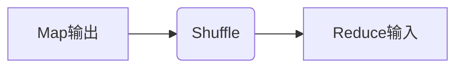

# MapReduce原理与代码实例讲解

## 1. 背景介绍

### 1.1 大数据时代的到来

随着互联网、物联网、移动互联网等新兴技术的快速发展,数据量呈现出爆炸式增长。如何有效地存储和处理这些海量数据,成为当前亟待解决的重要问题。传统的数据处理方式已经无法满足大数据时代的需求,因此迫切需要一种新的数据处理模型。

### 1.2 MapReduce的诞生

MapReduce是Google公司在2004年提出的一种分布式数据处理模型,用于解决海量数据的存储和计算问题。它的思想源于函数式编程中的Map和Reduce操作,将大规模数据处理任务分解为多个小任务,并行执行,最后将结果汇总。MapReduce的出现,为大数据时代的数据处理提供了一种全新的解决方案。

## 2. 核心概念与联系

### 2.1 MapReduce编程模型

MapReduce编程模型由两个主要函数组成:Map和Reduce。

- Map函数: 将输入数据集切分为多个小块,并对每个小块进行处理,生成中间结果。
- Reduce函数: 对Map函数的输出结果进行合并,生成最终结果。


### 2.2 MapReduce执行流程

1. 输入数据被切分为多个数据块,并分发到不同的Map任务节点。
2. Map任务并行处理各自的数据块,生成中间结果。
3. 系统对中间结果进行Shuffle操作,将具有相同键的值聚合在一起。
4. Reduce任务并行处理Shuffle后的数据,生成最终结果。
5. 最终结果被写入分布式文件系统。

### 2.3 MapReduce优势

- 高度可扩展性: 通过添加更多计算节点,可以线性扩展系统的计算能力。
- 高容错性: 任务失败时,可以自动重新调度和执行。
- 简单编程模型: 开发人员只需关注Map和Reduce函数的实现。
- 适用于各种数据处理场景: 如文本处理、数据分析、机器学习等。

## 3. 核心算法原理具体操作步骤

### 3.1 MapReduce算法原理

MapReduce算法的核心思想是将大规模数据处理任务分解为多个小任务,并行执行,最后合并结果。具体步骤如下:

1. **输入数据切分**: 将输入数据切分为多个数据块,每个数据块由一个Map任务处理。
2. **Map阶段**: 每个Map任务读取一个数据块,对其进行处理,生成中间结果(键值对)。
3. **Shuffle阶段**: 系统对Map任务的输出结果进行Shuffle操作,将具有相同键的值聚合在一起,形成(键,值列表)对。
4. **Reduce阶段**: 每个Reduce任务读取一个(键,值列表)对,对值列表进行处理,生成最终结果。
5. **输出结果**: 将Reduce任务的输出结果写入分布式文件系统。

### 3.2 Map函数

Map函数的作用是对输入数据进行处理,生成中间结果。Map函数的输入是一个(键,值)对,输出是一个或多个(键,值)对。

```python
def map_function(key, value):
    # 对输入数据进行处理
    ...
    # 生成中间结果
    emit(intermediate_key, intermediate_value)
```

### 3.3 Reduce函数

Reduce函数的作用是对Map函数的输出结果进行合并,生成最终结果。Reduce函数的输入是一个(键,值列表)对,输出是一个或多个(键,值)对。

```python
def reduce_function(key, value_list):
    # 对值列表进行处理
    ...
    # 生成最终结果
    emit(final_key, final_value)
```

### 3.4 Shuffle操作

Shuffle操作是MapReduce算法中一个关键步骤,它将Map任务的输出结果进行重新组织,将具有相同键的值聚合在一起,形成(键,值列表)对,作为Reduce任务的输入。



## 4. 数学模型和公式详细讲解举例说明

MapReduce算法可以用数学模型和公式进行描述,这有助于更深入地理解其原理。

### 4.1 MapReduce数学模型

假设输入数据集为$D$,将其切分为$n$个数据块$D_1, D_2, \ldots, D_n$。每个Map任务处理一个数据块,生成中间结果$M_i$,即:

$$M_i = map(D_i)$$

Shuffle操作将Map任务的输出结果重新组织,形成(键,值列表)对$R_j$:

$$R_j = shuffle(\bigcup_{i=1}^n M_i)$$

每个Reduce任务处理一个$R_j$,生成最终结果$O_j$:

$$O_j = reduce(R_j)$$

最终结果为所有Reduce任务的输出结果的并集:

$$O = \bigcup_{j=1}^m O_j$$

其中,$m$是Reduce任务的数量。

### 4.2 WordCount示例

WordCount是一个经典的MapReduce示例,用于统计文本文件中每个单词出现的次数。

**Map函数**:

```python
def map_function(key, value):
    # key: 文件偏移量
    # value: 文本行内容
    words = value.split()
    for word in words:
        emit(word, 1)
```

Map函数将每一行文本拆分为单词,并为每个单词生成一个(单词,1)的键值对。

**Reduce函数**:

```python
def reduce_function(key, value_list):
    # key: 单词
    # value_list: 该单词对应的计数列表
    count = sum(value_list)
    emit(key, count)
```

Reduce函数将具有相同键(单词)的值(计数)相加,得到每个单词的总计数。

通过MapReduce框架,可以并行执行多个Map和Reduce任务,高效地完成WordCount任务。

## 5. 项目实践:代码实例和详细解释说明

为了更好地理解MapReduce的实现,我们将使用Python编写一个简单的WordCount示例。

### 5.1 MapReduce框架

首先,我们需要实现一个简单的MapReduce框架,包括Map、Shuffle和Reduce三个阶段。

```python
def map_reduce(input_data, map_func, reduce_func):
    # Map阶段
    intermediate_data = []
    for data in input_data:
        intermediate_data.extend(map_func(data))

    # Shuffle阶段
    shuffled_data = {}
    for key, value in intermediate_data:
        if key in shuffled_data:
            shuffled_data[key].append(value)
        else:
            shuffled_data[key] = [value]

    # Reduce阶段
    output_data = []
    for key, value_list in shuffled_data.items():
        output_data.extend(reduce_func(key, value_list))

    return output_data
```

### 5.2 WordCount实现

接下来,我们实现WordCount的Map和Reduce函数。

```python
def map_word_count(data):
    # data: (文件名, 文本行内容)
    filename, line = data
    words = line.split()
    for word in words:
        yield (word, 1)

def reduce_word_count(key, value_list):
    # key: 单词
    # value_list: 该单词对应的计数列表
    count = sum(value_list)
    yield (key, count)
```

### 5.3 运行示例

最后,我们将输入数据、Map函数和Reduce函数传递给MapReduce框架,获得WordCount的结果。

```python
input_data = [
    ("file1.txt", "hello world hello"),
    ("file2.txt", "world python hello"),
    ("file3.txt", "python java python"),
]

output_data = map_reduce(input_data, map_word_count, reduce_word_count)
for word, count in output_data:
    print(f"{word}: {count}")
```

输出结果:

```
hello: 2
world: 2
python: 2
java: 1
```

通过这个简单的示例,我们可以更好地理解MapReduce的实现原理和代码细节。

## 6. 实际应用场景

MapReduce广泛应用于各种大数据处理场景,包括但不限于:

### 6.1 日志分析

通过MapReduce,可以高效地处理海量日志数据,统计访问量、错误率等指标,为网站优化和故障排查提供依据。

### 6.2 数据处理

MapReduce可以处理结构化、半结构化和非结构化数据,如文本、图像、视频等,为数据挖掘、机器学习等领域提供支持。

### 6.3 推荐系统

在推荐系统中,MapReduce可以用于处理用户行为数据、计算相似度、生成推荐结果等任务。

### 6.4 科学计算

MapReduce可以应用于天文学、生物信息学等领域,处理大规模科学数据,加速科研进程。

### 6.5 广告投放

在广告系统中,MapReduce可以用于分析用户兴趣、优化广告投放策略,提高广告效果。

## 7. 工具和资源推荐

### 7.1 Apache Hadoop

Apache Hadoop是最著名的开源MapReduce实现,提供了可靠、可扩展的分布式计算框架。Hadoop生态系统包括HDFS、MapReduce、Yarn等多个组件,可以满足各种大数据处理需求。

### 7.2 Apache Spark

Apache Spark是一种快速、通用的大数据处理引擎,支持批处理、流处理、机器学习等多种计算模型。Spark提供了高级API,如RDD、DataFrame和Dataset,简化了MapReduce编程。

### 7.3 云服务

许多云服务提供商,如Amazon Web Services、Microsoft Azure和Google Cloud Platform,都提供了基于MapReduce的大数据处理服务,如Amazon EMR、Azure HDInsight和Google Dataproc。这些服务可以快速部署和扩展MapReduce集群,降低维护成本。

### 7.4 开源资源

- Apache Hadoop官网: https://hadoop.apache.org/
- Apache Spark官网: https://spark.apache.org/
- MapReduce教程和示例代码: https://github.com/apache/hadoop/tree/trunk/hadoop-mapreduce-project/hadoop-mapreduce-examples

## 8. 总结:未来发展趋势与挑战

### 8.1 发展趋势

- 云计算和容器化: 将MapReduce部署在云环境中,利用容器技术提高资源利用率和灵活性。
- 流式处理: 结合流式处理框架,如Apache Kafka和Apache Flink,实现近乎实时的数据处理。
- 机器学习和人工智能: 将MapReduce与机器学习和人工智能技术相结合,提高数据处理和分析的智能化水平。

### 8.2 挑战

- 数据安全和隐私保护: 如何在大数据处理中保护敏感数据的安全和隐私,是一个亟待解决的问题。
- 资源管理和调度: 随着数据量和任务复杂度的增加,如何高效地管理和调度计算资源,是一个重要挑战。
- 系统优化和性能提升: 持续优化MapReduce系统的性能、可扩展性和容错性,以满足不断增长的计算需求。

## 9. 附录:常见问题与解答

### 9.1 MapReduce与传统数据处理方式有何不同?

传统的数据处理方式通常采用集中式架构,所有数据都存储在一个中央节点,由单个进程进行处理。这种方式在处理大规模数据时存在明显瓶颈,无法充分利用计算资源。

相比之下,MapReduce采用分布式架构,将大规模数据分散存储在多个节点上,并行执行多个Map和Reduce任务,充分利用了集群的计算能力。这种方式具有高度的可扩展性和容错性,能够有效处理海量数据。

### 9.2 MapReduce适合处理哪些类型的任务?

MapReduce非常适合处理可以并行化的批处理任务,如日志分析、数据处理、推荐系统等。对于需要实时处理的场景,MapReduce可能不太适合,这时可以考虑使用流式处理框架。

### 9.3 如何选择合适的MapReduce实现?

选择合适的MapReduce实现需要考虑多个因素,如开源或商业版本、社区活跃度、生态系统支持、性能和可扩展性等。Apache Hadoop和Apache Spark是两个广泛使用的开源MapReduce实现,具有活跃的社区和丰富的生态系