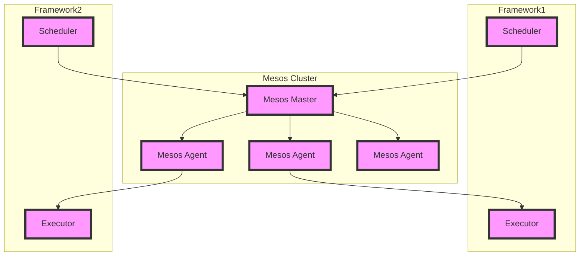

# Mesos原理与代码实例讲解

## 1.背景介绍

在现代分布式系统中,资源管理和调度是一个关键的挑战。随着应用程序的复杂性不断增加,以及基础设施的规模不断扩大,有效地管理和调度资源变得至关重要。Apache Mesos作为一个领先的集群资源管理和调度平台,为解决这一挑战提供了一种创新的方法。

Mesos最初由加州大学伯克利分校的AMPLab开发,旨在为各种类型的分布式应用程序提供资源共享和隔离。它采用了一种新颖的两级调度架构,将资源管理和任务调度分离,从而实现了高效、可扩展和灵活的资源利用。

### 1.1 资源管理的挑战

在传统的分布式系统中,每个应用程序通常都有自己的专用资源池。这种方式虽然简单,但会导致资源利用率低下,并增加了运维成本。另一方面,将所有资源集中管理又会带来单点故障的风险,并且难以满足不同应用程序的特殊需求。

### 1.2 Mesos的设计理念

Mesos旨在通过提供一个通用的资源共享和隔离层,来解决上述问题。它将整个集群视为一个共享的资源池,并允许多个并发的分布式应用程序动态地获取所需的资源。同时,Mesos还提供了资源隔离机制,确保不同应用程序之间的相互隔离,避免相互影响。

## 2.核心概念与联系

为了理解Mesos的工作原理,我们需要先介绍一些核心概念。

### 2.1 Mesos架构

Mesos采用了一种两级调度架构,包括以下三个主要组件:

1. **Mesos Master**:负责管理整个集群的资源,并将资源按需分配给不同的框架(Framework)。
2. **Mesos Agent**:运行在每个节点上,负责管理该节点的资源,并根据Master的指令启动和监控任务执行器(Executor)。
3. **Framework**:代表不同的分布式应用程序,负责注册到Mesos集群,并根据应用程序的需求向Master请求资源。每个Framework包含一个调度器(Scheduler)和一个或多个执行器(Executor)。



### 2.2 资源模型

Mesos将集群中的资源抽象为一组可配置的资源类型,例如CPU、内存、磁盘和端口等。每个资源都有一个标量值,表示该资源的数量或容量。

### 2.3 资源提供和调度

1. **资源提供**:Mesos Agent会周期性地将节点上的可用资源报告给Mesos Master。
2. **资源调度**:Mesos Master收到资源报告后,会将这些资源提供给注册的Framework。每个Framework的调度器根据应用程序的需求,向Master请求所需的资源。

### 2.4 任务执行

1. **任务启动**:当Master将资源分配给某个Framework时,它会通知相应的Mesos Agent启动一个任务执行器(Executor)。
2. **任务运行**:Executor负责运行实际的任务,并将任务状态报告给Framework调度器。
3. **任务终止**:任务完成后,Executor会将资源释放回Mesos Agent,以供后续任务使用。

## 3.核心算法原理具体操作步骤 

### 3.1 资源管理算法

Mesos采用了一种称为资源提供和调度的分层算法,用于管理和分配集群资源。

1. **资源提供**:Mesos Agent会周期性地将节点上的可用资源报告给Mesos Master。这个过程由一个名为`ResourceProviderProcess`的进程负责。

2. **资源调度**:Mesos Master收到资源报告后,会将这些资源提供给注册的Framework。每个Framework的调度器根据应用程序的需求,向Master请求所需的资源。这个过程由一个名为`HierarchicalAllocatorProcess`的进程负责。

下面是资源管理算法的具体步骤:

1. Mesos Agent启动时,会创建一个`ResourceProviderProcess`实例。
2. `ResourceProviderProcess`会周期性地收集节点上的资源使用情况,包括CPU、内存、磁盘和端口等。
3. `ResourceProviderProcess`将收集到的资源信息打包成一个`ResourcesProviderMessage`,并发送给Mesos Master。
4. Mesos Master收到`ResourcesProviderMessage`后,会将其传递给`HierarchicalAllocatorProcess`。
5. `HierarchicalAllocatorProcess`根据各个Framework的资源请求,以及资源提供者提供的资源,进行资源分配。
6. `HierarchicalAllocatorProcess`将分配决策通知给相应的Framework调度器和Mesos Agent。
7. Mesos Agent收到分配决策后,会启动相应的任务执行器(Executor)。

### 3.2 任务调度算法

Mesos采用了一种称为延迟调度(Delay Scheduling)的算法,用于决定将任务分配到哪个节点上执行。这个算法的目标是最大化集群资源的利用率,同时尽量减少任务之间的干扰。

延迟调度算法的基本思路是:当有新的任务需要调度时,不立即将其分配到某个节点上,而是将其放入一个延迟队列中。当有新的资源可用时,算法会从延迟队列中选择合适的任务进行调度。

具体步骤如下:

1. 当有新的任务需要调度时,Framework调度器会向Mesos Master发送一个`ResourceRequest`消息。
2. Mesos Master收到`ResourceRequest`后,会将其放入一个全局的延迟队列中。
3. 当有新的资源可用时(例如某个节点上的任务完成,释放了资源),Mesos Master会从延迟队列中选择合适的任务进行调度。
4. 选择任务时,算法会考虑多个因素,包括任务的资源需求、任务之间的亲和性、节点的可用资源等。
5. 一旦选择了合适的任务,Mesos Master会将其分配给相应的Mesos Agent,并通知Framework调度器。
6. Mesos Agent收到分配决策后,会启动相应的任务执行器(Executor)。

通过延迟调度算法,Mesos可以更好地利用集群资源,避免资源浪费,并减少任务之间的干扰。同时,这种算法也提供了一定的容错能力,因为任务可以被重新调度到其他节点上执行。

## 4.数学模型和公式详细讲解举例说明

在Mesos的资源管理和调度过程中,涉及到一些数学模型和公式。下面我们将详细讲解其中的一些关键模型和公式。

### 4.1 资源模型

Mesos将集群中的资源抽象为一组可配置的资源类型,例如CPU、内存、磁盘和端口等。每个资源都有一个标量值,表示该资源的数量或容量。

我们可以使用一个向量来表示一个节点上的资源:

$$\vec{r} = (r_1, r_2, \ldots, r_n)$$

其中,$$r_i$$表示第$$i$$种资源的数量或容量。

对于整个集群,我们可以将所有节点的资源求和,得到集群的总资源:

$$\vec{R} = \sum_{j=1}^{m} \vec{r}_j$$

其中,$$m$$是集群中节点的总数,$$\vec{r}_j$$是第$$j$$个节点的资源向量。

### 4.2 资源分配模型

当一个Framework请求资源时,它会向Mesos Master发送一个资源请求向量$$\vec{q}$$,表示它所需要的资源数量。Mesos Master需要决定是否可以满足这个请求,以及如何从集群中分配资源。

我们可以将这个问题建模为一个整数规划问题:

$$\begin{aligned}
\text{maximize} \quad & \sum_{j=1}^{m} \sum_{i=1}^{n} x_{ij} \\
\text{subject to} \quad & \sum_{j=1}^{m} x_{ij} r_{ij} \geq q_i, \quad \forall i \in \{1, \ldots, n\} \\
& x_{ij} \in \{0, 1\}, \quad \forall i \in \{1, \ldots, n\}, j \in \{1, \ldots, m\}
\end{aligned}$$

其中,$$x_{ij}$$是一个二值变量,表示是否将第$$j$$个节点的第$$i$$种资源分配给该Framework。目标函数是最大化分配的资源数量。约束条件保证了每种资源的分配量都满足Framework的需求。

这个整数规划问题是NP-难的,因此Mesos采用了一种启发式算法来近似求解。具体算法细节较为复杂,感兴趣的读者可以参考Mesos的源代码和相关论文。

### 4.3 任务调度模型

在延迟调度算法中,Mesos需要决定将哪些任务分配到哪些节点上执行。这个问题可以建模为一个二元线性分配问题。

假设有$$m$$个节点和$$n$$个任务,我们定义一个$$m \times n$$的分配矩阵$$X$$,其中$$x_{ij}$$表示任务$$j$$是否分配到节点$$i$$上执行。我们希望最小化任务之间的干扰,因此可以定义一个目标函数:

$$\text{minimize} \quad \sum_{i=1}^{m} \sum_{j=1}^{n} \sum_{k=1}^{n} x_{ij} x_{ik} c_{jk}$$

其中,$$c_{jk}$$表示任务$$j$$和任务$$k$$之间的干扰程度。

同时,我们需要满足以下约束条件:

1. 每个任务只能分配到一个节点上执行:

$$\sum_{i=1}^{m} x_{ij} = 1, \quad \forall j \in \{1, \ldots, n\}$$

2. 每个节点上分配的任务不能超过该节点的资源容量:

$$\sum_{j=1}^{n} x_{ij} r_j \leq R_i, \quad \forall i \in \{1, \ldots, m\}$$

其中,$$r_j$$是任务$$j$$的资源需求,$$R_i$$是节点$$i$$的资源容量。

这个二元线性分配问题也是NP-难的,Mesos采用了一种基于约束编程的启发式算法来近似求解。

通过上述数学模型和公式,Mesos可以更好地管理和调度集群资源,提高资源利用率,减少任务之间的干扰,从而提高整体系统的性能和效率。

## 5.项目实践：代码实例和详细解释说明

为了更好地理解Mesos的工作原理,我们将通过一个简单的示例项目来实践Mesos的使用。在这个示例中,我们将启动一个Mesos集群,并在其上运行一个简单的Python应用程序。

### 5.1 环境准备

首先,我们需要准备一个Mesos集群环境。你可以选择在本地使用Docker或Vagrant创建一个虚拟环境,也可以在云平台上创建一个Mesos集群。

对于本地环境,你可以使用Mesosphere提供的Docker镜像快速启动一个Mesos集群。具体步骤如下:

1. 安装Docker
2. 拉取Mesos Docker镜像:

```bash
docker pull mesosphere/mesos-master:1.9.0
docker pull mesosphere/mesos-agent:1.9.0
```

3. 启动Mesos Master:

```bash
docker run --name=mesos-master --ip=192.168.65.88 --net=host mesosphere/mesos-master:1.9.0
```

4. 启动Mesos Agent:

```bash
docker run --name=mesos-agent --privileged --net=host mesosphere/mesos-agent:1.9.0 --master=192.168.65.88:5050
```

现在,你已经有了一个运行中的Mesos集群,包括一个Master和一个Agent节点。

### 5.2 编写Python应用程序

接下来,我们将编写一个简单的Python应用程序,并将其作为Mesos框架运行在集群上。

创建一个名为`app.py`的Python文件,内容如下:

```python
import sys