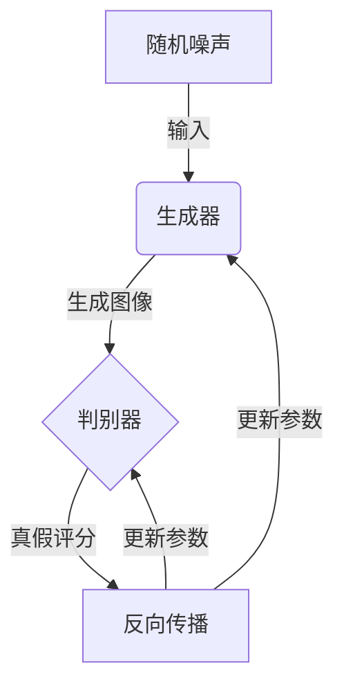
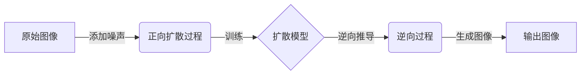
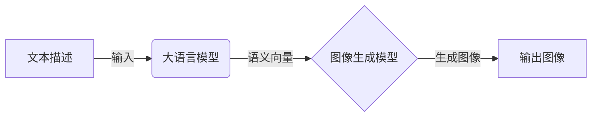

# Midjourney原理与代码实例讲解

## 1.背景介绍

### 1.1 人工智能绘画的兴起

近年来,人工智能技术在各个领域都取得了长足的进步,其中人工智能绘画也成为一个备受关注的热门话题。传统的数字绘画需要专业的绘画技能和大量的时间投入,而人工智能绘画则可以通过简单的文本描述快速生成高质量的图像,极大地降低了绘画的门槛。

### 1.2 Midjourney的崛起

在这一背景下,Midjourney作为一款基于人工智能的绘画工具应运而生。它由一家独立的人工智能研究实验室开发,利用最先进的人工智能技术,能够根据用户的文本描述生成逼真的图像。自2022年7月推出以来,Midjourney因其卓越的绘画效果和简单易用的操作界面,迅速在全球范围内获得了广泛的关注和好评。

## 2.核心概念与联系  

### 2.1 生成式对抗网络(GAN)

Midjourney的核心技术是基于生成式对抗网络(Generative Adversarial Network,GAN)。GAN由两个神经网络模型组成:生成器(Generator)和判别器(Discriminator)。

生成器的任务是根据输入的随机噪声,生成尽可能逼真的图像数据。而判别器则需要判断生成器生成的图像是真是假。两个模型相互对抗,生成器不断努力生成更加逼真的图像来迷惑判别器,而判别器也在不断提高对真假图像的识别能力。



经过大量的训练迭代,生成器最终能够生成高度逼真的图像,而判别器也能够较准确地识别真假图像。这种对抗性的训练过程使得GAN在图像生成任务上取得了非常出色的表现。

### 2.2 扩散模型(Diffusion Model)

除了GAN之外,Midjourney还采用了扩散模型(Diffusion Model)的技术。扩散模型是一种新兴的生成模型,其原理是通过学习图像的噪声分布,然后反向推导出逆过程,即从噪声中重建出原始图像。



扩散模型在图像生成任务上表现出色,生成的图像质量高、细节丰富、artifact较少。Midjourney结合了GAN和扩散模型的优势,从而实现了更加优秀的图像生成效果。

### 2.3 大语言模型(Large Language Model)

为了实现从文本描述到图像生成的过程,Midjourney采用了大型语言模型(Large Language Model,LLM)。LLM通过在大量文本数据上进行训练,学习到了丰富的语义和上下文信息。

Midjourney将用户输入的文本描述输入到LLM中,LLM会输出一个对应的语义向量表示。该语义向量将作为条件输入到图像生成模型(GAN或扩散模型)中,指导模型生成符合文本描述的图像。



大语言模型的引入使得Midjourney能够理解和捕捉复杂的语义信息,从而生成更加贴合文本描述的高质量图像。

## 3.核心算法原理具体操作步骤

### 3.1 数据预处理

在训练Midjourney的模型之前,需要对数据进行预处理,包括数据清洗、标注和增强等步骤。

1. **数据清洗**:过滤掉低质量、重复、不相关的图像和文本数据,保证数据的质量和一致性。

2. **数据标注**:为每个图像数据添加对应的文本描述标签,这是训练数据的关键步骤。可以采用人工标注或基于现有模型的自动标注方式。

3. **数据增强**:通过各种数据增强技术(如旋转、翻转、裁剪等)生成更多的训练数据,增加数据的多样性,提高模型的泛化能力。

### 3.2 模型训练

经过数据预处理后,就可以开始训练Midjourney的核心模型了,包括语义模型(LLM)和图像生成模型(GAN或扩散模型)。

1. **语义模型训练**:将文本描述数据输入到LLM中进行训练,使其能够学习到丰富的语义和上下文信息,并将其映射到一个语义向量空间中。

2. **图像生成模型训练**:
   - **GAN训练**:生成器和判别器相互对抗,生成器努力生成更加逼真的图像,判别器则努力区分真假图像。通过反向传播不断更新两个模型的参数,最终使生成器能够生成高质量的图像。
   - **扩散模型训练**:首先学习图像的噪声分布,然后反向推导出从噪声到原始图像的逆过程。通过大量的训练迭代,模型能够从纯噪声中重建出高质量的图像。

在训练过程中,语义向量将作为条件输入到图像生成模型中,指导模型生成符合文本描述的图像。通过端到端的训练,模型能够学习到从文本到图像的映射关系。

### 3.3 图像生成

经过充分的训练后,Midjourney就可以用于实际的图像生成任务了。具体的操作步骤如下:

1. 用户输入一个文本描述,描述希望生成的图像内容和风格。

2. 将文本描述输入到语义模型(LLM)中,得到对应的语义向量表示。

3. 将语义向量作为条件输入到图像生成模型(GAN或扩散模型)中。

4. 图像生成模型根据语义向量的指导,生成符合文本描述的图像。

5. 对生成的图像进行后处理(如调整对比度、锐化等),得到最终的输出图像。

通过上述步骤,Midjourney就能够根据用户的文本描述,自动生成逼真的、高质量的图像,大大提高了绘画的效率和便利性。

## 4.数学模型和公式详细讲解举例说明

### 4.1 生成式对抗网络(GAN)

生成式对抗网络(GAN)由生成器G和判别器D组成,它们相互对抗的目标可以用一个min-max游戏来表示:

$$\min_{G}\max_{D}V(D,G)=\mathbb{E}_{x\sim p_{data}(x)}[\log D(x)]+\mathbb{E}_{z\sim p_{z}(z)}[\log(1-D(G(z)))]$$

其中:
- $p_{data}(x)$是真实数据的分布
- $p_z(z)$是输入噪声的分布,通常是高斯分布或均匀分布
- $G(z)$是生成器根据噪声$z$生成的假数据
- $D(x)$是判别器对于真实数据$x$的输出,值越接近1表示判断为真实数据的可能性越大

在训练过程中,生成器G和判别器D相互对抗,G的目标是最小化$V(D,G)$,使得生成的假数据能够尽可能迷惑D;而D的目标是最大化$V(D,G)$,以提高对真假数据的区分能力。

通过交替优化G和D的参数,最终可以得到一个能够生成高质量图像的生成器G。

### 4.2 扩散模型(Diffusion Model)

扩散模型的核心思想是通过学习数据的噪声分布,然后反向推导出从噪声到原始数据的逆过程。具体来说,正向扩散过程可以表示为:

$$q(\mathbf{x}_t|\mathbf{x}_0)=\mathcal{N}(\mathbf{x}_t;\sqrt{1-\beta_t}\mathbf{x}_0,\beta_t\mathbf{I})$$

其中$\mathbf{x}_0$是原始数据,$\mathbf{x}_t$是在时间步$t$添加了噪声的数据,$\beta_t$是一个方差系数,控制了噪声的强度。

在训练过程中,模型需要学习从$\mathbf{x}_t$到$\mathbf{x}_{t-1}$的逆过程,即去噪过程:

$$q(\mathbf{x}_{t-1}|\mathbf{x}_t,\mathbf{x}_0)=\mathcal{N}(\mathbf{x}_{t-1};\mu_t(\mathbf{x}_t,\mathbf{x}_0),\Sigma_t)$$

其中$\mu_t$是一个神经网络,用于预测$\mathbf{x}_{t-1}$的均值,$\Sigma_t$是方差。通过最小化重构误差来训练$\mu_t$,使其能够较准确地从噪声中重建出原始数据。

在推理阶段,我们从纯噪声$\mathbf{x}_T\sim\mathcal{N}(0,\mathbf{I})$开始,通过迭代的方式应用去噪过程,最终可以生成出高质量的图像数据。

### 4.3 大语言模型(LLM)

大语言模型通常采用Transformer的结构,能够有效捕捉长距离的上下文依赖关系。其核心是Self-Attention机制,可以用下式表示:

$$\mathrm{Attention}(Q,K,V)=\mathrm{softmax}(\frac{QK^T}{\sqrt{d_k}})V$$

其中$Q$、$K$、$V$分别表示Query、Key和Value,它们都是通过线性变换得到的向量。$d_k$是缩放因子,用于防止内积过大导致梯度消失。

Self-Attention的计算过程是:对于每个Query向量,先与所有Key向量计算相似性得分,然后通过softmax函数得到注意力权重,最后将权重与Value向量加权求和,得到该Query对应的输出向量。

通过堆叠多层Self-Attention和前馈神经网络,LLM能够学习到丰富的语义和上下文信息,并将文本映射到一个语义向量空间中,为下游的图像生成任务提供有效的条件信息。

## 5.项目实践:代码实例和详细解释说明

为了更好地理解Midjourney的原理和实现,我们将通过一个简化的代码示例来演示其核心流程。这个示例使用PyTorch框架,结合了GAN和LLM的思想,能够根据文本描述生成简单的手写数字图像。

### 5.1 导入必要的库

```python
import torch
import torch.nn as nn
import torch.optim as optim
from torchvision import transforms, datasets
```

### 5.2 定义生成器和判别器

```python
class Generator(nn.Module):
    def __init__(self, noise_dim, text_dim, img_dim):
        super().__init__()
        self.noise_dim = noise_dim
        self.text_dim = text_dim
        self.img_dim = img_dim

        # 定义生成器网络结构
        # ...

    def forward(self, noise, text_emb):
        # 将噪声和文本嵌入向量作为输入
        # 通过网络生成图像
        # ...
        return img

class Discriminator(nn.Module):
    def __init__(self, img_dim, text_dim):
        super().__init__()
        self.img_dim = img_dim
        self.text_dim = text_dim

        # 定义判别器网络结构
        # ...

    def forward(self, img, text_emb):
        # 将图像和文本嵌入向量作为输入
        # 通过网络判断图像是真是假
        # ...
        return validity
```

### 5.3 定义文本编码器

```python
class TextEncoder(nn.Module):
    def __init__(self, vocab_size, emb_dim, hidden_dim):
        super().__init__()
        self.embedding = nn.Embedding(vocab_size, emb_dim)
        self.rnn = nn.GRU(emb_dim, hidden_dim, batch_first=True)

    def forward(self, text):
        # 将文本转换为词嵌入向量
        embedded = self.embedding(text)
        
        # 通过RNN编码器获取文本的隐状态向量
        