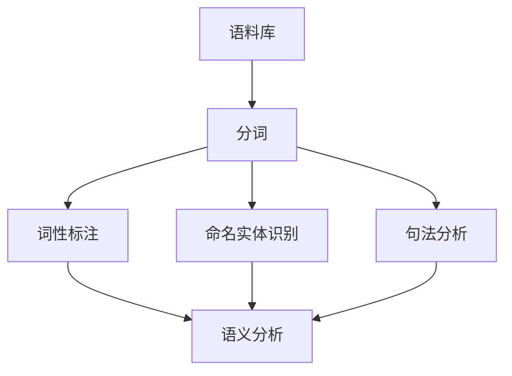

# NLTK 原理与代码实战案例讲解

## 1.背景介绍
### 1.1 自然语言处理的概念
自然语言处理(Natural Language Processing,NLP)是人工智能的一个重要分支,旨在让计算机能够理解、生成和处理人类语言。NLP涉及语言学、计算机科学、数学等多个学科,是一个跨学科的研究领域。

### 1.2 NLTK的由来
NLTK(Natural Language Toolkit)是一个用Python编写的自然语言处理工具包,由Steven Bird和Edward Loper在宾夕法尼亚大学开发。NLTK提供了易于使用的接口,可以访问50多个语料库和词汇资源,如WordNet,以及一套用于分类、标记化、词干提取、解析、语义推理等的文本处理库。

### 1.3 NLTK的应用场景
NLTK在学术研究和工业应用中都有广泛的应用,常见的应用场景包括:

- 文本分类:将文本按照主题、情感等分类
- 信息抽取:从文本中抽取关键信息,如人名、地名、组织机构名等
- 机器翻译:将一种语言的文本翻译成另一种语言
- 情感分析:分析文本中表达的情感是正面、负面还是中性
- 文本摘要:自动生成文本的摘要
- 问答系统:根据用户的问题,从文本中找到相应的答案

## 2.核心概念与联系
### 2.1 语料库(Corpus)
语料库是一个大型的结构化文本集合。NLTK提供了多种语料库,如布朗语料库、古腾堡语料库等。通过语料库,我们可以进行各种语言分析和研究。

### 2.2 分词(Tokenization)  
分词是将文本划分成一系列词(token)的过程。分词是文本处理的基础,后续的词性标注、命名实体识别等任务都依赖于分词的结果。NLTK提供了多种分词器,如基于规则的正则表达式分词器和基于统计的最大熵分词器等。

### 2.3 词性标注(Part-of-Speech Tagging)
词性标注是为文本中的每个词标注词性(如名词、动词、形容词等)的过程。词性信息可以帮助我们更好地理解文本的语法结构和语义信息。NLTK提供了多种词性标注器,如基于规则的Unigram标注器和基于统计的隐马尔可夫模型标注器等。

### 2.4 命名实体识别(Named Entity Recognition)
命名实体识别是识别文本中的命名实体(如人名、地名、组织机构名等)并将其归类到预定义类别的过程。NLTK提供了基于分类器的命名实体识别器,可以使用不同的分类算法,如决策树、最大熵等。

### 2.5 句法分析(Syntactic Parsing)
句法分析是分析句子的语法结构,确定句子中词与词之间的关系。常见的句法分析方法有短语结构句法分析和依存句法分析。NLTK提供了多种句法分析器,如基于规则的递归下降分析器和基于统计的PCFG分析器等。

### 2.6 语义分析(Semantic Analysis)  
语义分析是分析文本的语义信息,包括词义消歧、语义角色标注、指代消解等任务。NLTK提供了WordNet等语义资源,可以用于词义消歧和语义相似度计算等任务。

### 2.7 核心概念之间的联系

从上面的流程图可以看出,语料库是自然语言处理的基础,分词是后续任务的基础。词性标注、命名实体识别和句法分析可以并行进行,它们的结果都可以用于语义分析。

## 3.核心算法原理具体操作步骤
### 3.1 分词算法
#### 3.1.1 基于字典的分词
基于字典的分词是根据预定义的词典,将文本划分成词典中的词。具体步骤如下:

1. 加载预定义的词典
2. 对文本进行扫描,从左到右匹配词典中的词
3. 若匹配成功,则将匹配到的词加入结果列表,继续扫描剩余文本
4. 若匹配失败,则将当前字符作为一个词加入结果列表,继续扫描剩余文本
5. 重复步骤2-4,直到文本扫描完毕

#### 3.1.2 基于统计的分词
基于统计的分词是根据语料库中词的统计信息,如词频、互信息等,来决定分词的边界。常见的统计分词算法有最大匹配算法和最大熵算法等。以最大匹配算法为例,具体步骤如下:

1. 加载语料库,统计词频等信息
2. 对文本进行扫描,从左到右取最大长度的子串(如5个字)
3. 在语料库中查找该子串,若存在,则将其作为一个词加入结果列表,继续扫描剩余文本;若不存在,则去掉最后一个字,重复步骤3
4. 重复步骤2-3,直到文本扫描完毕

### 3.2 词性标注算法
#### 3.2.1 基于规则的词性标注
基于规则的词性标注是根据预定义的规则,为每个词标注词性。具体步骤如下:

1. 加载预定义的词性标注规则
2. 对文本进行分词
3. 对每个词应用词性标注规则,得到其词性
4. 将词性标注结果加入结果列表
5. 重复步骤3-4,直到所有词都标注完毕

#### 3.2.2 基于统计的词性标注
基于统计的词性标注是根据语料库中词的统计信息,如词性的先验概率、词性转移概率等,来决定每个词的词性。常见的统计词性标注算法有隐马尔可夫模型(HMM)和最大熵马尔可夫模型(MEMM)等。以HMM为例,具体步骤如下:

1. 加载语料库,统计词性的先验概率和转移概率等信息
2. 对文本进行分词
3. 使用Viterbi算法,根据HMM模型,计算每个词的词性
4. 将词性标注结果加入结果列表
5. 重复步骤3-4,直到所有词都标注完毕

### 3.3 命名实体识别算法
命名实体识别通常使用基于分类器的方法,如决策树、最大熵等。以最大熵为例,具体步骤如下:

1. 加载带有命名实体标注的语料库
2. 提取特征,如词本身、词性、上下文等
3. 使用最大熵分类器训练模型
4. 对测试文本进行分词和特征提取
5. 使用训练好的最大熵模型,对每个词进行分类,得到其命名实体类别
6. 将命名实体识别结果加入结果列表

### 3.4 句法分析算法
#### 3.4.1 基于规则的句法分析
基于规则的句法分析是根据预定义的语法规则,构建句子的语法结构树。常见的规则句法分析算法有CYK算法和Earley算法等。以CYK算法为例,具体步骤如下:

1. 加载预定义的语法规则
2. 对文本进行分词和词性标注
3. 使用CYK算法,根据语法规则,自底向上构建句子的语法结构树
4. 将句法分析结果加入结果列表

#### 3.4.2 基于统计的句法分析
基于统计的句法分析是根据语料库中句子的统计信息,如PCFG规则的概率等,来构建句子的语法结构树。以PCFG为例,具体步骤如下:

1. 加载带有语法结构标注的语料库,统计PCFG规则的概率
2. 对文本进行分词和词性标注
3. 使用Viterbi算法,根据PCFG模型,计算句子的最优语法结构树
4. 将句法分析结果加入结果列表

## 4.数学模型和公式详细讲解举例说明
### 4.1 隐马尔可夫模型(HMM)
隐马尔可夫模型是一种统计模型,常用于词性标注等任务。HMM由状态集合、观测集合、初始状态概率、状态转移概率和观测概率组成。在词性标注任务中,状态对应词性,观测对应词。

HMM的三个基本问题:

1. 评估问题:给定模型和观测序列,计算观测序列的概率
2. 解码问题:给定模型和观测序列,计算最可能的状态序列
3. 学习问题:给定观测序列,估计模型参数

其中,解码问题可以使用Viterbi算法求解。Viterbi算法的递推公式为:

$$
\delta_t(i) = \max_{1 \leq j \leq N} [\delta_{t-1}(j) a_{ji}] b_i(o_t)
$$

其中,$\delta_t(i)$表示在时刻$t$状态为$i$的最大概率,$a_{ji}$表示从状态$j$转移到状态$i$的概率,$b_i(o_t)$表示在状态$i$下观测到$o_t$的概率。

例如,假设有一个简单的HMM模型,状态集合为{NN,VB},观测集合为{I,love,you},初始状态概率为{0.5,0.5},状态转移概率为{{0.7,0.3},{0.4,0.6}},观测概率为{{0.5,0.4,0.1},{0.1,0.3,0.6}}。给定观测序列"I love you",使用Viterbi算法求解最可能的状态序列:

1. 初始化:
   $\delta_1(NN) = 0.5 \times 0.5 = 0.25$
   $\delta_1(VB) = 0.5 \times 0.1 = 0.05$

2. 递推:
   $\delta_2(NN) = \max{0.25 \times 0.7, 0.05 \times 0.4} \times 0.4 = 0.07$
   $\delta_2(VB) = \max{0.25 \times 0.3, 0.05 \times 0.6} \times 0.3 = 0.0225$
   $\delta_3(NN) = \max{0.07 \times 0.7, 0.0225 \times 0.4} \times 0.1 = 0.0049$  
   $\delta_3(VB) = \max{0.07 \times 0.3, 0.0225 \times 0.6} \times 0.6 = 0.0081$

3. 终止:
   $P^* = \max{0.0049, 0.0081} = 0.0081$
   $i_3^* = \arg\max{0.0049, 0.0081} = VB$

4. 回溯:
   $i_2^* = \arg\max{0.07 \times 0.3, 0.0225 \times 0.6} = NN$
   $i_1^* = \arg\max{0.25 \times 0.7, 0.05 \times 0.4} = NN$

因此,最可能的状态序列为"NN NN VB"。

### 4.2 最大熵模型(Maximum Entropy Model)
最大熵模型是一种概率模型,常用于词性标注、命名实体识别等任务。最大熵模型的原理是在满足已知约束条件的情况下,选择熵最大的概率分布。

最大熵模型的数学形式为:

$$
P(y|x) = \frac{1}{Z(x)} \exp(\sum_{i=1}^n \lambda_i f_i(x,y))
$$

其中,$x$表示输入,$y$表示输出,$f_i(x,y)$表示第$i$个特征函数,$\lambda_i$表示第$i$个特征函数的权重,$Z(x)$是归一化因子,用于确保概率和为1。

最大熵模型的训练过程是求解特征函数权重$\lambda_i$,使得模型的熵最大化,同时满足特征函数的约束条件。常用的训练算法有GIS(Generalized Iterative Scaling)和IIS(Improved Iterative Scaling)等。

例如,假设有一个二分类问题,输入为单词,输出为词性(NN或VB)。选择两个特征函数:

$$
f_1(x,y) = \begin{cases}
1, & x \text{以ing结尾且} y=VB 