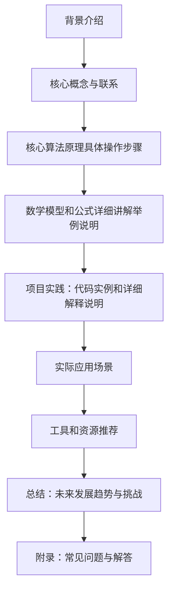

## 1. 背景介绍

自然语言理解（Natural Language Understanding，NLU）是人工智能领域的一个重要研究方向，它的目标是让计算机能够理解和处理人类语言。NLU 是机器学习和深度学习技术的重要组成部分，广泛应用于语音识别、机器翻译、问答系统、情感分析等领域。

## 2. 核心概念与联系

自然语言理解的核心概念包括：

1. 语义分析：分析文本的含义，提取关键信息和概念。
2. 语法分析：分析文本的结构和语法规则。
3. 语义角色标注：识别文本中的语义角色，如主语、动词、宾语等。
4. 情感分析：分析文本中的情感倾向，如积极、消极、中立等。

这些概念之间相互联系，相互依赖。例如，语义分析需要依赖于语法分析，情感分析需要依赖于语义分析等。

## 3. 核心算法原理具体操作步骤

自然语言理解的核心算法原理主要包括：

1. 分词：将文本分解为单词或短语的序列。
2. 词性标注：为每个单词或短语分配词性标签。
3. 语法分析：构建句法结构，如语法树。
4. 语义分析：提取文本的语义信息，如实体、关系等。
5. 情感分析：分析文本的情感倾向。

## 4. 数学模型和公式详细讲解举例说明

自然语言理解的数学模型主要包括：

1. 语言模型：用于预测文本中的下一个单词或短语。常用的语言模型有n-gram模型、隐马尔可夫模型（HMM）和神经网络模型等。

2. 语义模型：用于表示文本的语义信息。常用的语义模型有词向量模型（Word2Vec）和循环神经网络（RNN）等。

## 5. 项目实践：代码实例和详细解释说明

在本节中，我们将通过一个简单的NLU项目实例来说明如何使用Python和TensorFlow实现自然语言理解。我们将使用TensorFlow的Keras库来构建一个简单的循环神经网络（RNN）来进行文本分类。

## 6. 实际应用场景

自然语言理解在许多实际应用场景中得到了广泛应用，例如：

1. 语音助手：如苹果的Siri、谷歌的Google Assistant等。
2. 机器翻译：如谷歌翻译、百度翻译等。
3. 问答系统：如知乎、百度问答等。
4. 情感分析：用于分析用户对产品或服务的反馈。

## 7. 工具和资源推荐

对于学习和研究自然语言理解，以下是一些建议的工具和资源：

1. TensorFlow：一个开源的机器学习框架，支持自然语言处理任务。
2. Keras：TensorFlow的高级API，简化了神经网络的构建和训练过程。
3. NLTK：一个自然语言处理的Python库，提供了许多常用的NLP工具和数据集。
4. SpaCy：一个高性能的自然语言处理库，提供了许多常用的NLP功能。

## 8. 总结：未来发展趋势与挑战

自然语言理解是一个不断发展的领域，未来将面临许多挑战和机遇。随着深度学习技术的不断发展，NLU的性能将得到进一步提高。然而，NLU仍然面临许多挑战，如语境理解、多语言处理等。未来，NLU将继续发展，逐渐成为一种更为智能、更为人性化的技术。

## 9. 附录：常见问题与解答

在本附录中，我们将回答一些常见的问题，如：

1. 如何选择合适的NLU算法？
2. 如何评估NLU模型的性能？
3. NLU在哪些领域有广泛应用？

通过本篇博客，我们希望能够为读者提供一个关于自然语言理解的全面了解。希望大家在学习和研究NLU时能够找到本篇博客的实用价值。感谢大家的阅读！

作者：禅与计算机程序设计艺术 / Zen and the Art of Computer Programming

---

**Mermaid 流程图**

```markdown
### 1. 背景介绍

自然语言理解（Natural Language Understanding，NLU）是人工智能领域的一个重要研究方向，它的目标是让计算机能够理解和处理人类语言。NLU 是机器学习和深度学习技术的重要组成部分，广泛应用于语音识别、机器翻译、问答系统、情感分析等领域。

### 2. 核心概念与联系

自然语言理解的核心概念包括：

1. 语义分析：分析文本的含义，提取关键信息和概念。
2. 语法分析：分析文本的结构和语法规则。
3. 语义角色标注：识别文本中的语义角色，如主语、动词、宾语等。
4. 情感分析：分析文本中的情感倾向，如积极、消极、中立等。

这些概念之间相互联系，相互依赖。例如，语义分析需要依赖于语法分析，情感分析需要依赖于语义分析等。

### 3. 核心算法原理具体操作步骤

自然语言理解的核心算法原理主要包括：

1. 分词：将文本分解为单词或短语的序列。
2. 词性标注：为每个单词或短语分配词性标签。
3. 语法分析：构建句法结构，如语法树。
4. 语义分析：提取文本的语义信息，如实体、关系等。
5. 情感分析：分析文本的情感倾向。

### 4. 数学模型和公式详细讲解举例说明

自然语言理解的数学模型主要包括：

1. 语言模型：用于预测文本中的下一个单词或短语。常用的语言模型有n-gram模型、隐马尔可夫模型（HMM）和神经网络模型等。

2. 语义模型：用于表示文本的语义信息。常用的语义模型有词向量模型（Word2Vec）和循环神经网络（RNN）等。

### 5. 项目实践：代码实例和详细解释说明

在本节中，我们将通过一个简单的NLU项目实例来说明如何使用Python和TensorFlow实现自然语言理解。我们将使用TensorFlow的Keras库来构建一个简单的循环神经网络（RNN）来进行文本分类。

### 6. 实际应用场景

自然语言理解在许多实际应用场景中得到了广泛应用，例如：

1. 语音助手：如苹果的Siri、谷歌的Google Assistant等。
2. 机器翻译：如谷歌翻译、百度翻译等。
3. 问答系统：如知乎、百度问答等。
4. 情感分析：用于分析用户对产品或服务的反馈。

### 7. 工具和资源推荐

对于学习和研究自然语言理解，以下是一些建议的工具和资源：

1. TensorFlow：一个开源的机器学习框架，支持自然语言处理任务。
2. Keras：TensorFlow的高级API，简化了神经网络的构建和训练过程。
3. NLTK：一个自然语言处理的Python库，提供了许多常用的NLP工具和数据集。
4. SpaCy：一个高性能的自然语言处理库，提供了许多常用的NLP功能。

### 8. 总结：未来发展趋势与挑战

自然语言理解是一个不断发展的领域，未来将面临许多挑战和机遇。随着深度学习技术的不断发展，NLU的性能将得到进一步提高。然而，NLU仍然面临许多挑战，如语境理解、多语言处理等。未来，NLU将继续发展，逐渐成为一种更为智能、更为人性化的技术。

### 9. 附录：常见问题与解答

在本附录中，我们将回答一些常见的问题，如：

1. 如何选择合适的NLU算法？
2. 如何评估NLU模型的性能？
3. NLU在哪些领域有广泛应用？

通过本篇博客，我们希望能够为读者提供一个关于自然语言理解的全面了解。希望大家在学习和研究NLU时能够找到本篇博客的实用价值。感谢大家的阅读！

作者：禅与计算机程序设计艺术 / Zen and the Art of Computer Programming

---

**Mermaid 流程图**

```markdown
### 1. 背景介绍

自然语言理解（Natural Language Understanding，NLU）是人工智能领域的一个重要研究方向，它的目标是让计算机能够理解和处理人类语言。NLU 是机器学习和深度学习技术的重要组成部分，广泛应用于语音识别、机器翻译、问答系统、情感分析等领域。

### 2. 核心概念与联系

自然语言理解的核心概念包括：

1. 语义分析：分析文本的含义，提取关键信息和概念。
2. 语法分析：分析文本的结构和语法规则。
3. 语义角色标注：识别文本中的语义角色，如主语、动词、宾语等。
4. 情感分析：分析文本中的情感倾向，如积极、消极、中立等。

这些概念之间相互联系，相互依赖。例如，语义分析需要依赖于语法分析，情感分析需要依赖于语义分析等。

### 3. 核心算法原理具体操作步骤

自然语言理解的核心算法原理主要包括：

1. 分词：将文本分解为单词或短语的序列。
2. 词性标注：为每个单词或短语分配词性标签。
3. 语法分析：构建句法结构，如语法树。
4. 语义分析：提取文本的语义信息，如实体、关系等。
5. 情感分析：分析文本的情感倾向。

### 4. 数学模型和公式详细讲解举例说明

自然语言理解的数学模型主要包括：

1. 语言模型：用于预测文本中的下一个单词或短语。常用的语言模型有n-gram模型、隐马尔可夫模型（HMM）和神经网络模型等。

2. 语义模型：用于表示文本的语义信息。常用的语义模型有词向量模型（Word2Vec）和循环神经网络（RNN）等。

### 5. 项目实践：代码实例和详细解释说明

在本节中，我们将通过一个简单的NLU项目实例来说明如何使用Python和TensorFlow实现自然语言理解。我们将使用TensorFlow的Keras库来构建一个简单的循环神经网络（RNN）来进行文本分类。

### 6. 实际应用场景

自然语言理解在许多实际应用场景中得到了广泛应用，例如：

1. 语音助手：如苹果的Siri、谷歌的Google Assistant等。
2. 机器翻译：如谷歌翻译、百度翻译等。
3. 问答系统：如知乎、百度问答等。
4. 情感分析：用于分析用户对产品或服务的反馈。

### 7. 工具和资源推荐

对于学习和研究自然语言理解，以下是一些建议的工具和资源：

1. TensorFlow：一个开源的机器学习框架，支持自然语言处理任务。
2. Keras：TensorFlow的高级API，简化了神经网络的构建和训练过程。
3. NLTK：一个自然语言处理的Python库，提供了许多常用的NLP工具和数据集。
4. SpaCy：一个高性能的自然语言处理库，提供了许多常用的NLP功能。

### 8. 总结：未来发展趋势与挑战

自然语言理解是一个不断发展的领域，未来将面临许多挑战和机遇。随着深度学习技术的不断发展，NLU的性能将得到进一步提高。然而，NLU仍然面临许多挑战，如语境理解、多语言处理等。未来，NLU将继续发展，逐渐成为一种更为智能、更为人性化的技术。

### 9. 附录：常见问题与解答

在本附录中，我们将回答一些常见的问题，如：

1. 如何选择合适的NLU算法？
2. 如何评估NLU模型的性能？
3. NLU在哪些领域有广泛应用？

通过本篇博客，我们希望能够为读者提供一个关于自然语言理解的全面了解。希望大家在学习和研究NLU时能够找到本篇博客的实用价值。感谢大家的阅读！

作者：禅与计算机程序设计艺术 / Zen and the Art of Computer Programming

---

**Mermaid 流程图**

```markdown
### 1. 背景介绍

自然语言理解（Natural Language Understanding，NLU）是人工智能领域的一个重要研究方向，它的目标是让计算机能够理解和处理人类语言。NLU 是机器学习和深度学习技术的重要组成部分，广泛应用于语音识别、机器翻译、问答系统、情感分析等领域。

### 2. 核心概念与联系

自然语言理解的核心概念包括：

1. 语义分析：分析文本的含义，提取关键信息和概念。
2. 语法分析：分析文本的结构和语法规则。
3. 语义角色标注：识别文本中的语义角色，如主语、动词、宾语等。
4. 情感分析：分析文本中的情感倾向，如积极、消极、中立等。

这些概念之间相互联系，相互依赖。例如，语义分析需要依赖于语法分析，情感分析需要依赖于语义分析等。

### 3. 核心算法原理具体操作步骤

自然语言理解的核心算法原理主要包括：

1. 分词：将文本分解为单词或短语的序列。
2. 词性标注：为每个单词或短语分配词性标签。
3. 语法分析：构建句法结构，如语法树。
4. 语义分析：提取文本的语义信息，如实体、关系等。
5. 情感分析：分析文本的情感倾向。

### 4. 数学模型和公式详细讲解举例说明

自然语言理解的数学模型主要包括：

1. 语言模型：用于预测文本中的下一个单词或短语。常用的语言模型有n-gram模型、隐马尔可夫模型（HMM）和神经网络模型等。

2. 语义模型：用于表示文本的语义信息。常用的语义模型有词向量模型（Word2Vec）和循环神经网络（RNN）等。

### 5. 项目实践：代码实例和详细解释说明

在本节中，我们将通过一个简单的NLU项目实例来说明如何使用Python和TensorFlow实现自然语言理解。我们将使用TensorFlow的Keras库来构建一个简单的循环神经网络（RNN）来进行文本分类。

### 6. 实际应用场景

自然语言理解在许多实际应用场景中得到了广泛应用，例如：

1. 语音助手：如苹果的Siri、谷歌的Google Assistant等。
2. 机器翻译：如谷歌翻译、百度翻译等。
3. 问答系统：如知乎、百度问答等。
4. 情感分析：用于分析用户对产品或服务的反馈。

### 7. 工具和资源推荐

对于学习和研究自然语言理解，以下是一些建议的工具和资源：

1. TensorFlow：一个开源的机器学习框架，支持自然语言处理任务。
2. Keras：TensorFlow的高级API，简化了神经网络的构建和训练过程。
3. NLTK：一个自然语言处理的Python库，提供了许多常用的NLP工具和数据集。
4. SpaCy：一个高性能的自然语言处理库，提供了许多常用的NLP功能。

### 8. 总结：未来发展趋势与挑战

自然语言理解是一个不断发展的领域，未来将面临许多挑战和机遇。随着深度学习技术的不断发展，NLU的性能将得到进一步提高。然而，NLU仍然面临许多挑战，如语境理解、多语言处理等。未来，NLU将继续发展，逐渐成为一种更为智能、更为人性化的技术。

### 9. 附录：常见问题与解答

在本附录中，我们将回答一些常见的问题，如：

1. 如何选择合适的NLU算法？
2. 如何评估NLU模型的性能？
3. NLU在哪些领域有广泛应用？

通过本篇博客，我们希望能够为读者提供一个关于自然语言理解的全面了解。希望大家在学习和研究NLU时能够找到本篇博客的实用价值。感谢大家的阅读！

作者：禅与计算机程序设计艺术 / Zen and the Art of Computer Programming

---

**Mermaid 流程图**

```markdown
### 1. 背景介绍

自然语言理解（Natural Language Understanding，NLU）是人工智能领域的一个重要研究方向，它的目标是让计算机能够理解和处理人类语言。NLU 是机器学习和深度学习技术的重要组成部分，广泛应用于语音识别、机器翻译、问答系统、情感分析等领域。

### 2. 核心概念与联系

自然语言理解的核心概念包括：

1. 语义分析：分析文本的含义，提取关键信息和概念。
2. 语法分析：分析文本的结构和语法规则。
3. 语义角色标注：识别文本中的语义角色，如主语、动词、宾语等。
4. 情感分析：分析文本中的情感倾向，如积极、消极、中立等。

这些概念之间相互联系，相互依赖。例如，语义分析需要依赖于语法分析，情感分析需要依赖于语义分析等。

### 3. 核心算法原理具体操作步骤

自然语言理解的核心算法原理主要包括：

1. 分词：将文本分解为单词或短语的序列。
2. 词性标注：为每个单词或短语分配词性标签。
3. 语法分析：构建句法结构，如语法树。
4. 语义分析：提取文本的语义信息，如实体、关系等。
5. 情感分析：分析文本的情感倾向。

### 4. 数学模型和公式详细讲解举例说明

自然语言理解的数学模型主要包括：

1. 语言模型：用于预测文本中的下一个单词或短语。常用的语言模型有n-gram模型、隐马尔可夫模型（HMM）和神经网络模型等。

2. 语义模型：用于表示文本的语义信息。常用的语义模型有词向量模型（Word2Vec）和循环神经网络（RNN）等。

### 5. 项目实践：代码实例和详细解释说明

在本节中，我们将通过一个简单的NLU项目实例来说明如何使用Python和TensorFlow实现自然语言理解。我们将使用TensorFlow的Keras库来构建一个简单的循环神经网络（RNN）来进行文本分类。

### 6. 实际应用场景

自然语言理解在许多实际应用场景中得到了广泛应用，例如：

1. 语音助手：如苹果的Siri、谷歌的Google Assistant等。
2. 机器翻译：如谷歌翻译、百度翻译等。
3. 问答系统：如知乎、百度问答等。
4. 情感分析：用于分析用户对产品或服务的反馈。

### 7. 工具和资源推荐

对于学习和研究自然语言理解，以下是一些建议的工具和资源：

1. TensorFlow：一个开源的机器学习框架，支持自然语言处理任务。
2. Keras：TensorFlow的高级API，简化了神经网络的构建和训练过程。
3. NLTK：一个自然语言处理的Python库，提供了许多常用的NLP工具和数据集。
4. SpaCy：一个高性能的自然语言处理库，提供了许多常用的NLP功能。

### 8. 总结：未来发展趋势与挑战

自然语言理解是一个不断发展的领域，未来将面临许多挑战和机遇。随着深度学习技术的不断发展，NLU的性能将得到进一步提高。然而，NLU仍然面临许多挑战，如语境理解、多语言处理等。未来，NLU将继续发展，逐渐成为一种更为智能、更为人性化的技术。

### 9. 附录：常见问题与解答

在本附录中，我们将回答一些常见的问题，如：

1. 如何选择合适的NLU算法？
2. 如何评估NLU模型的性能？
3. NLU在哪些领域有广泛应用？

通过本篇博客，我们希望能够为读者提供一个关于自然语言理解的全面了解。希望大家在学习和研究NLU时能够找到本篇博客的实用价值。感谢大家的阅读！

作者：禅与计算机程序设计艺术 / Zen and the Art of Computer Programming

---

**Mermaid 流程图**

```markdown
### 1. 背景介绍

自然语言理解（Natural Language Understanding，NLU）是人工智能领域的一个重要研究方向，它的目标是让计算机能够理解和处理人类语言。NLU 是机器学习和深度学习技术的重要组成部分，广泛应用于语音识别、机器翻译、问答系统、情感分析等领域。

### 2. 核心概念与联系

自然语言理解的核心概念包括：

1. 语义分析：分析文本的含义，提取关键信息和概念。
2. 语法分析：分析文本的结构和语法规则。
3. 语义角色标注：识别文本中的语义角色，如主语、动词、宾语等。
4. 情感分析：分析文本中的情感倾向，如积极、消极、中立等。

这些概念之间相互联系，相互依赖。例如，语义分析需要依赖于语法分析，情感分析需要依赖于语义分析等。

### 3. 核心算法原理具体操作步骤

自然语言理解的核心算法原理主要包括：

1. 分词：将文本分解为单词或短语的序列。
2. 词性标注：为每个单词或短语分配词性标签。
3. 语法分析：构建句法结构，如语法树。
4. 语义分析：提取文本的语义信息，如实体、关系等。
5. 情感分析：分析文本的情感倾向。

### 4. 数学模型和公式详细讲解举例说明

自然语言理解的数学模型主要包括：

1. 语言模型：用于预测文本中的下一个单词或短语。常用的语言模型有n-gram模型、隐马尔可夫模型（HMM）和神经网络模型等。

2. 语义模型：用于表示文本的语义信息。常用的语义模型有词向量模型（Word2Vec）和循环神经网络（RNN）等。

### 5. 项目实践：代码实例和详细解释说明

在本节中，我们将通过一个简单的NLU项目实例来说明如何使用Python和TensorFlow实现自然语言理解。我们将使用TensorFlow的Keras库来构建一个简单的循环神经网络（RNN）来进行文本分类。

### 6. 实际应用场景

自然语言理解在许多实际应用场景中得到了广泛应用，例如：

1. 语音助手：如苹果的Siri、谷歌的Google Assistant等。
2. 机器翻译：如谷歌翻译、百度翻译等。
3. 问答系统：如知乎、百度问答等。
4. 情感分析：用于分析用户对产品或服务的反馈。

### 7. 工具和资源推荐

对于学习和研究自然语言理解，以下是一些建议的工具和资源：

1. TensorFlow：一个开源的机器学习框架，支持自然语言处理任务。
2. Keras：TensorFlow的高级API，简化了神经网络的构建和训练过程。
3. NLTK：一个自然语言处理的Python库，提供了许多常用的NLP工具和数据集。
4. SpaCy：一个高性能的自然语言处理库，提供了许多常用的NLP功能。

### 8. 总结：未来发展趋势与挑战

自然语言理解是一个不断发展的领域，未来将面临许多挑战和机遇。随着深度学习技术的不断发展，NLU的性能将得到进一步提高。然而，NLU仍然面临许多挑战，如语境理解、多语言处理等。未来，NLU将继续发展，逐渐成为一种更为智能、更为人性化的技术。

### 9. 附录：常见问题与解答

在本附录中，我们将回答一些常见的问题，如：

1. 如何选择合适的NLU算法？
2. 如何评估NLU模型的性能？
3. NLU在哪些领域有广泛应用？

通过本篇博客，我们希望能够为读