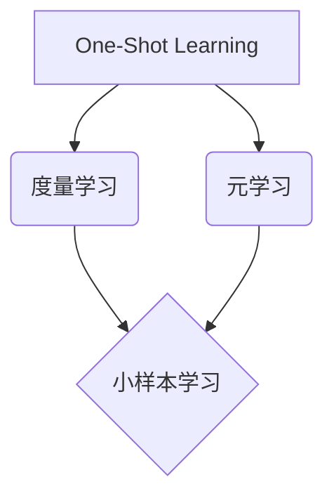

# One-Shot Learning原理与代码实例讲解

## 1. 背景介绍

### 1.1 One-Shot Learning的定义与起源

One-Shot Learning(单样本学习)是一种只需要极少量训练样本就能快速学习新类别的机器学习方法。与传统的深度学习方法不同,One-Shot Learning不需要大量的标注数据进行训练,而是通过学习任务之间的相似性,利用已学习过的知识快速适应新的任务。这种学习范式的灵感来源于人类强大的学习能力,即通过单个或极少的样本就能认识新事物。

### 1.2 One-Shot Learning的重要性

在现实世界中,很多应用场景下获取大量标注数据是非常困难和昂贵的,比如医学影像分类、人脸识别等。One-Shot Learning的出现为解决小样本学习问题提供了新的思路,具有广阔的应用前景。此外,One-Shot Learning作为一种更接近人类学习方式的范式,对于探索人工智能的本质和发展具有重要意义。

### 1.3 One-Shot Learning的发展历程

One-Shot Learning的研究最早可以追溯到20世纪90年代,当时的主要方法是基于概率模型和决策理论。进入21世纪后,随着深度学习的兴起,基于度量学习和元学习的One-Shot Learning方法逐渐成为主流。近年来,One-Shot Learning在人脸识别、行人再识别、图像分类等领域取得了长足进展,但如何进一步提高模型的泛化能力和鲁棒性仍是亟待解决的难题。

## 2. 核心概念与联系

### 2.1 核心概念

#### 2.1.1 度量学习(Metric Learning)

度量学习是One-Shot Learning的核心概念之一。其目标是学习一个度量空间,使得在该空间中,相同类别的样本之间距离较近而不同类别的样本之间距离较远。常见的度量学习方法有Siamese Network和Triplet Network。

#### 2.1.2 元学习(Meta Learning)

元学习又称为"学会学习",是One-Shot Learning的另一个核心概念。元学习旨在学习一个通用的学习器,使其能够从少量样本中快速学习新任务。代表性的元学习方法有MAML(Model-Agnostic Meta-Learning)和Prototypical Networks。

#### 2.1.3 小样本学习(Few-Shot Learning)

小样本学习是One-Shot Learning的一种推广,指的是利用少量(通常是1~5个)标注样本学习新类别的问题。N-way K-shot是小样本学习常用的实验协议,表示学习N个新类别,每个类别有K个标注样本。

### 2.2 核心概念之间的联系

下面是度量学习、元学习和小样本学习三者之间关系的Mermaid流程图:



度量学习和元学习是实现One-Shot Learning的两大核心技术路线。度量学习通过学习样本间的相似性度量,使得模型能够区分不同类别;元学习则是学习一个快速适应新任务的学习器。小样本学习是One-Shot Learning的推广,采用度量学习或元学习都可以解决小样本学习问题。

## 3. 核心算法原理具体操作步骤

### 3.1 基于度量学习的方法

#### 3.1.1 Siamese Network

Siamese Network由两个结构相同的子网络组成,用于学习两个样本之间的相似度。给定一个样本对(x1, x2),两个子网络分别将其映射到嵌入空间,然后通过一个度量函数(如欧氏距离)计算它们的相似度。训练时,最小化同类样本对的距离,最大化异类样本对的距离。

算法步骤:
1. 构建两个结构相同的子网络(如CNN)
2. 将输入样本对(x1, x2)分别送入两个子网络,得到特征表示(f1, f2) 
3. 计算f1和f2在嵌入空间的距离d=||f1-f2||
4. 如果(x1, x2)属于同一类别,最小化d;否则最大化d
5. 重复步骤2-4,直到模型收敛

#### 3.1.2 Triplet Network 

Triplet Network是Siamese Network的改进版,每次训练时使用三元组(anchor, positive, negative),其中anchor和positive属于同一类别,anchor和negative属于不同类别。目标是使anchor与positive的距离比anchor与negative的距离小于一个间隔m。

算法步骤:
1. 构建三个结构相同的子网络
2. 将三元组(a, p, n)分别输入三个子网络,得到特征(f_a, f_p, f_n)
3. 计算损失函数L=max(d(f_a,f_p)-d(f_a,f_n)+m, 0)
4. 通过梯度下降算法更新网络参数,最小化损失函数L
5. 重复步骤2-4,直到模型收敛

### 3.2 基于元学习的方法

#### 3.2.1 MAML

MAML是一种基于优化的元学习算法,旨在学习一个对新任务具有良好初始化效果的模型参数。MAML在元训练阶段不断模拟小样本学习任务,通过两层优化来更新模型:首先在支撑集(support set)上进行内循环优化,然后在查询集(query set)上进行外循环优化。

算法步骤:
1. 随机初始化模型参数θ
2. while not done do:
   1) 采样一个batch的小样本学习任务Ti
   2) for each Ti do:
      a. 在支撑集上通过一步或多步梯度下降得到参数θ_i':  θ_i'=θ-α∇θLTi(θ)
      b. 在查询集上计算任务损失:  LTi(θ_i')
   3) 计算所有任务的损失: ∑LTi(θ_i')
   4) 通过梯度下降更新θ: θ=θ-β∇θ∑LTi(θ_i')
3. return θ

#### 3.2.2 Prototypical Networks

Prototypical Networks是一种基于度量的元学习算法,通过学习每个类别的原型表示来进行分类。在小样本学习阶段,对于每个类别,在嵌入空间中计算支撑集样本的均值作为原型,然后根据查询样本与各个原型的距离进行最近邻分类。

算法步骤:
1. 随机初始化特征提取器参数θ
2. while not done do:
   1) 采样一个batch的小样本学习任务Ti
   2) for each Ti do:
      a. 提取支撑集样本特征,对每个类别 c 计算原型向量: pc=1/K ∑f_θ(x_i)
      b. 提取查询集样本特征f_θ(x)
      c. 计算查询样本属于每个类别的概率: p(y=c|x)=exp(-d(f_θ(x),pc))/∑exp(-d(f_θ(x),pc'))
      d. 计算任务损失: LTi=-∑log p(y=c|x)
   3) 计算所有任务的损失: ∑LTi
   4) 通过梯度下降更新θ
3. return θ

## 4. 数学模型和公式详细讲解举例说明

### 4.1 Siamese Network的对比损失

Siamese Network常用的损失函数是对比损失(Contrastive Loss),定义如下:

$$
L(x_1, x_2, y) = \frac{1}{2}y d^2 + \frac{1}{2}(1-y)\max(0, m-d)^2
$$

其中,$d=||f(x_1)-f(x_2)||$是两个样本在嵌入空间的欧氏距离,$y=1$表示$x_1$和$x_2$属于同一类别,$y=0$表示它们属于不同类别,$m$是一个超参数,表示异类样本对的距离阈值。

对比损失的作用是:当$y=1$时,最小化同类样本对的距离$d$;当$y=0$时,如果异类样本对的距离$d$小于阈值$m$,则对$(m-d)^2$进行惩罚。通过这种方式,Siamese Network可以学习一个判别性的嵌入空间。

举例说明:假设我们训练一个Siamese Network用于人脸识别,输入是两张人脸图像(x1, x2),输出是它们是否属于同一个人。如果(x1, x2)是同一个人的两张照片,我们期望它们在嵌入空间中的距离d较小,比如0.1;如果(x1, x2)是不同人的照片,我们期望它们的距离d较大,比如1.5。通过最小化对比损失,可以学习到一个好的人脸嵌入表示。

### 4.2 Prototypical Networks的概率输出

Prototypical Networks使用softmax函数根据查询样本与各个原型的距离计算类别概率:

$$
p(y=c|x) = \frac{\exp(-d(f_\theta(x), p_c))}{\sum_{c'} \exp(-d(f_\theta(x), p_{c'}))}
$$

其中,$f_\theta(x)$表示查询样本$x$的特征表示,$p_c$表示类别$c$的原型向量,$d$表示嵌入空间的距离度量(如欧氏距离)。

Prototypical Networks的分类思想是,如果查询样本与某个类别的原型距离较近,则它更有可能属于该类别。通过最小化负对数似然损失,可以学习一个嵌入空间,使得同类样本聚集,异类样本分离。

举例说明:假设我们有一个5-way 1-shot的小样本学习任务,即学习5个新类别,每个类别只有1个标注样本。我们首先在嵌入空间中计算每个类别的原型向量pc。然后,对于一个查询样本x,我们计算它与5个原型向量的距离d(f_θ(x), pc),再通过softmax函数得到它属于每个类别的概率。最后,我们将x分类为概率最大的那个类别。通过这种方式,Prototypical Networks可以在小样本设置下进行精确分类。

## 5. 项目实践：代码实例和详细解释说明

下面我们通过一个简单的代码实例来说明如何使用PyTorch实现Prototypical Networks进行小样本图像分类。

### 5.1 数据准备

我们使用Omniglot数据集进行实验,该数据集包含1623个手写字符,每个字符有20个样本。我们将数据集划分为1200个训练类,423个测试类。

```python
from torchvision.datasets import Omniglot
from torchvision.transforms import Compose, Resize, ToTensor

# 数据预处理
transform = Compose([Resize(28), ToTensor()])

# 加载数据集
trainset = Omniglot(root='./data', background=True, download=True, transform=transform)
testset = Omniglot(root='./data', background=False, download=True, transform=transform)
```

### 5.2 模型定义

我们使用一个4层卷积神经网络作为骨干网络,提取图像特征。

```python
import torch.nn as nn

class ProtoNet(nn.Module):
    def __init__(self):
        super().__init__()
        self.encoder = nn.Sequential(
            nn.Conv2d(1, 64, 3, padding=1),
            nn.BatchNorm2d(64),
            nn.ReLU(),
            nn.MaxPool2d(2),
            nn.Conv2d(64, 64, 3, padding=1),
            nn.BatchNorm2d(64),
            nn.ReLU(),
            nn.MaxPool2d(2),
            nn.Conv2d(64, 64, 3, padding=1),
            nn.BatchNorm2d(64),
            nn.ReLU(),
            nn.MaxPool2d(2),
            nn.Conv2d(64, 64, 3, padding=1),
            nn.BatchNorm2d(64),
            nn.ReLU(),
            nn.Flatten()
        )
        
    def forward(self, x):
        return self.encoder(x)
```

### 5.3 训练过程

我们采用5-way 5-shot的小样本学习设置,即每个任务有5个类别,每个类别有5个支撑样本。训练时,我们从训练集中随机采样一个batch的任务,计算每个类别的原型向量,然后在查询集上计算损失并更新模型参数。

```python
import torch
import torch.nn.functional as F

device = torch.device('cuda' if torch.cuda.is_available() else 'cpu')
model = ProtoNet().to(device)
optimizer = torch.optim.Adam(model.parameters(), lr=1e-3)

def train_step(model, optimizer, batch):
    model.train()