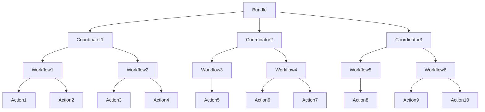

# OozieBundle工作流测试与验证:确保代码质量与可靠性

## 1.背景介绍

### 1.1 Apache Oozie 简介

Apache Oozie 是一个用于管理 Hadoop 作业的工作流调度系统。它可以集成各种作业类型,包括 Java 程序、MapReduce 作业、Pig 作业、Hive 作业等,将它们编排成有向无环图(DAG)的工作流。Oozie 工作流可以被周期性地调度执行,也可以被其他系统触发执行。

Oozie 的核心概念包括:

- **Workflow(工作流)**: 由多个动作组成的有向无环图。
- **Coordinator(协调器)**: 用于调度和执行多个工作流作业。
- **Bundle(捆绑包)**: 将多个协调器作业打包在一起。

### 1.2 OozieBundle 的作用

OozieBundle 是 Oozie 中用于组织和管理多个协调器作业的机制。它允许将相关的协调器作业捆绑在一起,并对它们进行统一的调度和管理。

OozieBundle 的主要作用包括:

1. **组织和管理多个协调器作业**: 通过将多个协调器作业捆绑在一个 Bundle 中,可以更好地组织和管理这些作业。
2. **统一调度和执行**: Bundle 可以统一调度和执行其中包含的所有协调器作业,简化了作业管理的复杂性。
3. **共享配置和属性**: Bundle 中的协调器作业可以共享一些公共的配置和属性,避免了重复配置的问题。

由于 OozieBundle 涉及多个协调器作业的组织和管理,因此对其进行充分的测试和验证是非常重要的,以确保整个工作流的正确性和可靠性。

## 2.核心概念与联系

### 2.1 OozieBundle 核心概念

OozieBundle 涉及以下几个核心概念:

1. **Bundle**: 捆绑包,用于组织和管理多个协调器作业。
2. **Coordinator(协调器)**: 定义工作流执行的时间和频率,并将工作流提交给 Oozie 执行。
3. **Workflow(工作流)**: 由多个动作组成的有向无环图,执行实际的任务。
4. **Action(动作)**: 工作流中的基本执行单元,可以是 MapReduce 作业、Pig 作业、Hive 作业等。

### 2.2 核心概念之间的关系

这些核心概念之间的关系如下:



- Bundle 包含多个 Coordinator。
- 每个 Coordinator 定义了一个或多个 Workflow。
- 每个 Workflow 由多个 Action 组成。

通过这种层次结构,OozieBundle 可以有效地组织和管理复杂的大数据工作流。

## 3.核心算法原理具体操作步骤

### 3.1 OozieBundle 工作流执行原理

OozieBundle 工作流的执行过程如下:

1. **Bundle 启动**: 当 Bundle 被触发执行时,它会根据配置的调度策略启动其中包含的所有 Coordinator。
2. **Coordinator 执行**: 每个 Coordinator 根据其定义的时间和频率,提交并执行相应的 Workflow。
3. **Workflow 执行**: 每个 Workflow 按照其定义的有向无环图结构,依次执行各个 Action。
4. **Action 执行**: 每个 Action 执行实际的任务,如 MapReduce 作业、Pig 作业、Hive 作业等。
5. **状态跟踪和监控**: Oozie 会跟踪和监控整个工作流的执行状态,包括 Bundle、Coordinator、Workflow 和 Action 的状态。
6. **错误处理和重试**: 如果某个 Action 执行失败,Oozie 可以根据配置进行重试或者执行错误处理逻辑。
7. **工作流完成**: 当所有 Workflow 和 Action 执行完成后,整个 Bundle 工作流就完成了。

### 3.2 OozieBundle 配置文件

OozieBundle 的配置主要包括以下几个文件:

1. **bundle.xml**: 定义 Bundle 的基本信息,如名称、描述、启动时间等。
2. **coordinator.xml**: 定义 Coordinator 的执行时间和频率,以及关联的 Workflow。
3. **workflow.xml**: 定义 Workflow 的有向无环图结构,包括各个 Action 的执行顺序和依赖关系。
4. **job.properties**: 定义 Action 的具体执行参数,如 MapReduce 作业的输入输出路径、Pig 脚本路径等。

这些配置文件共同定义了 OozieBundle 工作流的整体执行逻辑和行为。

## 4.数学模型和公式详细讲解举例说明

在 OozieBundle 工作流中,通常不涉及复杂的数学模型和公式。但是,在某些特定场景下,可能需要使用一些数学公式来计算或表示某些指标或参数。

例如,在计算 MapReduce 作业的资源使用情况时,可能需要使用以下公式:

$$
CPU\ Utilization = \frac{Total\ CPU\ Time}{Total\ Execution\ Time}
$$

其中,`CPU Utilization` 表示 CPU 利用率,`Total CPU Time` 表示作业使用的总 CPU 时间,`Total Execution Time` 表示作业的总执行时间。

另一个例子是,在计算作业的数据倾斜程度时,可能需要使用基尼系数(Gini Coefficient)公式:

$$
G = \frac{\sum_{i=1}^{n}\sum_{j=1}^{n}|x_i - x_j|}{2n\sum_{i=1}^{n}x_i}
$$

其中,`G` 表示基尼系数,`n` 表示数据块的数量,`x_i` 和 `x_j` 分别表示第 `i` 个和第 `j` 个数据块的大小。基尼系数越大,表示数据分布越不均匀,数据倾斜程度越严重。

这些公式可以帮助我们更好地理解和优化 OozieBundle 工作流中的各个环节,提高整体的执行效率和资源利用率。

## 5.项目实践:代码实例和详细解释说明

### 5.1 OozieBundle 配置示例

下面是一个简单的 OozieBundle 配置示例,包括 `bundle.xml`、`coordinator.xml`、`workflow.xml` 和 `job.properties` 文件。

**bundle.xml**:

```xml
<bundle-app name="my-bundle" xmlns="uri:oozie:bundle:0.2">
  <coordinator>
    <app-path>${nameNode}/user/${user.name}/bundle/coordinators/my-coord</app-path>
    <configuration>
      <property>
        <name>oozie.coord.application.path</name>
        <value>${nameNode}/user/${user.name}/bundle/coordinators/my-coord</value>
      </property>
    </configuration>
  </coordinator>
</bundle-app>
```

**coordinator.xml**:

```xml
<coordinator-app name="my-coord" frequency="${coord:days(1)}" start="2023-06-01T00:00Z" end="2023-06-08T00:00Z" timezone="UTC" xmlns="uri:oozie:coordinator:0.4">
  <controls>
    <timeout>10</timeout>
    <concurrency>1</concurrency>
    <execution>FIFO</execution>
  </controls>
  <action>
    <workflow>
      <app-path>${nameNode}/user/${user.name}/bundle/workflows/my-workflow</app-path>
      <configuration>
        <property>
          <name>workflowPath</name>
          <value>${nameNode}/user/${user.name}/bundle/workflows/my-workflow</value>
        </property>
      </configuration>
    </workflow>
  </action>
</coordinator-app>
```

**workflow.xml**:

```xml
<workflow-app name="my-workflow" xmlns="uri:oozie:workflow:0.5">
  <start to="my-mapreduce-node"/>
  <action name="my-mapreduce-node">
    <map-reduce>
      <job-tracker>${jobTracker}</job-tracker>
      <name-node>${nameNode}</name-node>
      <configuration>
        <property>
          <name>mapred.mapper.class</name>
          <value>org.apache.oozie.example.MapperClass</value>
        </property>
        <property>
          <name>mapred.reducer.class</name>
          <value>org.apache.oozie.example.ReducerClass</value>
        </property>
        <property>
          <name>mapred.input.dir</name>
          <value>${inputDir}</value>
        </property>
        <property>
          <name>mapred.output.dir</name>
          <value>${outputDir}</value>
        </property>
      </configuration>
    </map-reduce>
    <ok to="end"/>
    <error to="fail"/>
  </action>
  <kill name="fail">
    <message>MapReduce failed, error message[${wf:errorMessage(wf:lastErrorNode())}]</message>
  </kill>
  <end name="end"/>
</workflow-app>
```

**job.properties**:

```properties
nameNode=hdfs://namenode:8020
jobTracker=hdfs://resourcemanager:8032
queueName=default
examplesRoot=examples

oozie.use.system.libpath=true

inputDir=${nameNode}/user/${user.name}/${examplesRoot}/input-data/tiny
outputDir=${nameNode}/user/${user.name}/${examplesRoot}/output-data/${dateTimeYYYYMMDDHHMM}
```

在这个示例中:

- `bundle.xml` 定义了 Bundle 的基本信息,并引用了一个 Coordinator。
- `coordinator.xml` 定义了 Coordinator 的执行时间和频率,以及关联的 Workflow。
- `workflow.xml` 定义了 Workflow 的有向无环图结构,包括一个 MapReduce Action。
- `job.properties` 定义了 MapReduce Action 的具体执行参数,如输入输出路径、Mapper 和 Reducer 类等。

通过这些配置文件,我们可以创建一个每天执行一次的 OozieBundle 工作流,其中包含一个 MapReduce 作业。

### 5.2 OozieBundle 测试示例

在开发和部署 OozieBundle 工作流之前,我们需要对其进行全面的测试和验证,以确保其正确性和可靠性。下面是一个简单的测试示例:

```java
import org.apache.oozie.client.OozieClient;
import org.apache.oozie.client.WorkflowJob;
import org.apache.oozie.client.OozieClientException;

public class OozieClientTest {
    public static void main(String[] args) throws OozieClientException {
        // 创建 OozieClient 实例
        OozieClient ozClient = new OozieClient("http://oozie.example.com:11000/oozie");

        // 提交 Bundle 作业
        Properties bundleConf = ozClient.createBundle(bundleXmlPath);
        String bundleId = ozClient.run(bundleConf);
        System.out.println("Bundle job submitted with ID: " + bundleId);

        // 等待 Bundle 作业完成
        while (ozClient.getBundleJobInfo(bundleId).getStatus() == WorkflowJob.Status.RUNNING) {
            Thread.sleep(10000);
        }

        // 获取 Bundle 作业的最终状态
        WorkflowJob.Status bundleStatus = ozClient.getBundleJobInfo(bundleId).getStatus();
        System.out.println("Bundle job finished with status: " + bundleStatus);

        // 检查 Bundle 中每个 Coordinator 和 Workflow 的状态
        List<CoordinatorJob> coords = ozClient.getBundleJobInfo(bundleId).getCoordinators();
        for (CoordinatorJob coord : coords) {
            System.out.println("Coordinator job " + coord.getId() + " finished with status: " + coord.getStatus());
            List<WorkflowJob> workflows = coord.getWorkflows();
            for (WorkflowJob workflow : workflows) {
                System.out.println("  Workflow job " + workflow.getId() + " finished with status: " + workflow.getStatus());
            }
        }
    }
}
```

在这个测试示例中,我们使用 Oozie Java 客户端库来提交和监控 OozieBundle 作业。具体步骤如下:

1. 创建 `OozieClient` 实例,连接到 Oozie 服务器。
2. 提交 Bundle 作业,获取 Bundle ID。
3. 循环检查 Bundle 作业的状态,直到作业完成。
4. 获取 Bundle 作业的最终状态。
5. 遍历 Bundle 中的所有 Coordinator 和 Workflow,检查它们的执行状态。

通过这种方式,我们可以全面测试 OozieBundle 工作流的执行情况,验证其正确性和可靠性。同时,我们也可以编写更多的测