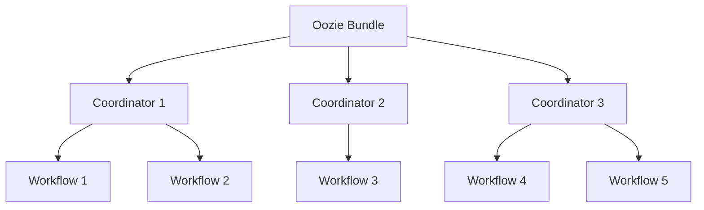
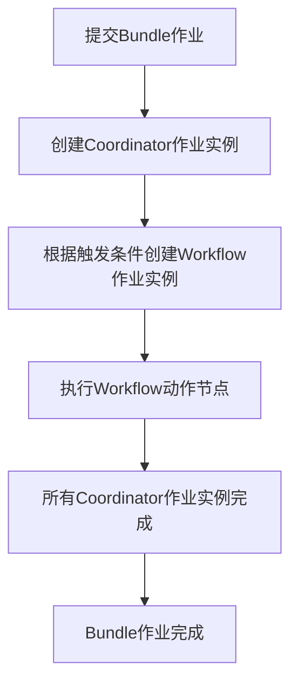

# OozieBundle监控与故障排查:确保工作流平稳运行

## 1.背景介绍

在大数据环境中,Apache Oozie是一个非常重要的工作流调度系统,它用于管理大数据作业的流程。Oozie支持多种类型的Hadoop作业(如Java MapReduce、Pig、Hive、Sqoop等),并将它们链接成有向无环图(DAG)。Oozie Bundle是Oozie中一个非常有用的功能,它允许将多个Oozie Coordinator应用程序捆绑在一起,形成一个更大的工作流应用程序。

OozieBundle可以确保多个相互依赖的Coordinator应用程序按正确的顺序执行,从而实现复杂的数据处理流程。然而,由于OozieBundle涉及多个组件的协作,其监控和故障排查也变得更加复杂。本文将重点介绍如何高效地监控OozieBundle,并对常见故障进行快速诊断和修复。

## 2.核心概念与联系

### 2.1 Oozie Bundle

Oozie Bundle是Oozie中的一个重要概念,它由多个Oozie Coordinator应用程序组成。每个Coordinator应用程序又由一个或多个Oozie工作流(Workflow)组成。Bundle、Coordinator和Workflow之间的关系如下所示:



### 2.2 Oozie Coordinator

Oozie Coordinator是Oozie中用于调度工作流的组件。它根据时间和数据可用性触发器来启动工作流。Coordinator由以下几个关键部分组成:

- **Coordinator应用程序**:定义了Coordinator的属性、数据集、输入/输出等。
- **Coordinator作业**:由Coordinator应用程序实例化生成,用于执行实际的工作流。
- **动作**:Coordinator作业中的最小执行单元,通常是一个Oozie工作流。

### 2.3 Oozie Workflow

Oozie Workflow定义了一系列需要执行的动作(如MapReduce、Pig、Hive等),以及它们之间的执行依赖关系。Workflow由以下几个关键部分组成:

- **工作流应用程序**:定义了工作流的属性、节点、过渡条件等。
- **工作流作业**:由工作流应用程序实例化生成,用于执行实际的动作。
- **动作节点**:工作流作业中的最小执行单元,如MapReduce作业、Pig脚本等。

## 3.核心算法原理具体操作步骤

### 3.1 OozieBundle执行流程

OozieBundle的执行流程如下:

1. 用户提交Bundle作业。
2. Oozie服务器解析Bundle作业,并为每个Coordinator应用程序创建一个Coordinator作业实例。
3. 每个Coordinator作业实例根据配置的触发条件(时间或数据可用性)创建相应的工作流作业实例。
4. 工作流作业实例执行一系列动作节点。
5. 所有Coordinator作业实例执行完毕后,Bundle作业完成。

该流程可用以下Mermaid流程图表示:



### 3.2 OozieBundle监控

为了确保OozieBundle的平稳运行,需要对以下几个方面进行监控:

1. **Bundle作业状态**:监控Bundle作业的整体状态,如RUNNING、SUCCEEDED、KILLED等。
2. **Coordinator作业状态**:监控每个Coordinator作业实例的状态,如RUNNING、SUCCEEDED、KILLED等。
3. **Workflow作业状态**:监控每个工作流作业实例的状态,如RUNNING、SUCCEEDED、FAILED等。
4. **动作节点状态**:监控每个动作节点的执行状态,如OK、ERROR等。
5. **资源利用率**:监控Oozie服务器的CPU、内存、磁盘等资源利用情况。

可以通过以下几种方式进行监控:

- **Oozie Web UI**:Oozie提供了基于Web的用户界面,可以查看Bundle、Coordinator、Workflow和动作节点的状态信息。
- **Oozie命令行工具**:Oozie提供了命令行工具(如oozie job -info),可以查询作业的详细信息。
- **第三方监控工具**:如Ambari、Cloudera Manager等,可以集成Oozie监控功能。
- **自定义监控脚本**:根据需求编写监控脚本,通过Oozie REST API获取监控数据。

## 4.数学模型和公式详细讲解举例说明

在OozieBundle的监控过程中,可能需要对一些指标进行统计和分析。以下是一些常用的数学模型和公式:

### 4.1 作业成功率

作业成功率是衡量OozieBundle运行质量的重要指标,它反映了作业成功执行的比例。可以分别计算Bundle、Coordinator和Workflow的成功率,公式如下:

Bundle成功率 = 成功执行的Bundle作业数 / 总Bundle作业数

$$
Bundle\_Success\_Rate = \frac{Succeeded\_Bundle\_Jobs}{Total\_Bundle\_Jobs}
$$

Coordinator成功率 = 成功执行的Coordinator作业实例数 / 总Coordinator作业实例数

$$
Coordinator\_Success\_Rate = \frac{Succeeded\_Coordinator\_Job\_Instances}{Total\_Coordinator\_Job\_Instances}
$$

Workflow成功率 = 成功执行的Workflow作业实例数 / 总Workflow作业实例数

$$
Workflow\_Success\_Rate = \frac{Succeeded\_Workflow\_Job\_Instances}{Total\_Workflow\_Job\_Instances}
$$

### 4.2 平均执行时间

平均执行时间是评估OozieBundle性能的另一个重要指标,它反映了作业从开始到结束的平均耗时。可以分别计算Bundle、Coordinator和Workflow的平均执行时间,公式如下:

Bundle平均执行时间 = 所有Bundle作业的总执行时间 / 总Bundle作业数

$$
Avg\_Bundle\_Execution\_Time = \frac{\sum\limits_{i=1}^{n}Bundle\_Job\_Execution\_Time_i}{n}
$$

Coordinator平均执行时间 = 所有Coordinator作业实例的总执行时间 / 总Coordinator作业实例数

$$
Avg\_Coordinator\_Execution\_Time = \frac{\sum\limits_{i=1}^{m}Coordinator\_Job\_Instance\_Execution\_Time_i}{m}
$$

Workflow平均执行时间 = 所有Workflow作业实例的总执行时间 / 总Workflow作业实例数

$$
Avg\_Workflow\_Execution\_Time = \frac{\sum\limits_{i=1}^{k}Workflow\_Job\_Instance\_Execution\_Time_i}{k}
$$

其中,n、m和k分别表示Bundle作业数、Coordinator作业实例数和Workflow作业实例数。

通过计算和分析这些指标,可以全面了解OozieBundle的运行状况,为故障排查和性能优化提供依据。

## 5.项目实践:代码实例和详细解释说明

为了更好地理解OozieBundle的使用,我们将通过一个实际项目案例来演示如何创建、监控和故障排查OozieBundle。

### 5.1 项目背景

假设我们有一个大数据项目,需要从不同的数据源(如Hive、HDFS等)提取数据,进行转换和加载(ETL),最终将数据加载到Hive表中,供下游应用程序使用。该项目包含以下几个主要步骤:

1. 从Hive表中提取原始数据。
2. 从HDFS中提取日志数据。
3. 对提取的数据进行清洗和转换。
4. 将转换后的数据加载到Hive表中。

每个步骤都可以使用Oozie Workflow来实现,并且这些步骤之间存在依赖关系。为了方便管理和调度这些Workflow,我们将使用OozieBundle将它们捆绑在一起。

### 5.2 创建OozieBundle

首先,我们需要创建一个OozieBundle,它包含三个Coordinator应用程序,每个Coordinator应用程序对应一个Workflow。

**Bundle.xml**

```xml
<bundle-app name="etl-bundle" xmlns="uri:oozie:bundle:0.2">
  <coordinator name="extract-hive-data">
    <app-path>${nameNode}/user/${wf:user()}/coordinators/extract-hive-data</app-path>
    <configuration>
      <property>
        <name>oozie.coord.application.path</name>
        <value>${nameNode}/user/${wf:user()}/apps/extract-hive-data</value>
      </property>
    </configuration>
  </coordinator>

  <coordinator name="extract-hdfs-data">
    <app-path>${nameNode}/user/${wf:user()}/coordinators/extract-hdfs-data</app-path>
    <configuration>
      <property>
        <name>oozie.coord.application.path</name>
        <value>${nameNode}/user/${wf:user()}/apps/extract-hdfs-data</value>
      </property>
    </configuration>
  </coordinator>

  <coordinator name="transform-and-load">
    <app-path>${nameNode}/user/${wf:user()}/coordinators/transform-and-load</app-path>
    <configuration>
      <property>
        <name>oozie.coord.application.path</name>
        <value>${nameNode}/user/${wf:user()}/apps/transform-and-load</value>
      </property>
    </configuration>
  </coordinator>
</bundle-app>
```

在这个Bundle中,我们定义了三个Coordinator应用程序:

1. `extract-hive-data`:从Hive表中提取原始数据。
2. `extract-hdfs-data`:从HDFS中提取日志数据。
3. `transform-and-load`:对提取的数据进行清洗和转换,并加载到Hive表中。

每个Coordinator应用程序都有一个对应的Workflow应用程序,用于执行实际的任务。

### 5.3 创建Coordinator应用程序

接下来,我们需要为每个Coordinator应用程序创建相应的配置文件。以`extract-hive-data`为例:

**extract-hive-data.xml**

```xml
<coordinator-app name="extract-hive-data" frequency="${coord:days(1)}" start="${startTime}" end="${endTime}" timezone="UTC" xmlns="uri:oozie:coordinator:0.4">
  <controls>
    <timeout>10</timeout>
    <concurrency>1</concurrency>
    <execution>FIFO</execution>
  </controls>
  <datasets>
    <dataset name="raw-data" frequency="${coord:days(1)}" initial-instance="${startTime}" timezone="UTC">
      <uri-template>${nameNode}/user/${wf:user()}/raw-data/${coord:formatTime(coord:dateOffset(current, -1, 'DAY'), 'yyyy-MM-dd')}</uri-template>
    </dataset>
  </datasets>
  <input-events>
    <data-in name="raw-data" dataset="raw-data">
      <instance>${coord:current(0)}</instance>
    </data-in>
  </input-events>
  <action>
    <workflow>
      <app-path>${nameNode}/user/${wf:user()}/apps/extract-hive-data</app-path>
      <configuration>
        <property>
          <name>inputDir</name>
          <value>${coord:dataInStatusDir('raw-data')}</value>
        </property>
      </configuration>
    </workflow>
  </action>
</coordinator-app>
```

在这个Coordinator应用程序中,我们定义了以下几个关键部分:

- `frequency`:设置Coordinator作业的执行频率,在本例中为每天一次。
- `start`和`end`:设置Coordinator作业的开始和结束时间。
- `datasets`:定义输入数据集,在本例中为Hive表中的原始数据。
- `input-events`:指定输入数据集的实例,用于触发Workflow的执行。
- `action`:定义要执行的Workflow应用程序,并传递必要的配置参数。

其他两个Coordinator应用程序(`extract-hdfs-data`和`transform-and-load`)的配置文件类似,只需要修改相应的数据集和Workflow应用程序路径即可。

### 5.4 创建Workflow应用程序

最后,我们需要为每个Workflow应用程序创建相应的配置文件。以`extract-hive-data`为例:

**extract-hive-data.xml**

```xml
<workflow-app name="extract-hive-data" xmlns="uri:oozie:workflow:0.5">
  <start to="extract-hive-data-node"/>
  <action name="extract-hive-data-node">
    <hive xmlns="uri:oozie:hive-action:0.5">
      <job-tracker>${jobTracker}</job-tracker>
      <name-node>${nameNode}</name-node>
      <script>${nameNode}/user/${wf:user()}/scripts/extract-hive-data.hql</script>
      <file>${nameNode}/user/${wf:user()}/scripts/extract-hive-data.hql#extract-hive-data.hql</file>
      