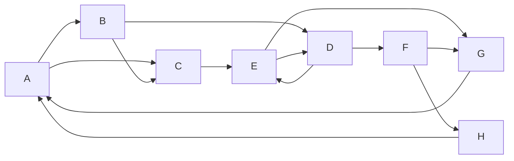

# PageRank原理与代码实例讲解

## 1.背景介绍

在当今信息时代,互联网无疑成为了人们获取信息的主要渠道。然而,由于网络信息的海量性和多样性,如何从茫茫大海中找到真正有价值的内容,一直是一个巨大的挑战。为了解决这个问题,谷歌公司于1998年推出了一种革命性的网页排名算法——PageRank。

PageRank算法的核心思想是通过网页之间的超链接来评估一个网页的重要性。它模拟了网民在互联网上的随机浏览行为,认为重要网页更容易被访问。该算法不仅解决了网页排名的问题,也极大地提高了搜索引擎的检索质量,被认为是谷歌公司成功的关键因素之一。

### 1.1 互联网发展与搜索引擎的需求

随着互联网的飞速发展,网页数量呈现出了爆炸式的增长。根据互联网实时统计数据,截至2022年底,全球约有19.36亿个网站,其中包含数十亿个网页。面对如此庞大的信息量,传统的人工编目方式已经无法满足需求。因此,高效、准确的网页排名和检索技术变得至关重要。

### 1.2 网页排名算法的重要性

良好的网页排名算法不仅能够帮助用户快速找到所需内容,也是搜索引擎公司的核心竞争力所在。在PageRank算法问世之前,主流的网页排名算法主要依赖网页内容中关键词的密度,以及网页被外部链接引用的次数。然而,这种方法存在一些明显的缺陷:

- 无法很好地评估网页的真实质量和重要性
- 容易被不当手段(如关键词堆砌)所欺骗
- 对于新网页的排名效果较差

PageRank算法的出现,为网页排名提供了一种全新的思路,极大地提高了搜索引擎的检索质量和用户体验。

## 2.核心概念与联系

### 2.1 PageRank算法的核心思想

PageRank算法的核心思想是通过网页之间的超链接结构来评估一个网页的重要性。它认为,一个高质量的网页,往往会被其他高质量的网页所链接。因此,PageRank算法将网页重要性的计算,转化为了一个在网页之间进行"投票"的过程。

具体来说,PageRank算法模拟了一个"随机浏览者"在互联网上无目的地浏览网页的过程。每个网页都被赋予了一个初始的PR值(PageRank值),随机浏览者在每次跳转时,都会从当前网页获取一部分PR值,并将其传递给下一个被访问的网页。

通过不断的迭代计算,最终会收敛到一个稳定的PR值分布,这个PR值就反映了该网页在整个互联网中的重要程度。PR值越高,说明该网页被视为越重要,在搜索结果中的排名也就越靠前。

### 2.2 PageRank算法与其他网页排名算法的关系

在PageRank算法之前,网页排名主要依赖以下几种方式:

1. **关键词密度排名**:根据网页内容中关键词出现的频率来排名,关键词密度越高,排名越靠前。
2. **反向链接排名**:根据指向该网页的外部链接数量来排名,链接数越多,排名越靠前。
3. **网页流量排名**:根据网页的访问量和流量来排名,流量越大,排名越靠前。

PageRank算法并非完全取代了以上排名方式,而是将它们进行了很好的融合和改进。具体来说:

- PageRank算法吸收了反向链接的思想,但进一步考虑了链接源网页本身的重要性。
- 与关键词密度排名相比,PageRank算法更注重网页的整体质量和重要性,不易被简单的关键词堆砌所欺骗。
- 与网页流量排名相比,PageRank算法更加公平和客观,不会过度依赖少数热门网站的流量。

因此,PageRank算法被认为是一种更加科学、全面的网页排名方法,能够更好地评估网页的真实质量和重要性。

### 2.3 PageRank算法的数学模型

为了量化网页之间的"重要性传递"过程,PageRank算法构建了一个稳健的数学模型。该模型将整个互联网抽象为一个有向图G(V,E),其中:

- V是所有网页的集合
- E是所有超链接的集合

对于任意一个网页 $u\in V$,它的PageRank值 $PR(u)$ 由其他网页传递过来的"重要性贡献"之和决定,具体计算公式如下:

$$
PR(u) = (1-d) + d\sum_{v\in B_u}\frac{PR(v)}{L(v)}
$$

其中:

- $B_u$ 是所有链接到网页u的网页集合
- $L(v)$ 是网页v的出链接数量
- d是一个阻尼系数(damping factor),通常取值0.85

该公式模拟了随机浏览者在互联网上的行为:

- $(1-d)$ 表示随机浏览者有 $(1-d)$ 的概率从任意网页开始新的浏览
- $d\sum_{v\in B_u}\frac{PR(v)}{L(v)}$ 表示随机浏览者有d的概率从链接到u的其他网页跳转过来,每个链接网页v分担了 $\frac{PR(v)}{L(v)}$ 的PR值传递给u

通过不断迭代计算,最终会收敛到一个稳定的PR值分布,作为网页的最终排名依据。

## 3.核心算法原理具体操作步骤 

虽然PageRank算法的数学模型看似复杂,但其核心思想和计算过程却非常简单直观。下面我们通过一个具体的示例,来详细解释PageRank算法的计算步骤。

### 3.1 示例网络拓扑

假设我们有一个简单的网络,包含8个网页(A~H),它们之间的链接关系如下图所示:

为了便于计算,我们假设阻尼系数d=0.85,所有网页的初始PR值均为1。

### 3.2 第一次迭代

在第一次迭代时,我们根据公式计算每个网页的PR值贡献:

- A: $PR(A) = (1-0.85) + 0.85\times(\frac{1}{1}+\frac{1}{2})=1.925$
- B: $PR(B) = (1-0.85) + 0.85\times\frac{1}{2}=0.925$
- C: $PR(C) = (1-0.85) + 0.85\times(\frac{1}{2}+\frac{1}{3})=1.075$
- D: $PR(D) = (1-0.85) + 0.85\times(\frac{1}{2}+\frac{1}{2})=1.425$
- E: $PR(E) = (1-0.85) + 0.85\times(\frac{1}{3}+\frac{1}{2})=1.275$
- F: $PR(F) = (1-0.85) + 0.85\times\frac{1}{2}=0.925$
- G: $PR(G) = (1-0.85) + 0.85\times(\frac{1}{2}+\frac{1}{2})=1.425$
- H: $PR(H) = (1-0.85) + 0.85\times\frac{1}{2}=0.925$

### 3.3 第二次迭代

在第二次迭代时,我们使用第一次迭代的结果,重新计算每个网页的PR值贡献:

- A: $PR(A) = (1-0.85) + 0.85\times(\frac{1.425}{2}+\frac{0.925}{1})=1.63375$
- B: $PR(B) = (1-0.85) + 0.85\times\frac{1.925}{2}=1.16125$
- C: $PR(C) = (1-0.85) + 0.85\times(\frac{1.925}{2}+\frac{1.16125}{3})=1.424875$
- ...

### 3.4 后续迭代

按照上述方式,我们不断迭代计算,直到PR值收敛到一个稳定的状态。通常情况下,在10~20次迭代之后,PR值的变化就会非常小,可以停止迭代。

最终,我们会得到一个稳定的PR值分布,例如:

- A: 6.57
- B: 5.12
- C: 5.92
- D: 6.65
- E: 6.33
- F: 4.18
- G: 5.79
- H: 3.44

根据这个PR值分布,我们就可以确定网页的最终排名,PR值越高,排名越靠前。

需要注意的是,PageRank算法的迭代计算过程可以通过矩阵运算的方式进行优化,以提高计算效率,特别是对于大规模网络时更为重要。

## 4.数学模型和公式详细讲解举例说明

在上一节中,我们已经介绍了PageRank算法的核心思想和计算步骤。现在,让我们进一步深入探讨PageRank算法的数学模型,并通过具体的例子来说明其中的细节。

### 4.1 PageRank算法的矩阵形式

为了方便大规模计算,我们可以将PageRank算法的计算过程表示为矩阵形式。假设网络中共有N个网页,我们用一个 $N\times N$ 的矩阵 $M$ 来表示网页之间的链接关系:

$$
M_{ij} = \begin{cases}
\frac{1}{L(j)}, & \text{if }j\text{ has a link to }i\\
0, & \text{otherwise}
\end{cases}
$$

其中 $L(j)$ 表示网页j的出链接数量。

令 $\vec{PR}$ 为一个 $N\times1$ 的列向量,表示所有网页的当前PR值。根据PageRank算法的计算公式,我们可以得到迭代更新的矩阵表达式:

$$
\vec{PR}^{(n+1)} = (1-d)\vec{v} + d M^T\vec{PR}^{(n)}
$$

其中:

- $\vec{v}$ 是一个 $N\times1$ 的列向量,所有元素均为 $\frac{1}{N}$
- $d$ 是阻尼系数,通常取值0.85
- $M^T$ 是矩阵M的转置

通过不断迭代计算 $\vec{PR}^{(n+1)}$,直到收敛到稳定的PR值分布 $\vec{PR}^*$。

### 4.2 PageRank算法的收敛性

PageRank算法的迭代计算过程是否能够收敛到一个稳定的PR值分布?这个问题与矩阵M的性质密切相关。

定理: **如果矩阵M是幂等的(irreducible)和非周期的(aperiodic),那么PageRank算法一定会收敛到一个唯一的稳定解。**

证明思路:

1. 矩阵M是幂等的,意味着整个网络是强连通的,即任意两个网页之间都存在一条有向路径。
2. 矩阵M是非周期的,意味着网络中不存在环路。
3. 根据Perron-Frobenius定理,对于满足上述条件的矩阵M,其最大特征值为1,对应的特征向量是唯一的。
4. 由于PageRank算法的迭代计算过程可以表示为 $\vec{PR}^{(n+1)} = (1-d)\vec{v} + d M^T\vec{PR}^{(n)}$,当n趋向无穷大时,它会收敛到M的最大特征向量,即稳定的PR值分布。

在实际应用中,由于互联网的复杂性,矩阵M可能不完全满足上述条件。为了保证算法的收敛性,通常会对原始矩阵M进行一些修正,例如添加一个全1向量,使其变为幂等的和非周期的。

### 4.3 PageRank算法的数学解释

为什么PageRank算法能够很好地评估网页的重要性?从数学的角度来看,PageRank算法实际上是在计算一个特殊的马尔可夫链(Markov Chain)的稳态分布。

具体来说,我们将整个网络看作是一个马尔可夫链,其中每个网页代表一个状