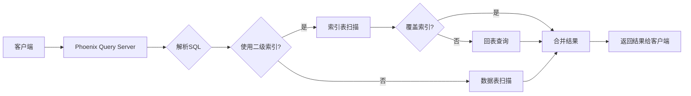

# Phoenix二级索引原理与代码实例讲解

## 1. 背景介绍

### 1.1 二级索引的重要性

在大数据处理系统中,高效的数据检索和查询能力是至关重要的。Apache Phoenix作为构建在HBase之上的SQL层,为用户提供了类似传统关系型数据库的二级索引功能,大大提升了查询性能。深入理解Phoenix二级索引的原理和实现,对于优化查询、设计高性能的Phoenix应用具有重要意义。

### 1.2 Phoenix二级索引概述

Phoenix支持在表上创建二级索引(Secondary Index),以加速对非主键列的查询。与HBase原生的二级索引不同,Phoenix二级索引通过协处理器和索引表的方式实现,具有更好的性能和灵活性。Phoenix会自动维护索引表与数据表之间的一致性。

## 2. 核心概念与关联

### 2.1 覆盖索引与函数索引 

Phoenix支持两种类型的二级索引:

- 覆盖索引(Covered Indexes):索引表中包含了索引列和查询所需的所有数据列,单次查询即可返回完整结果,避免了回表操作。
- 函数索引(Functional Indexes):对列值应用函数/表达式后再创建索引,如UPPER(column)。查询时也需对谓词应用相同函数。

### 2.2 全局索引与本地索引

按照索引数据分布方式,Phoenix二级索引分为:

- 全局索引(Global Indexes):索引表数据分布在不同的Region Server上,与数据表分布无关。适合写多读少场景。
- 本地索引(Local Indexes):索引表数据与数据表存储在相同的Region Server上,查询更高效。适合写少读多场景。

### 2.3 索引表结构

对于索引列 (COL1, COL2),Phoenix 的索引表结构如下:

| Row Key  | 列簇: 0  | 列簇: 0  |
|----------|---------|----------|
| COL1     | COL2    | PK_HASH  |

其中:
- COL1和COL2是索引列的值
- PK_HASH是数据表主键的MD5哈希值,确保索引列相同时主键哈希不同,避免覆盖
- 列簇0保存了索引列和主键哈希

## 3. 核心算法原理与具体操作步骤

### 3.1 创建索引

创建二级索引的基本语法:

```sql
CREATE [UNIQUE] INDEX [IF NOT EXISTS] index_name 
ON table_name (column_name, ...) 
[INCLUDE (column_name, ...)]
```

主要步骤如下:

1. 解析CREATE INDEX语句,提取索引表名、索引列等信息
2. 创建索引表的HTable对象
3. 通过协处理器,扫描数据表并向索引表写入数据
4. 索引表创建完成后,更新Phoenix系统元数据

### 3.2 索引查询

对于查询语句:

```sql
SELECT ... FROM table WHERE indexed_column = ?
```

查询转换与执行步骤:

1. 查询计划器识别出可以使用索引的谓词条件
2. 将查询改写为索引表扫描:
```sql
SELECT ... FROM index_table 
WHERE indexed_column = ?
```
3. 从索引表中根据谓词快速定位到主键
4. 根据主键从数据表检索完整行数据(覆盖索引则无需此步)
5. 合并数据并返回给客户端

### 3.3 索引更新

Phoenix通过协处理器hooks实现二级索引与数据表的同步更新:

1. 数据表发生写操作(PUT/DELETE)时触发协处理器
2. 协处理器根据索引表结构生成新的索引行
3. 通过HBase客户端API将索引行写入索引表
4. 完成数据表更新,并返回给客户端

## 4. 数学模型和公式详解

### 4.1 索引选择性计算

索引的选择性是指索引列的唯一值数量占表总行数的比例。选择性高的索引有助于缩小扫描范围,提升查询效率。

假设索引列的唯一值数量为n,表总行数为t,则索引选择性s为:

$$
s = \frac{n}{t}
$$

### 4.2 索引检索代价估算 

使用索引检索的代价可用磁盘I/O次数来衡量。设索引高度为h,每个节点项数为m,搜索到的叶子节点数为L:

索引扫描磁盘I/O次数 C 为:

$$
C = h + L
$$

其中,h为到达叶节点的节点数,L为满足条件的叶子节点数。

## 5. 项目实践:代码实例与详解

### 5.1 创建二级索引

```sql
-- 在user_id列创建覆盖索引
CREATE INDEX idx_user_id 
ON users (user_id) 
INCLUDE (first_name, last_name);
```

### 5.2 查询二级索引

```sql
-- 通过索引检索user_id=123的行
SELECT first_name, last_name 
FROM users 
WHERE user_id = 123;
```

Phoenix会自动选择使用`idx_user_id`索引进行检索,避免全表扫描。

### 5.3 函数索引示例

```sql
-- 在email列创建大写函数索引
CREATE INDEX idx_email_upper 
ON users (UPPER(email));

-- 使用函数索引查询
SELECT * FROM users 
WHERE UPPER(email) = 'JOHN@EXAMPLE.COM';
```

## 6. 实际应用场景

Phoenix二级索引在以下场景中发挥重要作用:

1. 对非主键列的等值或范围查询,提升检索性能
2. 对多列组合条件的查询,缩小扫描范围
3. 对大表的复杂JOIN操作,通过索引加速关联
4. 对实时性要求高的查询,通过覆盖索引避免回表
5. 对写入量大的表创建全局索引,平衡读写性能

## 7. 工具与资源推荐

1. Apache Phoenix官方文档:提供了Phoenix二级索引的详细介绍和使用指南。
2. HBase官方参考指南:深入讲解了HBase的架构和二级索引机制。
3. Phoenix Query Server:通过RESTful API提供Phoenix查询服务,简化应用开发。
4. Apache Calcite:Phoenix所使用的查询优化框架,支持基于代价的索引选择。

## 8. 总结:发展趋势与挑战

### 8.1 发展趋势

1. 更智能的索引选择与查询优化
2. 支持更多数据类型和查询模式的索引
3. 提升二级索引的写入性能
4. 与其他大数据生态系统的深度集成

### 8.2 面临的挑战

1. 索引存储空间的优化与控制
2. 高效处理索引表的region分裂与合并
3. 二级索引的异步创建与重建
4. 索引数据的实时性与一致性保证

## 9. 附录:常见问题解答

### Q1:什么情况下使用覆盖索引?

A1:当查询的列除了索引列外,还需要其他列时,使用覆盖索引可以避免回表查询,提升性能。

### Q2:二级索引对写入性能有何影响?

A2:由于需要同时更新数据表和索引表,二级索引会增加写入放大和延迟。可以通过异步索引更新等策略优化。

### Q3:如何选择创建全局索引还是本地索引?

A3:全局索引适合写多读少,需要分散写压力的场景;本地索引适合写少读多,对查询实时性要求高的场景。



作者：禅与计算机程序设计艺术 / Zen and the Art of Computer Programming