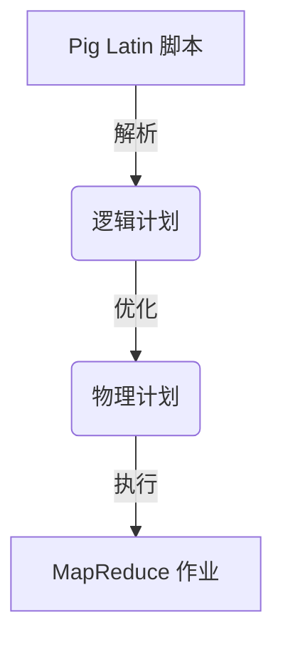

# Pig优化策略原理与代码实例讲解

## 1.背景介绍

### 1.1 什么是Pig

Apache Pig是一种用于并行计算的高级数据流语言和执行框架,最初由Yahoo!研究院开发。Pig可以通过一系列数据转换操作来描述数据分析任务,这些操作将被翻译成高效可伸缩的并行执行计划,以便在大型集群上运行。Pig的设计目标是允许数据分析师使用类似SQL的语言来编写复杂的数据转换,而无需学习Java编程。

### 1.2 Pig的优化策略重要性

由于Pig运行在大规模数据集上,因此优化执行计划对于提高整体性能至关重要。Pig提供了一组优化策略,用于分析逻辑计划并应用规则来生成更高效的物理执行计划。这些优化策略包括逻辑重写、代数重写、MapReduce指令选择等,旨在减少不必要的数据传输、合并作业以及利用索引等技术。

## 2.核心概念与联系

### 2.1 逻辑计划与物理计划

Pig将用户编写的Pig Latin脚本转换为一个逻辑计划,该计划由一系列逻辑运算符组成。然后,Pig的优化器将分析逻辑计划并应用各种优化规则,生成一个优化后的物理计划。物理计划由一组可执行的MapReduce作业组成,这些作业将在Hadoop集群上运行。



### 2.2 优化器与优化规则

Pig优化器是一个基于规则的系统,它包含了许多优化规则。这些规则可以分为以下几类:

1. **逻辑重写规则**: 重写逻辑计划中的运算符,以产生等价但更高效的表达式。
2. **代数重写规则**: 应用代数等价变换,如合并连接、投影下推等。
3. **MapReduce指令选择规则**: 选择最佳的MapReduce执行引擎,如本地模式、Tez或MapReduce。
4. **压缩规则**: 确定何时应用压缩,以减少数据传输和存储开销。
5. **索引规则**: 利用现有的索引来加速查询。

### 2.3 MapReduce指令选择

MapReduce指令选择是Pig优化器的一个重要组成部分。它根据作业的特征(如数据大小、操作类型等)选择最合适的执行引擎,如本地模式(用于小数据集)、Tez(用于复杂的有向无环图作业)或MapReduce(用于标准作业)。选择合适的执行引擎可以显著提高性能。

## 3.核心算法原理具体操作步骤

### 3.1 逻辑计划优化

逻辑计划优化包括以下几个步骤:

1. **投影下推**: 将投影操作尽可能下推到查询树的底部,以减少不必要的数据传输。
2. **Filter推导**: 将Filter操作推导到查询树的尽可能底部,以尽早过滤数据。
3. **常量折叠**: 预计算常量表达式,并将其折叠为单个常量值。
4. **投影-过滤组合**: 将投影和过滤操作合并为单个MapReduce作业。
5. **谓词推导**: 将谓词(如Filter条件)推导到查询树的底部,以便尽早应用过滤。

### 3.2 代数重写

代数重写包括以下几个步骤:

1. **连接重写**: 应用连接重写规则,如连接交换、连接合并和连接消除等。
2. **GroupBy重写**: 优化GroupBy操作,如GroupBy-DistinctBy融合和GroupBy-Cogroup融合等。
3. **Union重写**: 合并相邻的Union操作。
4. **排序重写**: 优化排序操作,如消除不必要的排序。
5. **投影重写**: 优化投影操作,如投影合并和投影列修剪等。

### 3.3 MapReduce指令选择

MapReduce指令选择算法包括以下步骤:

1. **数据统计**: 收集作业的输入数据统计信息,如记录数、字节数等。
2. **成本模型**: 根据数据统计信息和作业特征,估算每种执行引擎的成本。
3. **决策**: 选择成本最低的执行引擎作为最终选择。

### 3.4 压缩优化

压缩优化包括以下步骤:

1. **数据特征分析**: 分析输入和中间数据的特征,如数据类型、重复率等。
2. **压缩策略选择**: 根据数据特征选择合适的压缩编解码器,如LZO、Snappy等。
3. **压缩注入**: 在逻辑计划中注入压缩操作,以减少数据传输和存储开销。

### 3.5 索引利用

索引利用包括以下步骤:

1. **索引发现**: 发现可用的索引,如HBase表的二级索引。
2. **索引匹配**: 将查询谓词与可用索引进行匹配。
3. **索引注入**: 将索引扫描操作注入到逻辑计划中,以加速查询执行。

## 4.数学模型和公式详细讲解举例说明

### 4.1 成本模型

Pig使用成本模型来估算不同执行计划的成本,以便选择最优计划。成本模型考虑了多个因素,如数据大小、操作类型、资源利用率等。

成本模型的一般形式如下:

$$
Cost = \sum_{i=1}^{n} w_i \times f_i(job, stats)
$$

其中:
- $n$是成本因素的数量
- $w_i$是第$i$个成本因素的权重
- $f_i$是第$i$个成本因素的计算函数,它取决于作业特征($job$)和数据统计信息($stats$)

例如,对于MapReduce执行引擎,成本模型可能包括以下几个因素:

1. 数据读取成本: $f_1 = input\_size$
2. 数据写入成本: $f_2 = output\_size$
3. MapReduce启动成本: $f_3 = job\_count$
4. 中间数据传输成本: $f_4 = shuffle\_size$

通过调整每个因素的权重$w_i$,我们可以根据不同的优化目标(如最小化作业数量或最小化数据传输)来调整成本模型。

### 4.2 数据压缩模型

Pig在选择压缩策略时,会估算压缩和解压缩的开销,并与数据传输和存储的节省进行权衡。压缩模型可以表示为:

$$
Benefit = size\_reduction \times data\_size - compression\_cost - decompression\_cost
$$

其中:
- $size\_reduction$是压缩率,取值范围为$[0, 1]$
- $data\_size$是原始数据大小
- $compression\_cost$是压缩操作的开销
- $decompression\_cost$是解压缩操作的开销

只有当$Benefit$大于0时,压缩才是有利的。Pig会选择具有最大$Benefit$值的压缩编解码器。

压缩和解压缩的开销可以进一步细分为CPU开销和I/O开销:

$$
compression\_cost = cpu\_cost\_compress + io\_cost\_compress \\
decompression\_cost = cpu\_cost\_decompress + io\_cost\_decompress
$$

其中,CPU开销取决于压缩算法的复杂度,而I/O开销取决于数据大小和集群I/O带宽。

## 5.项目实践:代码实例和详细解释说明

让我们通过一个实际的Pig Latin脚本示例来演示Pig的优化策略。假设我们有一个Web服务器日志文件,我们需要统计每个IP地址的访问次数。

### 5.1 原始Pig Latin脚本

```pig
-- 加载Web日志数据
logs = LOAD 'weblog.txt' AS (remoteAddr:chararray, remoteUser:chararray, 
                             time:chararray, method:chararray, urlpath:chararray,
                             status:int, bytes:int);

-- 过滤掉状态码不为200的记录
filtered_logs = FILTER logs BY status == 200;

-- 提取IP地址
ip_proj = FOREACH filtered_logs GENERATE remoteAddr;

-- 统计IP地址出现次数
ip_counts = GROUP ip_proj BY remoteAddr;
result = FOREACH ip_counts GENERATE group, COUNT(ip_proj);

-- 存储结果
STORE result INTO 'ip_counts.txt';
```

这个脚本的逻辑计划包含多个MapReduce作业,每个FOREACH和GROUP语句都会生成一个新的MapReduce作业。

### 5.2 优化后的Pig Latin脚本

```pig
-- 加载Web日志数据
logs = LOAD 'weblog.txt' AS (remoteAddr:chararray, remoteUser:chararray,
                             time:chararray, method:chararray, urlpath:chararray,
                             status:int, bytes:int);

-- 过滤、投影和分组合并为一个MapReduce作业
result = FOREACH (GROUP (FILTER logs BY status == 200) BY remoteAddr) 
         GENERATE group, COUNT($1);

-- 存储结果
STORE result INTO 'ip_counts.txt';
```

经过Pig优化器的优化,这个脚本只需要一个MapReduce作业。优化器应用了以下策略:

1. **Filter推导**: 将Filter操作推导到FOREACH之前。
2. **投影下推**: 将投影操作(GENERATE remoteAddr)下推到FILTER之后。
3. **投影-过滤组合**: 将投影、过滤和分组操作合并为一个MapReduce作业。

### 5.3 逻辑计划可视化

我们可以使用Pig的`EXPLAIN`命令来查看优化前后的逻辑计划。

原始逻辑计划:

```
-----------------------------------------------------------------------------
| Pig Apache Pig Script                                                     |
-----------------------------------------------------------------------------
| load: Load(file://weblog.txt)                                             |
|                                                                           |
| filter: Filter(status#5 == 200)                                           |
|                                                                           |
| foreach: Foreach(remoteAddr#0)                                           |
|                                                                           |
| group: Group(remoteAddr#0)                                               |
|                                                                           |
| foreach: Foreach(group, COUNT(remoteAddr#0))                             |
|                                                                           |
| store: Store(file://ip_counts.txt)                                       |
-----------------------------------------------------------------------------
```

优化后逻辑计划:

```
-----------------------------------------------------------------------------
| Pig Apache Pig Script                                                     |
-----------------------------------------------------------------------------
| load: Load(file://weblog.txt)                                             |
|                                                                           |
| filter: Filter(status#5 == 200)                                          |
|                                                                           |
| group: Group(remoteAddr#0)                                                |
|                                                                           |
| foreach: Foreach(group, COUNT(remoteAddr#0))                             |
|                                                                           |
| store: Store(file://ip_counts.txt)                                       |
-----------------------------------------------------------------------------
```

可以看到,优化后的逻辑计划更加紧凑,减少了中间MapReduce作业的数量。

## 6.实际应用场景

Pig优化策略在许多大数据分析场景中发挥着重要作用,例如:

1. **Web日志分析**: 统计网站访问量、分析用户行为等。
2. **电商数据分析**: 分析用户购买模式、推荐系统等。
3. **社交网络分析**: 分析用户关系网络、信息传播等。
4. **金融风险分析**: 检测欺诈行为、评估信用风险等。
5. **基因组学分析**: 处理基因测序数据、发现基因模式等。

在这些场景中,数据量通常非常庞大,因此优化执行计划对于提高分析效率至关重要。Pig的优化策略可以自动化地生成高效的执行计划,从而加速数据处理过程。

## 7.工具和资源推荐

如果您想进一步学习和使用Pig,以下是一些有用的工具和资源:

1. **Apache Pig官网**: https://pig.apache.org/
2. **Pig编程指南**: https://pig.apache.org/docs/latest/start.html
3. **Pig Latin参考手册**: https://pig.apache.org/docs/latest/basic.html
4. **Pig性能优化指南**: https://pig.apache.org/docs/latest/perf.html
5. **Pig优化器源代码**: https://github.com/apache/pig/tree/trunk/src/org/apache/pig/newplan/optimizer
6. **Pig教程和示例**: https://pig.apache.org/docs/latest/tutorial.html
7. **Pig Stack Overflow社区**: https://stackoverflow.com/questions/tagged/apache-pig

此外,还有一些流行的Pig相关书籍,如《Pig Design Patterns》和《Pig Cookbook》,可以帮助您更深入地理解Pig。

## 8.总结:未来发展趋势与挑战

### 8.1 未来发展趋势

Pig作为一种高级数据流语言,