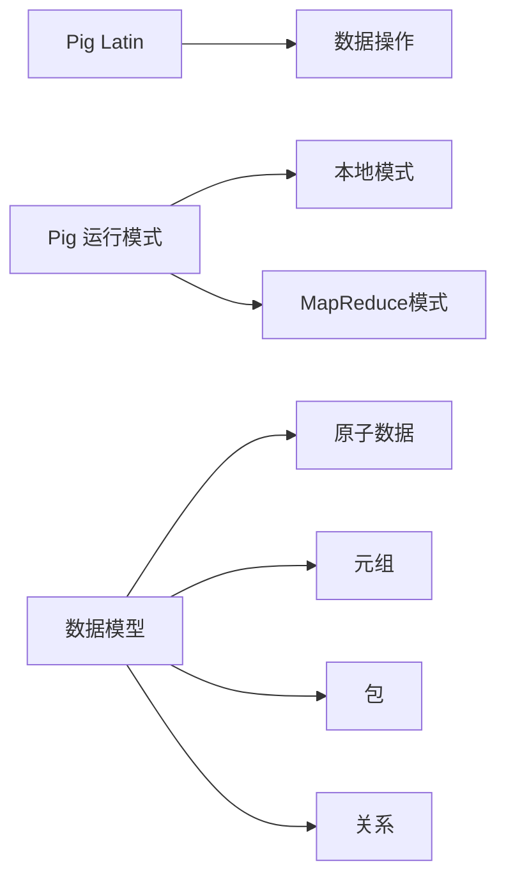

## 1.背景介绍

在大数据领域，处理大规模数据的需求日益增长。Apache Pig 是一个强大的开源数据处理平台，它的出现正是为了解决这个问题。在许多情况下，Pig的编程模型更简洁、更易于理解和实现，它将复杂的数据处理任务简化为一系列简单的数据流操作，大大提高了开发效率。

## 2.核心概念与联系

Pig的核心概念包括Pig Latin、Pig 运行模式和数据模型。Pig Latin是Pig的查询语言，它提供了丰富的数据操作命令，如加载、过滤、分组、排序、连接等。Pig有两种运行模式：本地模式和MapReduce模式。在本地模式下，Pig在单机上运行，适合处理小规模数据；在MapReduce模式下，Pig在Hadoop集群上运行，可以处理大规模数据。Pig的数据模型包括原子数据、元组、包和关系，这是Pig处理复杂数据的基础。



## 3.核心算法原理具体操作步骤

Pig的核心算法原理是将Pig Latin脚本转化为一系列的MapReduce任务。这个过程包括语法分析、语义分析、优化和代码生成四个步骤。在语法分析阶段，Pig会检查Pig Latin脚本的语法是否正确；在语义分析阶段，Pig会检查脚本的语义是否正确，如数据类型是否匹配、函数是否存在等；在优化阶段，Pig会对脚本进行优化，如合并多个MapReduce任务、消除冗余的数据操作等；在代码生成阶段，Pig会将优化后的脚本转化为Java代码，并编译为MapReduce任务。

## 4.数学模型和公式详细讲解举例说明

在Pig中，数据处理的基本单位是关系。关系可以用数学上的集合来表示，即 $R = \{t_1, t_2, ..., t_n\}$，其中 $t_i$ 是元组。元组是一组有序的字段，可以用有序对 $(f_1, f_2, ..., f_m)$ 来表示。字段是数据的最小单位，可以是任何类型，如整数、浮点数、字符串等。

例如，我们有一个关系 R，它包含两个元组 $(1, "Tom", 20)$ 和 $(2, "Jerry", 22)$，那么我们可以表示为 $R = \{(1, "Tom", 20), (2, "Jerry", 22)\}$。

## 5.项目实践：代码实例和详细解释说明

下面我们通过一个简单的例子来演示Pig的使用。假设我们有一个用户数据文件，每行包含用户ID、姓名和年龄，我们要找出年龄大于20的用户。

首先，我们加载数据：

```pig
users = LOAD 'users.txt' USING PigStorage(',') AS (id:int, name:chararray, age:int);
```

然后，我们过滤数据：

```pig
filtered_users = FILTER users BY age > 20;
```

最后，我们存储结果：

```pig
STORE filtered_users INTO 'output' USING PigStorage(',');
```

这个例子展示了Pig的基本用法，通过几行简单的Pig Latin脚本，我们就可以完成复杂的数据处理任务。

## 6.实际应用场景

Pig在许多大数据处理场景中都有广泛的应用，例如数据清洗、日志分析、统计计算等。在数据清洗中，我们可以使用Pig的数据操作命令来过滤、转换和合并数据；在日志分析中，我们可以使用Pig来处理大规模的日志数据，提取有用的信息；在统计计算中，我们可以使用Pig来进行复杂的聚合操作，如求和、求平均、求最大值和最小值等。

## 7.工具和资源推荐

在使用Pig时，有一些工具和资源可以帮助我们更好地理解和使用Pig。例如，Pig官方网站提供了详细的文档和教程；Pig Cookbook是一本关于Pig的实战书籍，它提供了许多实用的Pig脚本示例；Grunt是Pig的交互式shell，它可以帮助我们快速测试和调试Pig脚本。

## 8.总结：未来发展趋势与挑战

随着大数据的发展，Pig的使用将更加广泛。但是，Pig也面临一些挑战，例如如何处理实时数据、如何提高数据处理的效率、如何处理更复杂的数据结构等。未来，Pig需要在这些方面进行进一步的研发和优化。

## 9.附录：常见问题与解答

1. 问：Pig和SQL有什么区别？

答：Pig和SQL都是数据处理语言，但它们的设计目标和使用场景不同。SQL是一种结构化查询语言，它主要用于关系数据库的查询；而Pig是一种数据流语言，它主要用于大规模数据的处理。

2. 问：Pig和Hadoop有什么关系？

答：Pig是运行在Hadoop之上的数据处理平台，它将Pig Latin脚本转化为一系列的MapReduce任务，然后在Hadoop集群上执行。

作者：禅与计算机程序设计艺术 / Zen and the Art of Computer Programming