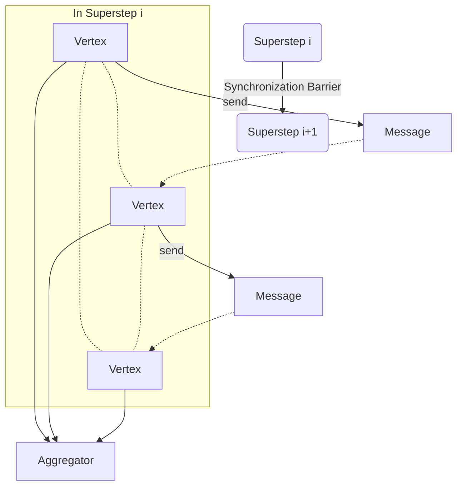
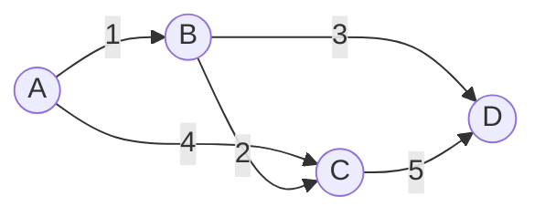

# Pregel图计算模型原理与代码实例讲解

## 1.背景介绍
### 1.1 图计算的重要性
在当今大数据时代,图数据无处不在。从社交网络到电商推荐,从金融风控到生物信息学,图数据的分析和挖掘在各行各业扮演着越来越重要的角色。然而,传统的数据处理模型和工具,如MapReduce和关系型数据库,在处理图数据时往往力不从心。因此,专门针对图数据的计算模型和系统应运而生,其中最具代表性和影响力的就是Google提出的Pregel模型。

### 1.2 Pregel的诞生
Pregel模型由Google于2010年提出,旨在为超大规模图数据的并行计算提供一个简单而强大的编程模型。Pregel的设计理念源自Valiant提出的BSP(Bulk Synchronous Parallel)并行计算模型,即将计算过程划分为一系列的超步(superstep),每个超步内部进行并行计算,超步之间通过消息传递进行同步。同时,Pregel吸收了MapReduce的一些优点,如抽象的编程接口、容错性等。自问世以来,Pregel迅速成为了图计算领域的事实标准,并催生了大量的开源实现,如Apache Giraph、GPS、Pregel+等。

### 1.3 Pregel的应用
基于Pregel模型,可以很方便地实现各种经典的图算法,如单源最短路径、PageRank、连通分量等。同时,Pregel也被广泛应用于现实世界中的各种场景:

- 在社交网络分析中,可以用Pregel进行社区发现、影响力分析等;
- 在推荐系统中,可以用Pregel实现基于图的协同过滤算法;
- 在自然语言处理中,可以用Pregel进行关系抽取、语义分析等;
- 在交通路网分析中,可以用Pregel计算最短路径、关键节点等;
- 在生物信息学中,可以用Pregel分析蛋白质相互作用网络、基因调控网络等。

可以说,只要是能抽象为图结构的问题,都可以尝试用Pregel进行建模求解。

## 2.核心概念与联系
### 2.1 顶点(Vertex)
顶点是构成图的基本单元。在Pregel中,每个顶点用一个唯一的id来标识,并拥有一个用户自定义的数据结构,称为顶点值(value)。此外,每个顶点还维护一个与之相连的边集合。顶点是计算和通信的主体,顶点通过修改自己的value,发送消息给其他顶点,来参与整个计算过程。

### 2.2 边(Edge)
边代表顶点之间的连接关系。在Pregel中,边可以是有向的,也可以是无向的。每条边由起点顶点id、终点顶点id和一个可选的边值(value)组成。边的方向决定了消息传递的方向,边的value可以携带一些额外的信息。需要注意的是,Pregel只允许顶点对其出边(out-edge)进行访问,无法获取入边(in-edge)的信息。

### 2.3 消息(Message)
消息是顶点之间通信的媒介。在Pregel中,消息是一个二元组<id, value>,其中id表示接收消息的目标顶点,value是消息的内容,可以是任意的数据结构。顶点可以通过send_message函数向其他顶点发送消息。消息在当前超步结束时被发送出去,在下一个超步开始时被接收和处理。

### 2.4 超步(Superstep)
超步是Pregel的核心概念,表示一轮并行的计算和通信过程。在每个超步中,所有的顶点都并行地执行一个相同的用户自定义函数compute,该函数读取上一轮发给自己的消息,更新自己的value,并向其他顶点发送消息。当一个顶点没有消息可以发送时,它可以调用vote_to_halt函数让自己进入休眠状态。当所有顶点都休眠时,整个计算过程结束。超步之间通过同步屏障(synchronization barrier)来分隔,保证了每个超步内部的并发安全性。

### 2.5 聚合器(Aggregator)
聚合器提供了一种全局通信的机制。与顶点对顶点的消息传递不同,聚合器允许所有顶点向一个全局的数据结构贡献值,在超步结束时自动汇总这些值并使结果在下一超步对所有顶点可见。常见的聚合器有最小值、最大值、求和等。聚合器通常用于计算一些全局的统计量或判断算法是否达到终止条件。

### 2.6 拓扑结构
下图展示了Pregel的核心概念之间的关系:



可以看出,在一个超步内,顶点通过边相互连接,可以向其他顶点发送消息。在超步结束时,消息被发送到目标顶点并被缓存,同时聚合器收集所有顶点的贡献并产生一个全局结果。在下一个超步,顶点开始处理上一轮收到的消息,更新自己的状态,并进行新一轮的计算和通信。整个过程由同步屏障分隔为多个离散的超步。

## 3.核心算法原理与具体操作步骤
下面以单源最短路径(Single Source Shortest Path)问题为例,介绍Pregel的核心算法原理和操作步骤。

### 3.1 问题定义
给定一个带权有向图G=(V,E),其中V是顶点集,E是边集。每条边(u,v)∈E都有一个非负的权重w(u,v)。再给定一个源顶点s∈V,求s到V中其他所有顶点的最短路径长度d(s,v)。

### 3.2 Pregel算法设计
1. 将图G的每个顶点v抽象为一个Pregel顶点,顶点值value初始化为INF(无穷大),源顶点s的value初始化为0。
2. 每个顶点v维护一个布尔变量halted,初始值为false,表示是否已经结束计算。
3. 在超步0,源顶点s向所有出边指向的顶点发送一个消息<id,value>,其中value等于相应边的权重。
4. 对于超步i(i>0):
   - 每个顶点v收集所有发给自己的消息<id,value>,更新自己的value为min(value, min(收到的value))。
   - 如果v的value有更新,说明找到了一条更短的路径,v向所有出边指向的顶点u发送一个消息<u.id, v.value + w(v,u)>。
   - 如果v没有收到消息,且没有发出任何消息,将halted设为true。
5. 当所有顶点都halted时,计算结束。每个顶点的value即为其到源点s的最短距离。

### 3.3 Pregel算法实现

```cpp
void compute(MessageIterator* messages) {
  if (superstep() == 0) {  // 超步0
    if (vertex_id() == source_id) {  // 源顶点
      value() = 0;
      for (EdgeIterator edge = out_edges(); !edge.done(); edge.next()) {
        send_message(edge.target(), edge.value());
      }
    }
  } else {  // 超步i
    int min_dist = value();
    for (; !messages->done(); messages->next()) {
      min_dist = min(min_dist, messages->value());
    }
    if (min_dist < value()) {  // 找到更短路径
      value() = min_dist;
      for (EdgeIterator edge = out_edges(); !edge.done(); edge.next()) {
        send_message(edge.target(), value() + edge.value());
      }
    }
    if (messages->size() == 0 && out_edges().size() == 0) {
      vote_to_halt();  // 没有消息且没有出边,结束计算
    }
  }
}
```

上述代码展示了单源最短路径问题的核心计算逻辑。在超步0,源顶点将初始距离(0)发送给所有邻居;在超步i,每个顶点从收到的消息中找到最小距离,如有更新则将新距离加上边权重发送给所有邻居;如果一个顶点既没有收到消息也没有发出消息,则将自己置为结束状态。最终每个顶点的value即为其到源点的最短距离。

## 4.数学模型与公式详解
Pregel的数学模型可以用一个递推公式来描述。设d(i,v)表示从源点s到顶点v在超步i时的最短距离,N(v)表示v的邻居顶点集合,则有:

$$
d(i,v) = 
\begin{cases}
0 & i=0 \wedge v=s \\
\infty & i=0 \wedge v \neq s \\
min\{d(i-1,v), min_{u \in N(v)}\{d(i-1,u)+w(u,v)\}\} & i>0
\end{cases}
$$

这个公式表示:
- 在超步0,源点s的距离为0,其他点的距离为无穷大。
- 在超步i(i>0),顶点v的距离等于上一轮自己的距离和所有邻居距离加上边权重的最小值。

例如,考虑下图所示的一个带权有向图,以A为源点:



根据上面的递推公式,我们可以计算出每个顶点在不同超步时的最短距离:

| 超步i | A   | B   | C   | D   |
|------|-----|-----|-----|-----|
| 0    | 0   | INF | INF | INF |
| 1    | 0   | 1   | 4   | INF |
| 2    | 0   | 1   | 3   | 4   |
| 3    | 0   | 1   | 3   | 4   |

可以看出,在超步3时,所有顶点的最短距离都已经稳定,与超步2时相同。这意味着算法已经收敛,可以终止计算了。最终每个顶点的最短距离如下:

$$
d(A,A)=0 \\
d(A,B)=1 \\
d(A,C)=3 \\
d(A,D)=4
$$

## 5.项目实践:代码实例与详解
下面给出一个基于Pregel模型的单源最短路径算法的完整C++代码实现。该实现使用了Stanford GPS(Graph Processing System)库,这是一个用C++开发的Pregel框架。

```cpp
#include <gps/gps.h>
using namespace std;

const int INF = numeric_limits<int>::max();

struct ShortestPathVertex {
  int id;
  int value;
  vector<pair<int,int>> edges;
  
  ShortestPathVertex() : id(-1), value(INF) {}
  
  void compute(MessageIterator* messages) {
    if (gps::global_step() == 0) {
      if (id == gps::global_src_id()) {
        value = 0;
        for (auto& edge : edges) {
          gps::send_message(edge.first, edge.second);
        }
      }
    } else {
      int min_dist = value;
      for (; !messages->done(); messages->next()) {
        min_dist = min(min_dist, messages->value());
      }
      if (min_dist < value) {
        value = min_dist;
        for (auto& edge : edges) {
          gps::send_message(edge.first, value + edge.second);
        }
      }
      if (messages->size() == 0 && edges.empty()) {
        gps::vote_to_halt();
      }
    }
  }
};

int main() {
  gps::GPS<ShortestPathVertex> gps;
  
  // 添加顶点
  gps.add_vertex(1); 
  gps.add_vertex(2);
  gps.add_vertex(3);
  gps.add_vertex(4);
  
  // 添加边
  gps.add_edge(1, 2, 1);
  gps.add_edge(1, 3, 