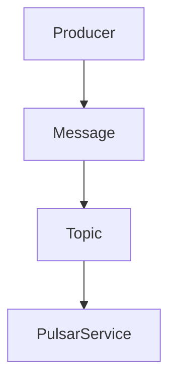

## 1.背景介绍

Apache Pulsar是一个高性能、可扩展的开源消息传递和流处理平台，它提供了灵活的消息模型和广泛的客户端语言支持，其设计初衷是为了解决大规模数据处理的挑战。在这篇文章中，我们将重点讨论Pulsar的生产者（Producer）组件，它是Pulsar体系中负责产生和发送消息的关键部分。我们会深入探讨其工作原理，并通过实际的代码示例来展示其使用方法。

## 2.核心概念与联系

在Pulsar中，生产者是消息的源头。它创建并发送消息到Pulsar服务，然后由Pulsar服务将这些消息路由到适当的消费者。Pulsar Producer的核心概念和联系包含以下几个重要元素：

- **主题（Topic）**：生产者将消息发送到的地址，它是消息路由的基础。
- **消息（Message）**：生产者发送的数据单元，每个消息都有一个唯一的序列ID。
- **生产者（Producer）**：创建并发送消息的实体。
- **Pulsar服务**：接收来自生产者的消息，并将其路由到消费者的服务。

这些概念之间的关系可以通过以下Mermaid流程图进行可视化表示：



## 3.核心算法原理具体操作步骤

生产者发送消息的过程主要包含以下步骤：

1. **创建生产者**：首先，需要在指定的主题上创建一个生产者。这一步通常在应用程序初始化时进行。
2. **生成消息**：生产者创建消息，这可以是任何形式的数据，比如字符串、字节数组或者特定的数据对象。
3. **发送消息**：生产者将消息发送到Pulsar服务。这一步可以同步进行，也可以异步进行，取决于你希望如何处理发送操作。
4. **处理结果**：一旦消息被发送，生产者会得到一个确认，表明消息已经成功地到达了Pulsar服务，或者发送失败的错误信息。

## 4.数学模型和公式详细讲解举例说明

Pulsar生产者的性能可以通过一些关键的度量指标进行评估，比如发送速率（messages per second）和发送延迟（latency）。这两个指标可以通过以下数学模型进行描述：

假设我们有一个生产者P，它每秒发送m条消息，每条消息的大小为s字节。那么，生产者的发送速率R可以定义为：

$$ R = m $$

同时，如果从生产者发送消息到消息被Pulsar服务确认的时间为t秒，那么，生产者的平均发送延迟L可以定义为：

$$ L = t / m $$

## 5.项目实践：代码实例和详细解释说明

下面是一个使用Java Pulsar客户端的生产者示例：

```java
import org.apache.pulsar.client.api.PulsarClient;
import org.apache.pulsar.client.api.Producer;
import org.apache.pulsar.client.api.MessageId;

public class PulsarProducerExample {
    public static void main(String[] args) throws Exception {
        PulsarClient client = PulsarClient.builder()
                .serviceUrl("pulsar://localhost:6650")
                .build();

        Producer<byte[]> producer = client.newProducer()
                .topic("my-topic")
                .create();

        MessageId msgId = producer.send("Hello Pulsar".getBytes());

        System.out.println("Message with ID " + msgId + " successfully sent");

        producer.close();
        client.close();
    }
}
```

在这个示例中，我们首先创建了一个PulsarClient实例，然后在"my-topic"主题上创建了一个生产者。接着，我们发送了一条包含"Hello Pulsar"字符串的消息，并打印出消息的ID。最后，我们关闭了生产者和客户端实例。

## 6.实际应用场景

Pulsar生产者广泛应用于大数据处理、实时分析、日志处理、事件驱动的微服务等领域。例如：

- 在大数据处理中，生产者可以将实时生成的数据发送到Pulsar，然后由Pulsar将数据路由到各种消费者进行处理。
- 在实时分析中，生产者可以将用户行为、系统度量等实时数据发送到Pulsar，然后由实时分析工具消费这些数据进行即时洞察。
- 在日志处理中，生产者可以将系统的日志数据发送到Pulsar，然后由日志处理工具消费这些数据进行存储、索引和查询。

## 7.工具和资源推荐

- [Apache Pulsar官方网站](http://pulsar.apache.org/)
- [Apache Pulsar GitHub仓库](https://github.com/apache/pulsar)
- [Pulsar Java客户端API文档](http://pulsar.apache.org/api/client/)

## 8.总结：未来发展趋势与挑战

随着数据规模的不断扩大和实时处理需求的增长，Pulsar生产者的角色将变得越来越重要。未来，Pulsar生产者可能会面临如何提高发送速率、降低发送延迟、增强可靠性等挑战。同时，如何更好地集成与各种语言和框架，提供更丰富的功能，也是未来的发展趋势。

## 9.附录：常见问题与解答

1. **问题**：如何提高Pulsar生产者的发送速率？
   **答案**：可以通过增加生产者的数量、调优Pulsar服务的配置、提高网络带宽等方法来提高发送速率。

2. **问题**：Pulsar生产者发送消息失败怎么办？
   **答案**：首先，需要查看失败的原因，比如网络问题、Pulsar服务问题等。然后，根据具体的原因来采取相应的解决措施，比如重试发送、修复网络问题、调优Pulsar服务等。

3. **问题**：如何保证Pulsar生产者发送消息的可靠性？
   **答案**：Pulsar提供了多种消息发送模式，包括同步发送和异步发送。在关键的场景下，可以使用同步发送模式，这样可以确保每条消息都被成功发送。此外，Pulsar还提供了消息持久化和复制的功能，可以进一步增强消息的可靠性。

作者：禅与计算机程序设计艺术 / Zen and the Art of Computer Programming