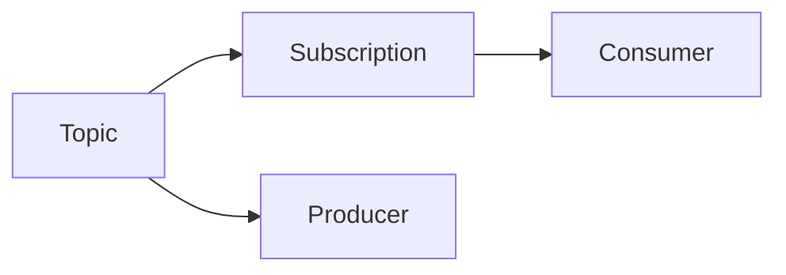

# Pulsar原理与代码实例讲解

## 1.背景介绍

Apache Pulsar 是一个云原生、分布式的消息流平台,旨在提供可扩展、高性能的发布订阅消息传递功能。它最初由 Yahoo 开发,后捐赠给 Apache 软件基金会,成为了顶级开源项目。

Pulsar 的设计灵感来自于 Apache BookKeeper,并借鉴了 Apache ZooKeeper 和 Apache Kafka 的部分思想。它结合了日志数据存储的高吞吐量和发布订阅消息系统的扇出语义,旨在为大规模分布式应用提供统一的消息流服务。

### 1.1 Pulsar 的主要特性

- **无限制扇出**:消费者组可以无限制地扩展,不会影响发布者的性能。
- **持久化存储**:消息以持久化日志的形式存储在分布式环境中,保证了数据的可靠性和持久性。
- **多租户支持**:支持多租户隔离,可以在同一个集群中为不同的租户提供独立的命名空间。
- **多集群复制**:支持跨数据中心的消息复制,实现异地多活和容灾备份。
- **多版本协议支持**:支持多种协议,如二进制、JSON 等,方便与不同系统集成。
- **轻量级消费者**:支持轻量级的消费者,可以在资源受限的环境中运行。

### 1.2 Pulsar 的应用场景

Pulsar 可以广泛应用于各种分布式系统和数据管道场景,例如:

- **微服务架构**:作为微服务之间的异步通信中间件,实现松耦合和可扩展性。
- **物联网(IoT)数据处理**:收集和处理来自大量设备的实时数据流。
- **日志收集和处理**:作为集中式日志收集和处理系统的基础设施。
- **实时数据分析**:将实时数据流输入到流式处理系统进行分析。
- **数据管道**:构建可靠的数据管道,将数据从源头传输到目的地。

## 2.核心概念与联系

Pulsar 的核心概念包括 Topic、Subscription、Consumer、Producer 等,它们之间存在着密切的关系。



### 2.1 Topic

Topic 是 Pulsar 中的逻辑数据通道,用于发布和订阅消息。每个 Topic 由一个或多个 Partition 组成,每个 Partition 由一系列有序的消息组成。

### 2.2 Subscription

Subscription 代表了一个消费者组,用于订阅 Topic 中的消息。每个 Subscription 都会独立地消费 Topic 中的所有消息,不同的 Subscription 之间是相互隔离的。

### 2.3 Consumer

Consumer 是消费者的实例,用于从 Subscription 中消费消息。每个 Consumer 都会被分配到一个或多个 Partition 上,并独立地消费这些 Partition 中的消息。

### 2.4 Producer

Producer 是生产者的实例,用于向 Topic 发布消息。Producer 会根据消息路由策略将消息发送到对应的 Partition 上。

## 3.核心算法原理具体操作步骤

Pulsar 的核心算法原理涉及多个方面,包括消息存储、消息复制、消息路由等。

### 3.1 消息存储

Pulsar 采用 Apache BookKeeper 作为底层的持久化存储系统。BookKeeper 是一个分布式的日志存储系统,可以提供高吞吐量和低延迟的写入性能。

消息存储的具体步骤如下:

1. 每个 Topic 的每个 Partition 都对应一个 BookKeeper Ledger。
2. 当 Producer 发送消息时,消息会先写入内存缓冲区。
3. 当内存缓冲区达到一定大小或超时时,消息会被持久化到 BookKeeper Ledger 中。
4. BookKeeper 会将消息复制到多个 Bookie 节点上,以保证数据的可靠性和持久性。

### 3.2 消息复制

为了实现跨数据中心的消息复制和容灾备份,Pulsar 引入了 Replicator 的概念。Replicator 会从源集群中的 Topic 读取消息,并将消息复制到目标集群中的 Topic。

消息复制的具体步骤如下:

1. 在源集群和目标集群中分别创建 Replicator 实例。
2. 源集群的 Replicator 会订阅源 Topic,并从中读取消息。
3. 源集群的 Replicator 会将消息发送到目标集群的 Replicator。
4. 目标集群的 Replicator 会将接收到的消息发布到目标 Topic 中。

### 3.3 消息路由

Pulsar 支持多种消息路由策略,用于将消息路由到不同的 Partition 上。常见的消息路由策略包括:

- **Round Robin 路由**:将消息依次路由到不同的 Partition 上,实现负载均衡。
- **Key 哈希路由**:根据消息的 Key 计算哈希值,将具有相同 Key 的消息路由到同一个 Partition 上,保证消息顺序。
- **Key 取模路由**:根据消息的 Key 取模,将具有相同 Key 的消息路由到同一个 Partition 上,保证消息顺序。

消息路由的具体步骤如下:

1. Producer 在发送消息时,会根据配置的路由策略计算出目标 Partition。
2. Producer 会将消息发送到对应的 Partition 上。
3. Consumer 会从分配到的 Partition 上消费消息。

## 4.数学模型和公式详细讲解举例说明

在 Pulsar 中,一些核心算法涉及到数学模型和公式,例如消息路由策略中的哈希函数和取模运算。

### 4.1 哈希函数

在 Key 哈希路由策略中,Pulsar 使用了 MurmurHash3 哈希函数来计算消息 Key 的哈希值。MurmurHash3 是一种非加密哈希函数,具有良好的性能和散列质量。

MurmurHash3 的核心公式如下:

$$
h_1 = seed \\
for(i = 0; i < len; i++) \\
\begin{cases}
k = data[i] \\
k *= c_1 \\
k = (k \ll r_1) | (k \gg (32 - r_1)) \\
k *= c_2 \\
h_1 \xor= k \\
h_1 = (h_1 \ll r_2) | (h_1 \gg (32 - r_2)) \\
h_1 *= m \\
h_1 \xor= h_1 \gg 16
\end{cases} \\
h_1 \xor= len \\
h_1 \xor= h_1 \gg 13 \\
h_1 \xor= h_1 \gg 15 \\
return h_1
$$

其中:

- $seed$ 是一个初始化的种子值
- $c_1$、$c_2$ 和 $m$ 是预定义的常量
- $r_1$ 和 $r_2$ 是预定义的位移量
- $data$ 是输入的数据
- $len$ 是数据的长度

通过这种位运算和混合运算,MurmurHash3 可以产生高质量的哈希值,并且计算速度非常快。

### 4.2 取模运算

在 Key 取模路由策略中,Pulsar 使用取模运算将消息路由到不同的 Partition 上。取模运算的公式如下:

$$
partition = hash(key) \bmod numPartitions
$$

其中:

- $hash(key)$ 是消息 Key 的哈希值
- $numPartitions$ 是 Topic 中 Partition 的总数

通过取模运算,具有相同 Key 的消息将被路由到同一个 Partition 上,从而保证了消息的顺序性。同时,不同的 Key 也会被均匀地分散到不同的 Partition 上,实现了负载均衡。

## 5.项目实践:代码实例和详细解释说明

为了更好地理解 Pulsar 的原理和使用方式,我们将通过一个简单的示例项目来演示如何使用 Pulsar 发送和接收消息。

### 5.1 环境准备

首先,我们需要准备 Pulsar 的运行环境。可以选择以下两种方式之一:

1. 在本地机器上安装和运行 Pulsar。
2. 使用 Docker 容器快速启动 Pulsar。

这里我们选择使用 Docker 容器的方式,更加简单快捷。运行以下命令即可启动 Pulsar:

```bash
docker run -it \
  -p 6650:6650 \
  -p 8080:8080 \
  --mount source=pulsardata,target=/pulsar/data \
  --mount source=pulsarconf,target=/pulsar/conf \
  apachepulsar/pulsar:2.10.1 \
  bin/pulsar standalone
```

### 5.2 创建 Topic

在开始发送和接收消息之前,我们需要先创建一个 Topic。可以使用 Pulsar 提供的命令行工具 `bin/pulsar-client` 来创建 Topic:

```bash
bin/pulsar-client create-topic persistent://public/default/my-topic
```

这里我们创建了一个名为 `my-topic` 的 Topic,位于 `public/default` 命名空间下。

### 5.3 发送消息

接下来,我们编写一个 Java 程序来发送消息到 Pulsar。首先,我们需要添加 Pulsar 客户端库的依赖:

```xml
<dependency>
    <groupId>org.apache.pulsar</groupId>
    <artifactId>pulsar-client</artifactId>
    <version>2.10.1</version>
</dependency>
```

然后,我们可以编写发送消息的代码:

```java
import org.apache.pulsar.client.api.Producer;
import org.apache.pulsar.client.api.PulsarClient;
import org.apache.pulsar.client.api.PulsarClientException;

public class PulsarProducer {
    public static void main(String[] args) throws PulsarClientException {
        // 创建 Pulsar 客户端实例
        PulsarClient client = PulsarClient.builder()
                .serviceUrl("pulsar://localhost:6650")
                .build();

        // 创建 Producer 实例
        Producer<byte[]> producer = client.newProducer()
                .topic("persistent://public/default/my-topic")
                .create();

        // 发送消息
        for (int i = 0; i < 10; i++) {
            String message = "Hello Pulsar " + i;
            producer.send(message.getBytes());
        }

        // 关闭 Producer 和客户端
        producer.close();
        client.close();
    }
}
```

这段代码首先创建了一个 Pulsar 客户端实例,并指定了 Pulsar 服务的 URL。然后,它创建了一个 Producer 实例,并指定了要发送消息的 Topic。接下来,它发送了 10 条消息到 Topic 中。最后,它关闭了 Producer 和客户端。

### 5.4 接收消息

接下来,我们编写一个 Java 程序来从 Pulsar 接收消息。同样,我们需要添加 Pulsar 客户端库的依赖:

```xml
<dependency>
    <groupId>org.apache.pulsar</groupId>
    <artifactId>pulsar-client</artifactId>
    <version>2.10.1</version>
</dependency>
```

然后,我们可以编写接收消息的代码:

```java
import org.apache.pulsar.client.api.Consumer;
import org.apache.pulsar.client.api.Message;
import org.apache.pulsar.client.api.PulsarClient;
import org.apache.pulsar.client.api.PulsarClientException;
import org.apache.pulsar.client.api.SubscriptionType;

public class PulsarConsumer {
    public static void main(String[] args) throws PulsarClientException {
        // 创建 Pulsar 客户端实例
        PulsarClient client = PulsarClient.builder()
                .serviceUrl("pulsar://localhost:6650")
                .build();

        // 创建 Consumer 实例
        Consumer<byte[]> consumer = client.newConsumer()
                .topic("persistent://public/default/my-topic")
                .subscriptionName("my-subscription")
                .subscriptionType(SubscriptionType.Shared)
                .subscribe();

        // 接收消息
        while (true) {
            Message<byte[]> msg = consumer.receive();
            String receivedMessage = new String(msg.getData());
            System.out.println("Received message: " + receivedMessage);

            // 确认消息已被处理
            consumer.acknowledge(msg);
        }
    }
}
```

这段代码首先创建了一个 Pulsar 客户端实例,并指定了 Pulsar 服务的 URL。然后,它创建了一个 Consumer 实例,并指定了要订阅的 Topic、订阅名称和订阅类型。接下来,它进入一个无限循环,不断从 Topic 中接收消息